# 🖥️ Federal Azure Virtual Desktop Automation

> **Enterprise-grade Azure Virtual Desktop deployment automation for Azure Commercial, Government, Secret, and Top Secret clouds**

---

## 📋 Overview

The Federal AVD solution provides comprehensive automation for deploying and managing Azure Virtual Desktop environments across all Azure cloud environments with built-in Zero Trust security controls, multi-cloud support, and enterprise-scale capabilities.

### What You Can Deploy

| Component | Description | Documentation |
|-----------|-------------|---------------|
| 🚀 **Quick Start** | Step-by-step guide for new deployments | [Quick Start Guide](docs/quickStart.md) |
| 🏢 **Host Pools** | Complete AVD host pool deployments with networking, storage, monitoring, and security | [Host Pool Deployment Guide](docs/hostpoolDeployment.md) |
| 🎨 **Custom Images** | Automated custom image builds with artifact-based software deployment | [Image Build Guide](docs/imageBuild.md) |
| 📦 **Image Management** | Central artifact storage and management for software packages | [Artifacts & Image Management](docs/artifactsGuide.md) |
| 🔧 **Add-Ons** | Lifecycle automation and operational tools | [Add-Ons](#-add-ons) |

### Cloud Environment Support

✅ **Azure Commercial** • ✅ **Azure Government** • ✅ **Azure Government Secret** • ✅ **Azure Government Top Secret**

---

## 🚀 Quick Start

Ready to deploy? The **[Quick Start Guide](docs/quickStart.md)** walks you through the complete deployment process with decision trees, prerequisites, and step-by-step instructions.

### Deployment Path Overview

```mermaid
graph TD
    A[Start] --> B{Need Custom<br/>Software or<br/>Configurations?}
    B -->|Yes| C[📦 Step 1: Deploy<br/>Image Management]
    B -->|No| D[Use Marketplace<br/>Image]
    C --> E{Build<br/>Custom Image?}
    E -->|Yes<br/>Pre-install software| F[🎨 Step 2: Build<br/>Custom Image]
    E -->|No<br/>Install at runtime| H[🏢 Step 3: Deploy<br/>Host Pool]
    F --> H
    D --> H
    H --> I[✅ Complete]
```

### Deployment Methods

| Component | Blue Button | Template Spec | PowerShell/CLI |
|-----------|-------------|---------------|----------------|
| **Image Management** (infrastructure) | ❌ | ❌ | ✅ All clouds |
| **Custom Image Build** | ✅ Com/Gov | ✅ All clouds | ✅ All clouds |
| **Host Pool** | ✅ Com/Gov | ✅ All clouds | ✅ All clouds |
| **Networking** | ✅ Com/Gov | ✅ All clouds | ✅ All clouds |
| **Add-Ons** | ✅ Com/Gov | ✅ All clouds | ✅ All clouds |

**💡 About Template Specs:**
- Provide guided form experience with built-in validation
- Generate parameter files for automation workflows
- Useful for teams unfamiliar with ARM/Bicep syntax
- **Only UI option for air-gapped clouds** (Secret/Top Secret)
- Not available for image management infrastructure deployment

**👉 [Get Started Now](docs/quickStart.md)** - Complete prerequisites, deployment options, and step-by-step instructions

---

## 🏗️ Architecture Components

### Core Components

#### Image Management Resources

Central storage and management for software artifacts. **Required** for custom image builds or session host customizations.

**Resources Created:**

- 🗄️ Storage Account with blob container for artifacts
- 🆔 Managed Identity with RBAC for secure access
- 🖼️ Compute Gallery for custom images
- 🔐 Private endpoints (optional, for Zero Trust)

**Learn More:**

- [Artifacts & Image Management Guide](docs/artifactsGuide.md)
- [Deploy-ImageManagement Script](docs/imageManagementScript.md)

#### Custom Image Building

Automated custom image build pipeline with artifact-based customizations.

**Features:**

- Automated software installation from artifacts
- Windows Updates and optimizations
- Supports marketplace or custom base images
- Regional image replication
- Build automation with PowerShell script

**Learn More:**

- [Image Build Guide](docs/imageBuild.md)

#### Host Pool Deployment

Complete AVD environment deployment with enterprise features.

**What's Included:**

- AVD host pool, workspace, and application groups
- Session host virtual machines (pooled or personal)
- FSLogix profile storage (Azure Files or NetApp Files)
- Monitoring with Log Analytics and Application Insights
- Key Vault for secrets management
- Private endpoints and network security (Zero Trust)
- Backup and recovery configuration

**Learn More:**

- [Host Pool Deployment Guide](docs/hostpoolDeployment.md)
- [Features](docs/features.md)
- [Design](docs/design.md)

---

## 🔧 Add-Ons

Optional add-ons extend the base AVD deployment with advanced lifecycle management and operational automation:

| Add-On | Purpose | Documentation |
|--------|---------|---------------|
| 🔄 **Session Host Replacer** | Automates rolling replacement of session hosts when new images are available with zero-downtime updates | [Session Host Replacer](deployments/add-ons/SessionHostReplacer/readme.md) |
| 📊 **Storage Quota Manager** | Monitors and automatically increases Azure Files Premium share quotas for FSLogix storage | [Storage Quota Manager](deployments/add-ons/StorageQuotaManager/readme.md) |
| 🔑 **Update Storage Keys** | Updates FSLogix storage account keys on session hosts for Entra ID-only deployments | [Update Storage Keys](deployments/add-ons/UpdateStorageAccountKeyOnSessionHosts/readme.md) |
| 📝 **Run Commands on VMs** | Execute scripts on selected virtual machines from a resource group | [Run Commands](deployments/add-ons/RunCommandsOnVms/readme.md) |

---

## 🔒 Zero Trust Security

This solution is architected to align with [Microsoft's Zero Trust principles for Azure Virtual Desktop](https://learn.microsoft.com/security/zero-trust/azure-infrastructure-avd):

### Security Controls

| Layer | Capability |
|-------|------------|
| **🌐 Network** | Private endpoints, no public IPs, network segmentation |
| **🔐 Identity** | Managed identities, Entra ID authentication, conditional access |
| **📁 Data** | Customer-managed keys, encryption at rest/transit, private connectivity |
| **🎯 Access** | RBAC least privilege, Azure Policy enforcement, user assignment restrictions |
| **📊 Monitoring** | Centralized logging, diagnostic data collection, threat detection |
| **⚙️ Configuration** | Immutable infrastructure, artifact-based deployment, integrity verification |

**[Zero Trust Architecture Details](docs/features.md#zero-trust-architecture)**

---

## 🌍 Identity Solutions

Support for multiple identity configurations to meet organizational requirements:

| Identity Solution | Description | Use Case |
|------------------|-------------|----------|
| **Active Directory Domain Services** | Traditional hybrid identity with AD domain join | Enterprise hybrid environments with on-premises AD |
| **Entra Domain Services** | Managed domain services in Azure | Cloud-focused without on-premises AD infrastructure |
| **Entra Kerberos (Hybrid)** | Entra ID-joined hosts with AD user accounts | Modernizing while maintaining AD user accounts |
| **Entra Kerberos (Cloud-Only)** | Entra ID users with Kerberos authentication | Cloud-native with Kerberos for FSLogix |
| **Entra ID** | Pure cloud identity solution | Fully cloud-native deployments |

**[Identity Solutions Details](docs/features.md#identity-solutions)**

---

## 📚 Documentation

### Getting Started

- 📖 [Quick Start Guide](docs/quickStart.md) - Step-by-step deployment instructions
- 🏗️ [Design](docs/design.md) - Architecture and resource organization
- ⚙️ [Parameters Reference](docs/parameters.md) - Complete parameter documentation

### Deployment Guides

- 🏢 [Host Pool Deployment](docs/hostpoolDeployment.md) - Deploy AVD host pools
- 🎨 [Image Build Guide](docs/imageBuild.md) - Build custom images
- 📦 [Artifacts & Image Management](docs/artifactsGuide.md) - Software artifact system
- 🔧 [Deploy-ImageManagement Script](docs/imageManagementScript.md) - Script usage guide

### Advanced Topics

- ✨ [Features](docs/features.md) - Detailed feature descriptions
- 🚫 [Limitations](docs/limitations.md) - Known limitations and workarounds
- 🔧 [Troubleshooting](docs/troubleshooting.md) - Common issues and solutions
- 🔐 [Entra Kerberos Setup](docs/entraKerberosCloudOnly.md) - Kerberos configuration
- 🌐 [Air-Gapped Clouds](docs/airGappedClouds.md) - Secret/Top Secret deployment

### Add-Ons

- 🔄 [Session Host Replacer](deployments/add-ons/SessionHostReplacer/readme.md)
- 📊 [Storage Quota Manager](deployments/add-ons/StorageQuotaManager/readme.md)
- 🔑 [Update Storage Keys](deployments/add-ons/UpdateStorageAccountKeyOnSessionHosts/readme.md)
- 📝 [Run Commands on VMs](deployments/add-ons/RunCommandsOnVms/readme.md)

---

## 🤝 Contributing

This project welcomes contributions and suggestions. Most contributions require you to agree to a Contributor License Agreement (CLA) declaring that you have the right to, and actually do, grant us the rights to use your contribution.

When you submit a pull request, a CLA bot will automatically determine whether you need to provide a CLA and decorate the PR appropriately. Simply follow the instructions provided by the bot.

This project has adopted the [Microsoft Open Source Code of Conduct](https://opensource.microsoft.com/codeofconduct/). For more information see the [Code of Conduct FAQ](https://opensource.microsoft.com/codeofconduct/faq/) or contact [opencode@microsoft.com](mailto:opencode@microsoft.com) with questions or comments.

---

## 📄 License

This project is licensed under the MIT License - see the [LICENSE](LICENSE) file for details.

---

## ™️ Trademarks

This project may contain trademarks or logos for projects, products, or services. Authorized use of Microsoft trademarks or logos is subject to and must follow [Microsoft's Trademark & Brand Guidelines](https://www.microsoft.com/legal/intellectualproperty/trademarks/usage/general). Use of Microsoft trademarks or logos in modified versions of this project must not cause confusion or imply Microsoft sponsorship. Any use of third-party trademarks or logos are subject to those third-party's policies.
