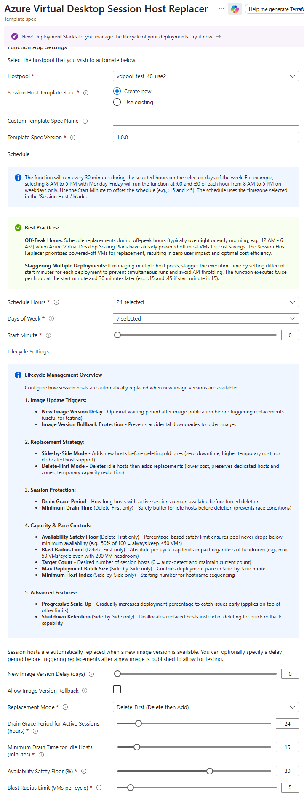
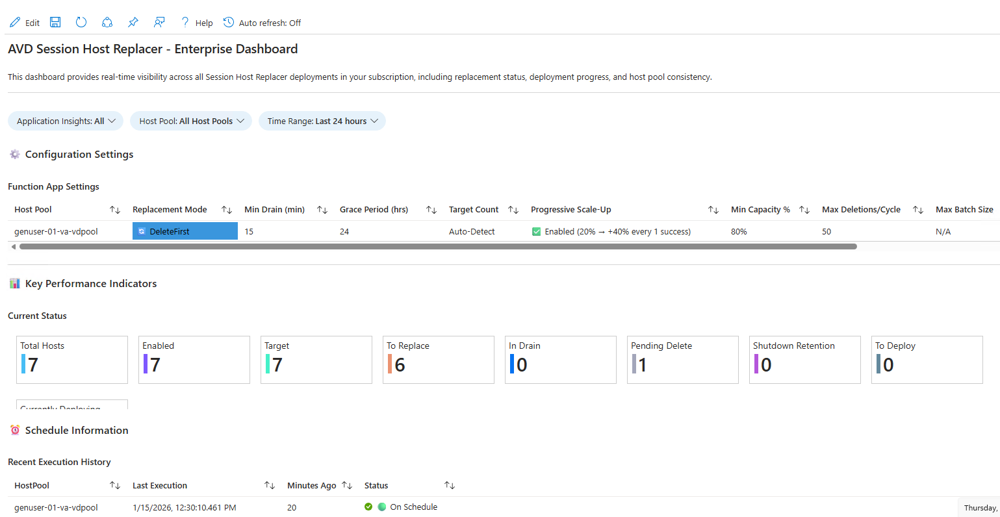

# AVD Session Host Replacer

> **Part of the [Federal AVD Solution](../../../README.md)** | See also: [Features Overview](../../../docs/features.md) | [Quick Start Guide](../../../docs/quickStart.md)

Automated Azure Function for managing Azure Virtual Desktop session host lifecycle through continuous image updates with flexible replacement strategies.

## Table of Contents

- [Overview](#overview)
- [Features](#features)
- [Replacement Modes](#replacement-modes)
- [Prerequisites](#prerequisites)
- [Deployment](#deployment)
- [Configuration](#configuration)
- [Permissions Setup](#permissions-setup)
- [How It Works](#how-it-works)
- [Process Flows](#process-flows)
- [Troubleshooting](#troubleshooting)
- [Maintenance](#maintenance)

## Overview

The Session Host Replacer monitors AVD session hosts and automatically replaces them when new images are available. It handles the complete lifecycle: detection → draining → deployment → deletion → device cleanup.

**Key Benefits:**

- **Flexible Replacement Strategies**: Choose between SideBySide (zero-downtime) or DeleteFirst (cost-optimized) modes
- **Zero-downtime rolling updates** with automatic capacity management (SideBySide mode)
- **Cost-optimized replacements** with controlled capacity reduction (DeleteFirst mode)
- **Dynamic capacity from scaling plans**: Automatic adjustment of safety floors based on scaling plan schedules (DeleteFirst mode)
- **Zero-touch image updates** with automatic version tracking
- **Graceful user session handling** with configurable grace periods
- **Progressive scale-up** for gradual, validated rollouts
- **Shutdown retention** for rollback capability (SideBySide mode)
- **Auto-detect target count** for dynamic scaling plan compatibility
- **Device cleanup** (Entra ID + Intune) with automatic hostname reuse
- **Multi-cloud support** (Commercial, GCC High, DoD, China; US Secret/Top Secret)

## Features

### Core Capabilities

- **Image Version Tracking**: Detects outdated images and triggers updates
- **Flexible Replacement Strategies**: Choose between SideBySide and DeleteFirst modes
- **Graceful Draining**: Configurable grace period for active sessions (default: 24 hours)
- **Minimum Drain Time**: Safety buffer for zero-session hosts before deletion (default: 15 minutes)
- **New Host Availability Check**: Safety mechanism that prevents deleting old hosts if newly deployed replacements aren't healthy and available
- **Progressive Scale-Up**: Gradual rollouts starting with small percentages and scaling up after success
- **Shutdown Retention**: Rollback capability by retaining old hosts in shutdown state (SideBySide mode)
- **Auto-Detect Target Count**: Maintains current host count, compatible with dynamic scaling plans
- **Tag-Based Opt-In**: Only affects hosts tagged with `IncludeInAutoReplace: true`
- **Device Cleanup**: Removes Entra ID and Intune device records automatically
- **Failed Deployment Recovery**: Automatic cleanup of partial resources with persistent tracking
- **Registration Verification**: Validates hosts successfully register before marking deployments as complete
- **Deployment State Persistence**: Tracks deleted hosts across function runs until deployment succeeds

### Enterprise Features

- **Zero Trust Networking**: Private endpoints and VNet integration
- **Customer-Managed Encryption**: CMK support for function storage
- **Multi-Cloud**: Commercial, GCC, GCC High, DoD, US Government Secret, and US Government Top Secret environments
- **Comprehensive Monitoring**: Application Insights integration with pre-built dashboard
- **Template Spec Integration**: Consistent deployments with versioning
- **Real-Time Visibility**: Azure Monitor Workbook dashboard for deployment tracking and host pool health
- **Dedicated Host Support**: Preserves and reuses dedicated host assignments (DeleteFirst mode)

### Performance & Efficiency Features

The Session Host Replacer includes several optimizations to minimize Azure API calls, execution time, and costs:

- **VM Caching**: Fetches all VMs once at function start and reuses throughout execution, updating cache after deletions instead of re-querying (reduces API calls by ~60%)
- **Lightweight Up-to-Date Check**: Fast pre-check to detect if pool is already current before expensive operations
- **Early Exit Path**: Immediately exits when no work needed, bypassing deployment/deletion logic and expensive API queries
- **Lazy Power State Loading**: Only queries VM power states when deletion decisions require them (not queried if pool up-to-date)
- **Scaling Plan Query Skipping**: Avoids scaling plan API call when pool already on latest image
- **Conditional Operations**: Skips replacement plan calculation and availability checks when lightweight check confirms up-to-date status

**Performance Impact**: Functions typically complete in <10 seconds when pool is up-to-date (vs 30-60 seconds for full evaluation), reducing execution costs by 70-80% for steady-state operations.

## Replacement Modes

The Session Host Replacer supports two distinct replacement strategies to accommodate different operational priorities:

### SideBySide Mode (Default)

**Best for**: Zero-downtime requirements, production environments, large host pools

**How it works**:

- Deploys new session hosts **before** deleting old ones
- Host pool temporarily doubles in size during replacement cycles
- New hosts are added, users naturally migrate, then old hosts are removed
- No capacity reduction at any point

**Characteristics**:

- ✅ **Zero downtime** - users always have available capacity
- ✅ **Maximum safety** - new hosts validated before old ones removed
- ✅ **Availability protection** - blocks deletions if new hosts fail health checks
- ✅ **Shutdown retention option** - keep old hosts powered off for rollback
- ✅ **Auto-detect target count** - compatible with scaling plans
- ✅ **Progressive scale-up** - gradual rollouts with validation
- ❌ **Higher temporary cost** - pays for both old and new hosts during transition
- ❌ **Requires capacity headroom** - subnet, quotas, dedicated hosts must support 2x size

**Configuration parameters**:

- `replacementMode`: `SideBySide`
- `targetSessionHostCount`: 0 (auto-detect) or specific number
- `maxDeploymentBatchSize`: Maximum deployments per run (default: 100)
- `minimumHostIndex`: Minimum starting index for hostname numbering - gap-filling logic starts from this index (default: 1, applies to both DeleteFirst and SideBySide modes)
- `enableShutdownRetention`: Keep old hosts shutdown for rollback (default: false)
- `shutdownRetentionDays`: Days to retain shutdown hosts (default: 3)

**Use cases**:

- Production environments with strict SLA requirements
- Large host pools where cost of temporary doubling is acceptable
- Environments requiring rollback capability
- Organizations with sufficient subnet IP space and Azure quotas

### DeleteFirst Mode

**Best for**: Cost optimization, resource-constrained environments, smaller host pools

**How it works**:

- Deletes idle old session hosts **first**, then deploys replacements
- Maintains minimum capacity percentage during replacements
- Reuses hostnames and dedicated host assignments from deleted hosts
- Gradual replacement controlled by max deletions per cycle

**Characteristics**:

- ✅ **Cost optimized** - no host pool doubling, pays only for needed capacity
- ✅ **Resource efficient** - lower IP address and quota consumption
- ✅ **Availability protection** - halts deletions if new hosts fail health checks
- ✅ **Hostname reuse** - leverages deleted names for new hosts
- ✅ **Dedicated host preservation** - maintains host group assignments
- ❌ **Temporary capacity reduction** - some hosts unavailable during replacement
- ❌ **Requires device cleanup** - Graph API permissions mandatory for name reuse
- ❌ **Slower rollouts** - limited by max deletions per cycle

**Configuration parameters**:

- `replacementMode`: `DeleteFirst`
- `targetSessionHostCount`: 0 (auto-detect) or Specific number
- `maxDeletionsPerCycle`: Maximum hosts to replace per run (default: 5)
- `minimumCapacityPercentage`: Safety floor for available capacity (default: 80%)
- `removeEntraDevice`: Must be `true` for hostname reuse
- `removeIntuneDevice`: Must be `true` for hostname reuse

**Use cases**:

- Dev/test environments with relaxed availability requirements
- Cost-sensitive deployments where temporary doubling is prohibitive
- Resource-constrained environments (limited IPs, quotas, or dedicated hosts)
- Smaller host pools where temporary capacity reduction is acceptable
- Environments using dedicated hosts where reuse is required

### Mode Comparison Matrix

| Feature | SideBySide | DeleteFirst |
|---------|------------|-------------|
| **Downtime** | None | Temporary capacity reduction |
| **Cost during replacement** | 2x (temporary) | 1x (no doubling) |
| **Hostname reuse** | No (generates new names) | Yes (reuses deleted names) |
| **Dedicated host support** | No (new hosts on different hosts) | Yes (preserves assignments) |
| **Shutdown retention** | Yes (optional) | No |
| **Auto-detect target count** | Yes | No (explicit count required) |
| **Device cleanup required** | Optional | Mandatory (for hostname reuse) |
| **Progressive scale-up** | Yes | Yes |
| **Subnet IP requirements** | 2x during replacement | 1x (no spike) |
| **Rollback capability** | Yes (with shutdown retention) | No |
| **Deployment velocity** | Fast (batch size up to 1000) | Controlled (max deletions per cycle) |
| **Minimum drain time** | Yes | Yes |
| **Best for** | Production, zero-downtime | Cost optimization, resource constraints |

### Choosing the Right Mode

**Choose SideBySide if**:

- Zero downtime is a hard requirement
- You have sufficient subnet IP space and Azure quotas
- Cost of temporary doubling is acceptable
- You want rollback capability via shutdown retention
- You're using dynamic scaling plans (auto-detect target count)

**Choose DeleteFirst if**:

- Cost optimization is the priority
- Subnet IP space or quotas are constrained
- You're using dedicated hosts and need to preserve assignments
- Temporary capacity reduction is acceptable
- You can enable Graph API permissions for device cleanup

## Prerequisites

### Required Before Deployment

#### 1. Managed Identity for Function App

The Session Host Replacer Function App supports two identity options:

##### Option A: System-Assigned Managed Identity

- **Automatically created** during deployment
- **Simpler setup** - no pre-created identity needed
- **Best for**: Environments without device cleanup requirements or a small number of host pools
- **Limitation**: Graph permissions must be granted before the first schedule run. They must also be granted for each function app/host pool.

##### Option B: User-Assigned Managed Identity

- **Pre-created** before deployment
- **Required for**: Device cleanup with hostname reuse in DeleteFirst mode (Graph permissions must exist before first run)
- **Best for**: Environments with a large number of host pools
- **Benefit**: Graph permissions can be granted before deployment

**Azure RBAC Permissions** (automatically granted during deployment for either identity type):

- `Desktop Virtualization Contributor` on Host Pool Resource Group
- `Reader` on Host Pool Subscription (for scaling plan queries)
- `Contributor` on Session Host Resource Group  
- `Reader` on Image Gallery/Marketplace

**Microsoft Graph API Permissions** (must be granted manually):

- `Device.ReadWrite.All` - For Entra ID device deletion
- `DeviceManagementManagedDevices.ReadWrite.All` - For Intune device deletion

> **Important for DeleteFirst Mode:** Graph API permissions must be configured **before** the first function execution if using device cleanup for hostname reuse. Use a User-Assigned Managed Identity to grant permissions before deployment, or grant them to the System-Assigned Identity after deployment and stop the function app for about an hour before the first run to allow time for the permissions to propagate.

#### 2. Grant Graph API Permissions to Managed Identity

**Why This Is Required:**

- The Function App needs to clean up stale device registrations in Entra ID and Intune
- This enables hostname reuse (required for DeleteFirst mode, optional for SideBySide)
- Service principals/managed identities require **Application Permissions** (not delegated permissions)

**When to Grant Permissions:**

- **User-Assigned Identity**: Grant permissions **before** deployment
- **System-Assigned Identity**: Grant permissions **after** deployment (the identity is created during deployment)

**Steps to Grant Permissions:**

1. **Get the Managed Identity Object ID**:

   For User-Assigned Identity:

   ```powershell
   $uai = Get-AzUserAssignedIdentity -ResourceGroupName "<rg-name>" -Name "<identity-name>"
   $objectId = $uai.PrincipalId
   ```

   For System-Assigned Identity (after deployment):

   ```powershell
   $functionApp = Get-AzWebApp -ResourceGroupName "<rg-name>" -Name "<function-app-name>"
   $objectId = $functionApp.Identity.PrincipalId
   ```

2. Navigate to the SessionHostReplacer directory:

   ```powershell
   cd deployments/add-ons/SessionHostReplacer
   ```

3. Run the permission script with your managed identity's Object ID:

   **For Commercial Azure:**

   ```powershell
   .\Set-GraphPermissions.ps1 -ManagedIdentityObjectId $objectId
   ```

   **For Azure Government (GCC High):**

   ```powershell
   .\Set-GraphPermissions.ps1 -ManagedIdentityObjectId $objectId -Environment USGov
   ```

   **For Azure Government (DoD):**

   ```powershell
   .\Set-GraphPermissions.ps1 -ManagedIdentityObjectId $objectId -Environment USGovDoD
   ```

   > **Note:** For US Secret and Top Secret clouds, you must first update the graph endpoint placeholders in the script using the reference links provided in the script comments.

4. **Verify the permissions were granted:**

   ```powershell
   # Check permissions in Azure AD
   Connect-MgGraph -Scopes "Application.Read.All"
   $mi = Get-MgServicePrincipal -ServicePrincipalId <object-id>
   $assignments = Get-MgServicePrincipalAppRoleAssignment -ServicePrincipalId $mi.Id
   $graph = Get-MgServicePrincipal -Filter "displayName eq 'Microsoft Graph'"

   $assignments | Where-Object { $_.ResourceId -eq $graph.Id } | ForEach-Object {
       $role = $graph.AppRoles | Where-Object { $_.Id -eq $_.AppRoleId }
       [PSCustomObject]@{
           Permission = $role.Value
           GrantedAt = $_.CreatedDateTime
       }
   }
   ```

   You should see:
   - `Device.ReadWrite.All`
   - `DeviceManagementManagedDevices.ReadWrite.All`

**Understanding Graph API Permissions:**

For service principals and managed identities calling Graph API:

- ✅ **Application Permissions (App Roles)** - Required, appear in token's `roles` claim
- ✅ `Device.ReadWrite.All` IS sufficient for device deletion when used by service principals

**Manual Permission Grant (if script fails):**

```powershell
# Connect with required scopes
Connect-MgGraph -Scopes "Application.Read.All","AppRoleAssignment.ReadWrite.All"

# Get managed identity and Graph service principals
$mi = Get-MgServicePrincipal -ServicePrincipalId <managed-identity-object-id>
$graph = Get-MgServicePrincipal -Filter "displayName eq 'Microsoft Graph'"

# Grant Device.ReadWrite.All
$roleId = "1138cb37-bd11-4084-a2b7-9f71582aeddb"
New-MgServicePrincipalAppRoleAssignment -ServicePrincipalId $mi.Id `
    -PrincipalId $mi.Id -ResourceId $graph.Id -AppRoleId $roleId

# Grant DeviceManagementManagedDevices.ReadWrite.All
$roleId = "243333ab-4d21-40cb-a475-36241daa0842"
New-MgServicePrincipalAppRoleAssignment -ServicePrincipalId $mi.Id `
    -PrincipalId $mi.Id -ResourceId $graph.Id -AppRoleId $roleId
```

#### 3. Azure Function App Requirements

The deployment creates or uses an existing Function App:

- **New Deployment**: Creates Premium Windows plan (P0v3) with zone redundancy option
- **Existing Plan**: Must be one of the following:
  - **Premium v3 Windows Plans**: P0v3, P1v3, P2v3, P3v3 (P0v3 recommended for cost savings)
  - **Elastic Premium Plans**: EP1, EP2, EP3
  - **Premium v2 Plans**: P1v2, P2v2, P3v2
- ❌ **Not Compatible**: Consumption plans, Linux plans, or Standard/Basic tiers
- **Required Features**:
  - Always On (enabled by deployment)
  - VNet Integration support (if using private endpoints)
  - PowerShell 7.4 runtime
- 💡 **Cost Tip**: P0v3 is the most cost-effective option and fully supports all required features

#### 4. Other Required Resources

1. **Template Spec** (optional but recommended for portal-based deployments)
2. **Application Insights** (recommended for monitoring)
3. **Storage Account** (automatically created by deployment for Function App internal use)

### Software Requirements

1. **PowerShell 7.4+**
2. **Microsoft Graph PowerShell Module** (for granting permissions)

   ```powershell
   Install-Module Microsoft.Graph -Scope CurrentUser
   ```

3. **Azure PowerShell Module** (for deployment)

   ```powershell
   Install-Module Az -Scope CurrentUser
   ```

## Deployment

### Brownfield Deployments

**The Session Host Replacer is fully brownfield-compatible** and can be deployed to manage any existing AVD host pool, regardless of how it was originally deployed (Azure Portal, Terraform, ARM/Bicep, etc.).

#### Prerequisites for Brownfield

- Existing host pool with session hosts
- Key Vault with credentials (VM admin, domain join if applicable)
- Subnet for new session hosts
- RBAC permissions on host pool and VM resource group

#### Naming Convention Considerations

The solution automatically detects naming conventions from your host pool name. However, if your host pool uses a non-standard naming pattern (e.g., `prod-avd-hostpool-01` instead of `hp-avd-prod-eus`), you should provide explicit names for resources.

**Required override parameters for non-standard naming:**

```bicep
// Function App infrastructure
functionAppNameOverride: 'func-avdshr-prod-eus'           // 2-60 chars, globally unique
storageAccountNameOverride: 'stavdshrprod'                // 3-24 chars, lowercase alphanumeric

// Session host resources (CRITICAL - must match existing naming in host pool!)
virtualMachineNameConvOverride: 'vm-SHNAME'               // Use SHNAME token
diskNameConvOverride: 'disk-SHNAME'                       // Use SHNAME token
networkInterfaceNameConvOverride: 'nic-SHNAME'            // Use SHNAME token
availabilitySetNameConvOverride: 'avset-##'               // Use ## token for index
```

**Token Reference:**
- `SHNAME` = Session host name (e.g., `avdvm-001` becomes `vm-avdvm-001` or `avdvm-001-vm`)
- `##` = Availability set index (e.g., `avset-01`, `avset-02`)

**Critical for brownfield:** Session host naming MUST match your existing pattern. For example:
- If existing VMs are named `avdvm-001`, use `virtualMachineNameConvOverride: 'SHNAME'` (no prefix/suffix)
- If existing VMs are named `vm-avdvm-001`, use `virtualMachineNameConvOverride: 'vm-SHNAME'`
- If existing VMs are named `avdvm-001-vm`, use `virtualMachineNameConvOverride: 'SHNAME-vm'`

**Note on other resources:**
- **App Service Plan**: Use existing via `appServicePlanResourceId` parameter (no naming needed)
- **Private Endpoints & NICs**: Automatically derived from storage account and function app names
- **Application Insights**: Uses shared naming convention (works across multiple host pools)

**When to use overrides:**

- Host pool name doesn't start with `hp-` or end with `-hp`
- Host pool name contains special characters or patterns that don't follow the automatic detection logic
- Existing session hosts use non-standard naming (VMs not following resource type prefix/suffix pattern)
- You want explicit control over function app and session host resource naming

**When overrides are NOT needed:**

- Host pool follows standard patterns: `hp-avd-prod-eus` or `avd-prod-eus-hp`
- Session hosts follow standard patterns: `vm-avdvm-001` or `avdvm-001-vm`
- You're comfortable with automatically-derived names

See the [Brownfield Example](#brownfield-deployment-example) below for a complete deployment scenario.

### 1. Create Template Spec (Optional but Recommended)

A template spec is a resource type for storing an Azure Resource Manager template (ARM template) in Azure for later deployment. Template specs enable you to share ARM templates with other users in your organization through Azure RBAC controls.

**Benefits of using template specs:**

- Standard ARM/Bicep templates without external dependencies
- Azure RBAC for access control (no SAS tokens required)
- Users can deploy without write access to the template source
- Integrates with existing deployment processes (PowerShell, Azure Portal, DevOps)
- **Custom portal forms** for guided deployment experience

For more information, see [Template Specs | Microsoft Learn](https://learn.microsoft.com/en-us/azure/azure-resource-manager/templates/template-specs?tabs=azure-powershell) and [Portal Forms for Template Specs](https://learn.microsoft.com/en-us/azure/azure-resource-manager/templates/template-specs-create-portal-forms).

**To create the Session Host Replacer template spec:**

1. Connect to the correct Azure environment where `<Environment>` equals 'AzureCloud', 'AzureUSGovernment', or the air-gapped equivalent:

   ```powershell
   Connect-AzAccount -Environment <Environment>
   ```

2. Ensure your context is set to the subscription where you want to store the template spec:

   ```powershell
   Set-AzContext -Subscription <subscriptionID>
   ```

3. Navigate to the deployments folder and execute the script with the add-ons flag:

   ```powershell
   cd deployments
   .\New-TemplateSpecs.ps1 -ResourceGroupName <resource-group-name> -Location <location> -CreateAddOns $true
   ```

   Example:

   ```powershell
   .\New-TemplateSpecs.ps1 -ResourceGroupName "rg-avd-management-use2" -Location "eastus2" -CreateAddOns $true
   ```

This creates a template spec named **sessionHostReplacer** with a custom UI form in the specified resource group that you can deploy directly from the portal.

### 2. Deploy Infrastructure

You can deploy the Session Host Replacer using either the Azure Portal with the custom UI form (recommended) or PowerShell.

#### Option 1: Deploy via Azure Portal (Recommended)

The custom UI form provides a guided experience with tooltips and validation:

1. Navigate to **Template Specs** in the Azure Portal
2. Select the **sessionHostReplacer** template spec
3. Click **Deploy**
4. Fill out the form with your configuration:
   - **Basics**: Resource group, location
   - **Function App Configuration**: Host pool resource ID, execution settings
   - **Session Hosts**: VM configuration, image, networking
   - **Identity**: Domain join configuration
   - **User Profiles**: FSLogix settings (optional)
   - **Monitoring**: Application Insights, Log Analytics workspace
   - **Custom Naming (Advanced)**: Brownfield naming overrides (optional)
   - **Tags**: Resource tags
5. Review and click **Create**

Here is a screen shot of the form:



The form automatically validates inputs and provides helpful descriptions for each parameter.

##### Brownfield Deployments with Custom Naming

For brownfield deployments with non-standard host pool naming (e.g., `prod-avd-hostpool-01` instead of `hp-avd-prod-eus`), use the **Custom Naming (Advanced)** step:

1. On the **Custom Naming (Advanced)** step, check **Use Custom Naming Overrides**
2. Fill out the **Function App Infrastructure Naming** section:
   - **Function App Name**: (Required) Globally unique name, 2-60 chars, alphanumeric and hyphens. Example: `func-avdshr-prod-eus2`
   - **Storage Account Name**: (Required) Globally unique name, 3-24 chars, lowercase alphanumeric only. Example: `stavdshrprod`
   - **Application Insights Name**: (Required if monitoring enabled) Unique within resource group, 1-260 chars. Example: `appi-avdshr-prod-eus2`
3. Fill out the **Session Host Resource Naming** section:
   - **Virtual Machine Naming Convention**: (Required) Pattern with `SHNAME` token. Example: `vm-SHNAME`
   - **OS Disk Naming Convention**: (Required) Pattern with `SHNAME` token. Example: `disk-SHNAME`
   - **Network Interface Naming Convention**: (Required) Pattern with `SHNAME` token. Example: `nic-SHNAME`
   - **Availability Set Naming Convention**: (Required) Pattern with `##` token. Example: `avset-##`

**Token Reference:**
- `SHNAME` = Session host name (e.g., `avdvm-001` becomes `vm-avdvm-001` with `vm-SHNAME` pattern)
- `##` = Availability set index (e.g., `01`, `02` becomes `avset-01`, `avset-02` with `avset-##` pattern)

**Critical:** Session host naming conventions MUST match your existing VMs! The form includes:
- Built-in validation for global uniqueness (Function App, Storage Account)
- Token validation (SHNAME and ## tokens required in naming patterns)
- Helpful examples and warnings
- Conditional visibility (Application Insights only shows if monitoring is enabled)

**When to use Custom Naming:**
- Host pool name doesn't follow standard patterns (`hp-*` or `*-hp`)
- Existing session hosts use non-standard naming
- You want explicit control over resource naming
- Deploying to existing infrastructure with specific naming requirements

**When Custom Naming is NOT needed:**
- Host pool follows standard patterns: `hp-avd-prod-eus` or `avd-prod-eus-hp`
- Session hosts follow standard patterns: `vm-avdvm-001` or `avdvm-001-vm`
- You're comfortable with automatically-derived names

#### Option 2: Deploy via PowerShell

```powershell
# Set parameters
$params = @{
    resourceGroupName = "rg-avd-management-use2"
    location = "eastus2"
    hostPoolResourceId = "/subscriptions/.../resourceGroups/.../providers/Microsoft.DesktopVirtualization/hostpools/hp-prod"
    # Optional: Only required if device cleanup is needed from first run (DeleteFirst mode)
    sessionHostReplacerUserAssignedIdentityResourceId = "/subscriptions/.../resourceGroups/.../providers/Microsoft.ManagedIdentity/userAssignedIdentities/mi-sessionhostreplacer"
    # ... other parameters
}

# Deploy using Template Spec
New-AzResourceGroupDeployment -ResourceGroupName $params.resourceGroupName `
    -TemplateSpecId "/subscriptions/.../resourceGroups/.../providers/Microsoft.Resources/templateSpecs/sessionHostReplacer/versions/1.0" `
    -TemplateParameterObject $params

# OR deploy directly from bicep file
New-AzResourceGroupDeployment -ResourceGroupName $params.resourceGroupName `
    -TemplateFile ".\deployments\add-ons\SessionHostReplacer\main.bicep" `
    -TemplateParameterObject $params
```

#### Brownfield Deployment Example

**Recommended approach:** Use the Azure Portal with the custom UI form's **Custom Naming (Advanced)** step. The form provides built-in validation, helpful tooltips, and prevents common mistakes.

**PowerShell alternative:** For automation or CI/CD pipelines, you can deploy via PowerShell with naming override parameters:

Example deployment for an existing host pool with non-standard naming:

```powershell
# Existing environment details
$existingHostPoolId = "/subscriptions/12345678-1234-1234-1234-123456789012/resourceGroups/rg-production-avd/providers/Microsoft.DesktopVirtualization/hostPools/prod-avd-hostpool-01"
$existingVMResourceGroupId = "/subscriptions/12345678-1234-1234-1234-123456789012/resourceGroups/rg-production-sessionhosts"
$existingKeyVaultId = "/subscriptions/12345678-1234-1234-1234-123456789012/resourceGroups/rg-production-shared/providers/Microsoft.KeyVault/vaults/kv-prod-avd"
$existingSubnetId = "/subscriptions/12345678-1234-1234-1234-123456789012/resourceGroups/rg-production-network/providers/Microsoft.Network/virtualNetworks/vnet-prod/subnets/snet-avd"

# Deploy Session Host Replacer with naming overrides
$params = @{
    # Required - brownfield references
    hostPoolResourceId = $existingHostPoolId
    virtualMachinesResourceGroupId = $existingVMResourceGroupId
    credentialsKeyVaultResourceId = $existingKeyVaultId
    virtualMachineSubnetResourceId = $existingSubnetId
    
    # Required - naming overrides for non-standard host pool name
    functionAppNameOverride = "func-avdshr-prod-eus2"
    storageAccountNameOverride = "stavdshrprod"
    applicationInsightsNameOverride = "appi-avdshr-prod-eus2"  # Only if monitoring enabled
    
    # Required - session host naming overrides (MUST match existing VM naming!)
    # Existing VMs: vm-avdvm-001, vm-avdvm-002, etc.
    virtualMachineNameConvOverride = "vm-SHNAME"
    diskNameConvOverride = "disk-SHNAME"
    networkInterfaceNameConvOverride = "nic-SHNAME"
    availabilitySetNameConvOverride = "avset-##"
    
    # Required - session host configuration
    sessionHostNamePrefix = "avdvm"
    imagePublisher = "MicrosoftWindowsDesktop"
    imageOffer = "windows-11"
    imageSku = "win11-25h2-avd"
    virtualMachineSize = "Standard_D4ads_v6"
    identitySolution = "ActiveDirectoryDomainServices"
    domainName = "corp.contoso.com"
    
    # Optional - replacement strategy
    replacementMode = "SideBySide"
    targetSessionHostCount = 0  # Auto-detect from current pool
    enableShutdownRetention = $true
    shutdownRetentionDays = 3
    
    # Optional - device cleanup (requires Graph permissions)
    removeEntraDevice = $true
    removeIntuneDevice = $true
}

New-AzResourceGroupDeployment -ResourceGroupName "rg-avd-management" `
    -TemplateFile ".\deployments\add-ons\SessionHostReplacer\main.bicep" `
    -TemplateParameterObject $params
```

**Key differences for brownfield:**

- No dependency on how the host pool was originally created
- Works across subscriptions (function app, host pool, and VMs can all be in different subscriptions)
- Naming overrides prevent issues with non-standard host pool names
- Existing session hosts must be tagged to opt-in (see [Tag Session Hosts](#4-tag-session-hosts-for-automation))

### 3. Restart Function App (Required After Graph Permission Grant)

If you granted Graph API permissions **after** deployment (e.g., using system-assigned identity), the managed identity needs to pick up the new permissions:

1. **Stop** the Function App completely
2. Wait **2-3 minutes** for Azure AD token cache to clear
3. **Start** the Function App
4. Verify permissions appear in Application Insights logs

> **Why this is necessary:** Function Apps cache Azure AD tokens. Restarting ensures the new Graph API permissions are included in fresh tokens.
> 
> **Note:** This step is only required if you granted Graph permissions after deployment. If using a user-assigned identity with pre-granted permissions, this step can be skipped.

### 4. Tag Session Hosts for Automation

Session hosts must be tagged to opt-in to automatic replacement:

```powershell
$vmName = "avdvm-001"
$resourceGroup = "rg-avd-sessionhosts"

Update-AzTag -ResourceId "/subscriptions/.../resourceGroups/$resourceGroup/providers/Microsoft.Compute/virtualMachines/$vmName" `
    -Operation Merge `
    -Tag @{
        "IncludeInAutoReplace" = "true"
        "AutoReplaceDeployTimestamp" = (Get-Date).ToString("o")
    }
```

> **Tip:** You can also set these tags in your session host deployment template to automatically opt in new hosts.

## Configuration

### Function Timer Schedule

The Session Host Replacer runs on a configurable timer schedule. **By default, it runs every 30 minutes.**

**To customize the schedule**, modify the timer trigger in the function configuration:

1. Navigate to the Function App in Azure Portal
2. Go to **Functions** → **session-host-replacer** → **Integration**
3. Click on the **Timer** trigger
4. Modify the **Schedule** using NCRONTAB format

**Common Schedule Examples:**

| Schedule | NCRONTAB Expression | Description |
| :------- | :------------------ | :---------- |
| Every 30 minutes | `0 */30 * * * *` | Default - runs 48 times per day |
| Every hour | `0 0 * * * *` | Runs at the top of every hour |
| Every 2 hours | `0 0 */2 * * *` | Runs every 2 hours |
| Business hours only | `0 0 8-17 * * *` | Runs hourly between 8 AM - 5 PM |
| Off-peak hours | `0 0 0-6,18-23 * * *` | Runs hourly during midnight-6 AM and 6 PM-11 PM |
| Nightly only | `0 0 2 * * *` | Runs once daily at 2 AM |
| Weekdays only | `0 0 * * * 1-5` | Runs hourly on Monday-Friday |

**NCRONTAB Format Reference:**

```
{second} {minute} {hour} {day} {month} {day-of-week}

Examples:
0 30 9-17 * * *     - Every 30 minutes between 9 AM and 5 PM
0 0 20 * * *        - Every day at 8 PM
0 0 */4 * * *       - Every 4 hours
0 0 1 * * 0         - Every Sunday at 1 AM
```

> **💡 Best Practice for Production:** Consider running the function during off-peak hours to minimize impact on active users. For example, `0 0 1-6 * * *` runs hourly between 1 AM and 6 AM.

> **⚠️ Important:** The function execution time does not affect deployment timing. Even if the function runs during business hours, the drain grace period (default: 24 hours) ensures users are not disrupted until their sessions naturally end.

### Application Settings

The following settings are automatically configured during deployment but can be adjusted in the Function App's **Configuration** blade:

```json
{
    "HostPoolName": "hp-prod-001",
    "HostPoolResourceGroupName": "rg-avd-hostpool",
    "HostPoolSubscriptionId": "...",
    "VirtualMachinesResourceGroupName": "rg-avd-sessionhosts",
    "VirtualMachinesSubscriptionId": "...",
    "TargetSessionHostCount": "0",
    "MaxDeploymentBatchSize": "10",
    "SessionHostDrainGraceMinutes": "1440",
    "UserAssignedIdentityClientId": "...",
    "ResourceManagerUri": "https://management.azure.com/",
    "GraphEndpoint": "https://graph.microsoft.com",
    "RemoveEntraDevice": "true",
    "RemoveIntuneDevice": "true"
}
```

> **Note:** Most settings should not be changed after deployment. If you need to adjust configuration, redeploy the function app with updated parameters.

## How It Works

### Replacement Triggers

The Session Host Replacer operates in **Image-Version-Based Replacement** mode:

- Replaces session hosts when their image version differs from the latest available version
- Use this to ensure all hosts run the latest OS/application patches
- Replacement happens whenever a new image is published (subject to optional delay)
- **Ringed Roll-out Support**: Use `replaceSessionHostOnNewImageVersionDelayDays` to delay replacement after a new image is detected (0-30 days). This emulates a staged deployment strategy similar to Windows Update rings, allowing you to validate a new image in production before rolling it out fleet-wide
- **Rollback Protection**: By default, the function will not replace hosts if their current image version is newer than the latest available version. Set `allowImageVersionRollback` to true to override this behavior

### Target Session Host Count

The `targetSessionHostCount` parameter defines your desired host pool size with two modes:

#### Explicit Count Mode

Set to a specific number (e.g., 100) to maintain that exact count throughout replacement cycles:

- Function always tries to maintain this specific number
- Does not adapt to manual scaling changes
- Best for static host pools with predictable capacity needs

#### Auto-Detect Mode (Recommended)

Set to `0` to automatically maintain the current count when replacement cycles begin:

- Function captures initial count when first outdated host is detected
- This count is maintained throughout the entire replacement cycle
- After all hosts are replaced, the next cycle captures the new current count
- **Perfect for dynamic scaling plans**: Function adapts to whatever count your scaling plan has set
- **Manual scaling compatible**: Make temporary adjustments between image updates

**Example scenario with auto-detect**:

1. Scaling plan maintains 50 hosts during normal operations
2. New image version is detected
3. Function captures "50" as target for this replacement cycle
4. Function replaces all 50 hosts while maintaining that count
5. After replacement completes, scaling plan increases to 75 hosts
6. Next image update will use "75" as the target

**Important**: Auto-detect mode is only supported in **SideBySide mode**. DeleteFirst mode requires an explicit target count.

### Tag Schema

Session hosts use these tags for automation:

| Tag | Purpose | Example Value | When Set |
|-----|---------|---------------|----------|
| `IncludeInAutoReplace` | Opt-in to automation | `true` | At deployment or manually |
| `AutoReplaceDeployTimestamp` | Birth timestamp for tracking | `2024-12-01T10:00:00Z` | At deployment |
| `AutoReplacePendingDrainTimestamp` | When draining started | `2024-12-15T14:30:00Z` | When placed in drain mode |
| `AutoReplaceShutdownTimestamp` | When host was shutdown (SideBySide with retention) | `2024-12-20T16:00:00Z` | When shutdown for retention |
| `ScalingPlanExclusion` | Exclude from scaling | `SessionHostReplacer` | Set at deployment, during drain mode, and shutdown retention. Removed when cycle completes (or when new hosts are active in SideBySide+retention mode) |

## Process Flows

### SideBySide Mode Workflow

```
┌─────────────────────────────────────────────────────────────────────┐
│  Timer Trigger (Configurable) → Lightweight Up-to-Date Check        │
└─────────────────────────────────────────────────────────────────────┘
                           │
              ┌────────────┴────────────┐
              │                         │
         ┌────▼─────┐            ┌──────▼─────────┐
         │  Already │            │  Needs Work    │
         │ Up-to-   │            │  (Image        │
         │  Date?   │            │   outdated)    │
         └────┬─────┘            └─────┬──────────┘
              │                        │
      ┌───────▼────────┐               │
      │  Early Exit    │               │
      │  (Tag cleanup  │               │
      │   only, ~10s)  │       ┌───────▼─────────┐
      └────────────────┘       │  VM Cache       │
                               │  (Query once,   │
                               │   reuse data)   │
                               └───────┬─────────┘
                                       │
                    ┌──────────────────┴─────────────────┐
                    │                                    │
               ┌────▼────────┐                   ┌───────▼───────┐
               │  Drain Old  │                   │ Deploy New    │
               │  Hosts      │                   │ Hosts First   │
               │  (Set Tag)  │                   │ (Parallel)    │
               └────┬────────┘                   └───────┬───────┘
                    │                                    │
                    │        ┌───────────────────────────┘
                    │        │
               ┌────▼────────▼────────┐
               │  Wait for Grace      │
               │  Period & Drain      │
               │  (24h default)       │
               └────┬─────────────────┘
                    │
               ┌─────────▼────────────┐
               │  Lazy Power State    │
               │  Query (only when    │
               │  deletion eligible)  │
               └────┬─────────────────┘
                    │
               ┌────▼─────────────────┐
               │  Shutdown or Delete  │
               │  + Device Cleanup    │
               │  (Based on Setting)  │
               └──────────────────────┘

```

**Detailed Steps**:

1. **VM Caching**: Fetch all VMs once at start and reuse throughout execution (~60% fewer API calls)
2. **Lightweight Up-to-Date Check**: Fast pre-check to detect if pool already current:
   - Check running/failed deployments
   - Quick image version comparison (first mismatch exits loop)
   - If up-to-date: Skip expensive operations and proceed to early exit path
   - **Performance**: Up-to-date pools complete in ~10 seconds vs 30-60 seconds
3. **Early Exit Path** (if pool up-to-date):
   - Skip scaling plan query
   - Skip replacement plan calculation
   - Skip power state queries
   - Only perform tag cleanup when cycle complete
   - Exit immediately
4. **Discovery**: Enumerate all session hosts via AVD Host Pool API (only if work needed)
5. **Tag Validation**: Filter to hosts with `IncludeInAutoReplace: true`
6. **Image Version Check**: Compare each host's image to latest marketplace/gallery version
7. **New Cycle Detection** (if progressive scale-up enabled): Check if image version changed, reset state before planning
8. **Target Count Determination**: Use explicit count or auto-detect current count at cycle start
9. **Capacity Planning**: Calculate automatic buffer (equals target count) for zero-downtime updates
10. **Progressive Scale-Up** (if enabled): Calculate batch size based on consecutive successes (uses reset state if new cycle)
11. **Deployment Submission**: Deploy new hosts using Template Spec (up to MaxDeploymentBatchSize)
12. **Availability Safety Check**: Verify newly deployed hosts have `Status` = `Available` before proceeding
13. **Drain Decision**: Mark old hosts for draining if:
    - New hosts are successfully deployed and registered
    - New hosts meet availability threshold (default 100%)
    - Image version differs from latest
    - Minimum drain time not yet met (if zero sessions)
14. **Grace Period Tracking**: Monitor via `AutoReplacePendingDrainTimestamp` tag
15. **Lazy Power State Loading**: Only query VM power states when hosts become eligible for deletion (not queried if pool up-to-date)
16. **Deletion or Shutdown**: After grace period + zero sessions + availability check passed:
    - **Without shutdown retention**: Delete VM, disks, NIC, session host registration
    - **With shutdown retention**: Shutdown (deallocate) VM and set `AutoReplaceShutdownTimestamp` tag
17. **Device Cleanup** (if enabled): Remove from Entra ID and Intune
18. **Expired Shutdown Cleanup**: Automatically delete VMs that have been shutdown beyond retention period (uses cached VM data)
19. **State Tracking**: Save deployment state to Table Storage for progressive scale-up and auto-detect mode

### DeleteFirst Mode Workflow

```
┌─────────────────────────────────────────────────────────────────────┐
│  Timer Trigger (Configurable) → Lightweight Up-to-Date Check        │
└─────────────────────────────────────────────────────────────────────┘
                           │
              ┌────────────┴────────────┐
              │                         │
         ┌────▼─────┐            ┌──────▼─────────┐
         │  Already │            │  Needs Work    │
         │ Up-to-   │            │  (Image        │
         │  Date?   │            │   outdated)    │
         └────┬─────┘            └─────┬──────────┘
              │                        │
      ┌───────▼────────┐               │
      │  Early Exit    │               │
      │  (Tag cleanup  │               │
      │   only, ~10s)  │       ┌───────▼─────────┐
      └────────────────┘       │  VM Cache       │
                               │  (Query once,   │
                               │   reuse data)   │
                               └───────┬─────────┘
                                       │
                ┌──────────────────────┴────────────────────────┐
                │                                               │
           ┌────▼──────────────┐                   ┌────────────▼─────────┐
           │ Check Pending     │                   │  Capacity Check      │
           │ Host Mappings     │                   │  (Respect Min %      │
           │ (From previous    │                   │   + Scaling Plan)    │
           │  failed run?)     │                   └────────────┬─────────┘
           └────┬──────────────┘                                │
                │                                               │
       ┌────────▼─────────┐                                     │
       │  Unresolved      │                                     │
       │  Hosts Exist?    │                                     │
       └────┬────────┬────┘                                     │
            │        │                                          │
         Yes│        │No                                        │
            │        └────────────────────┐                     │
       ┌────▼──────────────┐              │                     │
       │ BLOCK New         │              │                     │
       │ Deletions         │              │                     │
       │ → Retry           │              │                     │
       │ Deployment Only   │         ┌────▼─────────────────────▼──────┐
       └────┬──────────────┘         │  Drain Old Hosts                │
            │                        │  (Set Tag)                      │
            └────────────────────────┴────┬────────────────────────────┘
                                          │
                    ┌─────────────────────▼───────────────────┐
                    │  Wait for Grace Period & Zero Sessions  │
                    │  (24h for active, 15min for zero)       │
                    └─────────────────────┬───────────────────┘
                                          │
                    ┌─────────────────────▼───────────────────┐
                    │  Lazy Power State Query                 │
                    │  (only when deletion eligible)          │
                    └─────────────────────┬───────────────────┘
                                          │
                    ┌─────────────────────▼───────────────────┐
                    │  Delete Session Hosts                   │
                    │  + VM + Disks + NIC + Device Cleanup    │
                    │  → SAVE to PendingHostMappings          │
                    └─────────────────────┬───────────────────┘
                                          │
                    ┌─────────────────────▼───────────────────┐
                    │  Wait for Azure Resource Cleanup        │
                    │  (Poll until fully deleted)             │
                    └─────────────────────┬───────────────────┘
                                          │
                    ┌─────────────────────▼───────────────────┐
                    │  Deploy Replacements                    │
                    │  (Reuse deleted names + dedicated       │
                    │   host assignments from mappings)       │
                    └─────────────────────┬───────────────────┘
                                          │
                           ┌──────────────┴──────────────┐
                           │                             │
                    ┌──────▼────────┐           ┌────────▼────────────┐
                    │  Deployment   │           │  Deployment         │
                    │  Succeeded?   │           │  Failed?            │
                    └──────┬────────┘           └────────┬────────────┘
                           │                             │
                    ┌──────▼────────────────┐    ┌───────▼─────────────┐
                    │  Check Registration   │    │  Cleanup Partial    │
                    │  (VMs in host pool?)  │    │  Resources          │
                    └──────┬────────────────┘    │  KEEP Mappings      │
                           │                     │  → Retry Next Run   │
                  ┌────────▼────────┐            └─────────────────────┘
                  │  All Registered?│
                  └────┬────────┬───┘
                   Yes │        │ No
          ┌────────────┘        └─────────────┐
          │                                   │
    ┌─────▼──────────────┐        ┌───────────▼───────────┐
    │  Clear Mappings    │        │  KEEP Mappings        │
    │  Increment Success │        │  Status: Pending      │
    │  (Progressive      │        │  Registration         │
    │   Scale-Up)        │        │  → Check Next Run     │
    └────────────────────┘        └───────────────────────┘

```

**Detailed Steps**:

1. **VM Caching**: Fetch all VMs once at start and reuse throughout execution (~60% fewer API calls)
2. **Lightweight Up-to-Date Check**: Fast pre-check to detect if pool already current:
   - Check running/failed deployments
   - Quick image version comparison (first mismatch exits loop)
   - If up-to-date: Skip expensive operations and proceed to early exit path
   - **Performance**: Up-to-date pools complete in ~10 seconds vs 30-60 seconds
3. **Early Exit Path** (if pool up-to-date):
   - Skip scaling plan query (saves ~500ms API call)
   - Skip replacement plan calculation
   - Skip power state queries
   - Only perform tag cleanup when cycle complete
   - Exit immediately
4. **Discovery**: Enumerate all session hosts via AVD Host Pool API (only if work needed)
5. **Tag Validation**: Filter to hosts with `IncludeInAutoReplace: true`
6. **Target Count Validation**: Verify explicit target count is set (auto-detect not supported)
7. **Image Version Check**: Compare each host's image to latest marketplace/gallery version
8. **Scaling Plan Query** (if work needed): Query active scaling plan schedule for dynamic capacity target
9. **Availability Safety Check**: Verify any existing newly-deployed hosts meet availability threshold before proceeding with new deletions
9b. **Ghost Host Detection and Recovery**: Automatically detect and clean up "ghost hosts" - session hosts registered in host pool but with deleted VMs:
    - **Detection method**: VM query returns 404 (only reliable indicator; Status='Unavailable' also applies to powered-off VMs)
    - **Automatic recovery**: Remove Entra ID device (if enabled) → Remove Intune device (if enabled) → Remove stale host pool registration → Count as needing replacement
    - **Protection**: Prevents false positives from powered-off VMs (only trust IsUnavailable flag set when VM query fails)
10. **Capacity Calculation**: Determine max deletions respecting:
    - `maxDeletionsPerCycle`: Upper limit per run
    - `minimumCapacityPercentage`: Safety floor (overridden by scaling plan if available)
    - **Dynamic capacity from scaling plan** (phase-aware deletion throttling):
      - **Peak/RampUp phases**: Uses max(configured minimum, scaling plan %) as floor (conservative during business hours)
      - **RampDown/OffPeak phases**: Uses scaling plan % directly (more aggressive during off-hours)
      - **Example**: 80% configured minimum + 20% scaling plan Peak → uses 80% (protects users)
      - **Example**: 80% configured minimum + 10% scaling plan OffPeak → uses 10% (faster replacement)
      - **Result**: Balances user capacity protection during peak hours with efficient replacement during off-hours
11. **Drain Decision**: Mark old hosts for draining
12. **Grace Period Tracking**: Monitor via `AutoReplacePendingDrainTimestamp` tag
13. **Lazy Power State Loading**: Only query VM power states when hosts become eligible for deletion (not queried if pool up-to-date)
14. **Pre-Deletion Capture**: Before deletion, save:
    - Hostname (for reuse in new deployment)
    - Dedicated host ID (if assigned)
    - Dedicated host group ID (if assigned)
    - Availability zones (if assigned)
15. **Critical Deletion**: Delete session host + VM + disks + NIC + Entra/Intune devices
    - **Failure handling**: If any deletion fails, halt deployment to prevent hostname conflicts
    - **Success tracking**: Only reuse names from successfully deleted hosts
16. **Cache Update**: Remove deleted VMs from cache (more efficient than re-querying all VMs)
17. **Complete Deletion Verification**: Verify removal across all systems before proceeding:
    - **VM deletion**: Poll Azure Resource Manager until 404 confirmed (up to 5 minutes)
    - **Entra ID removal**: Query Microsoft Graph until device record removed
    - **Intune removal**: Query Microsoft Graph until device record removed
    - **Unified verification loop**: Checks all three systems together for each host until all confirmed
    - **Graph propagation handling**: Accounts for delayed propagation (can lag VM deletion by 30+ seconds)
    - **Per-host status logging**: Reports individual verification results after each check iteration
    - **Exponential backoff**: 5-second initial delay, increases with retries, 5-minute maximum wait
18. **Deployment Submission**: Deploy replacement hosts:
    - Reuse deleted hostnames (prevents name exhaustion)
    - Reuse dedicated host assignments (prevents stranding hosts)
    - Progressive scale-up (if enabled)
19. **Post-Deployment Availability Check**: Verify newly deployed hosts reach Available status before next cycle
20. **Failed Deployment Recovery and Host Tracking**: 
    - **Before deletion**: Pending hostnames saved to Table Storage (`PendingHostMappings`)
    - **After deployment failure**: Mappings persist (not cleared) with failed deployment cleanup
    - **Registration verification**: Checks if deployed VMs actually register in host pool
    - **Next run behavior**: 
      - Blocks new deletions until pending hosts resolved
      - Retries deployment using saved hostnames
      - Only clears mappings after hosts successfully register
    - **Protection**: Prevents capacity loss from deletion without successful replacement
    - **Works independently**: Functions with or without progressive scale-up enabled
21. **State Tracking**: Save deployment state including:
    - `PendingHostMappings`: JSON object tracking deleted hosts awaiting deployment
    - `ConsecutiveSuccesses`: Counter for progressive scale-up logic
    - `CurrentPercentage`: Current batch size for gradual rollouts
    - `LastDeploymentName`: Previous deployment for status checking
    - `LastStatus`: Success, Failed, or PendingRegistration

### Key Differences Between Modes

| Aspect | SideBySide | DeleteFirst |
|--------|------------|-------------|
| **Order of operations** | Deploy → Drain → Delete | Drain → Delete → Wait → Deploy |
| **Hostname handling** | Generate new sequential names | Reuse deleted hostnames |
| **Capacity during replacement** | 2x (old + new simultaneously) | <1x (deletions before deployments) |
| **Dedicated host preservation** | No (new hosts on different hosts) | Yes (captures and reuses assignments) |
| **Failure recovery** | Non-critical (names not reused) | Critical (saves pending names, blocks new deletions) |
| **Registration verification** | Checks if hosts register | Checks if hosts register AND blocks deletions if pending |
| **Deployment dependencies** | Independent operations | Deployment depends on successful deletion |
| **Resource verification** | Not required | Polls Azure until VMs fully deleted |
| **PendingHostMappings** | Not used | Always used (tracks deleted hosts awaiting deployment) |

### Progressive Scale-Up Mechanics

When `enableProgressiveScaleUp` is enabled, deployments start small and gradually increase:

**Configuration**:

- `initialDeploymentPercentage`: Starting batch size (e.g., 20%)
- `scaleUpIncrementPercentage`: Amount to increase after successes (e.g., 40%)
- `successfulRunsBeforeScaleUp`: Consecutive successes needed to scale up (default: 1)

**Behavior**:

- **New cycle detection**: Happens **before** replacement plan calculation to ensure reset state is used
- **Cycle detected by**: Image version change (e.g., new gallery image published)
- **New cycle starts**: Reset to initial percentage (e.g., 20%), clear consecutive success counter
- **After successful deployment AND registration**: Increment consecutive success counter (hosts must actually register in host pool)
- **After deployment without registration**: Keep pending mappings, do NOT increment counter, status = "PendingRegistration"
- **Scale up trigger**: After N consecutive successes, increase percentage by increment
- **Maximum**: Scale up to 100%
- **After failure**: Reset to initial percentage and clear success counter

**Example** (100 hosts to replace, 20% initial, 50% increment, 1 success required):

1. **Run 1**: Deploy 20 hosts (20% of 100) → Success
2. **Run 2**: Deploy 70 hosts (70% = 20% + 50%) → Success
3. **Run 3**: Deploy 100 hosts (100% = capped at max, would be 120%) → Remaining 10 deployed
4. **Run 4**: No more hosts to deploy, cycle complete

**SideBySide mode constraint**: `maxDeploymentBatchSize` acts as ceiling. If percentage calculation exceeds this, uses batch size instead.

**DeleteFirst mode constraint**: `maxDeletionsPerCycle` limits both deletions and subsequent deployments.

**State persistence**: Deployment state (percentage, consecutive successes, pending hosts) saved to Table Storage.

### Deployment State Persistence and Recovery (DeleteFirst Mode)

**Critical for DeleteFirst mode**, the Session Host Replacer uses Azure Table Storage to track deleted hosts across function runs. This ensures hosts are never lost due to deployment failures or registration issues.

**Problem Scenarios Without Persistence**:

1. **Deployment Failure After Deletion**:
   - Hosts 01, 02 deleted successfully
   - Deployment fails (token issue, quota, ARM error)
   - Next run: Function "forgets" 01, 02 were deleted
   - Result: Capacity permanently lost, function starts deleting 03, 04 instead

2. **Registration Failure After Deployment**:
   - Hosts 01, 02 deleted and redeployed
   - ARM deployment succeeds, but VMs never register (bad token, network issue, DSC failure)
   - Next run: Hosts not in AVD host pool, function doesn't "see" them
   - Result: Unmanaged VMs exist, capacity lost from host pool perspective

**Solution: PendingHostMappings**

A JSON field in the `sessionHostDeploymentState` Azure Table that tracks:
- Hostnames of deleted hosts
- Dedicated host assignments (HostId, HostGroupId)
- Availability zones
- Status: Deleted but awaiting successful deployment + registration

**Lifecycle**:

```
┌─────────────────────────────────────────────────────────────────┐
│ 1. Before Deletion: Save mappings to Table Storage              │
│    PendingHostMappings = {"avd01": {...}, "avd02": {...}}      │
└─────────────────────────────────────────────────────────────────┘
                              ↓
┌─────────────────────────────────────────────────────────────────┐
│ 2. Delete Hosts 01, 02 (Entra ID, Intune, VM cleanup)          │
└─────────────────────────────────────────────────────────────────┘
                              ↓
┌─────────────────────────────────────────────────────────────────┐
│ 3a. Deployment Succeeds + VMs Register                          │
│     → Verify hosts in AVD host pool                             │
│     → Clear PendingHostMappings = '{}'                          │
│     → Increment ConsecutiveSuccesses (progressive scale-up)     │
└─────────────────────────────────────────────────────────────────┘
                              OR
┌─────────────────────────────────────────────────────────────────┐
│ 3b. Deployment Fails                                             │
│     → Cleanup partial resources                                  │
│     → KEEP PendingHostMappings (don't clear)                    │
│     → Block new deletions on next run                            │
│     → Retry deployment with same hostnames                       │
└─────────────────────────────────────────────────────────────────┘
                              OR
┌─────────────────────────────────────────────────────────────────┐
│ 3c. Deployment Succeeds BUT VMs Don't Register                  │
│     → Check session host list - hosts missing                    │
│     → KEEP PendingHostMappings                                   │
│     → Set LastStatus = 'PendingRegistration'                     │
│     → Block new deletions until hosts register                   │
│     → Don't increment ConsecutiveSuccesses                       │
└─────────────────────────────────────────────────────────────────┘
```

**Protection Mechanisms**:

1. **Pre-Deletion Save**: Mappings written to Table Storage BEFORE any deletions occur
2. **Persistence Through Failures**: Mappings NOT cleared on deployment failure
3. **Registration Verification**: Checks if deployed VMs actually appear in host pool
4. **Block New Deletions**: If unresolved hosts exist, prevents deleting more capacity:
   ```
   Run 1: Delete 01, 02 → Deploy fails → Mappings kept
   Run 2: Load mappings → 01, 02 not registered → BLOCK new deletions → Retry deployment
   Run 3: Still not registered → BLOCK new deletions → Wait/investigate
   Run N: 01, 02 now registered → Clear mappings → Resume normal operations
   ```
5. **Progressive Scale-Up Integration**: Only counts as "successful deployment" when hosts register

**Table Storage Schema**:

- **Table Name**: `sessionHostDeploymentState`
- **Partition Key**: HostPoolName (e.g., "hp-prod-001")
- **Row Key**: "DeploymentState"
- **Field**: `PendingHostMappings` (JSON string)

**Example PendingHostMappings JSON**:

```json
{
  "avddemo01": {
    "HostId": "/subscriptions/.../dedicatedHosts/host1",
    "HostGroupId": "/subscriptions/.../hostGroups/group1",
    "Zones": ["1"]
  },
  "avddemo02": {
    "HostId": null,
    "HostGroupId": null,
    "Zones": []
  }
}
```

**Logging Examples**:

```
INFO: Saved 2 host property mapping(s) to deployment state before deletion
INFO: Loaded 2 pending host mapping(s) from previous run
WARNING: Deployment succeeded but 2 host(s) not yet registered: avddemo01, avddemo02 - keeping mappings and NOT counting as successful run
CRITICAL: 2 host(s) were previously deleted but not yet registered: avddemo01, avddemo02
WARNING: BLOCKING new deletions until pending hosts are resolved (deployment failure or registration issue)
INFO: All 2 pending host(s) successfully registered - clearing mappings
```

**Configuration**:

- **Enabled**: Automatically for `ReplacementMode = 'DeleteFirst'` (regardless of progressive scale-up setting)
- **Storage**: Uses Function App's storage account (no additional cost)
- **Retention**: Persists until hosts successfully deploy and register
- **Manual Reset**: Delete entity from `sessionHostDeploymentState` table if needed (rare)

**Benefits**:

- ✅ **Zero capacity loss** from deployment failures
- ✅ **Automatic recovery** across function runs
- ✅ **Registration validation** prevents silent failures
- ✅ **Cascading protection** blocks new deletions until resolved
- ✅ **Works independently** of progressive scale-up feature
- ✅ **Dedicated host preservation** maintains assignments across failures

**Best Practices**:

- Monitor logs for "PendingRegistration" status (indicates registration issues)
- Investigate if mappings persist across multiple runs (configuration/networking problem)
- Ensure Graph API permissions granted for device cleanup (required for hostname reuse)
- Verify registration token is valid and not expired

### New Host Availability Safety Check

The Session Host Replacer includes a critical safety mechanism that **prevents capacity loss** when new session hosts fail to register properly with the host pool.

**Problem Scenario**:
- New session hosts are deployed successfully (ARM deployment succeeds)
- However, the hosts fail to become "Available" in AVD (bad image, config issues, VM extensions fail)
- Without protection, the function would proceed to delete/shutdown old working hosts
- **Result**: Significant capacity loss with no available hosts for users

**Safety Mechanism**:

The function performs an **availability health check** on newly deployed hosts before allowing any deletions or shutdowns:

1. **Check Timing**: After deployment, before any delete/shutdown operations
2. **Status Validation**: Verifies new hosts have `Status` = `Available` (not just registered in AVD)
3. **Threshold**: By default, requires 100% of new hosts to be available (configurable via `minimumAvailablePercentage`)
4. **Action on Failure**:
   - **SideBySide Mode**: Allows deployment to complete, but **blocks all deletions/shutdowns** until next run
   - **DeleteFirst Mode**: **Halts the entire delete-deploy cycle** for current run
5. **Metrics Logging**: Reports availability percentage for dashboard visibility

**Status Check Details**:

The check uses the AVD `Status` property (health check), **not** `AllowNewSession` (drain mode):
- ✅ **Available** - Host is healthy and ready
- ✅ **NeedsAssistance** - Minor issues but operational
- ✅ **Upgrading** - Stack upgrade in progress
- ✅ **UpgradeFailed** - Upgrade failed but host still functional
- ❌ **Unavailable** - Host failed health check (blocks operations)
- ❌ **Shutdown** - Host is deallocated (blocks operations)
- ❌ **NoHeartbeat** - VM not reporting (blocks operations)

**Configuration**:

| Setting | Default | Description |
|---------|---------|-------------|
| `minimumAvailablePercentage` | `100` | Minimum percentage of newly deployed hosts that must be Available before allowing deletions (1-100%). Set to 100 for maximum safety, or lower (e.g., 60) to allow operations if most hosts are healthy |

**SideBySide Mode Behavior**:

```
Run 1: Deploy 10 new hosts → 7 Available, 3 Unavailable (70%)
       Safety check fails (70% < 100% threshold)
       → Deployment completes but NO deletions/shutdowns performed
       → Old hosts remain operational (preserving capacity)

Run 2: Check again → 9 Available, 1 Unavailable (90%)
       Safety check still fails (90% < 100% threshold)
       → Still blocking deletions

Run 3: Check again → 10 Available (100%)
       Safety check passes
       → Proceeds with deletions/shutdowns as planned
```

**DeleteFirst Mode Behavior**:

```
Run 1: Drain & delete 5 old hosts → Deploy 5 replacements
       → 3 Available, 2 Unavailable (60%)
       Safety check fails (60% < 100% threshold)
       → HALTS all further delete-deploy cycles
       → Preserves remaining old hosts

Run 2: Check previous deployment → 5 Available (100%)
       Safety check passes
       → Resumes normal operations
       → Can proceed with next batch of deletions
```

**Logging Examples**:

```
INFO: Availability check: 8/10 (80%) new hosts available
WARNING: Only 80% of new hosts are Available (threshold: 100%). Blocking deletions to preserve capacity.
INFO: All newly deployed hosts are Available. Safe to proceed with deletions.
METRICS: NewHosts: 10/10 (100%) Available
```

**Benefits**:

- ✅ **Prevents capacity loss** from bad image deployments
- ✅ **Automatic recovery** - resumes operations when hosts become healthy
- ✅ **Configurable threshold** - adjust based on risk tolerance
- ✅ **Dashboard visibility** - availability metrics logged for monitoring
- ✅ **Works in both modes** - protects SideBySide and DeleteFirst equally

**Best Practices**:

- Keep `minimumAvailablePercentage` at 100% for production (default)
- Lower to 60-80% only in dev/test environments or when acceptable risk
- Monitor METRICS logs for `NewHosts` availability percentage
- Investigate when multiple runs show low availability (image/config issues)

## Configuration

### Replacement Mode Parameters

| Setting | Default | Applies To | Description |
|---------|---------|------------|-------------|
| `replacementMode` | `SideBySide` | All | Replacement strategy: `SideBySide` (zero-downtime) or `DeleteFirst` (cost-optimized) |
| `targetSessionHostCount` | `0` | All | Target host pool size. Set to 0 for auto-detect mode (SideBySide only) or specific number for explicit count |
| `drainGracePeriodHours` | `24` | All | Grace period in hours for session hosts **with active sessions** before forced deletion (1-168 hours) |
| `minimumDrainMinutes` | `15` | All | Minimum drain time in minutes for session hosts **with zero sessions** before eligible for deletion (0-120 minutes). Acts as safety buffer for API lag and race conditions |
| `minimumAvailablePercentage` | `100` | All | Minimum percentage of newly deployed hosts that must be Available before allowing deletions/shutdowns (1-100%). Safety mechanism to prevent capacity loss from failed deployments |

### SideBySide Mode Parameters

| Setting | Default | Description |
|---------|---------|-------------|
| `maxDeploymentBatchSize` | `100` | Maximum deployments per function run (1-1000). Limits concurrent ARM deployments regardless of progressive scale-up percentage |
| `minimumHostIndex` | `1` | Minimum starting index for hostname numbering (1-999). Gap-filling logic starts from this index. Applies to both DeleteFirst and SideBySide modes |
| `enableShutdownRetention` | `false` | Shutdown (deallocate) old hosts instead of deleting them, enabling rollback to previous image |
| `shutdownRetentionDays` | `3` | Days to retain shutdown hosts before automatic deletion (1-7). Provides rollback window |

### DeleteFirst Mode Parameters

| Setting | Default | Description |
|---------|---------|-------------|
| `maxDeletionsPerCycle` | `5` | Maximum hosts to delete and deploy per cycle (1-50). Controls replacement pace - function deletes this many, then deploys same count |
| `minimumCapacityPercentage` | `80` | Safety floor: minimum percentage of target capacity to maintain (50-100%). Deletions capped to prevent dropping below threshold. Higher = more conservative, lower = more aggressive. **Note**: Automatically overridden by scaling plan schedules when available (see Dynamic Capacity below) |

#### Dynamic Capacity from Scaling Plans

**DeleteFirst mode only**: When a scaling plan is assigned to the host pool, the `minimumCapacityPercentage` is automatically and dynamically adjusted based on the active schedule phase:

**How it works**:
- Function queries the scaling plan on each run
- Determines current phase (RampUp, Peak, RampDown, OffPeak)
- Applies **phase-aware capacity strategy**:
  - **RampUp & Peak**: Uses configured `minimumCapacityPercentage` as a safety floor (whichever is higher: config or scaling plan)
  - **RampDown & OffPeak**: Uses scaling plan percentage directly (allows aggressive replacements when users aren't expected)
- Falls back to static `minimumCapacityPercentage` if no scaling plan found

**Example scenario**:

- Your scaling plan: 90% (Peak), 80% (RampDown), 50% (OffPeak), 60% (RampUp)
- Your configured `minimumCapacityPercentage`: 70%
- **Effective capacity**:
  - **Peak**: 90% (scaling plan higher than config)
  - **RampUp**: 70% (config floor enforced)
  - **RampDown**: 80% (scaling plan used directly)
  - **OffPeak**: 50% (scaling plan used directly - aggressive replacements allowed)

**Benefits**:

- ✅ **Intelligent timing**: Aligns replacements with business usage patterns
- ✅ **Faster off-peak updates**: Aggressive during low-usage windows (can go below configured minimum)
- ✅ **Peak protection**: Never goes below your configured minimum during business hours
- ✅ **Respects scaling intent**: Trusts that your scaling plan's off-peak percentages are appropriate
- ✅ **Automatic**: No manual coordination needed
- ✅ **Transparent**: Logs show which capacity source and phase logic is being used

**Safety features**:

- **Phase-aware floor**: Configured minimum acts as safety floor during RampUp/Peak phases only
- **30-minute look-ahead**: Prevents starting aggressive deletions within 30 minutes of transitioning to RampUp/Peak phase
- **Example**: Run at 5:45 AM during OffPeak → detects 6:00 AM RampUp transition → enforces configured minimum floor to ensure capacity is ready before users arrive

**Logging examples**:

```
Peak/RampUp phase: Using configured minimum (70%) as floor. Scaling plan: 60%, Effective: 70%
RampDown/OffPeak phase: Using scaling plan target directly. Effective capacity: 50%
Dynamic capacity from scaling plan (Schedule: Weekday, Phase: OffPeak): 50% -> effective: 50%
```

**Requirements**:

- Scaling plan must be assigned to the host pool
- Schedule must be configured with `rampUpMinimumHostsPct` and `rampDownMinimumHostsPct` values
- No additional configuration needed - feature is automatic when scaling plan is detected

### Progressive Scale-Up Parameters

| Setting | Default | Description |
| ------- | ------- | ----------- |
| `enableProgressiveScaleUp` | `false` | Enable percentage-based gradual deployment scale-up. Starts small and increases after consecutive successes |
| `initialDeploymentPercentage` | `20` | Starting batch size as percentage of total needed hosts (1-100%). Used when progressive scale-up is enabled |
| `scaleUpIncrementPercentage` | `40` | Percentage increase added after successful deployment runs (5-50%). Progressive increments until reaching 100% |
| `successfulRunsBeforeScaleUp` | `1` | Consecutive successful runs required before increasing percentage (1-5). More successes = more conservative |

### Image Version & Rollout Parameters

| Setting | Default | Description |
|---------|---------|-------------|
| `replaceSessionHostOnNewImageVersionDelayDays` | `0` | Days to wait after new image detection before starting replacements (0-30). Enables ringed rollouts for image validation |
| `allowImageVersionRollback` | `false` | Allow replacement even if current version is newer than latest available. Prevents accidental downgrades by default |

### Tagging & Automation Parameters

| Setting | Default | Description |
|---------|---------|-------------|
| `fixSessionHostTags` | `true` | Automatically add missing tags to session hosts during execution (IncludeInAutoReplace, AutoReplaceDeployTimestamp) |
| `includePreExistingSessionHosts` | `true` | Include session hosts that existed before automation deployment. If false, only new hosts are managed |
| `tagIncludeInAutomation` | `IncludeInAutoReplace` | Tag name identifying hosts included in automation. Must be set to `true` to enable automation |
| `tagDeployTimestamp` | `AutoReplaceDeployTimestamp` | Tag name for deployment timestamp (ISO 8601 format) |
| `tagPendingDrainTimestamp` | `AutoReplacePendingDrainTimestamp` | Tag name for drain start timestamp |
| `tagShutdownTimestamp` | `AutoReplaceShutdownTimestamp` | Tag name for shutdown timestamp (SideBySide with retention) |
| `tagScalingPlanExclusionTag` | `ScalingPlanExclusion` | Tag name for excluding hosts from scaling plans. Applied to newly deployed hosts, hosts in drain, and shutdown retention VMs. Removed when cycle completes (or when new capacity is active in SideBySide+retention) |

### Device Cleanup Parameters

| Setting | Default | Description |
|---------|---------|-------------|
| `removeEntraDevice` | `true` | Remove Entra ID device records when deleting session hosts. **Required for DeleteFirst mode** (hostname reuse) |
| `removeIntuneDevice` | `true` | Remove Intune device records when deleting session hosts. **Required for DeleteFirst mode** (hostname reuse) |

### Scheduling Parameters

| Setting | Default | Description |
|---------|---------|-------------|
| `timerSchedule` | `0 0,30 * * * *` | NCrontab format: `{second} {minute} {hour} {day} {month} {day-of-week}`. Default runs every 30 minutes at :00 and :30. Stagger across deployments by varying minutes |

**Timer Schedule Examples**:

- `0 0,30 * * * *` - Every 30 minutes (at :00 and :30 past each hour)
- `0 15,45 * * * *` - Every 30 minutes starting at :15 (runs at :15 and :45)
- `0 0 * * * *` - Every hour on the hour
- `0 0 */2 * * *` - Every 2 hours
- `0 0 8-17 * * 1-5` - Every hour from 8 AM to 5 PM, Monday through Friday
- `0 0,30 8-17 * * 1-5` - Every 30 minutes from 8 AM to 5 PM, Monday through Friday

### Environment-Specific Settings

**Commercial Azure (Global):**

```json
{
    "ResourceManagerUri": "https://management.azure.com/",
    "GraphEndpoint": "https://graph.microsoft.com",
    "StorageSuffix": "core.windows.net"
}
```

**GCC High (USGov):**

```json
{
    "ResourceManagerUri": "https://management.usgovcloudapi.net/",
    "GraphEndpoint": "https://graph.microsoft.us",
    "StorageSuffix": "core.usgovcloudapi.net"
}
```

**DoD (USGovDoD):**

```json
{
    "ResourceManagerUri": "https://management.usgovcloudapi.net/",
    "GraphEndpoint": "https://dod-graph.microsoft.us",
    "StorageSuffix": "core.usgovcloudapi.net"
}
```

> **Note:** Azure US Secret and US Top Secret clouds are supported via automatic environment detection during bicep deployment. The Graph endpoint is dynamically constructed as `https://graph.${environment().suffixes.storage}` and automatically configured in the Function App settings.

### Configuration Examples

#### Example 1: SideBySide with Zero-Downtime (Production)

```bicep
replacementMode: 'SideBySide'
targetSessionHostCount: 0  // Auto-detect for scaling plan compatibility
drainGracePeriodHours: 24  // 24-hour grace period for active sessions
minimumDrainMinutes: 30    // 30-minute safety buffer for zero-session hosts
maxDeploymentBatchSize: 100  // Deploy up to 100 hosts concurrently
enableProgressiveScaleUp: true
initialDeploymentPercentage: 10  // Start with 10% of needed hosts
scaleUpIncrementPercentage: 20   // Increase by 20% after successes
enableShutdownRetention: true    // Enable rollback capability
shutdownRetentionDays: 3         // Keep old hosts for 3 days
```

#### Example 2: DeleteFirst for Cost Optimization (Dev/Test)

```bicep
replacementMode: 'DeleteFirst'
targetSessionHostCount: 20  // Explicit count required
drainGracePeriodHours: 4    // Shorter grace period for dev
minimumDrainMinutes: 5      // Minimal safety buffer
maxDeletionsPerCycle: 5     // Replace 5 hosts per cycle
minimumCapacityPercentage: 70  // More aggressive (allow up to 30% reduction)
removeEntraDevice: true     // Required for hostname reuse
removeIntuneDevice: true    // Required for hostname reuse
```

#### Example 3: Gradual Ringed Rollout (Large Production)

```bicep
replacementMode: 'SideBySide'
targetSessionHostCount: 500
replaceSessionHostOnNewImageVersionDelayDays: 7  // Wait 7 days to validate new image
enableProgressiveScaleUp: true
initialDeploymentPercentage: 5   // Very conservative start (5% = 25 hosts)
scaleUpIncrementPercentage: 10   // Gradual increases
successfulRunsBeforeScaleUp: 2   // Require 2 consecutive successes
maxDeploymentBatchSize: 50       // Limit concurrent deployments
```

#### Example 4: Fast Rollout (Small Pool, Trusted Images)

```bicep
replacementMode: 'SideBySide'
targetSessionHostCount: 10
drainGracePeriodHours: 6   // Shorter grace period
minimumDrainMinutes: 0     // No safety buffer (delete immediately when zero sessions)
enableProgressiveScaleUp: false  // Deploy all at once
maxDeploymentBatchSize: 10       // Deploy all 10 simultaneously
replaceSessionHostOnNewImageVersionDelayDays: 0  // Immediate replacement
```

## Troubleshooting

### Common Issues

#### 1. Graph API 401 "Invalid Audience" Error

**Symptoms:**

- Logs show: "Access token validation failure. Invalid audience."
- Device deletion fails with 401

**Cause:** Token's audience claim doesn't match Graph endpoint

**Resolution:**

```powershell
# Verify token audience in Application Insights
traces
| where message contains "Token audience"
| order by timestamp desc
| take 10

# If wrong audience:
1. Verify GraphEndpoint setting matches environment
2. Restart Function App to clear token cache
3. Wait 5 minutes for new token acquisition
```

#### 2. Graph API 401 "Insufficient Privileges"

**Symptoms:**

- Logs show: "Insufficient privileges to complete the operation"
- Devices can be read but not deleted

**Cause:** Missing Device.ReadWrite.All permission in token

**Resolution:**

```powershell
# Check if permission is granted
.\Set-GraphPermissions.ps1 -ManagedIdentityObjectId <object-id>

# If granted but not in token:
1. Wait 10-60 minutes for Azure AD propagation
2. Stop Function App completely
3. Wait 2-3 minutes
4. Start Function App
5. Check logs for token roles - should include Device.ReadWrite.All
```

#### 3. Session Hosts Not Being Replaced

**Symptoms:**

- Function runs but doesn't drain/replace hosts
- No hosts in "pending delete" list

**Common Causes:**

**A. Missing/Invalid Tags:**

```powershell
# Check tags
$vm = Get-AzVM -ResourceGroupName "rg-sessionhosts" -Name "avdvm-001"
$vm.Tags

# Required: IncludeInAutoReplace: "true" (case-sensitive)
# Required: AutoReplaceDeployTimestamp: ISO8601 timestamp

# Fix if fixSessionHostTags=false
Update-AzTag -ResourceId $vm.Id -Operation Merge -Tag @{
    "IncludeInAutoReplace" = "true"
    "AutoReplaceDeployTimestamp" = (Get-Date).ToString("o")
}
```

**B. Image Version Not Detected:**

Verify image version detection is working:

```kusto
traces
| where message contains "IMAGE_INFO"
| order by timestamp desc
| take 1
```

Check that latest version differs from current host versions.

#### 4. Deployment Fails

**Common Issues:**

- Template Spec not found/accessible
- Insufficient RBAC permissions
- Quota limits exceeded
- No available subnet IPs

```powershell
# Check deployment errors
exceptions
| where outerMessage contains "deployment"
| order by timestamp desc

# Verify Template Spec exists
Get-AzTemplateSpec -ResourceGroupName "rg-management" -Name "sessionhost-template"

# Check managed identity RBAC
$mi = Get-AzUserAssignedIdentity -ResourceGroupName "rg-management" -Name "mi-sessionhostreplacer"
Get-AzRoleAssignment -ObjectId $mi.PrincipalId
```

#### 5. Device Not Deleted from Entra ID/Intune

**Resolution:**

```powershell
# Verify settings
$app = Get-AzFunctionApp -ResourceGroupName "rg-management" -Name "func-sessionhostreplacer"
$app.ApplicationSettings["RemoveEntraDevice"]  # Should be "true"
$app.ApplicationSettings["RemoveIntuneDevice"]  # Should be "true"

# Check Graph API calls in logs
traces
| where message contains "Removing session host" or message contains "Entra" or message contains "Intune"
| order by timestamp desc

# Verify Graph permissions
.\Set-GraphPermissions.ps1 -ManagedIdentityObjectId <object-id>
```

#### 6. DeleteFirst Mode: Deployment Conflicts

**Symptoms:**

- Deployments fail with "resource already exists" errors
- Function logs show deletion success but deployment fails

**Cause:** Azure resource cleanup not complete before reusing names

**Resolution:**

The function automatically polls for deletion completion (up to 5 minutes). If this happens:

1. Check if deletion verification completed:

```kusto
traces
| where message contains "VM" and message contains "deletion confirmed"
| order by timestamp desc
```

1. If verification timed out, manually verify VM deletion:

```powershell
Get-AzVM -ResourceGroupName "rg-sessionhosts" -Name "vm-oldhost-001"
# Should return 'ResourceNotFound' error
```

1. If VM still exists, deletion may have failed. Check deployment state:

```kusto
traces
| where message contains "CRITICAL ERROR" or message contains "deletion failures"
| order by timestamp desc
```

#### 7. Progressive Scale-Up Not Increasing

**Symptoms:**

- Deployments stay at initial percentage
- Consecutive successes not incrementing

**Causes & Solutions:**

**A. Previous deployment still running:**

```kusto
traces
| where message contains "Previous deployment is still running"
| order by timestamp desc
```

Wait for previous deployment to complete before next scale-up.

**B. Failed deployment between runs:**

```kusto
traces
| where message contains "Previous deployment failed"
| order by timestamp desc
```

Progressive scale-up resets on failure. Next successful deployment will restart from initial percentage.

**C. New cycle started:**

```kusto
traces
| where message contains "Detected new update cycle"
| order by timestamp desc
```

Scale-up resets when new image version detected or previous cycle completes.

#### 8. Auto-Detect Target Count Not Working

**Symptoms:**

- Target count shows as 0 or wrong number
- Logs show unexpected target count

**Causes & Solutions:**

**A. Using DeleteFirst mode:**

Auto-detect is only supported in SideBySide mode. Set explicit `targetSessionHostCount`.

**B. Cycle not started yet:**

Auto-detect captures count when first outdated host is detected:

```kusto
traces
| where message contains "New cycle detection" or message contains "Starting new update cycle"
| order by timestamp desc
```

If no outdated hosts exist, auto-detect hasn't captured a count yet.

**C. Check current stored target:**

```kusto
traces
| where message contains "SETTINGS"
| order by timestamp desc
| take 1
```

Look for `TargetSessionHostCount` value. If "Auto", count will be captured at next cycle start.

#### 9. Shutdown Retention VMs Not Being Deleted

**Symptoms:**

- Old VMs remain in shutdown state beyond retention period
- Logs show shutdown VMs but no cleanup

**Resolution:**

Check for expired shutdown VMs:

```kusto
traces
| where message contains "Shutdown retention is enabled"
| where message contains "expired shutdown VM"
| order by timestamp desc
```

Verify `enableShutdownRetention` is true and `shutdownRetentionDays` is configured:

```powershell
$app = Get-AzFunctionApp -ResourceGroupName "rg-management" -Name "func-sessionhostreplacer"
$app.ApplicationSettings["EnableShutdownRetention"]   # Should be "true"
$app.ApplicationSettings["ShutdownRetentionDays"]     # Should be 1-7
```

#### 10. Minimum Drain Time Not Respected

**Symptoms:**

- Hosts with zero sessions deleted immediately
- Expected safety buffer not applied

**Cause:** `minimumDrainMinutes` set to 0 or drain timestamp not set properly

**Resolution:**

```kusto
traces
| where message contains "MinimumDrainMinutes"
| order by timestamp desc
| take 1
```

Check configuration:

```powershell
$app = Get-AzFunctionApp -ResourceGroupName "rg-management" -Name "func-sessionhostreplacer"
$app.ApplicationSettings["MinimumDrainMinutes"]  # Recommended: 15-30
```

Verify hosts have drain timestamp tag:
```powershell
$vm = Get-AzVM -ResourceGroupName "rg-sessionhosts" -Name "vm-001"
$vm.Tags["AutoReplacePendingDrainTimestamp"]  # Should be ISO 8601 timestamp
```

#### 11. Replacement Progressing Slowly During Peak Hours

**Symptoms:**

- Only 2 hosts replaced per cycle despite many needing replacement
- Many hosts powered off but not being deleted
- Host pool shows low available capacity but high total count

**Cause:** Peak/RampUp phase enforces higher capacity floor; powered-off hosts count toward total capacity

**Explanation:**

The capacity floor calculation uses **total host count** (including powered-off VMs) to maintain minimum capacity:
- Peak phase: 80% capacity floor (default) = need 8 of 10 hosts minimum
- Max deletions during Peak: 10 - 8 = 2 per cycle
- Powered-off hosts are prioritized for deletion but still count toward floor

**Resolution Options:**

1. **Wait for off-hours** - RampDown/OffPeak phase uses lower capacity floor (e.g., 10% = 1 of 10 minimum) for faster replacement:

```kusto
traces
| where message contains "Dynamic capacity from scaling plan"
| where message contains "Phase:"
| order by timestamp desc
| take 10
```

2. **Power on old hosts** - Makes them truly available to users while waiting for replacement:

```powershell
# Identify powered-off hosts needing replacement
$vms = Get-AzVM -ResourceGroupName "rg-sessionhosts" -Status
$poweredOff = $vms | Where-Object { $_.PowerState -eq 'VM deallocated' }

# Power on specific hosts if needed for user capacity
$poweredOff | ForEach-Object { Start-AzVM -ResourceGroupName $_.ResourceGroupName -Name $_.Name }
```

3. **Lower static minimum** (not recommended for production during business hours):

```bicep
minimumCapacityPercentage: 50  // Allows more deletions but reduces user capacity protection
```

**Best Practice:** Let the phase-aware logic work as designed - scaling plan will power on old hosts if demand increases during Peak, while SessionHostReplacer maintains capacity floor and prioritizes powered-off hosts for replacement.

#### 12. Capacity Drops Too Low in DeleteFirst Mode

**Symptoms:**

- Too many hosts deleted at once
- Host pool capacity drops significantly

**Cause:** `minimumCapacityPercentage` set too low or `maxDeletionsPerCycle` too high

**Resolution:**

Adjust safety parameters:

```bicep
minimumCapacityPercentage: 80  // Increase to be more conservative (prevents dropping below 80%)
maxDeletionsPerCycle: 3         // Decrease for slower, safer replacements
```

Verify current settings:

```kusto
traces
| where message contains "SETTINGS"
| where message contains "MinimumCapacityPercent"
| order by timestamp desc
| take 1
```

#### 13. Failed Deployment Artifacts Not Cleaned Up

**Symptoms:**

- Orphaned VMs without session host registration
- VMs with names not following convention
- Failed deployments remain in resource group

**Resolution:**

Check for failed deployment cleanup:

```kusto
traces
| where message contains "failed deployments for cleanup" or message contains "orphaned VMs"
| order by timestamp desc
```

The function automatically cleans up failed deployments. If cleanup fails:

1. Manually identify orphaned VMs:

```powershell
# Get all VMs in resource group
$vms = Get-AzVM -ResourceGroupName "rg-sessionhosts"

# Get registered session hosts
$hostPool = Get-AzWvdHostPool -ResourceGroupName "rg-hostpool" -Name "hp-prod"
$sessionHosts = Get-AzWvdSessionHost -HostPoolName $hostPool.Name -ResourceGroupName "rg-hostpool"

# Find VMs not registered as session hosts
$orphanedVMs = $vms | Where-Object { 
    $vmName = $_.Name
    -not ($sessionHosts | Where-Object { $_.Name -like "*$vmName*" })
}
```

2. Manually clean up orphaned resources
3. Check pending host mappings in deployment state (DeleteFirst mode only)

### Monitoring Best Practices

1. **Set up Alerts:**

   ```kusto
   // Alert on repeated failures
   traces
   | where customDimensions.Category == "Function.session-host-replacer"
   | where severityLevel >= 3
   | summarize ErrorCount=count() by bin(timestamp, 1h)
   | where ErrorCount > 5
   
   // Alert on DeleteFirst mode deletion failures (critical)
   traces  
   | where message contains "CRITICAL ERROR" and message contains "deletion failures"
   | where timestamp > ago(1h)
   
   // Alert on progressive scale-up failures
   traces
   | where message contains "Reset consecutive successes" and severityLevel >= 2
   | where timestamp > ago(1h)
   ```

2. **Daily Health Check Queries:**

   ```kusto
   // Current state summary
   traces
   | where customDimensions.Category == "Function.session-host-replacer"
   | where message contains "METRICS"
   | order by timestamp desc
   | take 1
   | project timestamp, message
   
   // Recent deployment activity
   traces
   | where message contains "Deployment submitted"
   | where timestamp > ago(7d)
   | summarize Deployments=count(), HostsDeployed=sum(toint(extract(@"(\d+) VMs requested", 1, message))) by bin(timestamp, 1d)
   
   // Replacement cycle progress
   traces
   | where message contains "SETTINGS" or message contains "METRICS"
   | where timestamp > ago(1d)
   | order by timestamp desc
   | project timestamp, ReplacementMode=extract(@"ReplacementMode: (\w+)", 1, message),
             ToReplace=extract(@"ToReplace: (\d+)", 1, message),
             InDrain=extract(@"InDrain: (\d+)", 1, message),
             RunningDeployments=extract(@"RunningDeployments: (\d+)", 1, message)
   ```

3. **Weekly Health Check:**
   - Review successful replacement count via workbook dashboard
   - Check average age of fleet
   - Verify no stuck deployments (running > 2 hours)
   - Confirm device cleanup working (no orphaned Entra/Intune devices)
   - Validate progressive scale-up trajectory (if enabled)
   - Check shutdown retention cleanup (SideBySide mode)

4. **Monthly Review:**
   - Assess replacement mode effectiveness (cost vs. downtime)
   - Review batch size and progressive scale-up settings
   - Evaluate grace period effectiveness (too long/short?)
   - Check for orphaned devices in Entra ID/Intune
   - Validate Template Spec currency
   - Review capacity planning (subnet IPs, quotas, dedicated hosts)

### Debug Logging

Enable verbose logging in Application Insights:

```kusto
// All function execution
traces
| where customDimensions.Category == "Function.session-host-replacer"
| order by timestamp desc

// Graph API calls
traces
| where message contains "Graph" or message contains "device"
| order by timestamp desc

// Deployment activity
traces
| where message contains "deploy" or message contains "Template Spec"
| order by timestamp desc

// Drain and deletion activity
traces
| where message contains "drain" or message contains "delete" or message contains "shutdown"
| order by timestamp desc

// Progressive scale-up tracking
traces
| where message contains "consecutive successes" or message contains "CurrentPercentage"
| order by timestamp desc

// Mode-specific queries
// DeleteFirst: Hostname reuse tracking
traces
| where message contains "Captured dedicated host properties" or message contains "Reuse deleted names"
| order by timestamp desc

// SideBySide: Shutdown retention tracking  
traces
| where message contains "shutdown retention" or message contains "expired shutdown"
| order by timestamp desc

// Errors only
traces
| where severityLevel >= 3
| order by timestamp desc
```

### Monitoring Dashboard

The Session Host Replacer includes a pre-built Azure Monitor Workbook that provides real-time visibility into automation status and host pool health.

**Access the Dashboard:**

1. Navigate to Azure Portal → **Monitor** → **Workbooks**
2. Select **AVD Session Host Replacer Dashboard**
3. Or navigate directly from the Function App → **Monitoring** → **Workbooks**
4. **Select Host Pool**: Use the dropdown to filter by a specific host pool or view all

**Dashboard Features:**

- **📊 Key Performance Indicators**
  - Total session hosts
  - Hosts pending replacement
  - Hosts in drain mode
  - Hosts pending deletion
  - Hosts in shutdown retention (SideBySide mode)

- **🎯 Host Pool Consistency**
  - Hosts by image version
  - Hosts by age distribution
  - Replacement status breakdown
  - Replacement mode indicator

- **🔄 Deployment Progress**
  - Deployment activity timeline
  - Progressive scale-up status (current percentage, consecutive successes)
  - Success/failure tracking
  - Running vs. completed deployments

- **⏱️ Session Drain Status**
  - Hosts currently draining
  - Grace period countdowns
  - Active session counts
  - Minimum drain time compliance

- **🗑️ Deletion Activity**
  - Host deletion operations
  - Device cleanup (Entra ID + Intune)
  - Shutdown retention tracking (deallocated VMs awaiting rollback or expiration)
  - Expired shutdown VM cleanup (automatic after retention period)
  - Scaling plan exclusion management (protects retention VMs, allows scaling of new hosts)

- **⚙️ Configuration Summary**
  - Current replacement mode
  - Target host count (explicit or auto-detect)
  - Grace period and minimum drain settings
  - Progressive scale-up configuration
  - Batch size limits

- **⚠️ Errors and Warnings**
  - Recent errors with timestamps
  - Error trends over time
  - Failed deployment tracking
  - Critical alerts (DeleteFirst deletion failures)

- **📈 Historical Trends**
  - Function execution frequency
  - Average host pool size over time
  - Replacement cycle duration
  - Deployment success rate
  - Image version adoption timeline



**Customization:**

The workbook is fully customizable. You can:

- **Switch between host pools**: Dynamic dropdown populated from your environment
- Adjust time ranges (1 hour to 30 days)
- Add custom queries
- Modify visualizations
- Export data for reporting
- Filter by replacement mode

> **Multi-Tenant Support**: If you manage multiple host pools with separate Session Host Replacer deployments logging to the same Application Insights workspace, use the **Host Pool** parameter to filter the dashboard to a specific host pool or view aggregate data across all pools.

### Enterprise Workbook Architecture

The Session Host Replacer uses a **centralized workbook** pattern for enterprise-wide visibility:

- **Single Workbook** deploys to a central location (defaults to first deployment region)
- **Cross-Region Queries**: The workbook queries all regional Application Insights instances in your subscription
- **Multi-Region Filtering**: Use the **Application Insights** parameter to select which regions to view
- **Host Pool Filtering**: Use the **Host Pool** parameter to filter to specific pools or view all

**Deployment Behavior:**

- **First Deployment**: Creates the workbook in the specified `workbookLocation` (defaults to deployment region)
- **Subsequent Deployments**: Reuse the existing workbook (idempotent deployment)
- The workbook automatically discovers all Session Host Replacer Application Insights instances

**Location Note:** The workbook's physical location doesn't affect its cross-region query capabilities (similar to AVD Insights). You can optionally specify a preferred `workbookLocation` parameter if you want to control where it's deployed.

This pattern:

- **Single Pane of Glass**: One dashboard for all regions and host pools
- **Flexible Filtering**: View one region, multiple regions, or all regions
- **Idempotent**: No conflicts when deploying to multiple regions
- **Cost Efficient**: One workbook vs N (per region)

## Maintenance

### Updating the Function

**Option 1: Portal (Quick Updates)**

1. Navigate to Function App → App Service Editor
2. Edit `Modules/SessionHostReplacer/SessionHostReplacer.psm1`
3. Save changes
4. Restart Function App

**Option 2: PowerShell Deployment**

```powershell
$sourcePath = ".\deployments\add-ons\SessionHostReplacer\functions"
$zipPath = ".\SessionHostReplacer.zip"

Compress-Archive -Path "$sourcePath\*" -DestinationPath $zipPath -Force

Publish-AzWebApp -ResourceGroupName "rg-management" `
    -Name "func-sessionhostreplacer" `
    -ArchivePath $zipPath -Force

Restart-AzFunctionApp -ResourceGroupName "rg-management" `
    -Name "func-sessionhostreplacer" -Force
```

**Option 3: Azure CLI**

```bash
cd deployments/add-ons/SessionHostReplacer
zip -r SessionHostReplacer.zip functions/*

az functionapp deployment source config-zip \
  --resource-group rg-management \
  --name func-sessionhostreplacer \
  --src SessionHostReplacer.zip

az functionapp restart \
  --resource-group rg-management \
  --name func-sessionhostreplacer
```

### Monitoring Best Practices

1. **Set up Alerts:**

   ```kusto
   // Alert on repeated failures
   traces
   | where customDimensions.Category == "Function.session-host-replacer"
   | where severityLevel >= 3
   | summarize ErrorCount=count() by bin(timestamp, 1h)
   | where ErrorCount > 5
   ```

2. **Weekly Health Check:**
   - Review successful replacement count
   - Check average age of fleet
   - Verify no stuck deployments
   - Confirm device cleanup working

3. **Monthly Review:**
   - Assess batch size (progressive scale-up)
   - Review grace period effectiveness
   - Check for orphaned devices
   - Validate Template Spec currency

## Additional Resources

- [Azure Functions PowerShell Documentation](https://learn.microsoft.com/en-us/azure/azure-functions/functions-reference-powershell)
- [Azure Virtual Desktop Documentation](https://learn.microsoft.com/en-us/azure/virtual-desktop/)
- [Microsoft Graph Permissions Reference](https://learn.microsoft.com/en-us/graph/permissions-reference)
- [Managed Identity Best Practices](https://learn.microsoft.com/en-us/azure/active-directory/managed-identities-azure-resources/managed-identity-best-practice-recommendations)

## License

See repository root LICENSE file.
