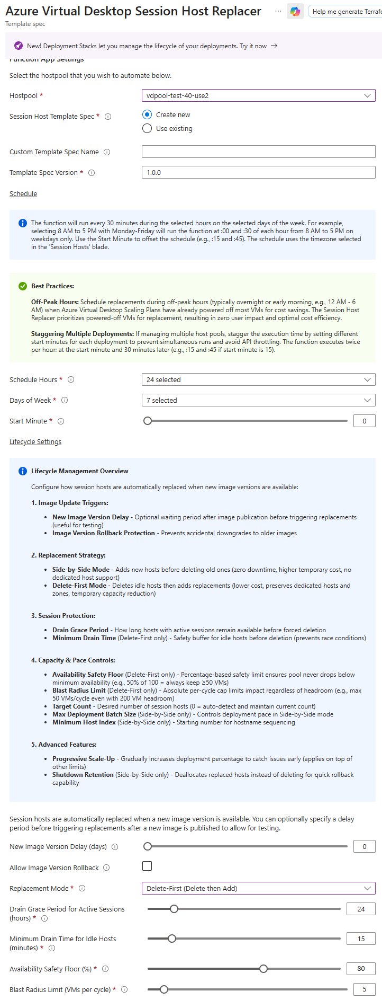
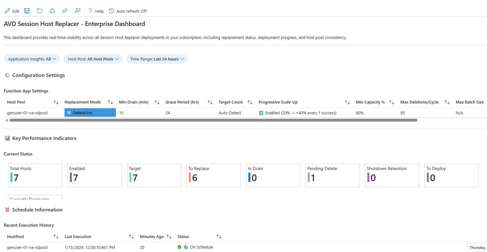

# AVD Session Host Replacer

> **Part of the [Federal AVD Solution](../../../README.md)** | See also: [Features Overview](../../../docs/features.md) | [Quick Start Guide](../../../docs/quick-start.md)

Automated Azure Function for managing Azure Virtual Desktop session host lifecycle through continuous image updates with flexible replacement strategies.

> **Supported host pools:** Use this add-on only with Azure Virtual Desktop **standard management**
> host pools. It creates, registers, drains, and deletes VMs directly. Don't use it with an
> automated host pool that has Session Host Configuration; Azure Virtual Desktop exclusively owns
> that pool's VM lifecycle and provides native Session Host Update. See
> [Choose a Host Pool Management Approach](../../../docs/host-pool-management.md).

## Table of Contents

- [Overview](#overview)
- [Features](#features)
- [Replacement Modes](#replacement-modes)
- [Prerequisites](#prerequisites)
- [Deployment](#deployment)
- [Configuration](#configuration)
- [How It Works](#how-it-works)
- [Canonical Replacement Flow](#canonical-replacement-flow)
- [Troubleshooting](#troubleshooting)
- [Maintenance](#maintenance)

## Overview

The Session Host Replacer monitors AVD session hosts and automatically replaces them when new images are available. It handles the complete lifecycle including detection, draining, deployment, deletion, and device cleanup.

**Key Benefits:**

- **Flexible Replacement Strategies**: Choose between SideBySide (zero-downtime) or DeleteFirst (cost-optimized) modes
- **Zero-downtime rolling updates** with automatic capacity management (SideBySide mode)
- **Cost-optimized replacements** with controlled capacity reduction (DeleteFirst mode)
- **Dynamic capacity from scaling plans**: Automatic adjustment of safety floors based on scaling plan schedules (DeleteFirst mode)
- **Zero-touch image updates** with automatic version tracking
- **Graceful user session handling** with configurable grace periods
- **Progressive scale-up** for gradual, validated rollouts
- **Shutdown retention** for rollback capability (SideBySide mode)
- **Auto-detect target count** for dynamic scaling plan compatibility
- **Device cleanup** (Entra ID + Intune) with automatic hostname reuse
- **Multi-cloud support** (Commercial, GCC High, DoD, China; US Secret/Top Secret)

## Features

### Core Capabilities

- **Image Version Tracking**: Detects outdated images and triggers updates
- **Flexible Replacement Strategies**: Choose between SideBySide and DeleteFirst modes
- **Graceful Draining**: Configurable grace period for active sessions (default: 24 hours)
- **Minimum Drain Time**: Safety buffer for zero-session hosts before deletion (default: 15 minutes)
- **New Host Availability Check**: Safety mechanism that prevents deleting old hosts if newly deployed replacements aren't healthy and available
- **Progressive Scale-Up**: Gradual rollouts starting with small percentages and scaling up after success
- **Shutdown Retention**: Rollback capability by retaining old hosts in shutdown state (SideBySide mode)
- **Auto-Detect Target Count**: Maintains current host count, compatible with dynamic scaling plans
- **Tag-Based Opt-In**: Only affects hosts tagged with `IncludeInAutoReplace: true`
- **Device Cleanup**: Removes Entra ID and Intune device records automatically
- **Failed Deployment Recovery**: Automatic cleanup of partial resources with persistent tracking
- **Registration Verification**: Validates hosts successfully register before marking deployments as complete
- **Deployment State Persistence**: Tracks deleted hosts across function runs until deployment succeeds

### Enterprise Features

- **Zero Trust Networking**: Private endpoints and VNet integration
- **Customer-Managed Encryption**: CMK support for function storage
- **Multi-Cloud**: Commercial, GCC, GCC High, DoD, US Government Secret, and US Government Top Secret environments
- **Comprehensive Monitoring**: Application Insights integration with pre-built dashboard
- **Template Spec Integration**: Consistent deployments with versioning
- **Real-Time Visibility**: Azure Monitor Workbook dashboard for deployment tracking and host pool health
- **Dedicated Host Support**: Preserves and reuses dedicated host assignments (DeleteFirst mode)

### Performance & Efficiency Features

The Session Host Replacer includes several optimizations to minimize Azure API calls, execution time, and costs:

- **VM Caching**: Fetches all VMs once at function start and reuses throughout execution, updating cache after deletions instead of re-querying (reduces API calls by ~60%)
- **Lightweight Up-to-Date Check**: Fast pre-check to detect if pool is already current before expensive operations
- **Early Exit Path**: Immediately exits when no work needed, bypassing deployment/deletion logic and expensive API queries
- **Lazy Power State Loading**: Queries VM power states only for deletion decisions or scaling-aware readiness validation
- **Focused Steady-State Validation**: Up-to-date pools skip replacement planning but still validate latest-image hosts when an enabled scaling plan is present
- **Conditional Operations**: Skips deployment and deletion calculations when the lightweight check confirms up-to-date status

**Performance Impact**: Functions typically complete in <10 seconds when pool is up-to-date (vs 30-60 seconds for full evaluation), reducing execution costs by 70-80% for steady-state operations.

## Replacement Modes

The Session Host Replacer supports two distinct replacement strategies to accommodate different operational priorities:

### SideBySide Mode (Default)

**Best for**: Zero-downtime requirements, production environments, large host pools

**How it works**:

- Deploys new session hosts **before** deleting old ones
- Host pool temporarily doubles in size during replacement cycles
- New hosts are added, users naturally migrate, then old hosts are removed
- No capacity reduction at any point

**Characteristics**:

- ✅ **Zero downtime** - users always have available capacity
- ✅ **Maximum safety** - new hosts validated before old ones removed
- ✅ **Availability protection** - blocks deletions if new hosts fail health checks
- ✅ **Shutdown retention option** - keep old hosts powered off for rollback
- ✅ **Auto-detect target count** - compatible with scaling plans
- ✅ **Progressive scale-up** - gradual rollouts with validation
- ❌ **Higher temporary cost** - pays for both old and new hosts during transition
- ❌ **Requires capacity headroom** - subnet, quotas, dedicated hosts must support 2x size

**Configuration parameters**:

- `replacementMode`: `SideBySide`
- `targetSessionHostCount`: 0 (auto-detect) or specific number
- `maxDeploymentBatchSize`: Maximum deployments per run (default: 100)
- `minimumHostIndex`: Minimum starting index for hostname numbering - gap-filling logic starts from this index (default: 1, applies to both DeleteFirst and SideBySide modes)
- `enableShutdownRetention`: Keep old hosts shutdown for rollback (default: false)
- `shutdownRetentionDays`: Days to retain shutdown hosts (default: 3)

**Use cases**:

- Production environments with strict SLA requirements
- Large host pools where cost of temporary doubling is acceptable
- Environments requiring rollback capability
- Organizations with sufficient subnet IP space and Azure quotas

### DeleteFirst Mode

**Best for**: Cost optimization, resource-constrained environments, smaller host pools

**How it works**:

- Deletes idle old session hosts **first**, then deploys replacements
- Maintains minimum capacity percentage during replacements
- Reuses hostnames and dedicated host assignments from deleted hosts
- Gradual replacement controlled by max deletions per cycle

**Characteristics**:

- ✅ **Cost optimized** - no host pool doubling, pays only for needed capacity
- ✅ **Resource efficient** - lower IP address and quota consumption
- ✅ **Availability protection** - halts deletions if new hosts fail health checks
- ✅ **Hostname reuse** - leverages deleted names for new hosts
- ✅ **Dedicated host preservation** - maintains host group assignments
- ❌ **Temporary capacity reduction** - some hosts unavailable during replacement
- ⚠️ **Directory cleanup is recommended** - VM absence is always verified; optional Entra ID and Intune cleanup requires Graph permissions and reduces stale-record risk during hostname reuse
- ❌ **Slower rollouts** - limited by max deletions per cycle

**Configuration parameters**:

- `replacementMode`: `DeleteFirst`
- `targetSessionHostCount`: 0 (auto-detect) or Specific number
- `maxDeletionsPerCycle`: Absolute replacement ceiling per cycle (default: 50)
- `minimumCapacityPercentage`: Safety floor for available capacity (default: 80%)
- `removeEntraDevice`: Optionally remove Entra ID records before hostname reuse (default: `true`)
- `removeIntuneDevice`: Optionally remove Intune records before hostname reuse (default: `true`)

**Use cases**:

- Dev/test environments with relaxed availability requirements
- Cost-sensitive deployments where temporary doubling is prohibitive
- Resource-constrained environments (limited IPs, quotas, or dedicated hosts)
- Smaller host pools where temporary capacity reduction is acceptable
- Environments using dedicated hosts where reuse is required

### Mode Comparison Matrix

| Feature | SideBySide | DeleteFirst |
| --- | --- | --- |
| **Downtime** | None | Temporary capacity reduction |
| **Cost during replacement** | 2x (temporary) | 1x (no doubling) |
| **Hostname reuse** | No (generates new names) | Yes (reuses deleted names) |
| **Dedicated host support** | No (new hosts on different hosts) | Yes (preserves assignments) |
| **Shutdown retention** | Yes (optional) | No |
| **Auto-detect target count** | Yes | Yes |
| **Device cleanup required** | Optional | Optional; recommended for hostname reuse |
| **Progressive scale-up** | Yes | Yes |
| **Subnet IP requirements** | 2x during replacement | 1x (no spike) |
| **Rollback capability** | Yes (with shutdown retention) | No |
| **Deployment velocity** | Fast (batch size up to 1000) | Controlled (max deletions per cycle) |
| **Minimum drain time** | Yes | Yes |
| **Best for** | Production, zero-downtime | Cost optimization, resource constraints |

### Choosing the Right Mode

**Choose SideBySide if**:

- Zero downtime is a hard requirement
- You have sufficient subnet IP space and Azure quotas
- Cost of temporary doubling is acceptable
- You want rollback capability via shutdown retention
- You're using dynamic scaling plans (auto-detect target count)

**Choose DeleteFirst if**:

- Cost optimization is the priority
- Subnet IP space or quotas are constrained
- You're using dedicated hosts and need to preserve assignments
- Temporary capacity reduction is acceptable
- You can enable Graph API permissions for device cleanup

## Prerequisites

### Required Before Deployment

#### 1. Managed Identity for Function App

The Session Host Replacer Function App supports two identity options:

##### Option A: System-Assigned Managed Identity

- **Automatically created** during deployment
- **Simpler setup** - no pre-created identity needed
- **Best for**: Environments without device cleanup requirements or a small number of host pools
- **Limitation**: Graph permissions must be granted before the first schedule run. They must also be granted for each function app/host pool.

##### Option B: User-Assigned Managed Identity

- **Pre-created** before deployment
- **Regional requirement**: Must be in the same Azure region as the Function App because Microsoft.Web cannot attach a user-assigned identity across regional isolation boundaries
- **Best for**: Pre-authorizing optional device cleanup before the first DeleteFirst run
- **Best for**: Environments with a large number of host pools
- **Benefit**: Graph permissions can be granted before deployment

**Azure RBAC Permissions** (automatically granted during deployment for either identity type):

- `Desktop Virtualization Contributor` on Host Pool Resource Group
- `Reader` on Host Pool Subscription (for scaling plan queries)
- `Contributor` on Session Host Resource Group  
- `Reader` on Image Gallery/Marketplace

**Microsoft Graph API Permissions** (must be granted manually):

- `Device.ReadWrite.All` - For Entra ID device deletion
- `DeviceManagementManagedDevices.ReadWrite.All` - For Intune device deletion

> [!IMPORTANT]
> **DeleteFirst mode:** If Entra ID or Intune cleanup is enabled, configure the corresponding Graph permissions **before** the first function execution. Use a User-Assigned Managed Identity to grant permissions before deployment, or grant them to the System-Assigned Identity after deployment and stop the function app for about an hour before the first run to allow time for the permissions to propagate.
>
> Intune is not currently available in Azure Government Secret or Azure Government Top Secret.
> Leave Intune cleanup disabled unless your environment support team confirms availability. Grant
> only `Device.ReadWrite.All` for Entra cleanup.

#### 2. Grant Graph API Permissions to Managed Identity

**Why This Is Needed When Device Cleanup Is Enabled:**

- The Function App needs to clean up stale device registrations in Entra ID and Intune
- This removes stale directory records before DeleteFirst reuses hostnames
- Service principals/managed identities require **Application Permissions** (not delegated permissions)

**When to Grant Permissions:**

- **User-Assigned Identity**: Grant permissions **before** deployment
- **System-Assigned Identity**: Grant permissions **after** deployment (the identity is created during deployment)

**Steps to Grant Permissions:**

1. **Get the Managed Identity Object ID**:

   For User-Assigned Identity:

   ```powershell
   $uai = Get-AzUserAssignedIdentity -ResourceGroupName "<rg-name>" -Name "<identity-name>"
   $objectId = $uai.PrincipalId
   ```

   For System-Assigned Identity (after deployment):

   ```powershell
   $functionApp = Get-AzWebApp -ResourceGroupName "<rg-name>" -Name "<function-app-name>"
   $objectId = $functionApp.Identity.PrincipalId
   ```

2. Navigate to the sessionHostReplacer directory:

   ```powershell
   cd deployments/add-ons/sessionHostReplacer
   ```

3. **Connect to the correct Microsoft Graph environment.**

   The permission helper intentionally does not select an environment, connect, or disconnect. This
   prevents it from guessing a cloud and lets it use the environment already authorized for your
   tenant.

   For Commercial Azure, Azure Government (GCC High), or Azure Government DoD, connect with the
   environment name supported by your installed Microsoft Graph PowerShell SDK:

   ```powershell
   $requiredScopes = @(
       'Application.Read.All'
       'AppRoleAssignment.ReadWrite.All'
   )

   # Commercial Azure
   Connect-MgGraph -Environment Global -Scopes $requiredScopes

   # Azure Government (GCC High) - use instead of the command above
   # Connect-MgGraph -Environment USGov -Scopes $requiredScopes

   # Azure Government DoD - use instead of the command above
   # Connect-MgGraph -Environment USGovDoD -Scopes $requiredScopes
   ```

> [!IMPORTANT]
> For Azure Government Secret and Azure Government Top Secret, do not use the public cloud
> labels as Graph environment names. Follow the Microsoft Graph connection instructions
> available inside your environment or from your environment support team. Configure and
> connect the Microsoft Graph PowerShell SDK with the authorized environment-specific values,
> requesting `Application.Read.All` and `AppRoleAssignment.ReadWrite.All`. This public
> repository intentionally does not publish or infer restricted environment names or endpoints.
> Authorized operators can start with the restricted
> [Azure Government Secret differences guidance](https://review.learn.microsoft.com/en-us/microsoft-government-secret/azure/azure-government-secret/overview/azure-government-secret-differences-from-global-azure?branch=live)
> or
> [Azure Government Top Secret differences guidance](https://review.learn.microsoft.com/en-us/microsoft-government-topsecret/azure/azure-government-top-secret/overview/azure-government-top-secret-differences-from-global-azure?branch=live).

4. **Verify the active Graph context before changing permissions:**

   ```powershell
   Get-MgContext |
       Select-Object Account, TenantId, Environment, Scopes
   ```

   Confirm the account, tenant, and environment are correct and that both required scopes are
   present. The connected account must be authorized to grant Microsoft Graph application roles,
   such as through Privileged Role Administrator or Global Administrator.

5. **Run the permission helper against the existing context:**

   ```powershell
   # Entra ID device cleanup only
   .\Set-GraphPermissions.ps1 `
       -ManagedIdentityObjectId $objectId `
       -DeviceCleanupTarget Entra

   # Entra ID and Intune device cleanup
   # Use only where Intune is available and both cleanup options are enabled.
   # .\Set-GraphPermissions.ps1 `
   #     -ManagedIdentityObjectId $objectId `
   #     -DeviceCleanupTarget Entra, Intune
   ```

   The helper discovers the application-role IDs from the Microsoft Graph service principal in the
   active environment, grants only missing permissions, verifies the result, and preserves
   unrelated Graph permissions. It fails without an active context or when required scopes are
   missing. It does not disconnect the context.

   You should see the permissions for the selected cleanup targets reported as present:

   - `Entra` grants `Device.ReadWrite.All`.
   - `Intune` grants `DeviceManagementManagedDevices.ReadWrite.All`.

> [!IMPORTANT]
> Intune is not currently available in Azure Government Secret or Azure Government Top Secret.
> Leave Intune cleanup disabled and use `-DeviceCleanupTarget Entra` unless your environment
> support team confirms Intune availability. Do not assume that
> `DeviceManagementManagedDevices.ReadWrite.All` exists there.

**Understanding Graph API Permissions:**

For service principals and managed identities calling Graph API:

- ✅ **Application Permissions (App Roles)** - Required, appear in token's `roles` claim
- ✅ `Device.ReadWrite.All` IS sufficient for device deletion when used by service principals

**Manual Permission Grant (if the helper cannot be used):**

```powershell
# First connect to the correct Graph environment as described above.
$context = Get-MgContext
if (-not $context) {
    throw 'Connect to the correct Microsoft Graph environment before continuing.'
}

# Get managed identity and Graph service principals
$mi = Get-MgServicePrincipal -ServicePrincipalId <managed-identity-object-id>
$graph = Get-MgServicePrincipal `
    -Filter "appId eq '00000003-0000-0000-c000-000000000000'" `
    -Property 'id,appRoles'

# Add DeviceManagementManagedDevices.ReadWrite.All only when Intune cleanup is enabled and Intune
# is available in the active environment.
$permissions = @('Device.ReadWrite.All')
foreach ($permissionName in $permissions) {
    $appRole = $graph.AppRoles |
        Where-Object {
            $_.Value -eq $permissionName -and
            $_.IsEnabled -and
            $_.AllowedMemberTypes -contains 'Application'
        }
    if (-not $appRole) {
        throw "Application permission '$permissionName' is unavailable in the active environment."
    }

    $bodyParameter = @{
        principalId = $mi.Id
        resourceId  = $graph.Id
        appRoleId   = $appRole.Id
    }
    New-MgServicePrincipalAppRoleAssignment `
        -ServicePrincipalId $mi.Id `
        -BodyParameter $bodyParameter
}
```

#### 3. Azure Function App Requirements

The deployment creates or uses an existing Function App:

- **New Deployment**: Creates Premium Windows plan (P0v3) with zone redundancy option
- **Existing Plan**: Must be one of the following:
  - **Premium v3 Windows Plans**: P0v3, P1v3, P2v3, P3v3 (P0v3 recommended for cost savings)
  - **Elastic Premium Plans**: EP1, EP2, EP3
  - **Premium v2 Plans**: P1v2, P2v2, P3v2
- ❌ **Not Compatible**: Consumption plans, Linux plans, or Standard/Basic tiers
- **Required Features**:
  - Always On (enabled by deployment)
  - VNet Integration support (if using private endpoints)
  - PowerShell 7.4 runtime
- 💡 **Cost Tip**: P0v3 is the most cost-effective option and fully supports all required features

#### 4. Network Requirements for Zero Trust Networking

These resources are required only when Zero Trust networking (`privateEndpoint: true`) is enabled:

1. **Function App outbound subnet**
   - Dedicated to Function App virtual network integration
   - Delegated to `Microsoft.Web/serverFarms`
2. **Private endpoint subnet**
   - Must not have any subnet delegations
   - Must be different from the Function App outbound subnet
3. **Private DNS zones**
   - Required for the Function App and storage private endpoints to resolve correctly

The session host VM subnet is also required for replacement hosts, but it does not require the
`Microsoft.Web/serverFarms` delegation.

#### 5. Other Required Resources

1. **Template Spec** (optional but recommended for portal-based deployments)
2. **Application Insights** (recommended for monitoring)
3. **Storage Account** (automatically created by deployment for Function App internal use)

### Software Requirements

1. **PowerShell 7.4+**
2. **Microsoft Graph PowerShell Module** (for granting permissions)

   ```powershell
   Install-Module Microsoft.Graph -Scope CurrentUser
   ```

3. **Azure PowerShell Module** (for deployment)

   ```powershell
   Install-Module Az -Scope CurrentUser
   ```

## Deployment

### Template Spec Portal Form (First Deployment)

From the repository root, publish the add-on Template Specs:

```powershell
.\tools\New-TemplateSpecs.ps1 `
  -ResourceGroupName 'rg-avd-operations-p-eus2' `
  -Location 'eastus2' `
  -createSharedServices $false `
  -createNetwork $false `
  -createImageManagement $false `
  -createCustomImage $false `
  -createHostPool $false `
  -createAutomatedHostPool $false `
  -CreateAddOns $true
```

In the Azure portal, open **Template Specs**, select **AVD Session Host Replacer**, and choose
**Deploy**. On **Review + create**, select **Create**. After the deployment is submitted, select
**Download template and parameters** and retain the working parameter file for subsequent
PowerShell or CI/CD deployments.

### Blue Button (Azure Commercial / Government Alternative)

Click the button for your target cloud to open the deployment UI in Azure Portal:

[](https://portal.azure.com/#blade/Microsoft_Azure_CreateUIDef/CustomDeploymentBlade/uri/https%3A%2F%2Fraw.githubusercontent.com%2FAzure%2FFederalAVD%2Fmain%2Fdeployments%2Fadd-ons%2FSessionHostReplacer%2Fmain.json/uiFormDefinitionUri/https%3A%2F%2Fraw.githubusercontent.com%2FAzure%2FFederalAVD%2Fmain%2Fdeployments%2Fadd-ons%2FSessionHostReplacer%2FuiFormDefinition.json) [](https://portal.azure.us/#blade/Microsoft_Azure_CreateUIDef/CustomDeploymentBlade/uri/https%3A%2F%2Fraw.githubusercontent.com%2FAzure%2FFederalAVD%2Fmain%2Fdeployments%2Fadd-ons%2FSessionHostReplacer%2Fmain.json/uiFormDefinitionUri/https%3A%2F%2Fraw.githubusercontent.com%2FAzure%2FFederalAVD%2Fmain%2Fdeployments%2Fadd-ons%2FSessionHostReplacer%2FuiFormDefinition.json)

**⚠️ Note:** Blue Button is unavailable in air-gapped clouds. Use the Template Spec form above.
See [deployment-guide.md](deployment-guide.md) for update procedures after the initial deployment.

### Brownfield Deployments

**The Session Host Replacer is brownfield-compatible with standard-management host pools**,
regardless of whether they were originally deployed through the Azure portal, Terraform, ARM,
Bicep, or another tool. It doesn't support automated host pools with Session Host Configuration.

#### Prerequisites for Brownfield

- Existing host pool with session hosts
- Key Vault with credentials (VM admin, domain join if applicable)
- Subnet for new session hosts
- RBAC permissions on host pool and VM resource group

#### Naming Convention Considerations

Pass the same `namingConvention` and `identifier` values used in the host pool deployment. When deploying from the Portal, these are pre-populated from the `hpNamingConvention` and `hpIdentifier` tags on the host pool resource. Session host naming patterns (`virtualMachineNameConv`, `virtualMachineDiskNameConv`, `virtualMachineNicNameConv`, `availabilitySetNameConv`) are pre-populated from tags on the hosts resource group.

**Critical for brownfield:** Session host naming MUST match your existing VM naming. For example:

- If existing VMs are named `avdvm-001`, use `virtualMachineNameConv: 'SHNAME'` (no prefix/suffix)
- If existing VMs are named `vm-avdvm-001`, use `virtualMachineNameConv: 'vm-SHNAME'`
- If existing VMs are named `avdvm-001-vm`, use `virtualMachineNameConv: 'SHNAME-vm'`

When naming tags are absent, the defaults are `SHNAME` for VMs, `SHNAME-osdisk` for OS disks, and `SHNAME-nic` for NICs. Existing resource-group tags continue to take precedence so replacement hosts retain the source host pool's naming.

**Token Reference:**

- `SHNAME` = Session host name (e.g., `avdvm-001` becomes `vm-avdvm-001`)
- `##` = Availability set index (e.g., `avset-01`, `avset-02`)

See the [Brownfield Example](#brownfield-deployment-example) below for a complete deployment scenario.

### 1. Create Template Spec (Optional but Recommended)

A template spec is a resource type for storing an Azure Resource Manager template (ARM template) in Azure for later deployment. Template specs enable you to share ARM templates with other users in your organization through Azure RBAC controls.

**Benefits of using template specs:**

- Standard ARM/Bicep templates without external dependencies
- Azure RBAC for access control (no SAS tokens required)
- Users can deploy without write access to the template source
- Integrates with existing deployment processes (PowerShell, Azure Portal, DevOps)
- **Custom portal forms** for guided deployment experience

For more information, see [Template Specs | Microsoft Learn](https://learn.microsoft.com/en-us/azure/azure-resource-manager/templates/template-specs?tabs=azure-powershell) and [Portal Forms for Template Specs](https://learn.microsoft.com/en-us/azure/azure-resource-manager/templates/template-specs-create-portal-forms).

**To create the Session Host Replacer template spec:**

1. Connect to the correct Azure environment where `<Environment>` equals 'AzureCloud', 'AzureUSGovernment', or the air-gapped equivalent:

   ```powershell
   Connect-AzAccount -Environment <Environment>
   ```

2. Ensure your context is set to the subscription where you want to store the template spec:

   ```powershell
   Set-AzContext -Subscription <subscriptionID>
   ```

3. From the repository root, execute the script with the core Template Specs disabled:

   ```powershell
   .\tools\New-TemplateSpecs.ps1 `
     -ResourceGroupName <resource-group-name> `
     -Location <location> `
     -createCustomImage $false `
     -createHostPool $false `
     -CreateAddOns $true
   ```

   Example:

   ```powershell
   .\tools\New-TemplateSpecs.ps1 `
     -ResourceGroupName 'rg-avd-management-use2' `
     -Location 'eastus2' `
     -createCustomImage $false `
     -createHostPool $false `
     -CreateAddOns $true
   ```

This publishes **AVD Session Host Replacer** with its custom UI form in the specified resource
group. Publishing does not deploy the add-on.

### 2. Deploy Infrastructure

Use the published Template Spec portal form for the first deployment. Use PowerShell with the
exported parameter file for subsequent deployments.

#### Option 1: Deploy via Azure Portal (Recommended)

The custom UI form provides a guided experience with tooltips and validation:

1. Navigate to **Template Specs** in the Azure Portal
2. Select the **sessionHostReplacer** template spec
3. Click **Deploy**
4. Fill out the form with your configuration:
   - **Basics**: Host pool selection, location
   - **Replacer Configuration**: Execution settings, replacement mode, schedule
   - **Identity**: Domain join configuration
   - **Session Hosts**: VM configuration, image, networking
   - **User Profiles**: FSLogix settings (optional)
   - **Infrastructure**: App Service Plan, encryption, zero trust networking
   - **Monitoring**: Application Insights, Log Analytics workspace
   - **Advanced**: Brownfield naming overrides, resource tags (optional)
5. Review and click **Create**

Here is a screen shot of the form:



The form automatically validates inputs and provides helpful descriptions for each parameter.

##### Brownfield Deployments with Custom Naming

For brownfield deployments with non-standard host pool naming (e.g., `prod-avd-hostpool-01` instead of `vdpool-avd-prod-eus`), use the **Custom Naming (Advanced)** step:

1. On the **Custom Naming (Advanced)** step, check **Use Custom Naming Overrides**
2. Fill out the **Function App Infrastructure Naming** section:
   - **Function App Name**: (Required) Globally unique name, 2-60 chars, alphanumeric and hyphens. Example: `func-avdshr-prod-eus2`
   - **Storage Account Name**: (Required) Globally unique name, 3-24 chars, lowercase alphanumeric only. Example: `stavdshrprod`
   - **Application Insights**: When monitoring is enabled, its name is generated automatically.
     Standard deployments use the Application Insights resource-type abbreviation with the same
     host-pool identity components as the Function App. A custom Function App name is followed by
     `-insights`.
3. Fill out the **Session Host Resource Naming** section:
   - **Virtual Machine Naming Convention**: (Required) Pattern with `SHNAME` token. Example: `vm-SHNAME`
   - **OS Disk Naming Convention**: (Required) Pattern with `SHNAME` token. Example: `disk-SHNAME`
   - **Network Interface Naming Convention**: (Required) Pattern with `SHNAME` token. Example: `nic-SHNAME`
   - **Availability Set Naming Convention**: (Required) Pattern with `##` token. Example: `avset-##`

**Token Reference:**

- `SHNAME` = Session host name (e.g., `avdvm-001` becomes `vm-avdvm-001` with `vm-SHNAME` pattern)
- `##` = Availability set index (e.g., `01`, `02` becomes `avset-01`, `avset-02` with `avset-##` pattern)

**Critical:** Session host naming conventions MUST match your existing VMs! The form includes:

- Built-in validation for global uniqueness (Function App, Storage Account)
- Token validation (SHNAME and ## tokens required in naming patterns)
- Helpful examples and warnings

**When to use Custom Naming:**

- Host pool name doesn't follow standard patterns (`vdpool-*` or `*-vdpool`)
- Existing session hosts use non-standard naming
- You want explicit control over resource naming
- Deploying to existing infrastructure with specific naming requirements

**When Custom Naming is NOT needed:**

- Host pool follows standard patterns: `vdpool-avd-prod-eus` or `avd-prod-eus-vdpool`
- Session hosts follow the default pattern: `avdvm-001`, with related resources named `avdvm-001-osdisk` and `avdvm-001-nic`
- You're comfortable with automatically-derived names

#### Option 2: Deploy via PowerShell

```powershell
# Set parameters
$params = @{
    resourceGroupName = "rg-avd-management-use2"
    location = "eastus2"
    hostPoolResourceId = "/subscriptions/.../resourceGroups/.../providers/Microsoft.DesktopVirtualization/hostpools/vdpool-prod"
    # Optional: Only required if device cleanup is needed from first run (DeleteFirst mode).
    # The identity must be in the same Azure region as the Function App.
    sessionHostReplacerUserAssignedIdentityResourceId = "/subscriptions/.../resourceGroups/.../providers/Microsoft.ManagedIdentity/userAssignedIdentities/mi-sessionhostreplacer"
    # ... other parameters
}

# Deploy using Template Spec
New-AzResourceGroupDeployment -ResourceGroupName $params.resourceGroupName `
    -TemplateSpecId "/subscriptions/.../resourceGroups/.../providers/Microsoft.Resources/templateSpecs/sessionHostReplacer/versions/1.0" `
    -TemplateParameterObject $params

# OR deploy directly from bicep file
New-AzResourceGroupDeployment -ResourceGroupName $params.resourceGroupName `
    -TemplateFile ".\deployments\add-ons\SessionHostReplacer\main.json" `
    -TemplateParameterObject $params
```

#### Brownfield Deployment Example

**Recommended approach:** Use the Azure Portal with the custom UI form's **Custom Naming (Advanced)** step. The form provides built-in validation, helpful tooltips, and prevents common mistakes.

**PowerShell alternative:** For automation or CI/CD pipelines, you can deploy via PowerShell with naming override parameters:

Example deployment for an existing host pool with non-standard naming:

```powershell
# Existing environment details
$existingHostPoolId = "/subscriptions/12345678-1234-1234-1234-123456789012/resourceGroups/rg-production-avd/providers/Microsoft.DesktopVirtualization/hostPools/prod-avd-hostpool-01"
$existingVMResourceGroupId = "/subscriptions/12345678-1234-1234-1234-123456789012/resourceGroups/rg-production-sessionhosts"
$existingKeyVaultId = "/subscriptions/12345678-1234-1234-1234-123456789012/resourceGroups/rg-production-shared/providers/Microsoft.KeyVault/vaults/kv-prod-avd"
$existingSubnetId = "/subscriptions/12345678-1234-1234-1234-123456789012/resourceGroups/rg-production-network/providers/Microsoft.Network/virtualNetworks/vnet-prod/subnets/snet-avd"

# Deploy Session Host Replacer with naming overrides
$params = @{
    # Required - brownfield references
    hostPoolResourceId = $existingHostPoolId
    virtualMachinesResourceGroupId = $existingVMResourceGroupId
    credentialsKeyVaultResourceId = $existingKeyVaultId
    virtualMachineSubnetResourceId = $existingSubnetId
    
    # Required - naming overrides for non-standard host pool name
    functionAppNameOverride = "func-avdshr-prod-eus2"
    storageAccountNameOverride = "stavdshrprod"
    
    # Required - session host naming (MUST match existing VM naming!)
    # Existing VMs: vm-avdvm-001, vm-avdvm-002, etc.
    virtualMachineNameConv = "vm-SHNAME"
    virtualMachineDiskNameConv = "disk-SHNAME"
    virtualMachineNicNameConv = "nic-SHNAME"
    availabilitySetNameConv = "avset-##"
    
    # Required - session host configuration
    sessionHostNamePrefix = "avdvm"
    imageReference = @{ publisher = "MicrosoftWindowsDesktop"; offer = "windows-11"; sku = "win11-25h2-avd" }
    virtualMachineSize = "Standard_D4ads_v6"
    identitySolution = "ActiveDirectoryDomainServices"
    domainName = "corp.contoso.com"
    
    # Optional - replacement strategy
    replacementMode = "SideBySide"
    targetSessionHostCount = 0  # Auto-detect from current pool
    enableShutdownRetention = $true
    shutdownRetentionDays = 3
    
    # Optional - device cleanup (requires Graph permissions)
    removeEntraDevice = $true
    removeIntuneDevice = $true
}

New-AzResourceGroupDeployment -ResourceGroupName "rg-avd-management" `
    -TemplateFile ".\deployments\add-ons\SessionHostReplacer\main.json" `
    -TemplateParameterObject $params
```

**Key differences for brownfield:**

- No dependency on how the host pool was originally created
- Works across subscriptions (function app, host pool, and VMs can all be in different subscriptions)
- Naming overrides prevent issues with non-standard host pool names
- Existing session hosts must be tagged to opt-in (see [Tag Session Hosts](#4-tag-session-hosts-for-automation))

### 3. Restart Function App (Required After Graph Permission Grant)

If you granted Graph API permissions **after** deployment (e.g., using system-assigned identity), the managed identity needs to pick up the new permissions:

1. **Stop** the Function App completely
2. Wait **2-3 minutes** for Azure AD token cache to clear
3. **Start** the Function App
4. Verify permissions appear in Application Insights logs

> **Why this is necessary:** Function Apps cache Azure AD tokens. Restarting ensures the new Graph API permissions are included in fresh tokens.
> 
> **Note:** This step is only required if you granted Graph permissions after deployment. If using a user-assigned identity with pre-granted permissions, this step can be skipped.

### 4. Tag Session Hosts for Automation

Session hosts must be tagged to opt-in to automatic replacement:

```powershell
$vmName = "avdvm-001"
$resourceGroup = "rg-avd-sessionhosts"

Update-AzTag -ResourceId "/subscriptions/.../resourceGroups/$resourceGroup/providers/Microsoft.Compute/virtualMachines/$vmName" `
    -Operation Merge `
    -Tag @{
        "IncludeInAutoReplace" = "true"
        "AutoReplaceDeployTimestamp" = (Get-Date).ToString("o")
    }
```

> **Tip:** You can also set these tags in your session host deployment template to automatically opt in new hosts.

## How It Works

### Replacement Triggers

The Session Host Replacer operates in **Image-Version-Based Replacement** mode:

- Replaces session hosts when their image version differs from the latest available version
- Use this to ensure all hosts run the latest OS/application patches
- Replacement happens whenever a new image is published (subject to optional delay)
- **Ringed Roll-out Support**: Use `replaceSessionHostOnNewImageVersionDelayDays` to delay replacement after a new image is detected (0-30 days). This emulates a staged deployment strategy similar to Windows Update rings, allowing you to validate a new image in production before rolling it out fleet-wide
- **Rollback Protection**: By default, the function will not replace hosts if their current image version is newer than the latest available version. Set `allowImageVersionRollback` to true to override this behavior

### Target Session Host Count

The `targetSessionHostCount` parameter defines your desired host pool size with two modes:

#### Explicit Count Mode

Set to a specific number (e.g., 100) to maintain that exact count throughout replacement cycles:

- Function always tries to maintain this specific number
- Does not adapt to manual scaling changes
- Best for static host pools with predictable capacity needs

#### Auto-Detect Mode (Recommended)

Set to `0` to automatically maintain the current count when replacement cycles begin:

- Function captures initial count when first outdated host is detected
- This count is maintained throughout the entire replacement cycle
- After all hosts are replaced, the next cycle captures the new current count
- **Perfect for dynamic scaling plans**: Function adapts to whatever count your scaling plan has set
- **Manual scaling compatible**: Make temporary adjustments between image updates

**Example scenario with auto-detect**:

1. Scaling plan maintains 50 hosts during normal operations
2. New image version is detected
3. Function captures "50" as target for this replacement cycle
4. Function replaces all 50 hosts while maintaining that count
5. After replacement completes, scaling plan increases to 75 hosts
6. Next image update will use "75" as the target

Auto-detect mode is supported in both replacement modes. In DeleteFirst mode, the captured target is persisted with the recovery state so retries continue toward the same cycle target.

### Tag Schema

Session hosts use these tags for automation:

| Tag | Purpose | Example Value | When Set |
| --- | --- | --- | --- |
| `IncludeInAutoReplace` | Opt-in to automation | `true` | At deployment or manually |
| `AutoReplaceDeployTimestamp` | Birth timestamp for tracking | `2024-12-01T10:00:00Z` | At deployment |
| `AutoReplacePendingDrainTimestamp` | When draining started | `2024-12-15T14:30:00Z` | When placed in drain mode |
| `AutoReplaceShutdownTimestamp` | When host was shutdown (SideBySide with retention) | `2024-12-20T16:00:00Z` | When shutdown for retention |
| `ScalingPlanExclusion` | Exclude from scaling | `SessionHostReplacer` | Set at deployment, during drain mode, and shutdown retention. Checked and restored on retained VMs each run; removed only from active hosts when the cycle completes or retention begins |

## Canonical Replacement Flow

The [canonical Session Host Replacer flow](replacement-flow.md) is the authoritative
reference for:

- Shared inventory, image, scaling-plan, and readiness evaluation.
- SideBySide deployment, validation, drain, retention, and removal sequencing.
- DeleteFirst capacity floors, exact-name replacement, and single-host restrictions.
- The 60-minute pre-RampUp, RampUp, and Peak destructive-work freeze.
- Progressive batch growth and mode-specific ceilings.
- Durable pending-host recovery after interruption, deployment failure, or delayed registration.
- Final fresh-state deletion checks and definitive deletion verification.

This README intentionally does not duplicate those state machines. It owns deployment,
configuration, monitoring, maintenance, and troubleshooting guidance.

## Configuration

### Function App Runtime

| Setting | Default | Description |
| --- | --- | --- |
| `powerShellVersion` | `7.4` | PowerShell worker version used by the Function App. The Template Spec form attempts to discover GA and preview versions available in the selected region. If the Portal returns no runtime metadata, the form offers PowerShell 7.6 preview and 7.4 as fallback choices. |

The deployed Function App remains pinned to the selected version. Publishing a newer Template Spec
does not change an existing app. To upgrade, redeploy the Session Host Replacer and explicitly select
the newer supported version. This allows the same template to create new apps on the current regional
default while existing apps continue running their configured version until a planned upgrade.

### Replacement Mode Parameters

| Setting | Default | Applies To | Description |
| --- | --- | --- | --- |
| `replacementMode` | `SideBySide` | All | Replacement strategy: `SideBySide` (zero-downtime) or `DeleteFirst` (cost-optimized) |
| `targetSessionHostCount` | `0` | All | Target host pool size. Set to 0 for auto-detect mode in either replacement mode, or use a specific number for explicit count |
| `drainGracePeriodHours` | `24` | All | Grace period in hours for session hosts **with active sessions** before forced deletion (1-168 hours) |
| `minimumDrainMinutes` | `15` | All | Minimum drain time in minutes for session hosts **with zero sessions** before eligible for deletion (0-120 minutes). Acts as safety buffer for API lag and race conditions |

### SideBySide Mode Parameters

| Setting | Default | Description |
| --- | --- | --- |
| `maxDeploymentBatchSize` | `100` | Maximum deployments per function run (1-1000). Limits concurrent ARM deployments regardless of progressive scale-up percentage |
| `minimumHostIndex` | `1` | Minimum starting index for hostname numbering (1-999). Gap-filling logic starts from this index. Applies to both DeleteFirst and SideBySide modes |
| `enableShutdownRetention` | `false` | Shutdown (deallocate) old hosts instead of deleting them, enabling rollback to previous image |
| `shutdownRetentionDays` | `3` | Days to retain shutdown hosts before automatic deletion (1-7). Provides rollback window |

### DeleteFirst Mode Parameters

| Setting | Default | Description |
| --- | --- | --- |
| `maxDeletionsPerCycle` | `50` | Absolute ceiling for hosts deleted and replaced per cycle (1-100). Progressive scale-up can select a smaller batch, and the capacity floor can reduce it further |
| `minimumCapacityPercentage` | `80` | Static online healthy floor when no enabled scaling-plan schedule can be evaluated. With a scaling plan, RampDown and OffPeak use its target but retain at least one online healthy host; new destructive batches freeze 60 minutes before RampUp and throughout RampUp and Peak |

#### Dynamic Capacity from Scaling Plans

**DeleteFirst mode only**: The scaling plan remains enabled and continues to own ordinary host power management. The replacer protects draining and newly deployed hosts with its scaling-exclusion value, then releases validated replacements back to autoscale.

**How it works**:
- Function queries the scaling plan on each run
- Determines current phase (RampUp, Peak, RampDown, OffPeak)
- Applies a phase-aware replacement strategy:
  - **60 minutes before RampUp, RampUp, and Peak**: Starts no new destructive batch. Recovery, deployment monitoring, registration, validation, and release of healthy replacements continue.
  - **RampDown and OffPeak**: Uses the scaling-plan percentage to size safe batches, while retaining at least one online healthy host.
- Falls back to static `minimumCapacityPercentage` if no scaling plan found
- Caps a static percentage floor at target minus one while replacement is active so pools with at least two hosts can progress one host at a time

**Example scenario**:

- Your scaling plan: 90% (Peak), 80% (RampDown), 50% (OffPeak), 60% (RampUp)
- Your configured `minimumCapacityPercentage`: 70%
- **Replacement behavior**:
  - **Peak and RampUp**: No new destructive batch
  - **60 minutes before RampUp**: No new destructive batch; autoscale prepares capacity
  - **RampDown**: Safe batch sized from the 80% target
  - **OffPeak**: Safe batch sized from the 50% target, never below one online healthy host

**Benefits**:

- ✅ **Intelligent timing**: Aligns replacements with business usage patterns
- ✅ **Faster off-peak updates**: Aggressive during low-usage windows (can go below configured minimum)
- ✅ **Peak protection**: Starts no new destructive work while users are ramping up or at peak
- ✅ **Respects scaling intent**: Trusts that your scaling plan's off-peak percentages are appropriate
- ✅ **Automatic**: No manual coordination needed
- ✅ **Transparent**: Logs show which capacity source and phase logic is being used

**Safety features**:

- **One-host absolute floor**: A zero-percent OffPeak target never authorizes deletion of the last online healthy host
- **60-minute RampUp freeze**: Prevents a new destructive batch from competing with autoscale as it prepares user capacity
- **Example**: Run at 5:15 AM before a 6:00 AM RampUp -> continue recovery and validation, but start no new delete/deploy batch
- **Single-host protection**: Exact-name DeleteFirst replacement is blocked for a target of one because uninterrupted availability is impossible without temporary capacity

**Logging examples**:

```text
Destructive replacement is frozen during scaling phase 'OffPeak->RampUp (look-ahead)'.
FINAL_DELETE_SAFETY | OnlineHealthy: 10 | RequiredRemaining: 5 | Candidates: 5/8 | Frozen: False
Replacement capacity policy: minimum online healthy hosts=1, effective percentage=0%, destructive freeze=False
```

**Requirements**:

- Scaling plan must be assigned to the host pool
- Schedule must be configured with `rampUpMinimumHostsPct` and `rampDownMinimumHostsPct` values
- No additional configuration needed - feature is automatic when scaling plan is detected

### Progressive Scale-Up Parameters

| Setting | Default | Description |
| ------- | ------- | ----------- |
| `enableProgressiveScaleUp` | `false` | Enable percentage-based gradual deployment scale-up. Starts small and increases after consecutive successes |
| `initialDeploymentPercentage` | `20` | Starting batch size as percentage of total needed hosts (1-100%). Used when progressive scale-up is enabled |
| `scaleUpIncrementPercentage` | `40` | Percentage increase added after successful deployment runs (5-50%). Progressive increments until reaching 100% |
| `successfulRunsBeforeScaleUp` | `1` | Consecutive successful runs required before increasing percentage (1-5). More successes = more conservative |

### Image Version & Rollout Parameters

| Setting | Default | Description |
| --- | --- | --- |
| `replaceSessionHostOnNewImageVersionDelayDays` | `0` | Days to wait after new image detection before starting replacements (0-30). Enables ringed rollouts for image validation |
| `allowImageVersionRollback` | `false` | Allow replacement even if current version is newer than latest available. Prevents accidental downgrades by default |

### Tagging & Automation Parameters

| Setting | Default | Description |
| --- | --- | --- |
| `fixSessionHostTags` | `true` | Automatically add missing tags to session hosts during execution (IncludeInAutoReplace, AutoReplaceDeployTimestamp) |
| `includePreExistingSessionHosts` | `true` | Include session hosts that existed before automation deployment. If false, only new hosts are managed |
| `tagIncludeInAutomation` | `IncludeInAutoReplace` | Tag name identifying hosts included in automation. Must be set to `true` to enable automation |
| `tagDeployTimestamp` | `AutoReplaceDeployTimestamp` | Tag name for deployment timestamp (ISO 8601 format) |
| `tagPendingDrainTimestamp` | `AutoReplacePendingDrainTimestamp` | Tag name for drain start timestamp |
| `tagShutdownTimestamp` | `AutoReplaceShutdownTimestamp` | Tag name for shutdown timestamp (SideBySide with retention) |
| `tagScalingPlanExclusionTag` | `ScalingPlanExclusion` | Tag name for excluding hosts from scaling plans. Applied to newly deployed hosts, hosts in drain, and shutdown retention VMs. Removed when cycle completes (or when new capacity is active in SideBySide+retention) |
| `tagValidatedImage` | `AutoReplaceValidatedImage` | Tag name for exact-image AVD health validation evidence. Allows a confirmed stopped, unexcluded host to count as scaling-plan-managed ready capacity. |

### Device Cleanup Parameters

| Setting | Default | Description |
| --- | --- | --- |
| `removeEntraDevice` | `true` | Remove Entra ID device records when deleting session hosts. Recommended before DeleteFirst hostname reuse; requires `Device.ReadWrite.All` when enabled |
| `removeIntuneDevice` | `true` | Remove Intune device records when deleting session hosts. Recommended before DeleteFirst hostname reuse; requires `DeviceManagementManagedDevices.ReadWrite.All` when enabled. Intune is not currently available in Azure Government Secret and Top Secret; set to `false` unless availability is confirmed for the target environment. |

### Scheduling Parameters

| Setting | Default | Description |
| --- | --- | --- |
| `timerSchedule` | `0 0,30 * * * *` | NCrontab format: `{second} {minute} {hour} {day} {month} {day-of-week}`. Default runs every 30 minutes at :00 and :30. Stagger across deployments by varying minutes |

**Timer Schedule Examples**:

- `0 0,30 * * * *` - Every 30 minutes (at :00 and :30 past each hour)
- `0 15,45 * * * *` - Every 30 minutes starting at :15 (runs at :15 and :45)
- `0 0 * * * *` - Every hour on the hour
- `0 0 */2 * * *` - Every 2 hours
- `0 0 8-17 * * 1-5` - Every hour from 8 AM to 5 PM, Monday through Friday
- `0 0,30 8-17 * * 1-5` - Every 30 minutes from 8 AM to 5 PM, Monday through Friday

### Environment-Specific Settings

**Commercial Azure (Global):**

```json
{
    "ResourceManagerUri": "https://management.azure.com/",
    "GraphEndpoint": "https://graph.microsoft.com",
    "StorageSuffix": "core.windows.net"
}
```

**GCC High (USGov):**

```json
{
    "ResourceManagerUri": "https://management.usgovcloudapi.net/",
    "GraphEndpoint": "https://graph.microsoft.us",
    "StorageSuffix": "core.usgovcloudapi.net"
}
```

**DoD (USGovDoD):**

DoD tenants deploy into the same Azure US Government cloud, so the template configures the same
settings as GCC High, including `"GraphEndpoint": "https://graph.microsoft.us"`. At runtime, if a
Graph call to `https://graph.microsoft.us` returns 401 or 403, the function acquires a new token
for `https://dod-graph.microsoft.us` and retries the call against that endpoint. No DoD-specific
configuration is required.

> **Note:** Azure US Secret and US Top Secret clouds are supported via automatic environment detection during bicep deployment. The Graph endpoint is dynamically constructed as `https://graph${replace(environment().suffixes.storage, 'core', '')}` (for example, storage suffix `core.microsoft.scloud` produces `https://graph.microsoft.scloud`) and automatically configured in the Function App settings.

### Configuration Examples

#### Example 1: SideBySide with Zero-Downtime (Production)

```bicep
replacementMode: 'SideBySide'
targetSessionHostCount: 0  // Auto-detect for scaling plan compatibility
drainGracePeriodHours: 24  // 24-hour grace period for active sessions
minimumDrainMinutes: 30    // 30-minute safety buffer for zero-session hosts
maxDeploymentBatchSize: 100  // Deploy up to 100 hosts concurrently
enableProgressiveScaleUp: true
initialDeploymentPercentage: 10  // Start with 10% of needed hosts
scaleUpIncrementPercentage: 20   // Increase by 20% after successes
enableShutdownRetention: true    // Enable rollback capability
shutdownRetentionDays: 3         // Keep old hosts for 3 days
```

#### Example 2: DeleteFirst for Cost Optimization (Dev/Test)

```bicep
replacementMode: 'DeleteFirst'
targetSessionHostCount: 20  // Explicit count required
drainGracePeriodHours: 4    // Shorter grace period for dev
minimumDrainMinutes: 5      // Minimal safety buffer
maxDeletionsPerCycle: 5     // Replace 5 hosts per cycle
minimumCapacityPercentage: 70  // More aggressive (allow up to 30% reduction)
removeEntraDevice: true     // Recommended before hostname reuse
removeIntuneDevice: true    // Recommended before hostname reuse
```

#### Example 3: Gradual Ringed Rollout (Large Production)

```bicep
replacementMode: 'SideBySide'
targetSessionHostCount: 500
replaceSessionHostOnNewImageVersionDelayDays: 7  // Wait 7 days to validate new image
enableProgressiveScaleUp: true
initialDeploymentPercentage: 5   // Very conservative start (5% = 25 hosts)
scaleUpIncrementPercentage: 10   // Gradual increases
successfulRunsBeforeScaleUp: 2   // Require 2 consecutive successes
maxDeploymentBatchSize: 50       // Limit concurrent deployments
```

#### Example 4: Fast Rollout (Small Pool, Trusted Images)

```bicep
replacementMode: 'SideBySide'
targetSessionHostCount: 10
drainGracePeriodHours: 6   // Shorter grace period
minimumDrainMinutes: 0     // No safety buffer (delete immediately when zero sessions)
enableProgressiveScaleUp: false  // Deploy all at once
maxDeploymentBatchSize: 10       // Deploy all 10 simultaneously
replaceSessionHostOnNewImageVersionDelayDays: 0  // Immediate replacement
```

## Troubleshooting

### Common Issues

#### 1. Graph API 401 "Invalid Audience" Error

**Symptoms:**

- Logs show: "Access token validation failure. Invalid audience."
- Device deletion fails with 401

**Cause:** Token's audience claim doesn't match Graph endpoint

**Resolution:**

```powershell
# Verify token audience in Application Insights
traces
| where message contains "Token audience"
| order by timestamp desc
| take 10

# If wrong audience:
1. Verify GraphEndpoint setting matches environment
2. Restart Function App to clear token cache
3. Wait 5 minutes for new token acquisition
```

#### 2. Graph API 401 "Insufficient Privileges"

**Symptoms:**

- Logs show: "Insufficient privileges to complete the operation"
- Devices can be read but not deleted

**Cause:** Missing Device.ReadWrite.All permission in token

**Resolution:**

```powershell
# Connect to the correct Microsoft Graph environment as described in the prerequisites, then verify.
.\Set-GraphPermissions.ps1 `
    -ManagedIdentityObjectId <object-id> `
    -DeviceCleanupTarget Entra

# If granted but not in token:
1. Wait 10-60 minutes for Azure AD propagation
2. Stop Function App completely
3. Wait 2-3 minutes
4. Start Function App
5. Check logs for token roles - should include Device.ReadWrite.All
```

#### 3. Session Hosts Not Being Replaced

**Symptoms:**

- Function runs but doesn't drain/replace hosts
- No hosts in "pending delete" list

**Common Causes:**

**A. Missing/Invalid Tags:**

```powershell
# Check tags
$vm = Get-AzVM -ResourceGroupName "rg-sessionhosts" -Name "avdvm-001"
$vm.Tags

# Required: IncludeInAutoReplace: "true" (case-sensitive)
# Required: AutoReplaceDeployTimestamp: ISO8601 timestamp

# Fix if fixSessionHostTags=false
Update-AzTag -ResourceId $vm.Id -Operation Merge -Tag @{
    "IncludeInAutoReplace" = "true"
    "AutoReplaceDeployTimestamp" = (Get-Date).ToString("o")
}
```

**B. Image Version Not Detected:**

Verify image version detection is working:

```kusto
traces
| where message contains "IMAGE_INFO"
| order by timestamp desc
| take 1
```

Check that latest version differs from current host versions.

#### 4. Deployment Fails

**Common Issues:**

- Template Spec not found/accessible
- Insufficient RBAC permissions
- Quota limits exceeded
- No available subnet IPs

```powershell
# Check deployment errors
exceptions
| where outerMessage contains "deployment"
| order by timestamp desc

# Verify Template Spec exists
Get-AzTemplateSpec -ResourceGroupName "rg-management" -Name "sessionhost-template"

# Check managed identity RBAC
$mi = Get-AzUserAssignedIdentity -ResourceGroupName "rg-management" -Name "mi-sessionhostreplacer"
Get-AzRoleAssignment -ObjectId $mi.PrincipalId
```

#### 5. Device Not Deleted from Entra ID/Intune

**Resolution:**

```powershell
# Verify settings
$app = Get-AzFunctionApp -ResourceGroupName "rg-management" -Name "func-sessionhostreplacer"
$app.ApplicationSettings["RemoveEntraDevice"]  # Should be "true"
$app.ApplicationSettings["RemoveIntuneDevice"]  # Should be "true"

# Check Graph API calls in logs
traces
| where message contains "Removing session host" or message contains "Entra" or message contains "Intune"
| order by timestamp desc

# After connecting to the correct Microsoft Graph environment, verify Graph permissions.
.\Set-GraphPermissions.ps1 `
    -ManagedIdentityObjectId <object-id> `
    -DeviceCleanupTarget Entra
```

#### 6. DeleteFirst Mode: Deployment Conflicts

**Symptoms:**

- Deployments fail with "resource already exists" errors
- Function logs show deletion success but deployment fails

**Cause:** Azure resource cleanup not complete before reusing names

**Resolution:**

The function automatically polls for deletion completion every 30 seconds for up to 10 minutes by default. If this happens:

1. Check if deletion verification completed:

```kusto
traces
| where message contains "VM" and message contains "deletion confirmed"
| order by timestamp desc
```

1. If verification timed out, manually verify VM deletion:

```powershell
Get-AzVM -ResourceGroupName "rg-sessionhosts" -Name "vm-oldhost-001"
# Should return 'ResourceNotFound' error
```

1. If VM still exists, deletion may have failed. Check deployment state:

```kusto
traces
| where message contains "CRITICAL ERROR" or message contains "deletion failures"
| order by timestamp desc
```

#### 7. Progressive Scale-Up Not Increasing

**Symptoms:**

- Deployments stay at initial percentage
- Consecutive successes not incrementing

**Causes & Solutions:**

**A. Previous deployment still running:**

```kusto
traces
| where message contains "Previous deployment is still running"
| order by timestamp desc
```

Wait for previous deployment to complete before next scale-up.

**B. Failed deployment between runs:**

```kusto
traces
| where message contains "Previous deployment failed"
| order by timestamp desc
```

Progressive scale-up resets on failure. Next successful deployment will restart from initial percentage.

**C. New cycle started:**

```kusto
traces
| where message contains "Detected new update cycle"
| order by timestamp desc
```

Scale-up resets when new image version detected or previous cycle completes.

#### 8. Auto-Detect Target Count Not Working

**Symptoms:**

- Target count shows as 0 or wrong number
- Logs show unexpected target count

**Causes & Solutions:**

**A. Deployment state is unavailable:**

Both modes support auto-detect. DeleteFirst requires deployment-state storage to persist the captured cycle target and recovery mappings. Verify that the managed identity has `Storage Table Data Contributor` on the storage account.

**B. Cycle not started yet:**

Auto-detect captures count when first outdated host is detected:

```kusto
traces
| where message contains "New cycle detection" or message contains "Starting new update cycle"
| order by timestamp desc
```

If no outdated hosts exist, auto-detect hasn't captured a count yet.

**C. Check current stored target:**

```kusto
traces
| where message contains "SETTINGS"
| order by timestamp desc
| take 1
```

Look for `TargetSessionHostCount` value. If "Auto", count will be captured at next cycle start.

#### 9. Shutdown Retention VMs Not Being Deleted

**Symptoms:**

- Old VMs remain in shutdown state beyond retention period
- Logs show shutdown VMs but no cleanup

**Resolution:**

Check for expired shutdown VMs:

```kusto
traces
| where message contains "Shutdown retention is enabled"
| where message contains "expired shutdown VM"
| order by timestamp desc
```

Verify `enableShutdownRetention` is true and `shutdownRetentionDays` is configured:

```powershell
$app = Get-AzFunctionApp -ResourceGroupName "rg-management" -Name "func-sessionhostreplacer"
$app.ApplicationSettings["EnableShutdownRetention"]   # Should be "true"
$app.ApplicationSettings["ShutdownRetentionDays"]     # Should be 1-7
```

#### 10. Minimum Drain Time Not Respected

**Symptoms:**

- Hosts with zero sessions deleted immediately
- Expected safety buffer not applied

**Cause:** `minimumDrainMinutes` set to 0 or drain timestamp not set properly

**Resolution:**

```kusto
traces
| where message contains "MinimumDrainMinutes"
| order by timestamp desc
| take 1
```

Check configuration:

```powershell
$app = Get-AzFunctionApp -ResourceGroupName "rg-management" -Name "func-sessionhostreplacer"
$app.ApplicationSettings["MinimumDrainMinutes"]  # Recommended: 15-30
```

Verify hosts have drain timestamp tag:

```powershell
$vm = Get-AzVM -ResourceGroupName "rg-sessionhosts" -Name "vm-001"
$vm.Tags["AutoReplacePendingDrainTimestamp"]  # Should be ISO 8601 timestamp
```

#### 11. Replacement Pauses Before RampUp or During Peak Hours

**Symptoms:**

- No new destructive batch starts even though hosts still need replacement
- Running deployments and health validation continue
- Validated hosts are released to autoscale

**Cause:** The replacer freezes new destructive work 60 minutes before RampUp and throughout RampUp and Peak so the scaling plan can prepare and maintain user capacity.

**Explanation:**

The function continues non-destructive work:

- Monitor running ARM deployments
- Recover unresolved exact-name replacements
- Validate registration, image identity, AVD status, health, and power state
- Remove replacer-owned scaling exclusions from validated hosts
- Start no additional drain or deletion operation

**Resolution Options:**

1. **Wait for RampDown or OffPeak** - The next safe invocation resumes destructive batching while retaining at least one online healthy host:

```kusto
traces
| where message contains "Destructive replacement is frozen"
| order by timestamp desc
| take 10
```

2. **Power on old hosts** - Makes them truly available to users while waiting for replacement:

```powershell
# Identify powered-off hosts needing replacement
$vms = Get-AzVM -ResourceGroupName "rg-sessionhosts" -Status
$poweredOff = $vms | Where-Object { $_.PowerState -eq 'VM deallocated' }

# Power on specific hosts if needed for user capacity
$poweredOff | ForEach-Object { Start-AzVM -ResourceGroupName $_.ResourceGroupName -Name $_.Name }
```

3. **Lower static minimum** (not recommended for production during business hours):

```bicep
minimumCapacityPercentage: 50  // Allows more deletions but reduces user capacity protection
```

**Best Practice:** Let the phase-aware logic work as designed - scaling plan will power on old hosts if demand increases during Peak, while SessionHostReplacer maintains capacity floor and prioritizes powered-off hosts for replacement.

#### 12. Capacity Drops Too Low in DeleteFirst Mode

**Symptoms:**

- Too many hosts deleted at once
- Host pool capacity drops significantly

**Cause:** `minimumCapacityPercentage` set too low or `maxDeletionsPerCycle` too high

**Resolution:**

Adjust safety parameters:

```bicep
minimumCapacityPercentage: 80  // Increase to be more conservative (prevents dropping below 80%)
maxDeletionsPerCycle: 3         // Decrease for slower, safer replacements
```

Verify current settings:

```kusto
traces
| where message contains "SETTINGS"
| where message contains "MinimumCapacityPercent"
| order by timestamp desc
| take 1
```

#### 13. Failed Deployment Artifacts Not Cleaned Up

**Symptoms:**

- Orphaned VMs without session host registration
- VMs with names not following convention
- Failed deployments remain in resource group

**Resolution:**

Check for failed deployment cleanup:

```kusto
traces
| where message contains "failed deployments for cleanup" or message contains "orphaned VMs"
| order by timestamp desc
```

The function automatically cleans up failed deployments. If cleanup fails:

1. Manually identify orphaned VMs:

```powershell
# Get all VMs in resource group
$vms = Get-AzVM -ResourceGroupName "rg-sessionhosts"

# Get registered session hosts
$hostPool = Get-AzWvdHostPool -ResourceGroupName "rg-hostpool" -Name "vdpool-prod"
$sessionHosts = Get-AzWvdSessionHost -HostPoolName $hostPool.Name -ResourceGroupName "rg-hostpool"

# Find VMs not registered as session hosts
$orphanedVMs = $vms | Where-Object { 
    $vmName = $_.Name
    -not ($sessionHosts | Where-Object { $_.Name -like "*$vmName*" })
}
```

2. Manually clean up orphaned resources
3. Check pending host mappings in deployment state (DeleteFirst mode only)

### Monitoring Best Practices

1. **Set up Alerts:**

   ```kusto
   // Alert on repeated failures
   traces
   | where customDimensions.Category == "Function.session-host-replacer"
   | where severityLevel >= 3
   | summarize ErrorCount=count() by bin(timestamp, 1h)
   | where ErrorCount > 5
   
   // Alert on DeleteFirst mode deletion failures (critical)
   traces  
   | where message contains "CRITICAL ERROR" and message contains "deletion failures"
   | where timestamp > ago(1h)
   
   // Alert on progressive scale-up failures
   traces
   | where message contains "Reset consecutive successes" and severityLevel >= 2
   | where timestamp > ago(1h)
   ```

2. **Daily Health Check Queries:**

   ```kusto
   // Current state summary
   traces
   | where customDimensions.Category == "Function.session-host-replacer"
   | where message contains "METRICS"
   | order by timestamp desc
   | take 1
   | project timestamp, message
   
   // Recent deployment activity
   traces
   | where message contains "Deployment submitted"
   | where timestamp > ago(7d)
   | summarize Deployments=count(), HostsDeployed=sum(toint(extract(@"(\d+) VMs requested", 1, message))) by bin(timestamp, 1d)
   
   // Replacement cycle progress
   traces
   | where message contains "SETTINGS" or message contains "METRICS"
   | where timestamp > ago(1d)
   | order by timestamp desc
   | project timestamp, ReplacementMode=extract(@"ReplacementMode: (\w+)", 1, message),
             ToReplace=extract(@"ToReplace: (\d+)", 1, message),
             InDrain=extract(@"InDrain: (\d+)", 1, message),
             RunningDeployments=extract(@"RunningDeployments: (\d+)", 1, message)
   ```

3. **Weekly Health Check:**
   - Review successful replacement count via workbook dashboard
   - Check average age of fleet
   - Verify no stuck deployments (running > 2 hours)
   - Confirm device cleanup working (no orphaned Entra/Intune devices)
   - Validate progressive scale-up trajectory (if enabled)
   - Check shutdown retention cleanup (SideBySide mode)

4. **Monthly Review:**
   - Assess replacement mode effectiveness (cost vs. downtime)
   - Review batch size and progressive scale-up settings
   - Evaluate grace period effectiveness (too long/short?)
   - Check for orphaned devices in Entra ID/Intune
   - Validate Template Spec currency
   - Review capacity planning (subnet IPs, quotas, dedicated hosts)

### Debug Logging

Enable verbose logging in Application Insights:

```kusto
// All function execution
traces
| where customDimensions.Category == "Function.session-host-replacer"
| order by timestamp desc

// Graph API calls
traces
| where message contains "Graph" or message contains "device"
| order by timestamp desc

// Deployment activity
traces
| where message contains "deploy" or message contains "Template Spec"
| order by timestamp desc

// Drain and deletion activity
traces
| where message contains "drain" or message contains "delete" or message contains "shutdown"
| order by timestamp desc

// Progressive scale-up tracking
traces
| where message contains "consecutive successes" or message contains "CurrentPercentage"
| order by timestamp desc

// Mode-specific queries
// DeleteFirst: Hostname reuse tracking
traces
| where message contains "Captured dedicated host properties" or message contains "Reuse deleted names"
| order by timestamp desc

// SideBySide: Shutdown retention tracking  
traces
| where message contains "shutdown retention" or message contains "expired shutdown"
| order by timestamp desc

// Errors only
traces
| where severityLevel >= 3
| order by timestamp desc
```

### Monitoring Dashboard

The Session Host Replacer includes a pre-built Azure Monitor Workbook that provides real-time visibility into automation status and host pool health.

**Access the Dashboard:**

1. Navigate to Azure Portal → **Monitor** → **Workbooks**
2. Select **AVD Session Host Replacer Dashboard**
3. Or open the resource group containing the selected Log Analytics workspace and select the
  **AVD Session Host Replacer - Enterprise Dashboard** workbook
4. **Select Host Pool**: Use the dropdown to filter by a specific host pool or view all

**Dashboard Features:**

- **📊 Key Performance Indicators**
  - Total session hosts
  - Hosts pending replacement
  - Hosts in drain mode
  - Hosts pending deletion
  - Hosts in shutdown retention (SideBySide mode)

- **🎯 Host Pool Consistency**
  - Hosts by image version
  - Hosts by age distribution
  - Replacement status breakdown
  - Replacement mode indicator

- **🔄 Deployment Progress**
  - Deployment activity timeline
  - Progressive scale-up status (current percentage, consecutive successes)
  - Success/failure tracking
  - Running vs. completed deployments

- **⏱️ Session Drain Status**
  - Hosts currently draining
  - Grace period countdowns
  - Active session counts
  - Minimum drain time compliance

- **🗑️ Deletion Activity**
  - Host deletion operations
  - Device cleanup (Entra ID + Intune)
  - Shutdown retention tracking (deallocated VMs awaiting rollback or expiration)
  - Expired shutdown VM cleanup (automatic after retention period)
  - Scaling plan exclusion management (protects retention VMs, allows scaling of new hosts)

- **⚙️ Configuration Summary**
  - Current replacement mode
  - Target host count (explicit or auto-detect)
  - Grace period and minimum drain settings
  - Progressive scale-up configuration
  - Batch size limits

- **⚠️ Errors and Warnings**
  - Recent errors with timestamps
  - Error trends over time
  - Failed deployment tracking
  - Critical alerts (DeleteFirst deletion failures)

- **📈 Historical Trends**
  - Function execution frequency
  - Average host pool size over time
  - Replacement cycle duration
  - Deployment success rate
  - Image version adoption timeline



**Customization:**

The workbook is fully customizable. You can:

- **Switch between host pools**: Dynamic dropdown populated from your environment
- Adjust time ranges (1 hour to 30 days)
- Add custom queries
- Modify visualizations
- Export data for reporting
- Filter by replacement mode

> **Multi-Host-Pool Support**: Each Session Host Replacer Function App has a corresponding
> Application Insights resource in the Function App resource group. Those Application Insights
> resources can send telemetry to the same Log Analytics workspace. Use the **Host Pool** parameter
> to filter the dashboard to a specific host pool or view aggregate data across all pools.

### Enterprise Workbook Architecture

The Session Host Replacer uses a **centralized workbook** pattern for enterprise-wide visibility:

- **One Workbook per Log Analytics Workspace** deploys into the selected workspace's subscription
  and resource group
- **One Application Insights per Function App** deploys into the Function App resource group and
  uses the same host-pool identity components as the Function App
- **Cross-Region Queries**: The workbook queries all regional Application Insights instances in your subscription
- **Multi-Region Filtering**: Use the **Application Insights** parameter to select which regions to view
- **Host Pool Filtering**: Use the **Host Pool** parameter to filter to specific pools or view all

**Deployment Behavior:**

- **First Deployment for a Workspace**: Creates the workbook in the selected Log Analytics
  workspace resource group and specified `workbookLocation` (defaults to the deployment region)
- **Subsequent Deployments Using the Same Workspace**: Reuse and update the same deterministic
  workbook, even when their Function Apps and session hosts use different resource groups
- **Different Workspaces**: Receive separate workbooks so their monitoring boundaries remain
  independent
- The workbook automatically discovers all Session Host Replacer Application Insights instances
- The workbook is associated with the selected Log Analytics workspace and is available from
  **Log Analytics workspace > Workbooks**. It can also be found by display name from
  **Azure Monitor > Workbooks**.

**Location Note:** The workbook's physical location doesn't affect its cross-region query
capabilities (similar to AVD Insights). Use the same `workbookLocation` selected when the workbook
was first created for that workspace. The deployment identity needs permission to create or update
workbooks in the workspace resource group, including when it is in a centralized monitoring
subscription.

> **Upgrade note:** Earlier releases deployed the workbook into each Session Host Replacer
> Function App resource group. The first deployment of this version creates the workspace-scoped
> workbook in the selected Log Analytics workspace resource group; ARM does not move or delete an
> older workbook. Validate the centralized workbook, preserve any intentional customizations, and
> then remove obsolete per-host workbooks through the approved change process.

> **Application Insights naming upgrade:** This version gives each Function App a corresponding
> Application Insights resource whose generated name uses the same host-pool identity. Redeploying
> an environment that used the earlier convention-derived name creates the new component and rewires
> the Function App to it. ARM does not delete the old component; retain it while historical telemetry
> is needed, then remove it through the approved change process. Parameter files must remove the
> retired `applicationInsightsNameOverride` parameter.

This pattern:

- **Single Pane of Glass**: One dashboard for all regions and host pools
- **Flexible Filtering**: View one region, multiple regions, or all regions
- **Idempotent**: No conflicts when deploying to multiple regions
- **Cost Efficient**: One workbook vs N (per region)

### Reviewing and Updating an Existing Configuration

The workbook's **Configuration and Effective Behavior** table translates the latest Function App
settings and scaling-plan telemetry into operator-facing behavior. It shows whether replacement is
currently permitted, whether destructive work is frozen, the active scaling phase and target, and
the applicable mode-specific limits. The Function App link opens the deployed resource for further
inspection.

Use `Set-SessionHostReplacerConfiguration.ps1` to review or change supported operational settings:

```powershell
# Review the current configuration without changing it.
.\Set-SessionHostReplacerConfiguration.ps1 `
  -FunctionAppName <function-app-name> `
  -ResourceGroupName <function-app-resource-group>

# Preview a safer, smaller DeleteFirst batch.
.\Set-SessionHostReplacerConfiguration.ps1 `
  -FunctionAppName <function-app-name> `
  -ResourceGroupName <function-app-resource-group> `
  -MinimumCapacityPercentage 90 `
  -MaxDeletionsPerCycle 2 `
  -WhatIf
```

The script reads the complete app-settings collection, displays only supported non-secret
configuration, validates mode-specific combinations, shows a before-and-after diff, and writes the
complete collection back so unrelated Function App settings are preserved. App-setting changes
restart the Function App.

The script intentionally does not change replacement mode, timer schedule, identities, networking,
device-cleanup permissions, template references, or other deployment resources. Change those
through the Template Spec or Bicep deployment.

> **Configuration source of truth:** A later Template Spec redeployment writes the parameter values
> back to the Function App and can overwrite direct app-setting changes. Update the authoritative
> deployment parameters to match any operational change that should persist across redeployments.

Required permissions:

- Review: `Microsoft.Web/sites/read` and `Microsoft.Web/sites/config/list/action`
- Update: `Microsoft.Web/sites/config/write`

## Maintenance

### Updating the Function

**Option 1: Portal (Quick Updates)**

1. Navigate to Function App → App Service Editor
2. Edit `Modules/SessionHostReplacer/SessionHostReplacer.psm1`
3. Save changes
4. Restart Function App

**Option 2: PowerShell Deployment**

```powershell
$sourcePath = ".\deployments\add-ons\SessionHostReplacer\functions"
$zipPath = ".\SessionHostReplacer.zip"

Compress-Archive -Path "$sourcePath\*" -DestinationPath $zipPath -Force

Publish-AzWebApp -ResourceGroupName "rg-management" `
    -Name "func-sessionhostreplacer" `
    -ArchivePath $zipPath -Force

Restart-AzFunctionApp -ResourceGroupName "rg-management" `
    -Name "func-sessionhostreplacer" -Force
```

**Option 3: Azure CLI**

```bash
cd deployments/add-ons/sessionHostReplacer
zip -r SessionHostReplacer.zip functions/*

az functionapp deployment source config-zip \
  --resource-group rg-management \
  --name func-sessionhostreplacer \
  --src SessionHostReplacer.zip

az functionapp restart \
  --resource-group rg-management \
  --name func-sessionhostreplacer
```

### Monitoring Best Practices

1. **Set up Alerts:**

   ```kusto
   // Alert on repeated failures
   traces
   | where customDimensions.Category == "Function.session-host-replacer"
   | where severityLevel >= 3
   | summarize ErrorCount=count() by bin(timestamp, 1h)
   | where ErrorCount > 5
   ```

2. **Weekly Health Check:**
   - Review successful replacement count
   - Check average age of fleet
   - Verify no stuck deployments
   - Confirm device cleanup working

3. **Monthly Review:**
   - Assess batch size (progressive scale-up)
   - Review grace period effectiveness
   - Check for orphaned devices
   - Validate Template Spec currency

## Additional Resources

- [Azure Functions PowerShell Documentation](https://learn.microsoft.com/en-us/azure/azure-functions/functions-reference-powershell)
- [Azure Virtual Desktop Documentation](https://learn.microsoft.com/en-us/azure/virtual-desktop/)
- [Microsoft Graph Permissions Reference](https://learn.microsoft.com/en-us/graph/permissions-reference)
- [Managed Identity Best Practices](https://learn.microsoft.com/en-us/azure/active-directory/managed-identities-azure-resources/managed-identity-best-practice-recommendations)

## License

See repository root LICENSE file.
