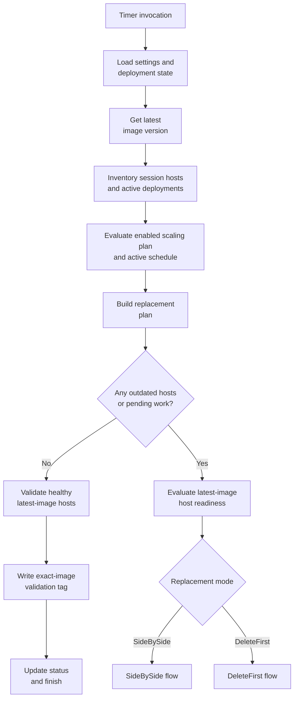
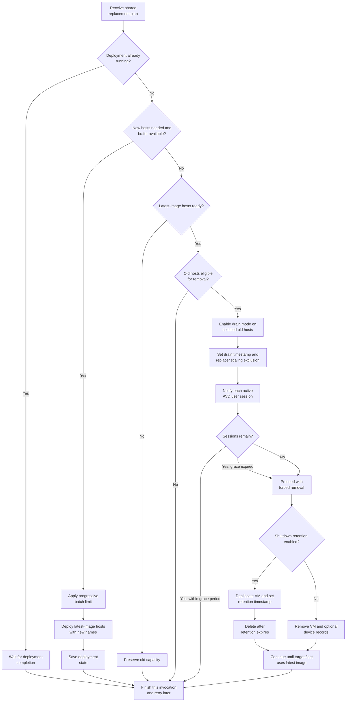
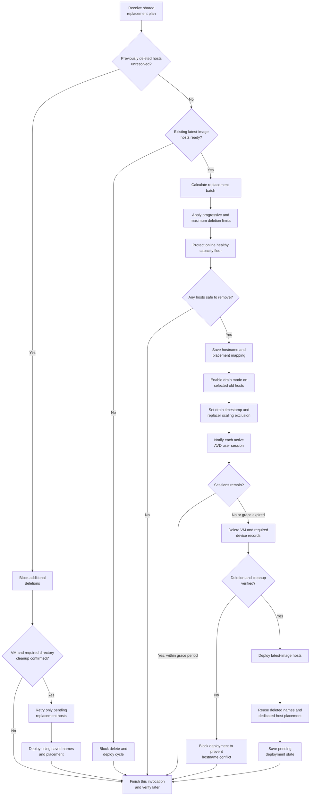

[**Home**](../../../README.md) | [**Session Host Replacer**](README.md) | [**Add-Ons**](../../../docs/add-ons.md)

# Session Host Replacer Flow Diagrams

These diagrams describe one timer invocation. A replacement cycle can span multiple invocations while deployments complete, users drain, or safety checks block further work.

## Shared Evaluation

Both replacement modes begin with the same inventory, image, planning, and validation steps.

Exact-image evidence is written whenever a latest-image host has AVD status `Available` and no failed AVD health checks. Drain mode does not prevent evidence from being written.

Readiness then treats a latest-image host as either:

- Online ready: health validated and accepting new sessions.
- Scalable standby: exact-image evidence exists, the VM is stopped or deallocated, AVD status is `Shutdown`, no administrator scaling exclusion applies, and an enabled scaling plan can start it.

Without an enabled, evaluable scaling plan, all latest-image hosts must be online ready. With a scaling plan, at least one must be online ready unless the active target is exactly `0%`.

## SideBySide

SideBySide creates replacement capacity before it removes old capacity. The pool can temporarily grow to twice its target size.

SideBySide-specific behavior:

- New hosts are deployed before old hosts are drained or removed.
- Failed readiness preserves the old hosts and waits for a later invocation.
- During an active `0%` scaling period, validated latest-image hosts may all be scalable standby; stale hosts can still be deleted or deallocated for shutdown retention.
- Shutdown retention is available only in this mode.
- Entra ID or Intune cleanup failures are reported but do not block unrelated replacements because hostnames are not reused.

## DeleteFirst

DeleteFirst removes a capacity-safe batch before deploying replacements. It records hostname and dedicated-host placement data before deletion so the replacement can reuse them.

DeleteFirst-specific behavior:

- During `RampUp`, `Peak`, and look-ahead into `RampUp`, the effective online healthy capacity floor is the greater of the configured minimum and the active scaling-plan target. During `RampDown` and `OffPeak`, it uses the active scaling-plan target directly.
- Drained, unhealthy, unavailable, and scaled-down hosts do not authorize deletion of additional online healthy hosts. They remain eligible for replacement without consuming the online floor.
- An active `0%` scaling target permits a zero-host floor during the applicable off-hours phase.
- OffPeak remains owned by the most recent selected schedule day until the next selected day's RampUp, including across midnight and unselected days.
- `MaxDeletionsPerCycle` remains an independent absolute blast-radius ceiling. Progressive scale-up may select a smaller batch, and the capacity floor may reduce it further.
- New deletions stop while a previously deleted host is not registered.
- New deletions fail closed when the recovery state cannot be read or the pending-host mapping cannot be saved.
- A failed zero-floor deployment can recover even when the host pool temporarily has no registrations.
- VM deletion is revalidated before hostname reuse even when directory cleanup is disabled.
- Required Entra ID or Intune cleanup is retried and revalidated before hostname reuse.
- A tracked or ARM-discovered running deployment blocks the invocation from deleting or deploying again.
- A deployment that remains `Running` fails closed until ARM or an operator moves it to a terminal state.
- A successful ARM deployment with pending AVD registration waits without cleanup or duplicate deployment.
- Accepted deployments require a durable tracking-state write; VM presence remains the duplicate-deployment gate if that write fails.
- Shutdown retention is always disabled.

## Drain Notification

The user message is sent when the replacer first puts a selected host into drain mode, not when the host merely appears in a plan. Every active AVD session found on that host receives the configured maintenance message. A host already in drain mode with a drain timestamp is not notified again on every timer invocation.
