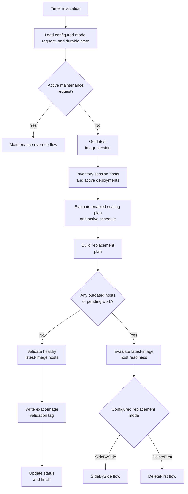
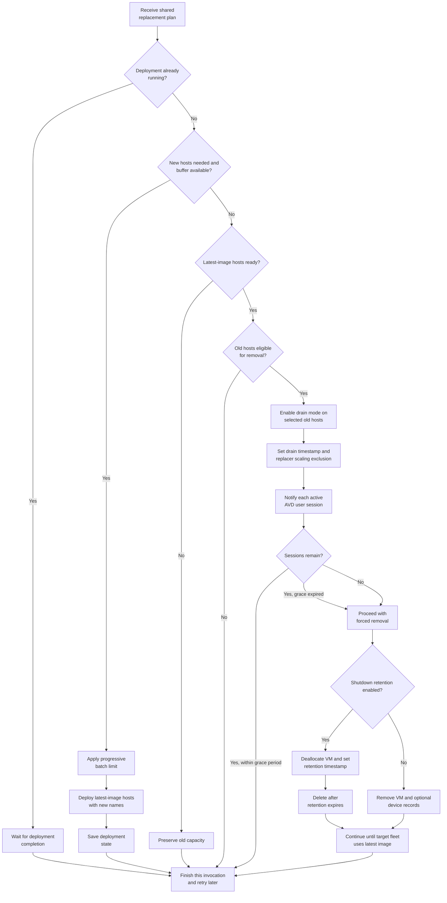
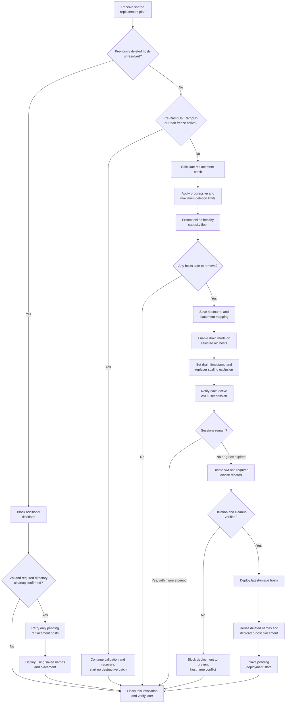
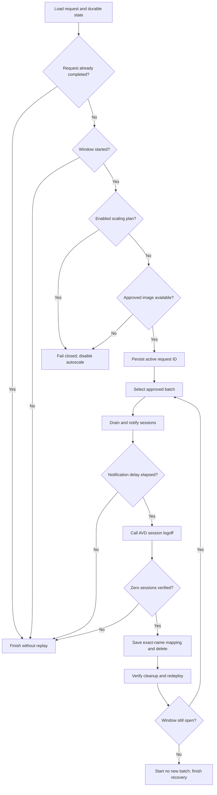

[**Home**](../../../README.md) | [**Session Host Replacer**](README.md) | [**Add-Ons**](../../../docs/add-ons.md)

# Canonical Session Host Replacer Flow

These diagrams describe one timer invocation. A replacement cycle can span multiple invocations while deployments complete, users drain, or safety checks block further work.

> **Canonical lifecycle reference:** This document owns the detailed replacement, readiness,
> scaling-phase, and recovery behavior. The [add-on README](README.md) owns deployment,
> configuration, monitoring, and troubleshooting guidance.

## Shared Evaluation

Normal replacement and the one-time maintenance override use the same inventory, image, planning,
and validation steps.

```mermaid
flowchart TD
    A[Timer invocation] --> B["Load configured mode,<br/>request, and durable state"]
    B --> R{"Active maintenance<br/>request?"}
    R -- Yes --> MW[Maintenance override flow]
    R -- No --> C["Get latest<br/>image version"]
    C --> D["Inventory session hosts<br/>and active deployments"]
    D --> E["Evaluate enabled scaling plan<br/>and active schedule"]
    E --> F["Build replacement<br/>plan"]
    F --> G{"Any outdated hosts<br/>or pending work?"}
    G -- No --> H["Validate healthy<br/>latest-image hosts"]
    H --> I["Write exact-image<br/>validation tag"]
    I --> J["Update status<br/>and finish"]
    G -- Yes --> K["Evaluate latest-image<br/>host readiness"]
    K --> L{Configured replacement mode}
    L -- SideBySide --> SBS[SideBySide flow]
    L -- DeleteFirst --> DF[DeleteFirst flow]
```

Exact-image evidence is written whenever a latest-image host has AVD status `Available` and no failed AVD health checks. Drain mode does not prevent evidence from being written.

Readiness then treats a latest-image host as either:

- Online ready: health validated and accepting new sessions.
- Scalable standby: exact-image evidence exists, the VM is stopped or deallocated, AVD status is `Shutdown`, no administrator scaling exclusion applies, and an enabled scaling plan can start it.

Without an enabled, evaluable scaling plan, all latest-image hosts must be online ready. With a scaling plan, every latest-image host must be either online ready or validated scalable standby, and at least one must be online ready even when the active target is `0%`.

## SideBySide

SideBySide creates replacement capacity before it removes old capacity. The pool can temporarily grow to twice its target size.

```mermaid
flowchart TD
    A["Receive shared<br/>replacement plan"] --> B{"Deployment already<br/>running?"}
    B -- Yes --> C["Wait for deployment<br/>completion"]
    C --> Z["Finish this invocation<br/>and retry later"]
    B -- No --> D{"New hosts needed and<br/>buffer available?"}
    D -- Yes --> E["Apply progressive<br/>batch limit"]
    E --> F["Deploy latest-image hosts<br/>with new names"]
    F --> G["Save deployment<br/>state"]
    G --> Z
    D -- No --> H{Latest-image hosts ready?}
    H -- No --> I[Preserve old capacity]
    I --> Z
    H -- Yes --> J{"Old hosts eligible<br/>for removal?"}
    J -- No --> Z
    J -- Yes --> K["Enable drain mode on<br/>selected old hosts"]
    K --> L["Set drain timestamp and<br/>replacer scaling exclusion"]
    L --> M["Notify each active<br/>AVD user session"]
    M --> N{Sessions remain?}
    N -- Yes, within grace period --> Z
    N -- Yes, grace expired --> O["Proceed with<br/>forced removal"]
    N -- No --> O
    O --> P{Shutdown retention enabled?}
    P -- Yes --> Q["Deallocate VM and set<br/>retention timestamp"]
    Q --> R["Delete after<br/>retention expires"]
    P -- No --> S["Remove VM and optional<br/>device records"]
    R --> T["Continue until target fleet<br/>uses latest image"]
    S --> T
    T --> Z
```

SideBySide-specific behavior:

- New hosts are deployed before old hosts are drained or removed.
- Replacement deployment, validation, and capacity-safe old-host removal can continue during every
  scaling phase. Before removal, the latest-image fleet must have the active scaling-plan percentage
  online, and the final fresh-state check preserves that online target.
- Failed readiness preserves the old hosts and waits for a later invocation.
- During an active `0%` scaling period, at least one latest-image host must remain online ready; the other validated latest-image hosts may be scalable standby.
- Shutdown retention is available only in this mode.
- Entra ID or Intune cleanup failures are reported but do not block unrelated replacements because hostnames are not reused.

## DeleteFirst

DeleteFirst removes a capacity-safe batch before deploying replacements. It records hostname and dedicated-host placement data before deletion so the replacement can reuse them.

```mermaid
flowchart TD
    A["Receive shared<br/>replacement plan"] --> B{"Previously deleted hosts<br/>unresolved?"}
    B -- Yes --> C["Block additional<br/>deletions"]
    C --> C1{"VM and required directory<br/>cleanup confirmed?"}
    C1 -- No --> Z
    C1 -- Yes --> D["Retry only pending<br/>replacement hosts"]
    D --> E["Deploy using saved names<br/>and placement"]
    E --> Z["Finish this invocation<br/>and verify later"]
    B -- No --> F{"Pre-RampUp, RampUp,<br/>or Peak freeze active?"}
    F -- Yes --> G["Continue validation and recovery;<br/>start no destructive batch"]
    G --> Z
    F -- No --> H[Calculate replacement batch]
    H --> I["Apply progressive and<br/>maximum deletion limits"]
    I --> J["Protect online healthy<br/>capacity floor"]
    J --> K{Any hosts safe to remove?}
    K -- No --> Z
    K -- Yes --> L["Save hostname and<br/>placement mapping"]
    L --> M["Enable drain mode on<br/>selected old hosts"]
    M --> N["Set drain timestamp and<br/>replacer scaling exclusion"]
    N --> O["Notify each active<br/>AVD user session"]
    O --> P{Sessions remain?}
    P -- Yes, within grace period --> Z
    P -- No or grace expired --> Q["Delete VM and required<br/>device records"]
    Q --> R{"Deletion and cleanup<br/>verified?"}
    R -- No --> S["Block deployment to prevent<br/>hostname conflict"]
    S --> Z
    R -- Yes --> T[Deploy latest-image hosts]
    T --> U["Reuse deleted names and<br/>dedicated-host placement"]
    U --> V["Save pending<br/>deployment state"]
    V --> Z
```

DeleteFirst-specific behavior:

- The scaling plan remains enabled. Replacer-owned exclusion tags protect draining and newly deployed hosts while ordinary validated hosts remain available to autoscale.
- New destructive batches freeze 60 minutes before `RampUp` and throughout `RampUp` and `Peak`.
  Deployment recovery, registration checks, health validation, and release of validated hosts to
  autoscale continue.
- During `RampDown` and `OffPeak`, the active scaling-plan target controls replacement pace, but at least one online healthy host remains. Without an evaluable scaling plan, the configured percentage is used and capped at target minus one so pools of two or more can progress.
- Drained, unhealthy, unavailable, and scaled-down hosts do not authorize deletion of additional online healthy hosts. They remain eligible for replacement without consuming the online floor.
- An active `0%` scaling target still retains one online healthy host.
- OffPeak remains owned by the most recent selected schedule day until the next selected day's RampUp, including across midnight and unselected days.
- `MaxDeletionsPerCycle` remains an independent absolute blast-radius ceiling. Progressive scale-up may select a smaller batch, and the capacity floor may reduce it further.
- New deletions stop while a previously deleted host is not registered.
- Registration alone does not authorize another destructive batch; the replacement must pass exact-image, AVD availability, health, power-state, and session-acceptance checks.
- New deletions fail closed when the recovery state cannot be read or the pending-host mapping cannot be saved.
- Recovery can redeploy exact unresolved names after an externally caused or legacy empty-pool incident, but new cycles do not intentionally create one.
- VM deletion is revalidated before hostname reuse even when directory cleanup is disabled.
- Only a definitive ARM `404` or `ResourceNotFound` confirms VM deletion; authorization, throttling, timeout, network, and service errors remain unresolved.
- Entra device cleanup is mandatory for Microsoft Entra joined hosts because DeleteFirst reuses the exact hostname. The function fails closed before destructive work if that required cleanup is disabled.
- Entra cleanup remains optional for domain-joined and Microsoft Entra hybrid joined hosts.
- Intune cleanup is optional but highly recommended before hostname reuse for Intune-enrolled Microsoft Entra joined or hybrid-joined hosts to prevent stale or duplicate managed-device records.
- Enabled Entra ID or Intune cleanup is retried and revalidated before hostname reuse.
- A tracked or ARM-discovered running deployment blocks the invocation from deleting or deploying again.
- A deployment that remains `Running` fails closed until ARM or an operator moves it to a terminal state.
- A successful ARM deployment with pending AVD registration waits without cleanup or duplicate deployment.
- Accepted deployments require a durable tracking-state write; VM presence remains the duplicate-deployment gate if that write fails.
- Shutdown retention is always disabled.
- Exact-name DeleteFirst replacement is blocked for a single-host target because it cannot preserve one available host.

## One-Time Maintenance Override

The override is a one-time, administrator-armed maintenance operation on an existing DeleteFirst
replacer. `Start-SessionHostMaintenanceReplacement.ps1` writes a request containing a unique
request ID, exact approved image version, UTC start time, window duration, batch limit, notification
delay, forced-sign-out authorization, and optional full-pool-outage authorization. Continuous
DeleteFirst work is suspended while the request is scheduled or active and resumes after the
request completes or expires. While the request is scheduled, deployment monitoring and pending
recovery continue, but no new normal replacement batch starts.

```mermaid
flowchart TD
    A["Load request and durable state"] --> B{"Request already completed?"}
    B -- Yes --> Z[Finish without replay]
    B -- No --> C{"Window started?"}
    C -- No --> Z
    C -- Yes --> D{"Enabled scaling plan?"}
    D -- Yes --> E["Fail closed; disable autoscale"]
    D -- No --> F{"Approved image available?"}
    F -- No --> E
    F -- Yes --> G["Persist active request ID"]
    G --> H["Select approved batch"]
    H --> I["Drain and notify sessions"]
    I --> J{"Notification delay elapsed?"}
    J -- No --> Z
    J -- Yes --> K["Call AVD session logoff"]
    K --> L{"Zero sessions verified?"}
    L -- No --> Z
    L -- Yes --> M["Save exact-name mapping and delete"]
    M --> N["Verify cleanup and redeploy"]
    N --> O{"Window still open?"}
    O -- Yes --> H
    O -- No --> P["Start no new batch; finish recovery"]
```

Maintenance-override behavior:

- Durable request IDs prevent replay.
- The exact approved image version is pinned into replacement deployment parameters.
- Autoscale must be disabled. Failure to query scaling-plan state also fails closed.
- The function explicitly calls the AVD user-session logoff operation and re-queries sessions;
  deleting a VM does not substitute for logoff.
- Notification delay is evaluated on timer invocations. With the default 30-minute timer, forced
  sign-out can begin up to approximately 30 minutes after the requested delay elapses.
- A full-pool outage, including one-host replacement, requires explicit authorization.
- The configured replacement mode must be DeleteFirst.
- Any shutdown-retention VM blocks scheduling and execution; maintenance does not purge retained
  rollback capacity implicitly.
- When the window closes, no new destructive batch starts. Already draining or deleted hosts
  continue through exact-name recovery.
- A new override cannot activate while normal replacement has pending deletion recovery or a
  replacer-owned draining host.
- Shutdown retention is unavailable; use SideBySide when retained-host rollback is required.

## Cross-Cutting Batch Progression

When progressive scale-up is enabled, both modes begin with the configured percentage of the hosts
still needed. After the configured number of successful deployment and registration runs, the
percentage increases by the configured increment, up to 100%.

- A new image version resets progression to the initial percentage.
- ARM deployment success without AVD registration is not a successful run.
- A failed deployment resets progression.
- `MaxDeploymentBatchSize` caps SideBySide deployments.
- `MaxDeletionsPerCycle` caps DeleteFirst deletion and matching replacement deployment.
- Readiness, scaling-phase freezes, and the final fresh-state capacity check can reduce or defer a
  calculated batch.

## Durable Recovery State

DeleteFirst saves `PendingHostMappings` to the `sessionHostDeploymentState` table before deleting a
host. Each entry preserves the exact hostname and placement information required to recreate that
host.

The mapping remains until the replacement is deployed and registered:

1. A state read or durable pre-deletion write failure blocks deletion.
2. A failed or interrupted deployment leaves the mapping in place.
3. The next invocation blocks new deletion and retries only unresolved names.
4. Partial registration retries only names that remain unresolved.
5. A successful ARM deployment waits for AVD registration without deleting or redeploying it.
6. The mapping is cleared only after all pending hosts are registered.

The stored positive auto-detected target remains authoritative during the cycle. Unresolved pending
names count toward target reconstruction, and an empty pool cannot establish a new zero target.

## Drain Notification

The user message is sent when the replacer first puts a selected host into drain mode, not when the host merely appears in a plan. Every active AVD session found on that host receives the configured maintenance message. A host already in drain mode with a drain timestamp is not notified again on every timer invocation.
