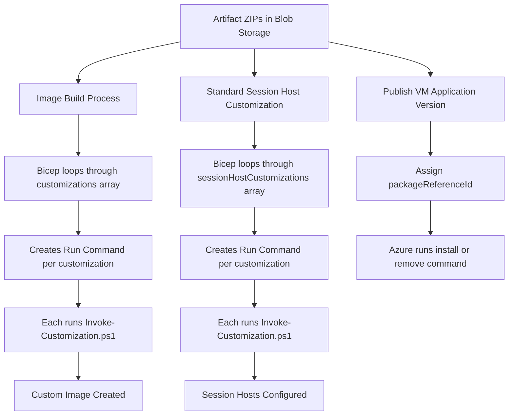

[**Home**](../README.md) | [**Quick Start**](quick-start.md) | [**Host Pool Deployment**](hostpool-deployment.md) | [**Image Build**](image-build.md) | [**Artifacts**](artifacts-guide.md) | [**Features**](features.md) | [**Parameters**](parameters.md) | [**Compliance**](compliance.md) | [**BCDR**](bcdr.md)

> **🔧 Technical References:**
>
> - [Image Management Template Documentation](../deployments/imageManagement/README.md) - Artifacts storage infrastructure
> - [Image Build Template Documentation](../deployments/imageBuild/README.md) - Using artifacts in image builds
> - [Update-ImageArtifacts.ps1 Script Guide](update-image-artifacts.md) - Script parameters, download methods, usage examples, and troubleshooting
> - [VM Applications Guide](vm-applications.md) - Publishing and assigning independently versioned applications
>

# Artifacts, Image Builds, and VM Applications Guide

## Overview

The artifacts system in this AVD solution provides a flexible, Zero Trust-compliant method for
delivering software and configurations to custom images and session hosts. An artifact folder can
be packaged once and used in either or both of these delivery models:

1. **Image-build or session-host customization** - `Invoke-Customization.ps1` downloads the ZIP
   and runs its root script during provisioning. This path installs or configures content once.
2. **Azure Compute Gallery VM Application** - `Publish-VMApplications.ps1` publishes the ZIP with
   explicit install and remove commands. Azure then applies the published version to assigned VMs.

Every package is stored in Image Management artifact storage. Publishing is a separate, explicit
step: uploading a ZIP does not create a VM Application, and publishing one does not assign it to a
host pool.

### Key Concepts

| Concept | Description |
| --- | --- |
| **Artifact** | A folder containing a PowerShell script and supporting files (installers, configuration files, etc.) |
| **Artifact Package** | The zipped version of an artifact folder, uploaded to Azure Blob Storage |
| **Invoke-Customization.ps1** | The orchestration script (`deployments/shared/scripts/Invoke-Customization.ps1`) that downloads and executes a single artifact |
| **Customization** | A reference to an artifact package with optional arguments, defined in deployment parameters |
| **Run Command** | Azure VM Run Command that executes `Invoke-Customization.ps1` for each artifact |
| **VM Application manifest** | Customer-owned `vmApplications.json` that selects ZIPs and defines immutable versions, lifecycle commands, and replication regions |
| **Package reference ID** | Gallery application-version resource ID returned by `Publish-VMApplications.ps1` and assigned to VMs |

### How It Works

**Image builds and standard session-host customizations use the same provisioning mechanism:**

1. **Bicep/ARM deployment** loops through the customizations array
2. For **each** customization, a separate VM Run Command is created
3. Each Run Command executes `Invoke-Customization.ps1` with parameters:
   - `Name` - The customization name
   - `Uri` - The blob storage URL to the artifact
   - `Arguments` - Optional arguments string
   - Authentication parameters for blob storage access
4. `Invoke-Customization.ps1` downloads the artifact and executes it
5. The `@batchSize(1)` decorator ensures customizations execute sequentially

**VM Applications use a separate lifecycle mechanism:**

1. `Update-ImageArtifacts.ps1` creates and uploads the same artifact ZIP.
2. A customer-owned manifest defines install, remove, optional update, and target-region settings.
3. `Publish-VMApplications.ps1` creates an immutable Gallery application version and returns its
   `packageReferenceId`.
4. The version is assigned through automated-host-pool parameters, the Session Host Policy add-on,
   direct assignment, or customer automation.
5. Azure executes the manifest lifecycle command asynchronously on each assigned VM.

### When Artifacts Are Used



**Image Build Process:**

- Uses `customizations` parameter array
- Bicep creates a Run Command for each item
- Each Run Command executes `Invoke-Customization.ps1` once
- Sequential execution via `@batchSize(1)`

**Session Host Deployment:**

- Uses `sessionHostCustomizations` parameter array
- Bicep creates a Run Command for each item
- Each Run Command executes `Invoke-Customization.ps1` once
- Sequential execution via `@batchSize(1)`

**VM Application Publication and Assignment:**

- Uses `imageManagement/vmApplications.json` to select uploaded ZIPs
- Publishes immutable semantic versions to the Image Management Compute Gallery
- Assigns ordered `packageReferenceId` values to target VMs
- Supports install, remove, and optional update behavior independent of the OS image
- Runs asynchronously after VM creation; application readiness must be monitored separately

### Choose the Delivery Model

| Content type or requirement | Image build | Session-host customization | VM Application |
| --- | --- | --- | --- |
| Software must be ready before first logon | Preferred | Possible, but increases provisioning time | Not sufficient by itself because installation is asynchronous |
| Independently versioned application with meaningful removal | Supported | Supported | Preferred |
| Registry, policy, STIG, security onboarding, or bootstrap configuration | Preferred | Supported | Do not publish |
| Environment-specific configuration | Avoid when possible | Preferred | Only when it is part of the application's lifecycle |
| Automated host pool application delivery | Bake into image | Reserve private customizations for exceptions | Preferred for independently manageable software |

Publish only software that installs and removes silently, synchronously, and independently. Keep
`Configure-*`, `Set-*`, policy, security-baseline, and shared host-prerequisite packages as image or
provisioning customizations unless they have a real, tested removal lifecycle.

Choose one delivery model for each application on a given host. Do not both bake an application
into the image and assign it as a VM Application unless its upgrade and removal logic explicitly
supports that starting state. Otherwise, VM Application removal can remove software the image is
expected to provide.

## Architecture

### Workflow Diagram

```text
┌────────────────────────────────────────────────────────────────┐
│ 1. Preparation Phase (Update-ImageArtifacts.ps1)               │
├────────────────────────────────────────────────────────────────┤
│ • Download software from internet (optional)                   │
│ • Compress each artifact folder → ZIP files                    │
│ • Upload to Azure Blob Storage                                 │
└──────────────────────────────┬─────────────────────────────────┘
                               │
                               ▼
┌────────────────────────────────────────────────────────────────┐
│ 2. Customization Deployment (Bicep/ARM Looping Logic)          │
├────────────────────────────────────────────────────────────────┤
│                                                                │
│ Image Build:                    Session Host Deployment:       │
│ ┌──────────────────────────┐    ┌────────────────────────────┐ │
│ │ imageBuild.bicep         │    │ invokeCustomizations.bicep │ │
│ ├──────────────────────────┤    ├────────────────────────────┤ │
│ │ for each customization:  │    │ for each customization:    │ │
│ │   Create Run Command     │    │   Create Run Command       │ │
│ │   @batchSize(1)          │    │   @batchSize(1)            │ │
│ └──────────┬───────────────┘    └───────────┬────────────────┘ │
│            │                                │                  │
│            ▼                                ▼                  │
│ ┌──────────────────────────┐    ┌────────────────────────────┐ │
│ │ VM Run Command #1        │    │ VM Run Command #1          │ │
│ │ Invoke-Customization.ps1 │    │ Invoke-Customization.ps1   │ │
│ │ -Name "FSLogix"          │    │ -Name "Configure-Office"   │ │
│ │ -Uri "https://..."       │    │ -Uri "https://..."         │ │
│ │ -Arguments ""            │    │ -Arguments "-param value"  │ │
│ └──────────┬───────────────┘    └───────────┬────────────────┘ │
│            │                                │                  │
│            ▼                                ▼                  │
│ ┌──────────────────────────┐    ┌────────────────────────────┐ │
│ │ VM Run Command #2        │    │ VM Run Command #2          │ │
│ │ Invoke-Customization.ps1 │    │ Invoke-Customization.ps1   │ │
│ └──────────┬───────────────┘    └───────────┬────────────────┘ │
│            │                                │                  │
│            ▼                                ▼                  │
│        (continues...)                  (continues...)          │
│                                                                │
└──────────────────────────────┬─────────────────────────────────┘
                               │
                               ▼
┌────────────────────────────────────────────────────────────────┐
│ 3. Execution Phase (Invoke-Customization.ps1)                  │
├────────────────────────────────────────────────────────────────┤
│ • Download artifact from blob storage (with managed identity)  │
│ • Determine file type (.zip, .ps1, .exe, .msi, .bat)           │
│ • Extract if ZIP, find PS1 script inside                       │
│ • Execute with optional Arguments parameter                    │
│ • Log all activity to C:\Windows\Logs\[Name].log               │
│ • Return exit code to Run Command                              │
└────────────────────────────────────────────────────────────────┘
```

The text diagram details the customization path. The VM Application path branches after upload:
`vmApplications.json` -> `Publish-VMApplications.ps1` -> Gallery application version -> VM
assignment -> Azure-managed install, update, or removal.

### Key Implementation Details

**Customization looping is handled by Bicep/ARM:**

- Image builds: `deployments/imageBuild/modules/applyCustomizationsBatch.bicep`
- Session hosts: `deployments/hostpools/modules/sessionHosts/modules/invokeCustomizations.bicep`

**Each artifact execution is independent:**

- Separate Run Command resource for each customization
- `@batchSize(1)` ensures sequential execution
- Each Run Command imports and executes `Invoke-Customization.ps1`
- Script is embedded inline via `loadTextContent()` function

**Parameters support:**

Arguments are passed as a single string to `Invoke-Customization.ps1`, which parses them into typed named parameters before calling your script. All four PowerShell parameter types are supported:

| Type | Script declaration | Arguments string syntax |
| --- | --- | --- |
| **String** | `[string]$Mode = 'Full'` | `-Mode Minimal` or `-Mode "my value"` |
| **Bool** | `[bool]$Enable = $true` | `-Enable $true` or `-Enable $false` |
| **Switch** | `[switch]$SkipShortcuts` | `-SkipShortcuts` (no value = `$true`) |
| **String array** | `[string[]]$Domains` | `-Domains @('a.com','b.com')` |

**Array syntax rules (JSON parameter files):**

- Use `@()` with single quotes — no JSON escaping needed: `"arguments": "-Domains @('a.com','b.com')"`
- Spaces after commas are fine: `@('a.com', 'b.com')` works
- Comma-separated quoted values also work: `"a.com", "b.com"` (requires `\"` escaping in JSON)
- Values with internal spaces must be quoted in the array: `@('Adobe Acrobat Pro','Google Chrome')`

## Artifacts Directory Structure

Repo-provided artifacts live at `.common/artifacts/` (currently empty, reserved for future use). Customer-provided artifacts and overrides belong at `customer/artifacts/`.

> **Ready-to-use examples:** `customer-examples/artifacts/` contains example packages for common software (Chrome, FSLogix, LGPO, STIG tooling, VS Code, built-in UWP apps, and more). Copy the folders you want directly into `customer/artifacts/` and pair them with the matching entries in `customer-examples/parameters/imageManagement/downloads.json`. See [`customer/README.md`](../customer/README.md) for copy commands.

**Note:** The orchestration script `Invoke-Customization.ps1` is at `deployments/shared/scripts/Invoke-Customization.ps1`, not in the artifacts directory. It is embedded into ARM/Bicep deployments using `loadTextContent()`.

### Getting Software Into Artifact Folders

`Update-ImageArtifacts.ps1` can automatically download software before packaging. Place a `downloads.json` file at `customer/parameters/imageManagement/downloads.json` (a ready-to-use example is at `customer-examples/parameters/imageManagement/downloads.json`) to define what to download and where to place it. Supported download methods include direct URL, web scraping, GitHub Releases API, winget, and winget preserve-layout for MSIX/UWP packages.

For a complete reference of all download methods, `downloads.json` fields, pipeline usage with `-CustomerRootPath`, and the full script parameter reference, see the **[Update-ImageArtifacts.ps1 Script Guide](update-image-artifacts.md)**.

> **Air-gapped environments:** Winget-based entries require internet access and cannot be used in air-gapped clouds. See [Air-Gapped Cloud Guide](air-gapped-clouds.md) for alternatives including the pre-staging approach for built-in UWP apps.

### Execution Rules (Invoke-Customization.ps1)

When `Invoke-Customization.ps1` downloads and executes an artifact during deployment:

| File Extension | Execution Behavior | Arguments Handling |
| --- | --- | --- |
| **.ps1** | Executed directly with PowerShell | Arguments string parsed into named parameters and splatted |
| **.exe** | Executed with `Start-Process` | Arguments string passed directly to executable |
| **.msi** | Executed with `msiexec.exe /i` | Arguments string passed directly to msiexec |
| **.bat** | Executed with `cmd.exe` | Arguments string passed directly to batch file |
| **.zip** | Extracted, then finds the first `.ps1` in the ZIP root and executes it | Arguments string parsed into named parameters and splatted to the PS1 |

ZIP artifacts must contain exactly one root-level PowerShell script. The runtime does not use a
declared entry point and does not guarantee which script is selected when multiple root scripts
exist. Put helper scripts in a subdirectory and invoke them explicitly from the root script.

For application artifacts that can also be published as VM Applications, use the same root script
for both lifecycle actions:

```powershell
param(
   [ValidateSet('Install', 'Uninstall')]
   [string]$DeploymentType = 'Install'
)

if ($DeploymentType -eq 'Install') {
   # Silent, synchronous installation.
}
else {
   # Silent, synchronous removal.
}
```

Keeping `Install` as the default preserves image-build and session-host customization behavior.
The VM Application manifest calls the same script with `-DeploymentType 'Install'` or
`-DeploymentType 'Uninstall'`. Do not add a separate root-level `Uninstall-Application.ps1` because
`Invoke-Customization.ps1` might select it as the ZIP entry point.

### Special Files

#### uploadedFileVersionInfo.txt

Auto-generated by `Update-ImageArtifacts.ps1`, this file tracks downloaded software versions:

```text
SoftwareName = Visual Studio Code
DownloadUrl = https://code.visualstudio.com/sha/download?build=stable&os=win32-x64
Download File = VSCodeUserSetup-x64-1.85.1.exe
ProductVersion = 1.85.1
FileVersion = 1.85.1.23348
Downloaded on = 12/15/2024 10:30:45 AM
--------------------------------------------------
SoftwareName = FSLogix
DownloadUrl = https://aka.ms/fslogix_download
Download File = FSLogix_Apps_2.9.8884.27471.zip
ProductVersion = 2.9.8884.27471
FileVersion = 2.9.8884.27471
Downloaded on = 12/15/2024 10:31:12 AM
--------------------------------------------------
```

> For the full packaging and staging details (rules, directory layout, `-CustomerRootPath` usage, air-gapped file placement), see [Update-ImageArtifacts.ps1 Script Guide — Artifacts Directory Structure](update-image-artifacts.md#artifacts-directory-structure).

## Creating Custom Artifact Packages

### Step-by-Step Guide

#### Step 1: Create the Artifact Folder

Create a new folder in `customer/artifacts/` with a descriptive name:

```powershell
# Example: Creating an artifact for Google Chrome
New-Item -Path ".\customer\artifacts\Chrome" -ItemType Directory
```

**Naming Conventions:**

- Use PascalCase (e.g., `MyApp`, `Configure-Setting`)
- Be descriptive but concise
- Avoid spaces and special characters

#### Step 2: Create the Main PowerShell Script

Every artifact package **must** contain exactly one root-level PowerShell script that performs the
installation or configuration. Supporting PowerShell scripts are allowed only in subdirectories.

**Important:** If you need parameters, use standard PowerShell named parameters. The `Invoke-Customization.ps1` orchestrator will parse the `Arguments` string and pass them to your script as named parameters.

**Dual-use application script template:**

Use `Deploy-[Name].ps1` for software that may also become a VM Application. The default
`DeploymentType` must remain `Install` because image builds and session-host customizations do not
pass that parameter. VM Application lifecycle commands pass it explicitly.

```powershell
param(
   [ValidateSet('Install', 'Uninstall')]
   [string]$DeploymentType = 'Install',
    [int[]]$SuccessExitCodes = @(0, 3010)
)

$SoftwareName = 'MyApplication'
$Script:Name = 'Deploy-MyApplication'
$LogPath = Join-Path -Path $env:SystemRoot -ChildPath 'Logs\Software'

function New-Log {
   param([Parameter(Mandatory = $true)][string]$Path)

   if (-not (Test-Path -LiteralPath $Path)) {
      New-Item -Path $Path -ItemType Directory -Force | Out-Null
   }
   $script:Log = Join-Path -Path $Path -ChildPath "$Script:Name-$(Get-Date -Format 'yyyy-MM-dd_HH-mm-ss').log"
}

function Write-Log {
   param(
      [ValidateSet('Info', 'Warning', 'Error')]
        $Category = 'Info',
      [Parameter(Mandatory = $true)][string]$Message
    )

   $Content = "[$(Get-Date -Format 'MM/dd/yyyy HH:mm:ss')]`t$Category`t$Message"
   Add-Content -LiteralPath $script:Log -Value $Content -ErrorAction Stop
    Write-Host $Content
}

function Invoke-MsiProcess {
   param(
      [Parameter(Mandatory = $true)][string]$ArgumentList,
      [Parameter(Mandatory = $true)][string]$Action,
      [int]$TimeoutMilliseconds = 600000
   )

   $process = Start-Process -FilePath 'msiexec.exe' -ArgumentList $ArgumentList -PassThru
   if (-not $process.WaitForExit($TimeoutMilliseconds)) {
      $process.Kill()
      throw "$Action timed out after $($TimeoutMilliseconds / 60000) minutes."
    }
   if ($process.ExitCode -notin $SuccessExitCodes) {
      throw "$Action failed with exit code $($process.ExitCode)."
   }

   Write-Log -Message "$Action completed with exit code $($process.ExitCode)."
}

function Get-InstalledProductCode {
   param([Parameter(Mandatory = $true)][string]$DisplayName)

   $uninstallPaths = @(
      'Registry::HKEY_LOCAL_MACHINE\SOFTWARE\Microsoft\Windows\CurrentVersion\Uninstall'
      'Registry::HKEY_LOCAL_MACHINE\SOFTWARE\Wow6432Node\Microsoft\Windows\CurrentVersion\Uninstall'
   )

   foreach ($path in $uninstallPaths) {
      if (-not (Test-Path -LiteralPath $path)) {
         continue
      }
      foreach ($key in Get-ChildItem -LiteralPath $path -ErrorAction SilentlyContinue) {
         $application = Get-ItemProperty -LiteralPath $key.PSPath -ErrorAction SilentlyContinue
         if ($application.DisplayName -eq $DisplayName -and
            $key.PSChildName -match '^\{[0-9A-Fa-f-]{36}\}$') {
            $key.PSChildName
         }
      }
   }
}

New-Log -Path $LogPath
try {
   Write-Log -Message "Starting $DeploymentType for $SoftwareName."

   if ($DeploymentType -eq 'Install') {
      $installerFiles = @(Get-ChildItem -LiteralPath $PSScriptRoot -Filter '*.msi' -File)
      if ($installerFiles.Count -ne 1) {
         throw "Expected exactly one MSI in '$PSScriptRoot'; found $($installerFiles.Count)."
      }

      $arguments = "/i `"$($installerFiles[0].FullName)`" /qn /norestart"
      Invoke-MsiProcess -ArgumentList $arguments -Action "$SoftwareName installation"
    }
   else {
      $productCodes = @(Get-InstalledProductCode -DisplayName $SoftwareName)
      if ($productCodes.Count -eq 0) {
         Write-Log -Message "$SoftwareName is not installed; removal is already complete."
      }
      foreach ($productCode in $productCodes) {
         Invoke-MsiProcess -ArgumentList "/x $productCode /qn /norestart" `
            -Action "$SoftwareName removal"
      }
    }

   Write-Log -Message "$DeploymentType completed successfully for $SoftwareName."
   exit 0
}
catch {
   Write-Log -Category Error -Message $_.Exception.Message
    exit 1
}
```

This example is intentionally synchronous and idempotent: it waits for MSI completion, accepts
`0` and `3010`, fails on timeout or a real installer error, and treats removal of an absent
application as success. Match `$SoftwareName` to the installed application's exact display name,
or adapt discovery to a stable MSI ProductCode. The
[`Microsoft-AzCLI`](../customer-examples/artifacts/Microsoft-AzCLI/) example contains a complete,
tested implementation with Windows Installer serialization handling.

For configuration-only content, keep a single `Configure-[Name].ps1` root script and omit
`DeploymentType`; such packages remain image-build or session-host customizations rather than VM
Applications.

**How the two callers invoke the script:**

For an image build or standard session-host customization, reference the ZIP normally and omit
`DeploymentType`:

```json
{
   "name": "MyApplication",
   "blobNameOrUri": "MyApplication.zip",
   "arguments": ""
}
```

The `Invoke-Customization.ps1` script will:

1. Download and extract `MyApplication.zip`.
2. Find `Deploy-MyApplication.ps1` in the ZIP root.
3. Call the script without `DeploymentType`.
4. Use the script's default `DeploymentType = 'Install'`.

For a VM Application, the manifest command extracts the same ZIP and explicitly calls either
`-DeploymentType 'Install'` or `-DeploymentType 'Uninstall'`. Azure does not use
`Invoke-Customization.ps1` for this path.

Add other named parameters to the root script when the customization needs them. For example:

```json
// Boolean — explicit $true / $false
"arguments": "-AllowDeveloperTools $true"

// Switch — no value means $true; omitting the parameter uses the script default
"arguments": "-SearchForApplications -Upgrade"

// String array — @() with single quotes, spaces after commas are fine
"arguments": "-Domains @('portal.azure.com', 'core.windows.net')"

// String array — values with internal spaces
"arguments": "-Apps @('Adobe Acrobat Pro', 'Google Chrome')"

// Mixed
"arguments": "-Domains @('portal.azure.us','agency.gov') -AllowDeveloperTools $true -SearchForApplications"
```

#### Step 3: Add Supporting Files

Place any required files in the same directory:

```text
Chrome/
|-- Deploy-Chrome.ps1
`-- GoogleChromeEnterpriseBundle64.msi
```

**Best Practices for Supporting Files:**

- Keep installers in the same directory as the script
- Use relative paths to locate files
- Include any configuration files needed
- Document file requirements in a readme.md

#### Step 4: Test Locally

Before uploading, test your script locally:

```powershell
# Image-build/customization behavior: no DeploymentType is passed
.\customer\artifacts\Chrome\Deploy-Chrome.ps1

# VM Application install and remove behavior
.\customer\artifacts\Chrome\Deploy-Chrome.ps1 -DeploymentType Install
.\customer\artifacts\Chrome\Deploy-Chrome.ps1 -DeploymentType Uninstall
```

#### Step 5: Upload with Update-ImageArtifacts.ps1

Once tested, upload the artifact to blob storage:

```powershell
.\deployments\Update-ImageArtifacts.ps1 `
   -StorageAccountResourceId '/subscriptions/.../storageAccounts/stabc123'
```

The script creates `Chrome.zip` for image builds, session-host customizations, and VM Application
publication. Add `-DeleteExistingBlobs` only when intentionally replacing the complete contents of
the artifacts container; omit it for a normal incremental upload.

For local packaging or air-gapped transfer without Azure access:

```powershell
.\deployments\Update-ImageArtifacts.ps1 `
      -PackageOnly `
      -OutputPath 'C:\AirGapTransfer'
```

#### Step 6: Hand Off a Dual-Use Package for VM Application Publication

Stop here for image-build and session-host customization packages. A dual-use application is ready
for the separate publication workflow when all of these are true:

- Its uploaded package name is known, such as `Chrome.zip`.
- The ZIP contains exactly one root script, such as `Deploy-Chrome.ps1`.
- Running the root script without `DeploymentType` installs the application.
- Explicit `Install` and `Uninstall` modes are silent, synchronous, idempotent, and tested.
- The package does not retrieve mutable application content from the internet at runtime.

Continue with the [VM Applications Guide](vm-applications.md). It owns the operational procedure
for Image Management prerequisites, `vmApplications.json`, lifecycle command construction,
semantic versioning, validation, Gallery publication, host assignment, remediation, and air-gapped
publication. The
[`Microsoft-AzCLI`](../customer-examples/artifacts/Microsoft-AzCLI/) package and
[example manifest](../customer-examples/parameters/imageManagement/vmApplications.json) are the
tested reference implementation.

Uploading the ZIP is the boundary between these guides. It does not publish or assign a VM
Application.

### Advanced Script Patterns

#### Pattern 1: Download Installer from Internet

Prefer staging installers with `downloads.json` so the artifact ZIP is deterministic and portable.
Use a runtime download only as a documented customization exception when the endpoint is reachable
from the build or session-host network. Do not publish a VM Application whose immutable version
depends on mutable internet content.

```powershell
Param(
    [Parameter(Mandatory = $false)]
    [string]$InstallerUrl = "https://example.com/installer.exe"
)

# Download the installer
$InstallerPath = Join-Path $env:TEMP "installer.exe"

Write-Log -Category Info -Message "Downloading installer from $InstallerUrl"
Invoke-WebRequest -Uri $InstallerUrl -OutFile $InstallerPath -UseBasicParsing

# Verify download
if (-not (Test-Path $InstallerPath)) {
    throw "Failed to download installer"
}

# Install
Start-Process -FilePath $InstallerPath -ArgumentList "/S" -Wait
```

#### Pattern 2: Registry Configuration

For configuration-only artifacts (no installer):

```powershell
Function Set-RegistryValue {
    Param (
        [Parameter(Mandatory = $true)]
        [string]$Key,
        [Parameter(Mandatory = $true)]
        [string]$Name,
        [Parameter(Mandatory = $true)]
        $Value,
        [Parameter(Mandatory = $false)]
        [Microsoft.Win32.RegistryValueKind]$Type = 'String'
    )
    
    if (-not (Test-Path -LiteralPath $Key)) {
        New-Item -Path $Key -Force | Out-Null
        Write-Log -Category Info -Message "Created registry key: $Key"
    }
    
    New-ItemProperty -LiteralPath $Key -Name $Name -Value $Value -PropertyType $Type -Force | Out-Null
    Write-Log -Category Info -Message "Set registry value: $Key\$Name = $Value"
}

# Example usage
Set-RegistryValue -Key "HKLM:\SOFTWARE\MyApp" -Name "Setting1" -Value "Enabled" -Type String
```

#### Pattern 3: Conditional Execution Based on Parameters

```powershell
Param(
    [Parameter(Mandatory = $false)]
    [ValidateSet('Full', 'Minimal', 'Custom')]
    [string]$InstallMode = 'Full',
    
    [Parameter(Mandatory = $false)]
    [switch]$SkipShortcuts
)

Write-Log -Category Info -Message "InstallMode: $InstallMode"
Write-Log -Category Info -Message "SkipShortcuts: $SkipShortcuts"

# Conditional logic
switch ($InstallMode) {
    'Full' {
        Write-Log -Category Info -Message "Performing full installation"
        # Full installation code
    }
    'Minimal' {
        Write-Log -Category Info -Message "Performing minimal installation"
        # Minimal installation code
    }
    'Custom' {
        Write-Log -Category Info -Message "Performing custom installation"
        # Custom installation code
    }
}

if (-not $SkipShortcuts) {
    # Create shortcuts
    Write-Log -Category Info -Message "Creating shortcuts"
}
```

#### Pattern 4: Multi-File Installation

For artifacts with multiple installers:

```powershell
# Locate all installers
$ScriptPath = Split-Path -Parent $MyInvocation.MyCommand.Path
$Installers = Get-ChildItem -Path $ScriptPath -Filter "*.exe"

foreach ($Installer in $Installers) {
    Write-Log -Category Info -Message "Installing: $($Installer.Name)"
    
    $Process = Start-Process -FilePath $Installer.FullName -ArgumentList "/S" -Wait -PassThru
    
    if ($Process.ExitCode -in $SuccessExitCodes) {
        Write-Log -Category Info -Message "$($Installer.Name) completed successfully"
    }
    else {
        Write-Log -Category Error -Message "$($Installer.Name) failed with exit code: $($Process.ExitCode)"
        exit $Process.ExitCode
    }
}
```

### Script Requirements Checklist

- [ ] Script uses standard PowerShell named parameters
- [ ] Script includes logging functionality
- [ ] Script handles errors gracefully
- [ ] Script exits non-zero when the installer fails (any exit code other than 0 or 3010)
- [ ] Installer and uninstaller are silent, synchronous, and bounded by a timeout
- [ ] Script uses relative paths for file access (`$PSScriptRoot` or `Split-Path`)
- [ ] Script includes header comments explaining purpose
- [ ] Script contains ASCII characters only (U+0000 through U+007F)
- [ ] Script name follows convention: `Deploy-[Name].ps1` for dual-use applications or
   `Configure-[Name].ps1` for customization-only packages

Before publishing the package as a VM Application, also verify:

- [ ] `DeploymentType` accepts `Install` and `Uninstall`, with `Install` as the default
- [ ] Running the script with no arguments performs the image-build install path
- [ ] Explicit install and uninstall modes both work when run repeatedly
- [ ] Uninstalling an absent application succeeds
- [ ] The ZIP contains exactly one root-level PowerShell script
- [ ] `vmApplications.json` references the exact ZIP filename and root script
- [ ] The manifest passes `Publish-VMApplications.ps1 -ValidateOnly`

## The Invoke-Customization.ps1 Orchestrator

### Overview

The `Invoke-Customization.ps1` script (`deployments/shared/scripts/Invoke-Customization.ps1`) is the
core orchestration script used by image builds and standard session-host customizations. It handles
**one** customization at a time. VM Applications do not use this orchestrator; Azure runs their
manifest lifecycle commands.

**Key Points:**

- **Location:** `deployments/shared/scripts/Invoke-Customization.ps1`
- **Usage:** Embedded into Bicep/ARM via `loadTextContent()` function
- **Execution:** One instance per customization via VM Run Commands
- **Looping:** Handled by Bicep/ARM deployment, NOT by the script
- **Parameters:** Standard PowerShell parameters, NOT DynParameters

### Parameters

| Parameter | Type | Required | Description |
| --- | --- | --- | --- |
| `APIVersion` | string | No | IMDS API version for managed identity tokens (default based on cloud) |
| `Arguments` | string | No | Arguments string passed to the artifact (default: empty) |
| `BlobStorageSuffix` | string | Yes | Blob storage endpoint suffix (e.g., `blob.core.usgovcloudapi.net`) |
| `BuildDir` | string | No | Build directory for temp files (used in image builds) |
| `Name` | string | Yes | Name of the customization (used for logging) |
| `Uri` | string | Yes | Full URI to the artifact in blob storage |
| `UserAssignedIdentityClientId` | string | No | Client ID for managed identity authentication |

### How It Works

**Execution Flow:**

```text
1. START: Invoke-Customization.ps1 receives parameters from Run Command
   ↓
2. Start transcript logging to C:\Windows\Logs\[Name].log
   ↓
3. Create temp directory ($env:TEMP\[Name] or BuildDir\[Name])
   ↓
4. Authentication check:
   - If Uri is in blob storage AND UserAssignedIdentityClientId provided:
     → Get OAuth token from Azure Instance Metadata Service (IMDS)
     → Add Bearer token to download headers
   - Else:
     → Download without authentication (public or SAS token in URL)
   ↓
5. Download artifact from Uri to temp directory
   ↓
6. Determine file extension and handle accordingly:
   ├─ .EXE:
   │  └─ Execute: Start-Process with Arguments
   ├─ .MSI:
   │  └─ Execute: msiexec.exe /i [file] with Arguments
   ├─ .BAT:
   │  └─ Execute: cmd.exe with Arguments
   ├─ .PS1:
   │  ├─ If Arguments provided:
   │  │  ├─ Parse Arguments string into parameter hashtable
   │  │  └─ Call script with splatted parameters: & $Script @params
   │  └─ Else: & $Script
   └─ .ZIP:
      ├─ Extract to subfolder in temp directory
      ├─ Find first .ps1 file in root of extracted content
      ├─ If Arguments provided:
      │  ├─ Parse Arguments into parameter hashtable
      │  └─ Call script with splatted parameters: & $Script @params
      └─ Else: & $Script
   ↓
7. Cleanup temp directory (if in $env:TEMP)
   ↓
8. Stop transcript
   ↓
9. END: Exit code returned to Run Command
```

### Argument Parsing

**For PowerShell Scripts (.ps1 or .ps1 inside .zip):**

The `Arguments` string is parsed into named parameters using the `ConvertTo-ParametersSplat` function:

**Input Format:**

```text
-ParameterName Value -SwitchParameter -AnotherParam "Value with spaces"
```

**Parsing Rules:**

1. Parameters start with `-` followed by parameter name
2. Switch parameters have no value (set to `$true`)
3. Boolean values: `true` → `$true`, `false` → `$false`
4. Both single (`'`) and double (`"`) quotes are treated as string delimiters and stripped from the value
5. Result is hashtable splatted to the PowerShell script

**Example:**

Deployment configuration:

```json
{
  "name": "MyApp",
  "blobNameOrUri": "MyApp.zip",
  "arguments": "-InstallMode Full -SkipShortcuts -LogPath C:\\Logs"
}
```

Parsed to hashtable:

```powershell
@{
  InstallMode = "Full"
  SkipShortcuts = $true
  LogPath = "C:\Logs"
}
```

Called as:

```powershell
& Deploy-MyApp.ps1 @params
# Equivalent to: & Deploy-MyApp.ps1 -InstallMode "Full" -SkipShortcuts -LogPath "C:\Logs"
```

**For EXE/MSI/BAT files:**

Arguments are passed directly to `Start-Process` without parsing. Use appropriate syntax for the executable:

```json
{
  "name": "TeamsBootstrapper",
  "blobNameOrUri": "teamsbootstrapper.exe",
  "arguments": "-p -o C:\\Logs"
}
```

### File Type Handling

| Extension | Handler | Arguments Usage |
| --- | --- | --- |
| **.exe** | `Start-Process -FilePath $file -ArgumentList $args` | Direct pass-through |
| **.msi** | `msiexec.exe /i $file $args` | Direct pass-through |
| **.bat** | `cmd.exe $file $args` | Direct pass-through |
| **.ps1** | `& $script @parsedParams` | Parsed into parameters |
| **.zip** | Extract → Find .ps1 → `& $script @parsedParams` | Parsed into parameters |

### Logging

All activity is logged via PowerShell transcript:

**Log Location:** `C:\Windows\Logs\[Name].log`

**Log Content:**

- All parameter values
- Download progress
- File type detection
- Execution commands
- Exit codes
- Any errors

**Example Log:**

```text
[12/22/2024 10:30:15] Starting 'MyApp' script with the following parameters.
[12/22/2024 10:30:15] APIVersion: 2018-02-01
[12/22/2024 10:30:15] BlobStorageSuffix: blob.core.usgovcloudapi.net
[12/22/2024 10:30:15] Name: MyApp
[12/22/2024 10:30:15] Uri: https://staccount.blob.core.usgovcloudapi.net/artifacts/MyApp.zip
[12/22/2024 10:30:15] Arguments: -InstallMode Full
[12/22/2024 10:30:16] Downloading 'https://...' to 'C:\Temp\MyApp'
[12/22/2024 10:30:20] Finished downloading
[12/22/2024 10:30:21] Extracting 'MyApp.zip' to 'C:\Temp\MyApp\MyApp'
[12/22/2024 10:30:22] Finding PowerShell script in root of 'C:\Temp\MyApp\MyApp'
[12/22/2024 10:30:22] Calling PowerShell Script with arguments '-InstallMode Full'
[12/22/2024 10:32:45] Script completed
```

### Bicep Integration

**How Invoke-Customization.ps1 is Called:**

**Image Builds:**
File: `deployments/imageBuild/modules/applyCustomization.bicep`

```bicep
resource runCommand 'Microsoft.Compute/virtualMachines/runCommands@2023-09-01' = {
  parent: virtualMachine
  name: customizer.name
  location: location
  properties: {
    parameters: [
      { name: 'APIVersion', value: apiVersion }
      { name: 'BlobStorageSuffix', value: 'blob.${environment().suffixes.storage}' }
      { name: 'UserAssignedIdentityClientId', value: userAssignedIdentityClientId }
      { name: 'Name', value: customizer.name }
      { name: 'Uri', value: customizer.uri }
      { name: 'Arguments', value: customizer.?arguments ?? '' }
      { name: 'BuildDir', value: buildDir }
    ]
    source: {
      script: loadTextContent('../../../shared/scripts/Invoke-Customization.ps1')
    }
    treatFailureAsDeploymentFailure: true
  }
}
```

**Session Hosts:**
File: `deployments/hostpools/modules/sessionHosts/modules/invokeCustomizations.bicep`

```bicep
@batchSize(1)
resource runCommands 'Microsoft.Compute/virtualMachines/runCommands@2023-03-01' = [for customizer in customizers: {
  name: customizer.name
  location: location
  parent: virtualMachine
  properties: {
    parameters: [
      { name: 'APIVersion', value: apiVersion }
      { name: 'BlobStorageSuffix', value: 'blob.${environment().suffixes.storage}' }
      { name: 'UserAssignedIdentityClientId', value: userAssignedIdentityClientId }
      { name: 'Name', value: customizer.name }
      { name: 'Uri', value: customizer.uri }
      { name: 'Arguments', value: customizer.arguments }
    ]
    source: {
      script: loadTextContent('../../../../shared/scripts/Invoke-Customization.ps1')
    }
    treatFailureAsDeploymentFailure: true
  }
}]
```

**Key Points:**

- `loadTextContent()` embeds the entire script inline
- `@batchSize(1)` ensures sequential execution
- Bicep loops through customizations array
- Each customization gets its own Run Command resource
- Run Commands execute independently

## Integration with Deployments

### Image Build Integration

#### Step 1: Deploy Infrastructure and Upload Artifacts

```powershell
# Deploy infrastructure only
.\deployments\Deploy-ImageManagement.ps1 `
    -Location "East US 2" `
    -ParameterFilePrefix "production"

# OR deploy and upload artifacts in one step
.\deployments\Deploy-ImageManagement.ps1 `
    -Location "East US 2" `
    -ParameterFilePrefix "production" `
    -UpdateArtifacts

# To refresh artifacts separately (e.g. after adding new software)
.\deployments\Update-ImageArtifacts.ps1 `
    -StorageAccountResourceId "<artifactsStorageAccountResourceId>"
```

#### Step 2: Reference Artifacts in Image Build

Edit your image build parameters file:

```json
{
  "artifactsContainerUri": {
    "value": "https://staccount.blob.core.usgovcloudapi.net/artifacts/"
  },
  "artifactsUserAssignedIdentityResourceId": {
    "value": "/subscriptions/.../userAssignedIdentities/uami-artifacts"
  },
  "customizations": {
    "value": [
      {
        "name": "LGPO",
        "blobNameOrUri": "LGPO.zip",
        "arguments": ""
      },
      {
        "name": "FSLogix",
        "blobNameOrUri": "FSLogix.zip",
        "arguments": ""
      },
      {
        "name": "Teams",
        "blobNameOrUri": "teamsbootstrapper.exe",
        "arguments": "-p"
      },
      {
        "name": "Office365",
        "blobNameOrUri": "Configure-Office365.zip",
        "arguments": ""
      },
      {
        "name": "Chrome",
        "blobNameOrUri": "Chrome.zip",
        "arguments": "-InstallMode Enterprise -DisableUpdates"
      }
    ]
  }
}
```

**What Happens:**

1. Bicep loops through the `customizations` array
2. For each item, creates a VM Run Command
3. Each Run Command executes `Invoke-Customization.ps1` with:
   - `Name` = customization name
   - `Uri` = constructed full URL (artifactsContainerUri + blobNameOrUri)
   - `Arguments` = arguments string
4. Run Commands execute sequentially (`@batchSize(1)`)

#### Step 3: Deploy Image Build

```powershell
New-AzDeployment `
    -Location "East US 2" `
    -TemplateFile ".\deployments\imageBuild\imageBuild.json" `
   -TemplateParameterFile ".\customer\parameters\imageBuild\production.imageBuild.parameters.json"
```

### Standard Session Host Customization Integration

#### Step 1: Prepare Artifacts

Same as image build - artifacts must be uploaded to blob storage.

#### Step 2: Reference Artifacts in Host Pool Deployment

Edit your host pool parameters file:

```json
{
  "artifactsContainerUri": {
    "value": "https://staccount.blob.core.usgovcloudapi.net/artifacts/"
  },
  "artifactsUserAssignedIdentityResourceId": {
    "value": "/subscriptions/.../userAssignedIdentities/uami-artifacts"
  },
  "sessionHostCustomizations": {
    "value": [
      {
        // Configure-OneDriveKFMPolicy: -TenantId is mandatory.
        // Add -EnableRemoteApp for RemoteApp (not full-desktop) host pools.
        "name": "Configure-OneDriveKFMPolicy",
        "blobNameOrUri": "Configure-OneDriveKFMPolicy.zip",
        "arguments": "-TenantId 12345678-1234-1234-1234-123456789012"
      },
      {
        // Configure-RemoteDesktopPolicy: use -EnableRemoteApp for RemoteApp pools.
        // Times are in milliseconds (21600000 = 6 hours).
        "name": "Configure-RemoteDesktopPolicy",
        "blobNameOrUri": "Configure-RemoteDesktopPolicy.zip",
        "arguments": "-MaxIdleTime 21600000 -MaxDisconnectionionTime 21600000"
      },
      {
        "name": "Install-LineOfBusinessApp",
        "blobNameOrUri": "LOBApp.zip",
        "arguments": "-InstallMode Full -SkipShortcuts"
      },
      {
        "name": "Configure-EdgePolicy",
        "blobNameOrUri": "Configure-EdgePolicy.zip",
        "arguments": ""
      }
    ]
  }
}
```

**What Happens:**

1. Bicep loops through the `sessionHostCustomizations` array
2. For each session host VM, creates Run Commands for all customizations
3. Each Run Command executes `Invoke-Customization.ps1` with appropriate parameters
4. Run Commands execute sequentially per VM (`@batchSize(1)`)

#### Step 3: Deploy Host Pool

```powershell
New-AzDeployment `
    -Location "East US 2" `
    -TemplateFile ".\deployments\hostpools\hostpool.json" `
   -TemplateParameterFile ".\customer\parameters\hostpools\production.hostpool.parameters.json"
```

## Best Practices

### Script Development

1. **Always Use Logging**
   - Include comprehensive logging in every script
   - Log to `C:\Windows\Logs` for consistency
   - Include timestamps and categories (Info/Warning/Error)

2. **Handle Errors Gracefully**
   - Use try/catch blocks
   - Return meaningful exit codes
   - Log errors before exiting

3. **Make Scripts Idempotent**
   - Check if software is already installed
   - Skip if already configured correctly
   - Allow re-running without issues

4. **Use Relative Paths**
   - Never hardcode paths
   - Use `$PSScriptRoot` or `Split-Path -Parent $MyInvocation.MyCommand.Path`
   - Assume files are in the same directory as the script

5. **Document Your Scripts**
   - Include header comments explaining purpose
   - Document parameters and expected behavior
   - Create a readme.md for complex artifacts

### Artifact Organization

1. **One Script Per Package**
   - Each artifact folder should have exactly one main .ps1 script
   - Use clear, descriptive names
   - Use `Deploy-[Name].ps1` for dual-use applications or `Configure-[Name].ps1` for
     customization-only packages

2. **Keep Packages Small**
   - Don't include unnecessary files
   - Download large installers during execution if possible
   - Use separate packages for unrelated functionality

3. **Version Control**
   - Let Deploy-ImageManagement.ps1 download latest versions
   - Check uploadedFileVersionInfo.txt for current versions
   - Test with new versions before production deployment

### Deployment Strategy

1. **Test in Development First**
   - Test locally before uploading
   - Deploy to dev environment before production
   - Use different parameter file prefixes for environments

2. **Use Image Layers**
   - Install common software in base image
   - Apply environment-specific configs on session hosts
   - Minimize session host customizations for faster provisioning

3. **Parameter Management**
   - Use arguments parameter for environment-specific values
   - Don't hardcode tenant IDs or configuration values
   - Store sensitive data in Key Vault, not in scripts
   - Pass sensitive values as parameters from Key Vault references

### Security

1. **Avoid Hardcoded Credentials**
   - Never store credentials in scripts
   - Use managed identities for authentication
   - Retrieve secrets from Key Vault if needed

2. **Validate Downloads**
   - Verify file hashes for critical downloads
   - Use HTTPS for all downloads
   - Check file signatures where applicable

3. **Minimize Permissions**
   - Scripts run with system privileges - be careful
   - Don't install software that runs with unnecessary permissions
   - Follow principle of least privilege

## Troubleshooting

### Common Issues

#### Issue: Artifact Script Not Executing

**Symptoms:**

- Run Command completes but artifact script doesn't execute
- No errors in Invoke-Customization.ps1 log

**Solutions:**

1. **Check script exists in ZIP:**

   ```powershell
   # Extract and check contents
   Expand-Archive -Path ".\MyApp.zip" -DestinationPath ".\temp" -Force
   Get-ChildItem .\temp\ -Recurse
   # Must see .ps1 file in ROOT of extracted content
   ```

2. **Verify ZIP structure:**
   - ✅ Correct: `MyApp.zip\Deploy-MyApp.ps1`
   - ❌ Wrong: `MyApp.zip\MyApp\Deploy-MyApp.ps1` (extra folder level)

3. **Check Invoke-Customization log:**

   ```powershell
   # On the VM, check the log
   Get-Content "C:\Windows\Logs\MyApp.log"
   # Look for "Finding PowerShell script in root"
   ```

#### Issue: Script Fails with "File Not Found"

**Symptoms:**

- Script runs but can't find installer or supporting files
- Error: "Cannot find path..."

**Solutions:**

1. **Use correct path resolution:**

   ```powershell
   # Wrong - don't use hardcoded paths
   $Installer = "C:\Installers\app.msi"
   
   # Correct - use script location
   $ScriptPath = Split-Path -Parent $MyInvocation.MyCommand.Path
   $Installer = Get-ChildItem -Path $ScriptPath -Filter "*.msi" | Select-Object -First 1
   
   # Alternative
   $ScriptPath = $PSScriptRoot
   ```

2. **Verify files are in artifact:**

   ```powershell
   # Check artifact folder contents before zipping
   Get-ChildItem .\customer\artifacts\MyApp\ -Recurse
   ```

#### Issue: Parameters Not Being Received

**Symptoms:**

- Script receives wrong parameter values or no parameters
- Parameters show as empty or default values

**Solutions:**

1. **Verify parameter declaration:**

   ```powershell
   # Script must use standard named parameters
   Param(
       [Parameter(Mandatory = $false)]
       [string]$InstallMode = 'Full',
       
       [Parameter(Mandatory = $false)]
       [switch]$SkipShortcuts
   )
   ```

2. **Check arguments format:**

   ```json
   // Correct format in deployment
   {
     "name": "MyScript",
     "blobNameOrUri": "MyScript.zip",
     "arguments": "-InstallMode Minimal -SkipShortcuts"
   }
   
   // Not: "arguments": "InstallMode=Minimal;SkipShortcuts=True"
   ```

3. **Test locally with same syntax:**

   ```powershell
   # Test exactly as Invoke-Customization will call it
   & .\Deploy-MyApp.ps1 -InstallMode Minimal -SkipShortcuts
   ```

4. **Add debug logging:**

   ```powershell
   # At start of script
   Write-Host "Received parameters:"
   Write-Host "  InstallMode: $InstallMode"
   Write-Host "  SkipShortcuts: $SkipShortcuts"
   ```

#### Issue: Installation Returns Non-Zero Exit Code

**Symptoms:**

- Installer executes but returns error code
- Common codes: 1603, 1619, 1641, 3010

**Solutions:**

1. **Accept common success codes:**

   ```powershell
   $Process = Start-Process -FilePath $Installer -ArgumentList $Arguments -Wait -PassThru
   $ExitCode = $Process.ExitCode
   
   # 3010 = reboot required (still success)
   # 1641 = reboot initiated (still success)
   if ($ExitCode -eq 0 -or $ExitCode -eq 3010 -or $ExitCode -eq 1641) {
       Write-Log "Installation successful (exit code: $ExitCode)"
       exit 0
   }
   else {
       Write-Log -Category Error -Message "Installation failed with exit code: $ExitCode"
       exit $ExitCode
   }
   ```

2. **Enable detailed logging:**

   ```powershell
   # For MSI
   $LogFile = Join-Path $env:TEMP "installer.log"
   $Arguments = "/i `"$Installer`" /qn /norestart /l*v `"$LogFile`""
   
   # For EXE (if supported)
   $Arguments = "/silent /log:`"$LogFile`""
   ```

3. **Verify prerequisites:**
   - Check if installer requires specific OS version
   - Verify architecture matches (x86 vs x64)
   - Ensure .NET Framework or VC++ redistributables are installed

### Diagnostic Tools

#### View Artifact Versions

```powershell
# Check what's currently deployed
$StorageAccount = "staccount"
$Container = "artifacts"
$Context = (Get-AzStorageAccount -ResourceGroupName "rg-name" -Name $StorageAccount).Context

Get-AzStorageBlob -Container $Container -Context $Context | 
    Select-Object Name, LastModified, Length |
    Format-Table -AutoSize
```

#### Download and Inspect Artifact

```powershell
# Download artifact for inspection
$BlobName = "MyApp.zip"
$LocalPath = ".\temp\$BlobName"

Get-AzStorageBlobContent -Container $Container -Blob $BlobName -Destination $LocalPath -Context $Context

# Extract and inspect
Expand-Archive -Path $LocalPath -DestinationPath ".\temp\extracted" -Force
Get-ChildItem .\temp\extracted\ -Recurse
```

#### Check Run Command Logs

**Image Build:**

If you enabled `collectCustomizationLogs` during deployment, all logs are automatically saved to blob storage in the `image-customization-logs` container. See the [Image Build Guide - Getting Detailed Logs](image-build.md#getting-detailed-logs) for details on accessing these logs.

Alternatively, you can check logs directly on the build VM during or after the build:

```powershell
# On build VM during image build
# Each customization creates its own log file
Get-Content "C:\Windows\Logs\Deploy-MyApp.log"

# List all customization logs
Get-ChildItem "C:\Windows\Logs\" -Filter "*.log" | 
    Where-Object { $_.Name -match '^(Install-|Configure-|Enable-)' } |
    Sort-Object LastWriteTime
```

**Session Host:**

```powershell
# On session host, check individual customization logs
Get-Content "C:\Windows\Logs\Deploy-MyApp.log"

# View all customization logs sorted by execution time
Get-ChildItem "C:\Windows\Logs\" -Filter "*.log" | 
    Where-Object { $_.Name -match '^(Install-|Configure-|Enable-)' } |
    Sort-Object LastWriteTime |
    ForEach-Object {
        Write-Host "`n=== $($_.Name) (Last Modified: $($_.LastWriteTime)) ===" -ForegroundColor Cyan
        Get-Content $_.FullName -Tail 20
    }

# Check VM Run Command execution status
Get-Content "C:\WindowsAzure\Logs\Plugins\Microsoft.CPlat.Core.RunCommandWindows\*\*\RunCommand.log" -Tail 100
```

### Getting Help

If you encounter issues not covered here:

1. **Check existing documentation:**
   - [Update-ImageArtifacts Script Guide](update-image-artifacts.md)
   - [Troubleshooting Guide](troubleshooting.md)
   - [Quick Start Guide](quick-start.md)

2. **Review example artifacts:**
   - `customer-examples/artifacts/Microsoft-VSCode/` - Simple installer example
   - `customer-examples/artifacts/Configure-Office365Policy/` - Configuration example
   - `customer-examples/artifacts/Microsoft-FSLogix/` - Download and install example

3. **Search GitHub issues:**
   - [FederalAVD Issues](https://github.com/Azure/FederalAVD/issues)
   - Search for error messages or similar problems

4. **Create a new issue:**
   - Include artifact script code
   - Include relevant log excerpts
   - Describe expected vs. actual behavior
   - Mention Azure environment (Commercial, Government, etc.)

## Related Documentation

- [Update-ImageArtifacts Script Guide](update-image-artifacts.md) - Detailed script documentation
- [VM Applications Guide](vm-applications.md) - Manifest, publication, assignment, and remediation
- [Quick Start Guide](quick-start.md) - Complete deployment walkthrough
- [Parameters Reference](parameters.md) - All deployment parameters
- [Air-Gapped Cloud Guide](air-gapped-clouds.md) - Special considerations for air-gapped environments

---

**Last Updated:** September 2026
