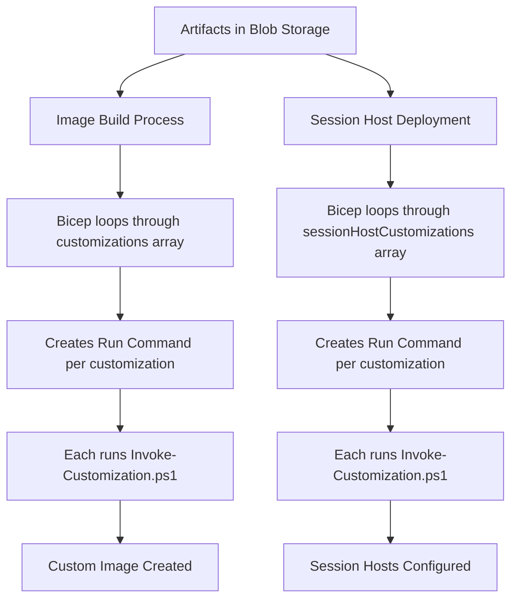

[**Home**](../README.md) | [**Quick Start**](quickStart.md) | [**Host Pool Deployment**](hostpoolDeployment.md) | [**Image Build**](imageBuild.md) | [**Artifacts**](artifactsGuide.md) | [**Features**](features.md) | [**Parameters**](parameters.md)

> **🔧 Technical References:**
> - [Image Management Template Documentation](../deployments/imageManagement/README.md) - Artifacts storage infrastructure
> - [Image Build Template Documentation](../deployments/imageBuild/README.md) - Using artifacts in image builds

# Artifacts and Image Management Guide

## Table of Contents

- [Overview](#overview)
- [Architecture](#architecture)
- [Artifacts Directory Structure](#artifacts-directory-structure)
- [Creating Custom Artifact Packages](#creating-custom-artifact-packages)
- [Master Scripts](#master-scripts)
- [Integration with Deployments](#integration-with-deployments)
- [Best Practices](#best-practices)
- [Troubleshooting](#troubleshooting)

## Overview

The artifacts system in this AVD solution provides a flexible, Zero Trust-compliant method for deploying software and configurations to both custom images and session hosts. Artifacts are packages containing PowerShell scripts, installers, and supporting files that are:

1. Stored in Azure Blob Storage
2. Downloaded and executed during image builds or session host deployments
3. Managed through the `Invoke-Customization.ps1` orchestration script

### Key Concepts

| Concept | Description |
|---------|-------------|
| **Artifact** | A folder containing a PowerShell script and supporting files (installers, configuration files, etc.) |
| **Artifact Package** | The zipped version of an artifact folder, uploaded to Azure Blob Storage |
| **Invoke-Customization.ps1** | The orchestration script (`.common/scripts/Invoke-Customization.ps1`) that downloads and executes a single artifact |
| **Customization** | A reference to an artifact package with optional arguments, defined in deployment parameters |
| **Run Command** | Azure VM Run Command that executes `Invoke-Customization.ps1` for each artifact |

### How It Works

**Both image builds and session host deployments use the same mechanism:**

1. **Bicep/ARM deployment** loops through the customizations array
2. For **each** customization, a separate VM Run Command is created
3. Each Run Command executes `Invoke-Customization.ps1` with parameters:
   - `Name` - The customization name
   - `Uri` - The blob storage URL to the artifact
   - `Arguments` - Optional arguments string
   - Authentication parameters for blob storage access
4. `Invoke-Customization.ps1` downloads the artifact and executes it
5. The `@batchSize(1)` decorator ensures customizations execute sequentially

### When Artifacts Are Used



**Image Build Process:**

- Uses `customizations` parameter array
- Bicep creates a Run Command for each item
- Each Run Command executes `Invoke-Customization.ps1` once
- Sequential execution via `@batchSize(1)`

**Session Host Deployment:**

- Uses `sessionHostCustomizations` parameter array
- Bicep creates a Run Command for each item
- Each Run Command executes `Invoke-Customization.ps1` once
- Sequential execution via `@batchSize(1)`

## Architecture

### Workflow Diagram

```
┌────────────────────────────────────────────────────────────────┐
│ 1. Preparation Phase (Deploy-ImageManagement.ps1)              │
├────────────────────────────────────────────────────────────────┤
│ • Download software from internet (optional)                   │
│ • Compress each artifact folder → ZIP files                    │
│ • Upload to Azure Blob Storage                                 │
└──────────────────┬─────────────────────────────────────────────┘
                   │
                   ▼
┌────────────────────────────────────────────────────────────────┐
│ 2. Bicep/ARM Deployment (Looping Logic)                        │
├────────────────────────────────────────────────────────────────┤
│                                                                │
│ Image Build:                    Session Host Deployment:       │
│ ┌──────────────────────────┐    ┌────────────────────────────┐ │
│ │ imageBuild.bicep         │    │ invokeCustomizations.bicep │ │
│ ├──────────────────────────┤    ├────────────────────────────┤ │
│ │ for each customization:  │    │ for each customization:    │ │
│ │   Create Run Command     │    │   Create Run Command       │ │
│ │   @batchSize(1)          │    │   @batchSize(1)            │ │
│ └──────────┬───────────────┘    └──────────┬─────────────────┘ │
│            │                                │                  │
│            ▼                                ▼                  │
│ ┌──────────────────────────┐    ┌────────────────────────────┐ │
│ │ VM Run Command #1        │    │ VM Run Command #1          │ │
│ │ Invoke-Customization.ps1 │    │ Invoke-Customization.ps1   │ │
│ │ -Name "FSLogix"          │    │ -Name "Configure-Office"   │ │
│ │ -Uri "https://..."       │    │ -Uri "https://..."         │ │
│ │ -Arguments ""            │    │ -Arguments "-param value"  │ │
│ └──────────┬───────────────┘    └──────────┬─────────────────┘ │
│            │                                │                  │
│            ▼                                ▼                  │
│ ┌──────────────────────────┐    ┌────────────────────────────┐ │
│ │ VM Run Command #2        │    │ VM Run Command #2          │ │
│ │ Invoke-Customization.ps1 │    │ Invoke-Customization.ps1   │ │
│ └──────────┬───────────────┘    └──────────┬─────────────────┘ │
│            │                                │                  │
│            ▼                                ▼                  │
│        (continues...)                  (continues...)          │
│                                                                │
└────────────────────────────────────────────────────────────────┘
                   │
                   ▼
┌────────────────────────────────────────────────────────────────┐
│ 3. Execution Phase (Invoke-Customization.ps1)                  │
├────────────────────────────────────────────────────────────────┤
│ • Download artifact from blob storage (with managed identity)  │
│ • Determine file type (.zip, .ps1, .exe, .msi, .bat)           │
│ • Extract if ZIP, find PS1 script inside                       │
│ • Execute with optional Arguments parameter                    │
│ • Log all activity to C:\Windows\Logs\[Name].log               │
│ • Return exit code to Run Command                              │
└────────────────────────────────────────────────────────────────┘
```

### Key Implementation Details

**Looping is handled by Bicep/ARM:**

- Image builds: `deployments/imageBuild/modules/applyCustomizationsBatch.bicep`
- Session hosts: `deployments/hostpools/modules/sessionHosts/modules/invokeCustomizations.bicep`

**Each artifact execution is independent:**

- Separate Run Command resource for each customization
- `@batchSize(1)` ensures sequential execution
- Each Run Command imports and executes `Invoke-Customization.ps1`
- Script is embedded inline via `loadTextContent()` function

**Parameters support:**

- Arguments are passed as a single string to `Invoke-Customization.ps1`
- For PowerShell scripts, arguments are parsed into named parameters
- Format: `-ParameterName Value -SwitchParameter`
- Example: `-InstallMode Full -SkipShortcuts`

## Artifacts Directory Structure

### Repository Location

All artifacts are stored in the repository at:

```text
.common/artifacts/
```

### Directory Layout

```text
.common/artifacts/
│
├── uploadedFileVersionInfo.txt              # Auto-generated version info
│
├── FSLogix.zip                              # Pre-packaged artifact (optional)
├── WDOT.zip                                 # Pre-packaged artifact (optional)
│
├── Install-FSLogix/                         # Artifact Package Example
│   ├── Install-FSLogix.ps1                  # Main script (required)
│   └── [supporting files]                   # Installers, configs (optional)
│
├── VSCode/                                  # Artifact Package Example
│   ├── Install_VSCode.ps1                   # Main script (required)
│   ├── VSCodeSetup.exe                      # Installer (optional)
│   └── readme.md                            # Documentation (optional)
│
├── Configure-Office365Policy/               # Configuration-only example
│   ├── Configure-Office365.ps1              # Main script (required)
│   └── office365.admx                       # Policy templates (optional)
│
├── LGPO/                                    # Tool-based artifact
│   ├── install-lgpo.ps1                     # Main script (required)
│   └── LGPO.exe                             # Tool executable (optional)
│
└── [Your-Custom-Artifact]/                  # Your custom package
    ├── Install-[AppName].ps1                # Main script (required)
    ├── [installer-file]                     # Application installer (optional)
    └── [config-files]                       # Supporting files (optional)
```

**Note:** The orchestration script `Invoke-Customization.ps1` is located at `.common/scripts/Invoke-Customization.ps1` (not in the artifacts directory). It is embedded into ARM/Bicep deployments using the `loadTextContent()` function.

### Packaging Rules (Deploy-ImageManagement.ps1)

When `Deploy-ImageManagement.ps1` processes the `.common/artifacts/` directory for upload to blob storage:

| Source | Processing | Result |
|--------|------------|--------|
| **Subfolders** | Compressed to ZIP | Each subfolder becomes a separate .zip file (e.g., `Chrome/` → `Chrome.zip`) |
| **Root files** | Copied as-is | Files in the root are uploaded individually without modification |

**Example:**

```
.common/artifacts/
├── Chrome/              → Uploaded as Chrome.zip
│   ├── Install-Chrome.ps1
│   └── installer.msi
├── FSLogix/             → Uploaded as FSLogix.zip
│   └── Install-FSLogix.ps1
└── teamsbootstrapper.exe → Uploaded as teamsbootstrapper.exe
```

### Execution Rules (Invoke-Customization.ps1)

When `Invoke-Customization.ps1` downloads and executes an artifact during deployment:

| File Extension | Execution Behavior | Arguments Handling |
|----------------|-------------------|-------------------|
| **.ps1** | Executed directly with PowerShell | Arguments string parsed into named parameters and splatted |
| **.exe** | Executed with `Start-Process` | Arguments string passed directly to executable |
| **.msi** | Executed with `msiexec.exe /i` | Arguments string passed directly to msiexec |
| **.bat** | Executed with `cmd.exe` | Arguments string passed directly to batch file |
| **.zip** | Extracted, then finds first .ps1 in root and executes it | Arguments string parsed into named parameters and splatted to the PS1 |

### Special Files

#### uploadedFileVersionInfo.txt

Auto-generated by `Deploy-ImageManagement.ps1`, this file tracks downloaded software versions:

```text
SoftwareName = Visual Studio Code
DownloadUrl = https://code.visualstudio.com/sha/download?build=stable&os=win32-x64
Download File = VSCodeUserSetup-x64-1.85.1.exe
ProductVersion = 1.85.1
FileVersion = 1.85.1.23348
Downloaded on = 12/15/2024 10:30:45 AM
--------------------------------------------------
SoftwareName = FSLogix
DownloadUrl = https://aka.ms/fslogix_download
Download File = FSLogix_Apps_2.9.8884.27471.zip
ProductVersion = 2.9.8884.27471
FileVersion = 2.9.8884.27471
Downloaded on = 12/15/2024 10:31:12 AM
--------------------------------------------------
```

## Creating Custom Artifact Packages

### Step-by-Step Guide

#### Step 1: Create the Artifact Folder

Create a new folder in `.common/artifacts/` with a descriptive name:

```powershell
# Example: Creating an artifact for Google Chrome
New-Item -Path ".\.common\artifacts\Chrome" -ItemType Directory
```

**Naming Conventions:**

- Use PascalCase (e.g., `MyApp`, `Configure-Setting`)
- Be descriptive but concise
- Avoid spaces and special characters

#### Step 2: Create the Main PowerShell Script

Every artifact package **must** contain exactly one PowerShell script that performs the installation or configuration.

**Important:** If you need parameters, use standard PowerShell named parameters. The `Invoke-Customization.ps1` orchestrator will parse the `Arguments` string and pass them to your script as named parameters.

**Script Template:**

```powershell
#region Parameters (Optional - only if you need them)
Param(
    [Parameter(Mandatory = $false)]
    [string]$InstallMode = 'Full',
    
    [Parameter(Mandatory = $false)]
    [switch]$SkipShortcuts
)
#endregion

#region Initialization
$SoftwareName = 'MyApplication'
$LogPath = 'C:\Windows\Logs'
$Script:Name = 'Install-MyApp'
#endregion

#region Functions
Function Write-Log {
    Param (
        [Parameter(Mandatory = $false)]
        [ValidateSet("Info", "Warning", "Error")]
        $Category = 'Info',
        [Parameter(Mandatory = $true)]
        $Message
    )
    
    $Date = Get-Date
    $Content = "[$Date]`t$Category`t`t$Message`n"
    Add-Content $Script:Log $Content -ErrorAction Stop
    Write-Host $Content
}

Function New-Log {
    Param (
        [Parameter(Mandatory = $true)]
        [string]$Path
    )
    
    $Date = Get-Date -UFormat "%Y-%m-%d_%H-%M-%S"
    $Script:LogFile = "$Script:Name-$Date.log"
    
    if (-not (Test-Path $Path)) {
        New-Item -Path $Path -ItemType Directory -Force | Out-Null
    }
    
    $Script:Log = Join-Path $Path $Script:LogFile
    Add-Content $Script:Log "Date`t`t`tCategory`t`tDetails"
}
#endregion

#region Main Script
try {
    # Initialize logging
    New-Log -Path $LogPath
    Write-Log -Category Info -Message "Starting $SoftwareName installation"
    
    # Log received parameters
    Write-Log -Category Info -Message "InstallMode: $InstallMode"
    Write-Log -Category Info -Message "SkipShortcuts: $SkipShortcuts"
    
    # Locate installer in script directory
    $ScriptPath = Split-Path -Parent $MyInvocation.MyCommand.Path
    $Installer = Get-ChildItem -Path $ScriptPath -Filter "*.msi" | Select-Object -First 1
    
    if (-not $Installer) {
        throw "Installer not found in $ScriptPath"
    }
    
    Write-Log -Category Info -Message "Found installer: $($Installer.Name)"
    
    # Build arguments based on parameters
    $Arguments = "/i `"$($Installer.FullName)`" /qn /norestart"
    
    if ($InstallMode -eq 'Minimal') {
        $Arguments += " ADDLOCAL=Core"
    }
    
    # Execute installation
    Write-Log -Category Info -Message "Executing: msiexec.exe $Arguments"
    
    $Process = Start-Process -FilePath "msiexec.exe" -ArgumentList $Arguments -Wait -PassThru
    $ExitCode = $Process.ExitCode
    
    if ($ExitCode -eq 0 -or $ExitCode -eq 3010) {
        Write-Log -Category Info -Message "Installation completed successfully. Exit code: $ExitCode"
        exit 0
    }
    else {
        Write-Log -Category Error -Message "Installation failed with exit code: $ExitCode"
        exit $ExitCode
    }
}
catch {
    Write-Log -Category Error -Message "Error during installation: $_"
    exit 1
}
#endregion
```

**How Parameters Work:**

When you define this customization in your deployment:

```json
{
  "name": "MyApp",
  "blobNameOrUri": "MyApp.zip",
  "arguments": "-InstallMode Minimal -SkipShortcuts"
}
```

The `Invoke-Customization.ps1` script will:

1. Download and extract MyApp.zip
2. Find Install-MyApp.ps1 inside
3. Parse the arguments string: `-InstallMode Minimal -SkipShortcuts`
4. Call the script: `& Install-MyApp.ps1 -InstallMode Minimal -SkipShortcuts`

Your script receives: `$InstallMode = "Minimal"` and `$SkipShortcuts = $true`

#### Step 3: Add Supporting Files

Place any required files in the same directory:

```
Chrome/
├── Install-Chrome.ps1
└── GoogleChromeEnterpriseBundle64.msi
```

**Best Practices for Supporting Files:**

- Keep installers in the same directory as the script
- Use relative paths to locate files
- Include any configuration files needed
- Document file requirements in a readme.md

#### Step 4: Test Locally

Before uploading, test your script locally:

```powershell
# Test with no parameters
.\.common\artifacts\Chrome\Install-Chrome.ps1

# Test with named parameters
.\.common\artifacts\Chrome\Install-Chrome.ps1 -InstallMode Full -SkipShortcuts
```

#### Step 5: Deploy with Deploy-ImageManagement.ps1

Once tested, deploy the artifact:

```powershell
# Update artifacts in blob storage
.\deployments\Deploy-ImageManagement.ps1 `
    -StorageAccountResourceId "/subscriptions/.../storageAccounts/stabc123" `
    -ManagedIdentityResourceID "/subscriptions/.../userAssignedIdentities/uami-123" `
    -DeleteExistingBlobs
```

### Advanced Script Patterns

#### Pattern 1: Download Installer from Internet

Some installers may be too large to store in the repo. Download them during execution:

```powershell
Param(
    [Parameter(Mandatory = $false)]
    [string]$InstallerUrl = "https://example.com/installer.exe"
)

# Download the installer
$InstallerPath = Join-Path $env:TEMP "installer.exe"

Write-Log -Category Info -Message "Downloading installer from $InstallerUrl"
Invoke-WebRequest -Uri $InstallerUrl -OutFile $InstallerPath -UseBasicParsing

# Verify download
if (-not (Test-Path $InstallerPath)) {
    throw "Failed to download installer"
}

# Install
Start-Process -FilePath $InstallerPath -ArgumentList "/S" -Wait
```

#### Pattern 2: Registry Configuration

For configuration-only artifacts (no installer):

```powershell
Function Set-RegistryValue {
    Param (
        [Parameter(Mandatory = $true)]
        [string]$Key,
        [Parameter(Mandatory = $true)]
        [string]$Name,
        [Parameter(Mandatory = $true)]
        $Value,
        [Parameter(Mandatory = $false)]
        [Microsoft.Win32.RegistryValueKind]$Type = 'String'
    )
    
    if (-not (Test-Path -LiteralPath $Key)) {
        New-Item -Path $Key -Force | Out-Null
        Write-Log -Category Info -Message "Created registry key: $Key"
    }
    
    New-ItemProperty -LiteralPath $Key -Name $Name -Value $Value -PropertyType $Type -Force | Out-Null
    Write-Log -Category Info -Message "Set registry value: $Key\$Name = $Value"
}

# Example usage
Set-RegistryValue -Key "HKLM:\SOFTWARE\MyApp" -Name "Setting1" -Value "Enabled" -Type String
```

#### Pattern 3: Conditional Execution Based on Parameters

```powershell
Param(
    [Parameter(Mandatory = $false)]
    [ValidateSet('Full', 'Minimal', 'Custom')]
    [string]$InstallMode = 'Full',
    
    [Parameter(Mandatory = $false)]
    [switch]$SkipShortcuts
)

Write-Log -Category Info -Message "InstallMode: $InstallMode"
Write-Log -Category Info -Message "SkipShortcuts: $SkipShortcuts"

# Conditional logic
switch ($InstallMode) {
    'Full' {
        Write-Log -Category Info -Message "Performing full installation"
        # Full installation code
    }
    'Minimal' {
        Write-Log -Category Info -Message "Performing minimal installation"
        # Minimal installation code
    }
    'Custom' {
        Write-Log -Category Info -Message "Performing custom installation"
        # Custom installation code
    }
}

if (-not $SkipShortcuts) {
    # Create shortcuts
    Write-Log -Category Info -Message "Creating shortcuts"
}
```

#### Pattern 4: Multi-File Installation

For artifacts with multiple installers:

```powershell
# Locate all installers
$ScriptPath = Split-Path -Parent $MyInvocation.MyCommand.Path
$Installers = Get-ChildItem -Path $ScriptPath -Filter "*.exe"

foreach ($Installer in $Installers) {
    Write-Log -Category Info -Message "Installing: $($Installer.Name)"
    
    $Process = Start-Process -FilePath $Installer.FullName -ArgumentList "/S" -Wait -PassThru
    
    if ($Process.ExitCode -ne 0 -and $Process.ExitCode -ne 3010) {
        Write-Log -Category Warning -Message "$($Installer.Name) failed with exit code: $($Process.ExitCode)"
    }
    else {
        Write-Log -Category Info -Message "$($Installer.Name) completed successfully"
    }
}
```

### Script Requirements Checklist

- [ ] Script uses standard PowerShell named parameters (NOT DynParameters)
- [ ] Script includes logging functionality
- [ ] Script handles errors gracefully
- [ ] Script returns appropriate exit codes (0 = success)
- [ ] Script uses relative paths for file access (`$PSScriptRoot` or `Split-Path`)
- [ ] Script includes header comments explaining purpose
- [ ] Script name follows convention: `Install-[Name].ps1` or `Configure-[Name].ps1`

## The Invoke-Customization.ps1 Orchestrator

### Overview

The `Invoke-Customization.ps1` script (`.common/scripts/Invoke-Customization.ps1`) is the core orchestration script used by both image builds and session host deployments. It handles **one** customization at a time.

**Key Points:**

- **Location:** `.common/scripts/Invoke-Customization.ps1`
- **Usage:** Embedded into Bicep/ARM via `loadTextContent()` function
- **Execution:** One instance per customization via VM Run Commands
- **Looping:** Handled by Bicep/ARM deployment, NOT by the script
- **Parameters:** Standard PowerShell parameters, NOT DynParameters

### Parameters

| Parameter | Type | Required | Description |
|-----------|------|----------|-------------|
| `APIVersion` | string | No | IMDS API version for managed identity tokens (default based on cloud) |
| `Arguments` | string | No | Arguments string passed to the artifact (default: empty) |
| `BlobStorageSuffix` | string | Yes | Blob storage endpoint suffix (e.g., `blob.core.usgovcloudapi.net`) |
| `BuildDir` | string | No | Build directory for temp files (used in image builds) |
| `Name` | string | Yes | Name of the customization (used for logging) |
| `Uri` | string | Yes | Full URI to the artifact in blob storage |
| `UserAssignedIdentityClientId` | string | No | Client ID for managed identity authentication |

### How It Works

**Execution Flow:**

```
1. START: Invoke-Customization.ps1 receives parameters from Run Command
   ↓
2. Start transcript logging to C:\Windows\Logs\[Name].log
   ↓
3. Create temp directory ($env:TEMP\[Name] or BuildDir\[Name])
   ↓
4. Authentication check:
   - If Uri is in blob storage AND UserAssignedIdentityClientId provided:
     → Get OAuth token from Azure Instance Metadata Service (IMDS)
     → Add Bearer token to download headers
   - Else:
     → Download without authentication (public or SAS token in URL)
   ↓
5. Download artifact from Uri to temp directory
   ↓
6. Determine file extension and handle accordingly:
   ├─ .EXE:
   │  └─ Execute: Start-Process with Arguments
   ├─ .MSI:
   │  └─ Execute: msiexec.exe /i [file] with Arguments
   ├─ .BAT:
   │  └─ Execute: cmd.exe with Arguments
   ├─ .PS1:
   │  ├─ If Arguments provided:
   │  │  ├─ Parse Arguments string into parameter hashtable
   │  │  └─ Call script with splatted parameters: & $Script @params
   │  └─ Else: & $Script
   └─ .ZIP:
      ├─ Extract to subfolder in temp directory
      ├─ Find first .ps1 file in root of extracted content
      ├─ If Arguments provided:
      │  ├─ Parse Arguments into parameter hashtable
      │  └─ Call script with splatted parameters: & $Script @params
      └─ Else: & $Script
   ↓
7. Cleanup temp directory (if in $env:TEMP)
   ↓
8. Stop transcript
   ↓
9. END: Exit code returned to Run Command
```

### Argument Parsing

**For PowerShell Scripts (.ps1 or .ps1 inside .zip):**

The `Arguments` string is parsed into named parameters using the `ConvertTo-ParametersSplat` function:

**Input Format:**

```
-ParameterName Value -SwitchParameter -AnotherParam "Value with spaces"
```

**Parsing Rules:**

1. Parameters start with `-` followed by parameter name
2. Switch parameters have no value (set to `$true`)
3. Boolean values: `true` → `$true`, `false` → `$false`
4. Quoted strings are preserved
5. Result is hashtable splatted to the PowerShell script

**Example:**

Deployment configuration:

```json
{
  "name": "MyApp",
  "blobNameOrUri": "MyApp.zip",
  "arguments": "-InstallMode Full -SkipShortcuts -LogPath C:\\Logs"
}
```

Parsed to hashtable:

```powershell
@{
  InstallMode = "Full"
  SkipShortcuts = $true
  LogPath = "C:\Logs"
}
```

Called as:

```powershell
& Install-MyApp.ps1 @params
# Equivalent to: & Install-MyApp.ps1 -InstallMode "Full" -SkipShortcuts -LogPath "C:\Logs"
```

**For EXE/MSI/BAT files:**

Arguments are passed directly to `Start-Process` without parsing. Use appropriate syntax for the executable:

```json
{
  "name": "TeamsBootstrapper",
  "blobNameOrUri": "teamsbootstrapper.exe",
  "arguments": "-p -o C:\\Logs"
}
```

### File Type Handling

| Extension | Handler | Arguments Usage |
|-----------|---------|-----------------|
| **.exe** | `Start-Process -FilePath $file -ArgumentList $args` | Direct pass-through |
| **.msi** | `msiexec.exe /i $file $args` | Direct pass-through |
| **.bat** | `cmd.exe $file $args` | Direct pass-through |
| **.ps1** | `& $script @parsedParams` | Parsed into parameters |
| **.zip** | Extract → Find .ps1 → `& $script @parsedParams` | Parsed into parameters |

### Logging

All activity is logged via PowerShell transcript:

**Log Location:** `C:\Windows\Logs\[Name].log`

**Log Content:**

- All parameter values
- Download progress
- File type detection
- Execution commands
- Exit codes
- Any errors

**Example Log:**

```
[12/22/2024 10:30:15] Starting 'MyApp' script with the following parameters.
[12/22/2024 10:30:15] APIVersion: 2018-02-01
[12/22/2024 10:30:15] BlobStorageSuffix: blob.core.usgovcloudapi.net
[12/22/2024 10:30:15] Name: MyApp
[12/22/2024 10:30:15] Uri: https://staccount.blob.core.usgovcloudapi.net/artifacts/MyApp.zip
[12/22/2024 10:30:15] Arguments: -InstallMode Full
[12/22/2024 10:30:16] Downloading 'https://...' to 'C:\Temp\MyApp'
[12/22/2024 10:30:20] Finished downloading
[12/22/2024 10:30:21] Extracting 'MyApp.zip' to 'C:\Temp\MyApp\MyApp'
[12/22/2024 10:30:22] Finding PowerShell script in root of 'C:\Temp\MyApp\MyApp'
[12/22/2024 10:30:22] Calling PowerShell Script with arguments '-InstallMode Full'
[12/22/2024 10:32:45] Script completed
```

### Bicep Integration

**How Invoke-Customization.ps1 is Called:**

**Image Builds:**
File: `deployments/imageBuild/modules/applyCustomization.bicep`

```bicep
resource runCommand 'Microsoft.Compute/virtualMachines/runCommands@2023-09-01' = {
  parent: virtualMachine
  name: customizer.name
  location: location
  properties: {
    parameters: [
      { name: 'APIVersion', value: apiVersion }
      { name: 'BlobStorageSuffix', value: 'blob.${environment().suffixes.storage}' }
      { name: 'UserAssignedIdentityClientId', value: userAssignedIdentityClientId }
      { name: 'Name', value: customizer.name }
      { name: 'Uri', value: customizer.uri }
      { name: 'Arguments', value: customizer.?arguments ?? '' }
      { name: 'BuildDir', value: buildDir }
    ]
    source: {
      script: loadTextContent('../../../../.common/scripts/Invoke-Customization.ps1')
    }
    treatFailureAsDeploymentFailure: true
  }
}
```

**Session Hosts:**
File: `deployments/hostpools/modules/sessionHosts/modules/invokeCustomizations.bicep`

```bicep
@batchSize(1)
resource runCommands 'Microsoft.Compute/virtualMachines/runCommands@2023-03-01' = [for customizer in customizers: {
  name: customizer.name
  location: location
  parent: virtualMachine
  properties: {
    parameters: [
      { name: 'APIVersion', value: apiVersion }
      { name: 'BlobStorageSuffix', value: 'blob.${environment().suffixes.storage}' }
      { name: 'UserAssignedIdentityClientId', value: userAssignedIdentityClientId }
      { name: 'Name', value: customizer.name }
      { name: 'Uri', value: customizer.uri }
      { name: 'Arguments', value: customizer.arguments }
    ]
    source: {
      script: loadTextContent('../../../../../.common/scripts/Invoke-Customization.ps1')
    }
    treatFailureAsDeploymentFailure: true
  }
}]
```

**Key Points:**

- `loadTextContent()` embeds the entire script inline
- `@batchSize(1)` ensures sequential execution
- Bicep loops through customizations array
- Each customization gets its own Run Command resource
- Run Commands execute independently

## Integration with Deployments

### Image Build Integration

**Step 1: Prepare Artifacts**

```powershell
# Deploy image management resources and upload artifacts
.\deployments\Deploy-ImageManagement.ps1 `
    -DeployImageManagementResources `
    -Location "East US 2" `
    -ParameterFilePrefix "production"
```

**Step 2: Reference Artifacts in Image Build**

Edit your image build parameters file:

```json
{
  "artifactsContainerUri": {
    "value": "https://staccount.blob.core.usgovcloudapi.net/artifacts/"
  },
  "artifactsUserAssignedIdentityResourceId": {
    "value": "/subscriptions/.../userAssignedIdentities/uami-artifacts"
  },
  "customizations": {
    "value": [
      {
        "name": "LGPO",
        "blobNameOrUri": "LGPO.zip",
        "arguments": ""
      },
      {
        "name": "FSLogix",
        "blobNameOrUri": "FSLogix.zip",
        "arguments": ""
      },
      {
        "name": "Teams",
        "blobNameOrUri": "teamsbootstrapper.exe",
        "arguments": "-p"
      },
      {
        "name": "Office365",
        "blobNameOrUri": "Configure-Office365.zip",
        "arguments": ""
      },
      {
        "name": "Chrome",
        "blobNameOrUri": "Chrome.zip",
        "arguments": "-InstallMode Enterprise -DisableUpdates"
      }
    ]
  }
}
```

**What Happens:**

1. Bicep loops through the `customizations` array
2. For each item, creates a VM Run Command
3. Each Run Command executes `Invoke-Customization.ps1` with:
   - `Name` = customization name
   - `Uri` = constructed full URL (artifactsContainerUri + blobNameOrUri)
   - `Arguments` = arguments string
4. Run Commands execute sequentially (`@batchSize(1)`)

**Step 3: Deploy Image Build**

```powershell
New-AzDeployment `
    -Location "East US 2" `
    -TemplateFile ".\deployments\imageBuild\imageBuild.bicep" `
    -TemplateParameterFile ".\deployments\imageBuild\parameters\production.imageBuild.parameters.json"
```

### Session Host Integration

**Step 1: Prepare Artifacts**

Same as image build - artifacts must be uploaded to blob storage.

**Step 2: Reference Artifacts in Host Pool Deployment**

Edit your host pool parameters file:

```json
{
  "artifactsContainerUri": {
    "value": "https://staccount.blob.core.usgovcloudapi.net/artifacts/"
  },
  "artifactsUserAssignedIdentityResourceId": {
    "value": "/subscriptions/.../userAssignedIdentities/uami-artifacts"
  },
  "sessionHostCustomizations": {
    "value": [
      {
        "name": "Configure-OneDrive",
        "blobNameOrUri": "Configure-OneDrive.zip",
        "arguments": "-TenantId 12345678-1234-1234-1234-123456789012 -EnableKFM"
      },
      {
        "name": "Install-LineOfBusinessApp",
        "blobNameOrUri": "LOBApp.zip",
        "arguments": "-InstallMode Full -SkipShortcuts"
      },
      {
        "name": "Configure-EdgePolicy",
        "blobNameOrUri": "Configure-EdgePolicy.zip",
        "arguments": ""
      }
    ]
  }
}
```

**What Happens:**

1. Bicep loops through the `sessionHostCustomizations` array
2. For each session host VM, creates Run Commands for all customizations
3. Each Run Command executes `Invoke-Customization.ps1` with appropriate parameters
4. Run Commands execute sequentially per VM (`@batchSize(1)`)

**Step 3: Deploy Host Pool**

```powershell
New-AzDeployment `
    -Location "East US 2" `
    -TemplateFile ".\deployments\hostpools\hostpool.bicep" `
    -TemplateParameterFile ".\deployments\hostpools\parameters\production.hostpool.parameters.json"
```

## Best Practices

### Script Development

1. **Always Use Logging**
   - Include comprehensive logging in every script
   - Log to `C:\Windows\Logs` for consistency
   - Include timestamps and categories (Info/Warning/Error)

2. **Handle Errors Gracefully**
   - Use try/catch blocks
   - Return meaningful exit codes
   - Log errors before exiting

3. **Make Scripts Idempotent**
   - Check if software is already installed
   - Skip if already configured correctly
   - Allow re-running without issues

4. **Use Relative Paths**
   - Never hardcode paths
   - Use `$PSScriptRoot` or `Split-Path -Parent $MyInvocation.MyCommand.Path`
   - Assume files are in the same directory as the script

5. **Document Your Scripts**
   - Include header comments explaining purpose
   - Document parameters and expected behavior
   - Create a readme.md for complex artifacts

### Artifact Organization

1. **One Script Per Package**
   - Each artifact folder should have exactly one main .ps1 script
   - Use clear, descriptive names
   - Follow naming convention: `Install-[Name].ps1` or `Configure-[Name].ps1`

2. **Keep Packages Small**
   - Don't include unnecessary files
   - Download large installers during execution if possible
   - Use separate packages for unrelated functionality

3. **Version Control**
   - Let Deploy-ImageManagement.ps1 download latest versions
   - Check uploadedFileVersionInfo.txt for current versions
   - Test with new versions before production deployment

### Deployment Strategy

1. **Test in Development First**
   - Test locally before uploading
   - Deploy to dev environment before production
   - Use different parameter file prefixes for environments

2. **Use Image Layers**
   - Install common software in base image
   - Apply environment-specific configs on session hosts
   - Minimize session host customizations for faster provisioning

3. **Parameter Management**
   - Use arguments parameter for environment-specific values
   - Don't hardcode tenant IDs or configuration values
   - Store sensitive data in Key Vault, not in scripts
   - Pass sensitive values as parameters from Key Vault references

### Security

1. **Avoid Hardcoded Credentials**
   - Never store credentials in scripts
   - Use managed identities for authentication
   - Retrieve secrets from Key Vault if needed

2. **Validate Downloads**
   - Verify file hashes for critical downloads
   - Use HTTPS for all downloads
   - Check file signatures where applicable

3. **Minimize Permissions**
   - Scripts run with system privileges - be careful
   - Don't install software that runs with unnecessary permissions
   - Follow principle of least privilege

## Troubleshooting

### Common Issues

#### Issue: Artifact Script Not Executing

**Symptoms:**

- Run Command completes but artifact script doesn't execute
- No errors in Invoke-Customization.ps1 log

**Solutions:**

1. **Check script exists in ZIP:**

   ```powershell
   # Extract and check contents
   Expand-Archive -Path ".\MyApp.zip" -DestinationPath ".\temp" -Force
   Get-ChildItem .\temp\ -Recurse
   # Must see .ps1 file in ROOT of extracted content
   ```

2. **Verify ZIP structure:**
   - ✅ Correct: `MyApp.zip\Install-MyApp.ps1`
   - ❌ Wrong: `MyApp.zip\MyApp\Install-MyApp.ps1` (extra folder level)

3. **Check Invoke-Customization log:**

   ```powershell
   # On the VM, check the log
   Get-Content "C:\Windows\Logs\MyApp.log"
   # Look for "Finding PowerShell script in root"
   ```

#### Issue: Script Fails with "File Not Found"

**Symptoms:**

- Script runs but can't find installer or supporting files
- Error: "Cannot find path..."

**Solutions:**

1. **Use correct path resolution:**

   ```powershell
   # Wrong - don't use hardcoded paths
   $Installer = "C:\Installers\app.msi"
   
   # Correct - use script location
   $ScriptPath = Split-Path -Parent $MyInvocation.MyCommand.Path
   $Installer = Get-ChildItem -Path $ScriptPath -Filter "*.msi" | Select-Object -First 1
   
   # Alternative
   $ScriptPath = $PSScriptRoot
   ```

2. **Verify files are in artifact:**

   ```powershell
   # Check artifact folder contents before zipping
   Get-ChildItem .\.common\artifacts\MyApp\ -Recurse
   ```

#### Issue: Parameters Not Being Received

**Symptoms:**

- Script receives wrong parameter values or no parameters
- Parameters show as empty or default values

**Solutions:**

1. **Verify parameter declaration:**

   ```powershell
   # Script must use standard named parameters
   Param(
       [Parameter(Mandatory = $false)]
       [string]$InstallMode = 'Full',
       
       [Parameter(Mandatory = $false)]
       [switch]$SkipShortcuts
   )
   ```

2. **Check arguments format:**

   ```json
   // Correct format in deployment
   {
     "name": "MyScript",
     "blobNameOrUri": "MyScript.zip",
     "arguments": "-InstallMode Minimal -SkipShortcuts"
   }
   
   // Not: "arguments": "InstallMode=Minimal;SkipShortcuts=True"
   ```

3. **Test locally with same syntax:**

   ```powershell
   # Test exactly as Invoke-Customization will call it
   & .\Install-MyApp.ps1 -InstallMode Minimal -SkipShortcuts
   ```

4. **Add debug logging:**

   ```powershell
   # At start of script
   Write-Host "Received parameters:"
   Write-Host "  InstallMode: $InstallMode"
   Write-Host "  SkipShortcuts: $SkipShortcuts"
   ```

#### Issue: Installation Returns Non-Zero Exit Code

**Symptoms:**

- Installer executes but returns error code
- Common codes: 1603, 1619, 1641, 3010

**Solutions:**

1. **Accept common success codes:**

   ```powershell
   $Process = Start-Process -FilePath $Installer -ArgumentList $Arguments -Wait -PassThru
   $ExitCode = $Process.ExitCode
   
   # 3010 = reboot required (still success)
   # 1641 = reboot initiated (still success)
   if ($ExitCode -eq 0 -or $ExitCode -eq 3010 -or $ExitCode -eq 1641) {
       Write-Log "Installation successful (exit code: $ExitCode)"
       exit 0
   }
   ```

2. **Enable detailed logging:**

   ```powershell
   # For MSI
   $LogFile = Join-Path $env:TEMP "installer.log"
   $Arguments = "/i `"$Installer`" /qn /norestart /l*v `"$LogFile`""
   
   # For EXE (if supported)
   $Arguments = "/silent /log:`"$LogFile`""
   ```

3. **Verify prerequisites:**
   - Check if installer requires specific OS version
   - Verify architecture matches (x86 vs x64)
   - Ensure .NET Framework or VC++ redistributables are installed

### Diagnostic Tools

#### View Artifact Versions

```powershell
# Check what's currently deployed
$StorageAccount = "staccount"
$Container = "artifacts"
$Context = (Get-AzStorageAccount -ResourceGroupName "rg-name" -Name $StorageAccount).Context

Get-AzStorageBlob -Container $Container -Context $Context | 
    Select-Object Name, LastModified, Length |
    Format-Table -AutoSize
```

#### Download and Inspect Artifact

```powershell
# Download artifact for inspection
$BlobName = "MyApp.zip"
$LocalPath = ".\temp\$BlobName"

Get-AzStorageBlobContent -Container $Container -Blob $BlobName -Destination $LocalPath -Context $Context

# Extract and inspect
Expand-Archive -Path $LocalPath -DestinationPath ".\temp\extracted" -Force
Get-ChildItem .\temp\extracted\ -Recurse
```

#### Check Run Command Logs

**Image Build:**

If you enabled `collectCustomizationLogs` during deployment, all logs are automatically saved to blob storage in the `image-customization-logs` container. See the [Image Build Guide - Getting Detailed Logs](imageBuild.md#getting-detailed-logs) for details on accessing these logs.

Alternatively, you can check logs directly on the build VM during or after the build:

```powershell
# On build VM during image build
# Each customization creates its own log file
Get-Content "C:\Windows\Logs\Install-MyApp.log"

# List all customization logs
Get-ChildItem "C:\Windows\Logs\" -Filter "*.log" | 
    Where-Object { $_.Name -match '^(Install-|Configure-|Enable-)' } |
    Sort-Object LastWriteTime
```

**Session Host:**

```powershell
# On session host, check individual customization logs
Get-Content "C:\Windows\Logs\Install-MyApp.log"

# View all customization logs sorted by execution time
Get-ChildItem "C:\Windows\Logs\" -Filter "*.log" | 
    Where-Object { $_.Name -match '^(Install-|Configure-|Enable-)' } |
    Sort-Object LastWriteTime |
    ForEach-Object {
        Write-Host "`n=== $($_.Name) (Last Modified: $($_.LastWriteTime)) ===" -ForegroundColor Cyan
        Get-Content $_.FullName -Tail 20
    }

# Check VM Run Command execution status
Get-Content "C:\WindowsAzure\Logs\Plugins\Microsoft.CPlat.Core.RunCommandWindows\*\*\RunCommand.log" -Tail 100
```

### Getting Help

If you encounter issues not covered here:

1. **Check existing documentation:**
   - [Deploy-ImageManagement Script Guide](imageManagementScript.md)
   - [Troubleshooting Guide](troubleshooting.md)
   - [Quick Start Guide](quickStart.md)

2. **Review example artifacts:**
   - `.common/artifacts/VSCode/` - Simple installer example
   - `.common/artifacts/Configure-Office365Policy/` - Configuration example
   - `.common/artifacts/Install-FSLogix/` - Download and install example

3. **Search GitHub issues:**
   - [FederalAVD Issues](https://github.com/Azure/FederalAVD/issues)
   - Search for error messages or similar problems

4. **Create a new issue:**
   - Include artifact script code
   - Include relevant log excerpts
   - Describe expected vs. actual behavior
   - Mention Azure environment (Commercial, Government, etc.)

## Related Documentation

- [Deploy-ImageManagement Script Guide](imageManagementScript.md) - Detailed script documentation
- [Quick Start Guide](quickStart.md) - Complete deployment walkthrough
- [Parameters Reference](parameters.md) - All deployment parameters
- [Air-Gapped Cloud Guide](airGappedClouds.md) - Special considerations for air-gapped environments

---

**Last Updated:** December 2024
