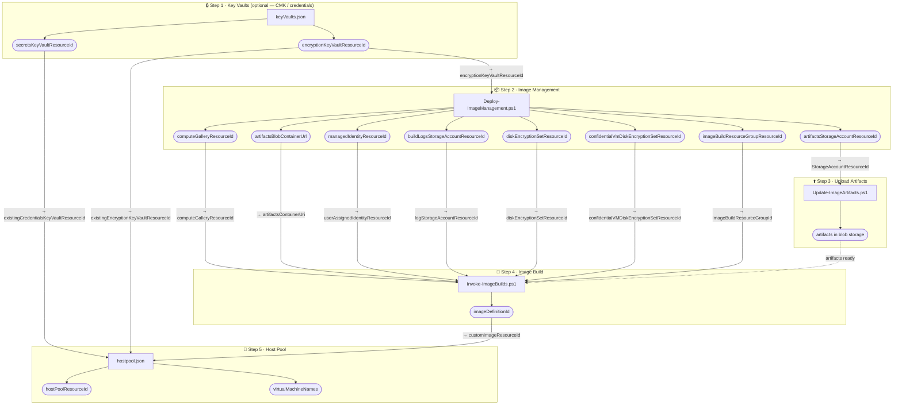
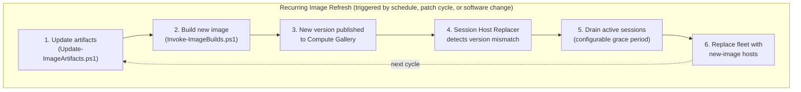

[**Home**](../README.md) | [**Quick Start**](quick-start.md) | [**Host Pool Deployment**](hostpool-deployment.md) | [**Image Build**](image-build.md) | [**Artifacts**](artifacts-guide.md) | [**Features**](features.md) | [**Parameters**](parameters.md) | [**Compliance**](compliance.md) | [**BCDR**](bcdr.md)

# End-to-End Automation Guide

This guide describes how to chain the FederalAVD deployment steps together in an automated or scripted workflow. It focuses on **which outputs feed which inputs** at each step — not on any specific pipeline tool or CI/CD platform.

Each step maps to an existing script or ARM/Bicep deployment. You can wire them together in whatever automation tool you use (Azure DevOps, GitHub Actions, a shell script, a runbook, etc.).

---

## The Pipeline at a Glance

Each subgraph shows a deployment step and its outputs (rounded nodes). Arrows between steps are labelled with the **target parameter name** in the receiving step.



---

## Step 1: Deploy Key Vaults

**Script/template:** `deployments/keyVaults/keyVaults.json`  
**When required:** Only if using Customer Managed Keys (CMK) or a pre-provisioned credentials Key Vault.

### Key outputs

| Output | Used by |
|--------|---------|
| `secretsKeyVaultResourceId` | Host pool — `existingCredentialsKeyVaultResourceId`; Session Host Replacer / Session Hosts add-on — `credentialsKeyVaultResourceId` |
| `encryptionKeyVaultResourceId` | Image Management — `encryptionKeyVaultResourceId`; Host Pool — `existingEncryptionKeyVaultResourceId` |
| `encryptionKeyVaultUri` | Available if needed for manual key references |

### Notes

- The deploying identity needs **Key Vault Crypto Officer** on the encryption key vault before running any downstream step that creates CMK keys.
- Key Vaults are intentionally deployed separately so the same vault can be shared across multiple host pool deployments and image builds.

---

## Step 2: Deploy Image Management

**Script:** `deployments/Deploy-ImageManagement.ps1`  
**Template:** `deployments/imageManagement/imageManagement.json`

```
Inputs from Step 1 (if CMK):
  encryptionKeyVaultResourceId  →  imageManagement parameter: encryptionKeyVaultResourceId

Script invocation:
  .\Deploy-ImageManagement.ps1 -Location <region> -ParameterFilePrefix <prefix>
  # Add -UpdateArtifacts to also run Step 3 automatically
```

If your customer parameter files live outside the extracted repo zip, pass `-CustomerRootPath <path>` so the script reads from your external customer folder.

### Key outputs

| Output | Used by |
|--------|---------|
| `computeGalleryResourceId` | Image Build — `computeGalleryResourceId` parameter |
| `artifactsStorageAccountResourceId` | Update-ImageArtifacts.ps1 — `StorageAccountResourceId` |
| `artifactsBlobContainerUrl` | Image Build — `artifactsContainerUri` parameter |
| `managedIdentityResourceId` | Image Build — `userAssignedIdentityResourceId` parameter |
| `buildLogsStorageAccountResourceId` | Image Build — `logStorageAccountResourceId` parameter |
| `diskEncryptionSetResourceId` | Image Build — `diskEncryptionSetResourceId` parameter (only when CMK enabled) |
| `confidentialVmDiskEncryptionSetResourceId` | Image Build — `confidentialVMDiskEncryptionSetResourceId` parameter (only when Confidential VM encryption type is `EncryptedWithCmk`) |
| `imageBuildResourceGroupResourceId` | Image Build — `imageBuildResourceGroupId` parameter (existing RG path only) |

### Notes

- Add `-UpdateArtifacts` to the script call to roll Steps 2 and 3 into a single invocation for first-time setup.
- If `deployArtifactsStorageAccount = false` in the parameter file, the artifacts-related outputs will be empty strings — skip Step 3 and omit `artifactsContainerUri` / `userAssignedIdentityResourceId` in Step 4.
- The `managedIdentityResourceId` output (→ `userAssignedIdentityResourceId`) is only **required** when using the existing resource group path (`imageBuildResourceGroupId` is set), zero-trust artifacts storage, or log collection. Leave it empty to use the **temporary RG path** (see Step 4 notes).
- If your customer parameter files live outside the extracted repo zip, pass `-CustomerRootPath <path>` to `Deploy-ImageManagement.ps1` and `Invoke-ImageBuilds.ps1` so they resolve the external customer folder.

---

## Step 3: Upload Artifacts

**Script:** `deployments/Update-ImageArtifacts.ps1`  
**When required:** Every time software packages are added or updated. Skip if Step 2 was run with `-UpdateArtifacts`.

```
Inputs from Step 2:
  artifactsStorageAccountResourceId  →  -StorageAccountResourceId
  (or pass -StorageAccountName / -ResourceGroupName instead)
```

This step has **no Azure deployment outputs** — it only writes blobs to storage. The artifact container URL produced by Step 2 (`artifactsBlobContainerUrl`) is what you pass to image builds.

### Notes

- For air-gapped environments, use `-SkipDownloadingNewSources` and pre-stage customer-managed files in `customer/artifacts/` before running.
- Use `-DeleteExistingBlobs` for a clean upload when removing old packages.
- To merge customer-owned optional downloads, place `downloads.json` in `customer/parameters/imageManagement/`; the script discovers it automatically.
- To keep customer content outside a freshly extracted repo zip, pass `-CustomerRootPath <path>` to `Update-ImageArtifacts.ps1`.

---

## Step 4: Build Custom Image

**Script:** `deployments/Invoke-ImageBuilds.ps1`  
**Template:** `deployments/imageBuild/imageBuild.json`

```
Inputs from Step 2:
  computeGalleryResourceId      →  imageBuild parameter: computeGalleryResourceId
  artifactsBlobContainerUrl     →  imageBuild parameter: artifactsContainerUri
  managedIdentityResourceId     →  imageBuild parameter: userAssignedIdentityResourceId
  buildLogsStorageAccountResourceId  →  imageBuild parameter: logStorageAccountResourceId (optional)
  diskEncryptionSetResourceId        →  imageBuild parameter: diskEncryptionSetResourceId (only when CMK enabled)
  confidentialVmDiskEncryptionSetResourceId  →  imageBuild parameter: confidentialVMDiskEncryptionSetResourceId (only when Confidential VM with CMK)
  imageBuildResourceGroupResourceId  →  imageBuild parameter: imageBuildResourceGroupId (existing RG path only)

Script invocation:
  .\Invoke-ImageBuilds.ps1 -Location <region> -ParameterFilePrefixes @('prefix1','prefix2')
```

These values are typically pre-populated in the image build parameter files after the first imageManagement deployment.

### Key outputs

| Output | Used by |
|--------|---------|
| `imageDefinitionId` | Host Pool — `customImageResourceId` parameter |

### Notes

- `Invoke-ImageBuilds.ps1` runs all prefixes **in parallel** as Azure deployment jobs and waits for all to complete.
- The `imageDefinitionId` output points at the gallery image definition. For the host pool, pass the **latest version** resource ID or use the `/versions/latest` alias:  
  `<imageDefinitionId>/versions/latest`
- Build time is typically 45–90 minutes. Factor this into pipeline timeouts.
- **Temporary RG path:** If `imageBuildResourceGroupId` is empty in your parameter file, each build creates a new uniquely-named temporary resource group and **deletes the entire resource group on completion**. Do not query or reference the build resource group after the deployment finishes — it will not exist. This path requires no pre-staging with imageManagement and no UAI unless storage features are enabled.
- **Existing RG path:** If `imageBuildResourceGroupId` is set, imageBuild deploys VMs into that resource group and deletes only the VMs on completion. The resource group persists and can be inspected after the build.

---

## Step 5: Deploy Host Pool

**Script:** None yet — deploy directly via ARM/PowerShell/CLI or the Azure Portal.  
**Template:** `deployments/hostpools/hostpool.json`

```
Inputs from Step 4:
  imageDefinitionId + /versions/latest  →  hostpool parameter: customImageResourceId

Inputs from Step 1 (if using pre-provisioned credentials or CMK):
  secretsKeyVaultResourceId     →  hostpool parameter: existingCredentialsKeyVaultResourceId
  encryptionKeyVaultResourceId  →  hostpool parameter: existingEncryptionKeyVaultResourceId

Example PowerShell invocation:
  $paramFile = "prod.hostpool.parameters.json"
  $deploymentName = [System.IO.Path]::GetFileNameWithoutExtension($paramFile)
  New-AzDeployment `
      -Location <region> `
      -TemplateFile ".\deployments\hostpools\hostpool.json" `
  -TemplateParameterFile ".\customer\parameters\hostpools\$paramFile" `
      -Name $deploymentName
```

### Key outputs

| Output | Description |
|--------|-------------|
| `hostPoolResourceId` | Host pool resource ID — useful for Session Host Replacer add-on |
| `workspaceResourceId` | AVD workspace resource ID |
| `virtualMachineNames` | Array of deployed session host VM names |
| `fslogixLocalStorageAccountResourceIds` | Storage account(s) for FSLogix profiles |

### Notes

- If `customImageResourceId` is empty, the host pool uses the marketplace image defined by `imagePublisher` / `imageOffer` / `imageSku`.
- The host pool deployment always creates all resources. Use `existingLogAnalyticsWorkspaceResourceId`, `existingAVDInsightsDataCollectionRuleResourceId`, and `existingDataCollectionEndpointResourceId` in the parameter file to reuse shared monitoring infrastructure instead of creating new resources. Use `existingVmBackupVaultResourceId` (personal host pools) or `existingFilesBackupVaultResourceId` (pooled host pools) to reuse existing backup vaults, and `existingEncryptionKeyVaultResourceId` to reference a pre-deployed encryption Key Vault.
- For repeatable redeployments (e.g., after a new image build), keep your parameter file stable and just update `customImageResourceId` to the new image version.

---

## Passing Outputs Between Steps

Because there is no single orchestration script today, outputs must be captured and passed manually between steps. Common approaches:

**Option A — Save outputs to variables in a single session**

```powershell
# Step 2
$imgMgmt = New-AzDeployment -Name "..." -Location $location -TemplateFile "..." -TemplateParameterFile "..."
$galleryId   = $imgMgmt.Outputs.computeGalleryResourceId.Value
$containerUrl = $imgMgmt.Outputs.artifactsBlobContainerUrl.Value
$identityId  = $imgMgmt.Outputs.managedIdentityResourceId.Value

# Step 3 (if not using -UpdateArtifacts)
.\Update-ImageArtifacts.ps1 -StorageAccountResourceId $imgMgmt.Outputs.artifactsStorageAccountResourceId.Value

# Step 4 — pre-populate these values in your imageBuild parameter file, or pass inline
```

**Option B — Capture outputs to a JSON file between steps**

```powershell
$imgMgmt.Outputs | ConvertTo-Json | Set-Content ".\imageManagement.outputs.json"
# Load in a later step/session
$outputs = Get-Content ".\imageManagement.outputs.json" | ConvertFrom-Json
$galleryId = $outputs.computeGalleryResourceId.Value
```

**Option C — Store outputs in an Azure Key Vault or App Configuration**  
Suitable for pipeline automation where steps run in separate jobs with no shared memory.

**Option D — Read outputs from deployment history**  
Azure stores all deployment outputs in history. You can retrieve them any time:

```powershell
$imgMgmt = Get-AzDeployment -Name "ImageManagement-basic-20260507123000"
$galleryId = $imgMgmt.Outputs.computeGalleryResourceId.Value
```

---

## Suggested Parameter File Strategy

Keep one parameter file per component per environment. Update only the fields that change between runs (typically `customImageResourceId` after a new build):

```
customer/
  parameters/
    keyVaults/
      prod.keyVaults.parameters.json

    imageManagement/
      prod.imageManagement.parameters.json

    imageBuild/
      prod.imageBuild.parameters.json       ← update computeGalleryResourceId, artifactsContainerUri, etc. once
      win11-m365.imageBuild.parameters.json ← per image definition variant

    hostpools/
      prod-finance.hostpool.parameters.json ← update customImageResourceId after each build
      prod-general.hostpool.parameters.json
```

---

## Ongoing Image Lifecycle

Steps 1–5 above are a **one-time setup**. Once a host pool is deployed and the Session Host Replacer is running, you do not redeploy the host pool to roll out new images. The repeating lifecycle looks like this:



**Key point:** The host pool `customImageResourceId` parameter points at the gallery image *definition* (not a specific version). The Replacer compares each running session host's image version against the latest version in the gallery. When a new version exists, it triggers a replacement cycle automatically — no parameter file update and no host pool redeployment required.

### Automated approach: Session Host Replacer

The Session Host Replacer is an Azure Function add-on that monitors the Compute Gallery and manages the entire replacement cycle without human intervention.

**What triggers a new replacement cycle:**
- A new image version is published to the gallery (i.e., Step 2 above completes)
- The function detects that running hosts have an image version older than the gallery's latest

**What it handles automatically:**
- Marks outdated hosts as drain mode (no new sessions)
- Waits for configurable grace period before removing hosts with active sessions
- Deploys new hosts using the host pool's current configuration + latest gallery image
- Validates new hosts register successfully before removing old ones
- Cleans up Entra ID and Intune device records (DeleteFirst mode)
- Supports SideBySide (zero-downtime) and DeleteFirst (cost-optimized) replacement strategies
- Ringed rollout delay — configurable per-host-pool delay after a new image is detected, enabling validation before fleet-wide rollout

**Setup:** Deploy the add-on once per host pool. The `hostPoolResourceId` output from Step 5 is the primary input.

> See [Session Host Replacer Add-On](session-host-replacer.md) and [full add-on documentation](../deployments/add-ons/sessionHostReplacer/README.md) for deployment prerequisites, configuration, and replacement mode comparison.

### Manual approach: TagAndDrainSessionHosts.ps1

For teams that do not use the Session Host Replacer, `deployments/TagAndDrainSessionHosts.ps1` provides a manual drain-and-replace workflow:

1. Run the script to tag existing session hosts into drain mode and optionally force-logoff sessions after a grace period
2. Deploy replacement session hosts via the `deployments/add-ons/sessionHosts/` add-on or a new host pool deployment
3. Once new hosts are healthy, delete the drained hosts

This is appropriate for environments with strict change control windows or when the Session Host Replacer is not deployed.

### Pipeline integration

A typical image refresh pipeline stage (after initial setup) runs only Steps 3–4:

```powershell
# Step 3 — refresh artifacts (skip if no software changes this cycle)
.\Update-ImageArtifacts.ps1 `
    -StorageAccountResourceId $artifactsStorageAccountResourceId

# Step 4 — build new image
.\Invoke-ImageBuilds.ps1 `
    -Location $location `
    -ParameterFilePrefixes @('win11-m365')

# Step 5 is NOT required — Session Host Replacer picks up the new gallery version automatically.
# Monitor replacement progress via the Azure Monitor Workbook deployed with the add-on.
```

Key Vaults (Step 1), Image Management infrastructure (Step 2), and Host Pool (Step 5) are deployed once and not part of the recurring pipeline unless infrastructure is changing.

---

## Related Resources

- [Quick Start Guide](quick-start.md) — Step-by-step walkthrough with portal options
- [imageManagement README](../deployments/imageManagement/README.md) — Infrastructure parameters
- [Update-ImageArtifacts Script](update-image-artifacts.md) — Artifact upload options
- [Image Build Guide](image-build.md) — Image build parameters and monitoring
- [Host Pool Deployment Guide](hostpool-deployment.md) — Full host pool parameter reference
- [Air-Gapped Cloud Guide](air-gapped-clouds.md) — Secret/Top Secret cloud considerations
