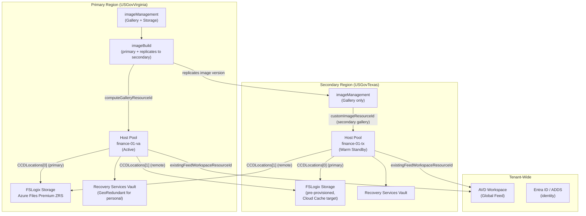

[**Home**](../README.md) | [**Quick Start**](quick-start.md) | [**Host Pool Deployment**](hostpool-deployment.md) | [**Image Build**](image-build.md) | [**Artifacts**](artifacts-guide.md) | [**Features**](features.md) | [**Parameters**](parameters.md) | [**Compliance**](compliance.md) | [**BCDR**](bcdr.md)

# Business Continuity & Disaster Recovery

## Overview

FederalAVD includes purpose-built support for multi-region disaster recovery and high availability at every layer of the AVD stack — compute, profiles, images, and control plane. These capabilities are built into the existing templates and do not require additional tooling. This guide explains each available pattern, the RTO/RPO characteristics of each, and the specific parameters and deployment sequence required to implement them.

> **Well-Architected Reference:** This guidance aligns with the [Azure Well-Architected Framework for AVD — Reliability](https://learn.microsoft.com/en-us/azure/well-architected/azure-virtual-desktop/reliability) and [Azure Virtual Desktop business continuity and disaster recovery](https://learn.microsoft.com/en-us/azure/virtual-desktop/disaster-recovery).

---

## Intra-Region High Availability — Availability Zones

**What it protects against:** Single datacenter (zone) failure within a region.

**RTO:** Zero — transparent to users. No failover action required.  
**RPO:** Zero.

The host pool template defaults to `availability = 'AvailabilityZones'`, spreading session host VMs across all availability zones in the selected region. This is the primary resiliency mechanism for single-region deployments and provides a 99.99% SLA for compute.

```bicep
// hostpool.bicep defaults
param availability string = 'AvailabilityZones'
param availabilityZones array = []  // empty = spread across all zones
```

`'AvailabilitySets'` is available as a fallback for regions that do not support Availability Zones.

> **Note:** Availability Zones protect against zone-level faults within a region. They do not protect against full regional outages.

---

## Profile Strategy for Cross-Region Deployments

> **FSLogix is always recommended for pooled host pools.** Without FSLogix, users on pooled hosts accumulate roaming profile baggage in the local temp profile, leading to bloat, inconsistent state, and policy enforcement gaps. The question for DR is not whether to use FSLogix, but whether to replicate profiles across regions. Personal host pool VMs carry their profile state on the OS disk and typically do not require FSLogix.

### Start With OneDrive Known Folder Move

Before designing a cross-region FSLogix strategy, evaluate whether **OneDrive Known Folder Move (KFM)** is deployed or can be deployed as part of the AVD configuration. KFM silently redirects Desktop, Documents, and Pictures to OneDrive, making those folders cloud-native and continuously synchronized independent of the FSLogix profile container.

With KFM in place:

- **The files users care most about survive any regional failover automatically** — documents, desktop items, and saved work are already in OneDrive and available from any host pool in any region.
- **The FSLogix profile container's cross-region importance shrinks significantly** — it holds application state, browser cache, Outlook OST files, and registry hive. Users starting with a fresh profile on failover face a much smaller practical gap.
- **For most organizations, KFM + per-region FSLogix profiles meets recovery objectives** without the cost and performance trade-offs of Cloud Cache or additional geo-redundant profile storage.

> **Recommendation:** Deploy OneDrive KFM via Intune or Group Policy before evaluating Cloud Cache or any cross-region profile replication approach. It is the lowest-complexity, highest-impact profile resilience investment available for cloud-joined or hybrid AVD deployments.

**Reference:** [Redirect and move Windows known folders to OneDrive](https://learn.microsoft.com/en-us/onedrive/redirect-known-folders)

---

### Recommended: Per-Region Profiles (No Cross-Region Replication)

The default recommendation for cross-region DR is **independent per-region FSLogix storage with no cross-region synchronization**. Each region's host pool writes profiles to its own local storage. On a regional failover, users connecting to the secondary region get a fresh profile or the last state that was written to the secondary region's own storage.

This is preferred for most deployments because:

- **No WAN write penalty** — Cross-region Cloud Cache commits every profile write over the WAN before acknowledging it to the OS. On a high-latency cross-region path this degrades I/O performance for every user session, every day — not only during a failover event.
- **No IOPS downgrade** — The natural alternative to Cloud Cache for cross-region redundancy is geo-redundant storage (GRS). However, Azure Files GRS is only available on Standard (HDD-backed) accounts, which cannot meet the IOPS requirements for production-scale AVD deployments. Premium Azure Files (required for adequate IOPS) is only available with ZRS or LRS — neither of which replicates cross-region. Cloud Cache with two Premium accounts is therefore the only performant cross-region replication option, and it carries the WAN write penalty described above.
- **Lower cost** — No secondary storage account is needed for profile data; only the compute and networking infrastructure in the secondary region.

Deploy the secondary host pool with its own FSLogix storage. Accept that users who fail over will start from an empty or per-region profile. Use OneDrive Known Folder Move (KFM) to roam Desktop/Documents/Pictures natively, reducing the practical impact of per-region profiles.

> **FSLogix storage redundancy:** Independent of cross-region DR strategy, match FSLogix storage account redundancy to compute resilience. When session hosts are deployed across availability zones, set `fslogixStorageRedundancy = 'ZoneRedundant'` (the default is `LocallyRedundant`). **Azure Files Premium does not support Geo-Redundant Storage (GRS) — ZRS is the highest redundancy tier available for production-grade FSLogix storage.** LRS is appropriate only for single-zone or availability set deployments. Environments aligning to [NIST SP 800-53 Rev 5](https://csrc.nist.gov/pubs/sp/800/53/r5/upd1/final) CP-9 (Information System Backup) should use ZRS in zone-enabled regions as the expected baseline for primary profile storage.

### When Cloud Cache Is the Right Answer

Use FSLogix Cloud Cache for cross-region scenarios only when **near-zero profile RPO is a firm requirement** — i.e., users must continue exactly where they left off, including unsaved profile state, after a regional failover. Cloud Cache is the correct and supported mechanism for this; just go in with eyes open on the performance trade-off.

See [Profile High Availability — FSLogix Cloud Cache](#profile-high-availability--fslogix-cloud-cache) for configuration details.

---

## Profile High Availability — FSLogix Cloud Cache

**What it protects against:** Storage account or full region outage for user profile data, with near-zero RPO.

**RTO:** Near-zero — sessions continue without interruption during storage failure.  
**RPO:** Near-zero — only writes in-flight at the exact moment of failure are at risk.

> **Performance trade-off:** Cloud Cache commits every profile write simultaneously to all configured locations before acknowledging it to the OS. Across a cross-region WAN path, this adds latency to every write I/O for the duration of every user session — not only during failover. Measure round-trip latency between session hosts and the secondary storage endpoint before enabling cross-region Cloud Cache in production. Note that GRS-based storage is not a viable alternative: Azure Files GRS requires Standard accounts, which do not provide sufficient IOPS for production AVD. Cloud Cache with two Premium LRS/ZRS accounts in separate regions is the only performant cross-region replication path, with the WAN write penalty as the accepted trade-off. Intra-region Cloud Cache (two Premium accounts in the same region, different zones) does not carry this cross-region penalty and is appropriate for zone-HA scenarios.

FSLogix Cloud Cache is an **active/active** replication mechanism built into the FSLogix agent. Every VHD/X container write is committed to all configured storage locations simultaneously before being acknowledged. On storage failure, the agent continues writing to surviving locations. When the failed location recovers, the agent automatically reconciles the container from the surviving copy.

### How It Works in This Solution

The host pool template supports Cloud Cache across both Azure Files and Azure NetApp Files. The session hosts are configured automatically when the following parameters are set:

| Parameter | Purpose |
|-----------|---------|
| `fslogixContainerType` | Must be `CloudCacheProfileContainer` or `CloudCacheProfileOfficeContainer` |
| `fslogixStorageService` or `deployFSLogixStorage` | Creates the **primary-region** storage during deployment |
| `fslogixExistingRemoteStorageAccountResourceIds` | **Pre-provisioned** secondary-region Azure Files accounts |
| `fslogixExistingRemoteNetAppVolumeResourceIds` | **Pre-provisioned** secondary-region Azure NetApp Files volumes |

The template configures FSLogix `CCDLocations` registry keys on every session host to include the primary-region storage first (preferred read path), followed by all remote locations. The local deployment-created storage is automatically included; pre-existing remote storage is appended.

### Prerequisites for Cross-Region Cloud Cache

1. **Secondary-region storage must be pre-provisioned** — the host pool template does not create remote storage accounts. Deploy a second host pool in the secondary region using the same `identifier` and `index` (or set `deployFSLogixStorage = true` in a secondary region host pool deployment) to create the storage first, then pass its resource ID as `fslogixExistingRemoteStorageAccountResourceIds` in the primary region deployment.

2. **Network reachability** — session hosts must be able to reach the remote storage account's SMB endpoint (port 445) over your WAN fabric (ExpressRoute, VPN, or VNet peering). Azure Private Endpoints on the secondary storage account must be resolvable from the primary region.

3. **Identity solution** — Cloud Cache with multiple accounts requires a directory-backed identity solution: `EntraDS`, `ADDS`, `EntraKerberos-Hybrid`, or `EntraKerberos-CloudOnly`. The `EntraId` option (storage key auth) only writes to the first configured account and does not provide cross-region redundancy.

4. **FSLogix sizing** — ensure `fslogixSizeInMBs` is sized appropriately; Cloud Cache synchronizes the full container to all locations.

### Example Parameter Configuration

```json
{
  "fslogixContainerType": { "value": "CloudCacheProfileContainer" },
  "fslogixStorageService": { "value": "AzureFiles Premium" },
  "fslogixExistingRemoteStorageAccountResourceIds": {
    "value": [
      "/subscriptions/<sub>/resourceGroups/rg-finance-01-storage-tx/providers/Microsoft.Storage/storageAccounts/safslogixfinance01tx"
    ]
  }
}
```

> **Azure NetApp Files cross-region note:** `fslogixExistingRemoteNetAppVolumeResourceIds` allows specifying ANF volumes in a secondary region. However, cross-region ANF volume access requires Azure NetApp Files Cross-Region Replication (CRR) to be configured independently of this template. CRR creates a read-replica in the secondary region, which must then be promoted before it is writable. Consult the [ANF CRR documentation](https://learn.microsoft.com/en-us/azure/azure-netapp-files/cross-region-replication-introduction) before using this option for DR.

---

## Image Gallery Cross-Region Replication

**What it protects against:** Loss of custom image availability in a region, preventing new session host deployment from custom images.

**RTO:** Zero — images are pre-replicated. A secondary-region host pool consuming the local gallery's `latest` version has no dependency on the primary region.  
**RPO:** Zero — images are immutable point-in-time artifacts.

### Architecture

Image gallery replication requires **two imageManagement deployments** — one per region. Each creates an independent Azure Compute Gallery. The imageBuild template then replicates each image version to both galleries automatically.

```
imageManagement → Primary Region Gallery (always created)
imageManagement → Secondary Region Gallery (separate deployment, prerequisite for DR)

imageBuild → builds in primary region
           → replicates image version to both galleries (via remoteComputeGalleryResourceId)
```

### Deployment Sequence

**Step 1: Deploy imageManagement in both regions**

Run the imageManagement template twice — once per region. Storage accounts and build logs storage are only needed in the build region (primary); the secondary deployment can deploy only the gallery:

```powershell
# Primary build region
.\Deploy-ImageManagement.ps1 -Location usgovvirginia -ParameterFilePrefix primary

# Secondary/DR region — gallery only (disable storage to save cost)
.\Deploy-ImageManagement.ps1 -Location usgovtexas -ParameterFilePrefix secondary
```

Secondary region parameter file:
```json
{
  "deployArtifactsStorageAccount": { "value": false },
  "deployBuildLogsStorageAccount": { "value": false }
}
```

**Step 2: Pass both gallery resource IDs to imageBuild**

```json
{
  "computeGalleryResourceId": {
    "value": "<output: primary imageManagement computeGalleryResourceId>"
  },
  "remoteComputeGalleryResourceId": {
    "value": "<output: secondary imageManagement computeGalleryResourceId>"
  }
}
```

The template automatically derives the secondary region name from the gallery resource's `.location` property and adds it to the image version's `targetRegions` array. No manual region string is required.

**Step 3: Secondary host pool references its local gallery**

```json
{
  "customImageResourceId": {
    "value": "<secondaryGalleryId>/images/<imageDefinitionName>/versions/latest"
  }
}
```

Azure resolves `latest` from within the secondary gallery, which already has the image replicated asynchronously. The secondary host pool has no runtime dependency on the primary region.

### Customer-Managed Key Considerations

If `keyManagementGalleryImageVersions` is not `PlatformManaged`, the `diskEncryptionSetResourceId` output from each imageManagement deployment is region-specific. Pass the **secondary region** imageManagement DES output to the imageBuild `diskEncryptionSetResourceId` parameter when building images that will be replicated to that region. Encrypted image versions can only be replicated to regions where the DES exists.

---

## Cross-Region Host Pool Deployment

**What it protects against:** Full regional outage of the primary AVD host pool.

**RTO:**
- **Warm standby** (VMs pre-deployed, powered off): Minutes — power on VMs and ensure users can reach the secondary workspace.
- **Cold standby** (no VMs pre-deployed): Hours to days — must deploy session hosts before users can connect.

**RPO:** Zero for profiles if Cloud Cache is configured with cross-region storage (see above). Zero for images (pre-replicated).

### Naming Consistency — The Key to Cross-Region Deployments

The `identifier` + `index` combination drives all resource group and AVD resource naming. Using the same identifier and index in both regions creates parallel, independently named resource groups that align logically but do not conflict:

```
Primary:   identifier=finance, index=1, location=usgovvirginia
  → rg-finance-01-hosts-va
  → rg-finance-01-storage-va
  → rg-avd-control-plane-va / vdpool-finance-01

Secondary: identifier=finance, index=1, location=usgovtexas
  → rg-finance-01-hosts-tx
  → rg-finance-01-storage-tx
  → rg-avd-control-plane-tx / vdpool-finance-01
```

Each region has its own fully independent operations infrastructure (Key Vault, Recovery Services Vault) in `rg-avd-operations-{loc}`.

### Workspace Strategy

You have two options for the AVD workspace (feed):

**Option A — Shared workspace (primary region workspace aggregates both):**  
When deploying the secondary host pool, pass the primary workspace resource ID as `existingFeedWorkspaceResourceId`. The secondary app group is added to the existing workspace's `applicationGroupReferences` without overwriting existing entries.

```json
{
  "existingFeedWorkspaceResourceId": {
    "value": "<primary region workspace resource ID>"
  }
}
```

> **Important:** Without `existingFeedWorkspaceResourceId`, a `Complete` deployment overwrites the workspace's app group references, dropping the primary region's application group registration. Always set this parameter when adding a secondary pool to an existing workspace.

**Option B — Independent workspaces per region:**  
Deploy the secondary region with its own workspace (`existingFeedWorkspaceResourceId = ''`). Users are routed to the correct workspace via conditional access, identity provider, or manual workspace assignment. This provides full workspace-level isolation between regions.

### Standby Mode Options

**Warm standby — Start VM on Connect:**  
Set `startVMOnConnect = true` in the secondary host pool. Deallocated VMs start on demand when a user connects after a failover event. Ongoing cost is storage only (no compute for deallocated VMs).

**Cold standby — Session Host Replacer on demand:**  
Do not pre-deploy session hosts. In a failover event, trigger a Session Host Replacer run in the secondary region to deploy VMs from the pre-replicated image. RTO is bounded by VM deployment time (typically 10-20 minutes at scale).

### Deployment Checklist for Secondary Region

- [ ] imageManagement deployed in secondary region (gallery pre-created)
- [ ] imageBuild referencing `remoteComputeGalleryResourceId` = secondary gallery
- [ ] Secondary-region networking deployed (VNet, subnets, DNS, ExpressRoute/VPN to primary)
- [ ] Domain connectivity available in secondary region (if ADDS/EntraDS)
- [ ] FSLogix secondary storage pre-provisioned (if Cloud Cache)
- [ ] Host pool deployed with same `identifier` + `index`, secondary subnet, `existingFeedWorkspaceResourceId` set
- [ ] `customImageResourceId` pointing to secondary gallery

### Executing Pooled Host Pool Failover

When a regional outage occurs, the steps depend on which standby mode was chosen. In all cases, the prerequisite checklist above must have been completed beforehand — you cannot improvise the image replication or networking during an active outage.

#### Step 1 — Confirm image availability in the secondary gallery

Before deploying session hosts, verify that the intended image version is present and fully replicated in the secondary region's Azure Compute Gallery. You need the resource ID of the image version in the **secondary** gallery, not the primary.

If the last replication run completed successfully before the outage, the image is available. If the most recent version was not yet replicated, use the most recent available version in the secondary gallery. Do not attempt to trigger a new imageBuild run while the primary region is unavailable.

To list available image versions in the secondary gallery:

```powershell
# List replicated image versions in the secondary gallery
Get-AzGalleryImageVersion `
  -ResourceGroupName <secondary imageManagement resource group> `
  -GalleryName <secondary gallery name> `
  -GalleryImageDefinitionName <image definition name>
```

Note the `id` of the version you will use. If `keyManagementGalleryImageVersions` is `CustomerManaged`, use the secondary region's Disk Encryption Set resource ID, not the primary's.

#### Step 2 — Warm standby: scale up existing session hosts

If session hosts were pre-deployed in the secondary region (warm standby with `startVMOnConnect = true`), they start automatically on user connection. No deployment action is required. Verify that:

- The secondary host pool is registered in the workspace users are being directed to (see [Workspace Strategy](#workspace-strategy))
- Scaling plan limits are appropriate for the expected failover load — adjust `minSessionHostCount` in Session Host Replacer or increase the scaling plan's capacity thresholds if needed

#### Step 3 — Cold standby: deploy session hosts from pre-replicated image

If no session hosts are pre-deployed, use **`deployments/add-ons/sessionHosts/`** to add session hosts to the secondary host pool. This avoids re-running the full hostpool template (which would touch control plane resources and workspace registration). The session hosts add-on takes the existing host pool resource ID and deploys only the VMs:

```powershell
# From the repo root — deploy session hosts into the secondary host pool
cd deployments/add-ons/sessionHosts

# Edit or create a parameter file targeting the secondary region:
#   - hostPoolResourceId: resource ID of the secondary host pool
#   - customImageResourceId: image version ID from the secondary gallery (Step 1)
#   - virtualMachineNamePrefix / index: consistent with your naming convention
#   - subnet: secondary region subnet resource ID

New-AzResourceGroupDeployment `
  -ResourceGroupName <secondary hosts resource group> `
  -TemplateFile sessionHosts.bicep `
  -TemplateParameterFile parameters/sessionHosts.<env>.json
```

Alternatively, trigger a **Session Host Replacer** run in the secondary region if it was pre-configured there. Session Host Replacer will deploy the configured number of hosts from the `latest` version in the secondary gallery automatically.

#### Step 4 — Verify user routing

Ensure users are being directed to the secondary workspace or host pool. This solution does not automate DNS failover or workspace switching — user routing must be handled through:

- **Conditional access policies** that assign users to the secondary workspace's application group
- **Manual workspace assignment** (update users' feed URL or re-subscribe to the secondary workspace)
- **AVD Global Reach / workspace aggregation** if the secondary app group was registered to the shared primary workspace (Option A above)

#### Post-failover: image replication catchup

When the primary region recovers, resume normal imageBuild runs with `remoteComputeGalleryResourceId` pointing to the secondary gallery. The next successful build will replicate the latest image to the secondary region, keeping the secondary gallery current for the next DR event or for failing back.

---

## Personal Host Pool VM Backup

**What it protects against:** Accidental deletion, data corruption, or OS-level failure on personal (dedicated) session host VMs. With geo-redundant vaults, also enables cross-region restore for personal VMs.

**RTO:** Hours — manual restore process.  
**RPO:** Determined by backup schedule and `backupRetentionDays` (daily backup, default 30-day retention). For cross-region restore (GRS), recovery points in the secondary region lag the primary by approximately 12–24 hours — this is the effective RPO for a regional outage scenario.

Personal host pool VMs are backed up to an Azure Recovery Services Vault when `recoveryServices = true`. The vault is deployed to the **host pool’s own hosts resource group** (`rg-avd-hosts-{identifier}-{index}-{loc}`) — one vault per host pool, not shared. This keeps backup scope and lifecycle tightly bound to each host pool.

```bicep
param recoveryServices bool = false
@allowed(['LocallyRedundant', 'ZoneRedundant', 'GeoRedundant'])
param recoveryServicesVaultStorageRedundancy string = 'LocallyRedundant'
@minValue(1)
@maxValue(365)
param backupRetentionDays int = 30                        // daily retention window
param existingVmBackupVaultResourceId string = '' // omit to create a new vault
```

For personal host pools:
- `GeoRedundant` replicates backup recovery points to a paired Azure region and automatically enables Cross-Region Restore (CRR), allowing VM recovery in that secondary region even if the primary region is completely unavailable. CRR is enabled automatically when GRS is selected — no separate parameter is needed. GRS storage costs roughly 2× LRS regardless of whether CRR is on or off; without CRR the geo-redundant copy is passive data durability with no recovery capability, so enabling CRR with GRS is always the right choice. The only additional cost for CRR is the restore operation itself, which occurs only during an actual DR event. In environments aligned to [NIST SP 800-53 Rev 5](https://csrc.nist.gov/pubs/sp/800/53/r5/upd1/final) CP-6 (Alternate Storage Site) and CP-7 (Alternate Processing Site), GRS is the recommended configuration — backup data physically resides at an alternate facility and can be restored there within an acceptable RTO.
- `ZoneRedundant` protects backup data against a zone-level failure within the region. Satisfies NIST CP-9 zone-resilience expectations when cross-region restore is not required.
- `LocallyRedundant` is the default and is appropriate when cross-region recovery of backup data is not a requirement and the host pool is already zone-redundant.

### Performing a Cross-Region Restore

When a regional outage requires recovering personal VMs into the paired region, the process is entirely manual through the Azure Portal or Azure CLI. There is no automated failover. At a high level:

1. **Navigate to the vault** in the Azure Portal — the vault is in the hosts resource group (`rg-avd-hosts-{identifier}-{index}-{loc}`) in the *primary* region. Even if the primary region is unavailable, the vault's geo-redundant data is accessible from the portal.
2. **Switch to Secondary Region view** — in the vault's **Backup Items** blade, use the **Secondary Region** toggle. This shows backup items replicated to the paired region. The toggle is not visible by default; you must explicitly select it.
3. **Select the VM and trigger restore** — choose the VM, select **Restore VM**, then choose **Cross Region Restore**. Select a recovery point (the most recent available in the secondary region is typically 12–24 hours behind the primary).
4. **Specify target resources in the secondary region** — provide a target resource group, target virtual network, and subnet. These must already exist in the secondary region (pre-provisioned as part of your DR runbook; this solution's networking template can be pre-deployed there).
5. **Wait for restore to complete** — the restored VM is created in the secondary region as a standalone VM, not automatically enrolled in a host pool. After the restore completes, re-add it to the secondary region's AVD host pool.

> **Note:** CRR recovery points in the secondary region lag the primary by approximately 12–24 hours. This is the practical RPO for CRR — not the backup schedule interval alone.

For the full procedure including CLI and PowerShell options, see [Restore Azure VM data in Azure portal — Cross Region Restore](https://learn.microsoft.com/en-us/azure/backup/backup-azure-arm-restore-vms#cross-region-restore).

Customer-managed key (CMK) encryption is supported for the vault via `keyManagementRecoveryServicesVault`. The vault always uses its system-assigned identity for CMK access — this avoids an extra user-assigned identity resource and is also required by Azure when the vault has a private endpoint.

> **CMK with private Key Vaults — mutually exclusive controls:** Azure Backup has no `AzureServices` trusted service bypass for Key Vault, so it cannot reach a Key Vault with `publicNetworkAccess: Disabled`. This creates an irreconcilable conflict between two independent controls when both `deployPrivateEndpoints = true` and `keyManagementRecoveryServicesVault = CustomerManaged` are set:
>
> | | **Option A** | **Option B** |
> |---|---|---|
> | RSV encryption | Customer-Managed Keys | Platform-Managed Keys |
> | KV public access | Enabled (`publicNetworkAccess: Disabled` removed; KV reachable from Azure public network by any authenticated principal) | Disabled (private-only enforced) |
> | SC-28 satisfied for RSV | ✅ Yes | ❌ No |
> | SC-7 network isolation maintained | ❌ No | ✅ Yes |
> | Parameter | `encryptionKeyVaultForcePublicAccess: true` | `encryptionKeyVaultForcePublicAccess: false` (default) |
>
> When `encryptionKeyVaultForcePublicAccess = false` (the default), the solution automatically falls back to PMK on the RSV rather than failing the deployment (Option B). Neither option satisfies both controls simultaneously — this is a **Microsoft Azure platform limitation**. The choice is a compliance risk decision for your ISSO and Authorizing Official, not a solution default. Document the selected option and formally accept the resulting gap in your SSP.

> **Pooled host pools:** When `recoveryServices = true` for a pooled host pool, the **FSLogix Azure Files file shares** are backed up using Azure Backup snapshot policy. The vault for Azure Files backup is deployed to the **shared operations resource group** (`rg-avd-operations-{loc}`) and is reused across pooled host pools in the same region — pass `existingFilesBackupVaultResourceId` on subsequent pooled deployments to reuse an existing vault rather than creating a second one. FSLogix share snapshots are stored in the storage account itself and are not transmitted to the vault — the vault holds only scheduling metadata. Vault storage redundancy is therefore hardcoded to `LocallyRedundant` for the Azure Files vault, and CMK is not required. The `backupRetentionDays` parameter controls the snapshot retention period (VM backup and Azure Files backup are mutually exclusive per host pool type, so the parameter is shared). Soft-delete retention for FSLogix file shares is controlled separately by `fslogixSoftDeleteRetentionDays` (default: 14 days). For cross-region profile resilience on pooled host pools, see [Profile Strategy for Cross-Region Deployments](#profile-strategy-for-cross-region-deployments).

---

## Session Host Replacer — Image Rollback

**What it protects against:** Bad image deployment to the fleet. Not a regional outage mitigation.

**RTO:** Minutes — power on retained old session hosts.  
**RPO:** Not applicable — user profile data is unaffected by session host replacement.

When `deployScalingPlan = true` and Session Host Replacer is configured with `ShutdownRetention` mode, replaced (old-image) session hosts are powered off but retained for a configurable period (1-7 days) rather than deleted. If a new image is discovered to have issues, the fleet can be rolled back by:

1. Powering on the retained hosts
2. Draining new hosts
3. Removing new hosts after users have migrated back

The **Ringed Rollout** setting (0-30 day delay) further limits blast radius by staging new image adoption across the fleet progressively, allowing validation in a subset of hosts before fleet-wide rollout.

See [Session Host Replacer documentation](session-host-replacer.md) for configuration details.

---

## End-to-End Multi-Region Architecture

The following illustrates a complete active/passive multi-region AVD deployment using all available DR capabilities:



**On primary region failure:**
1. Cloud Cache has already synchronized all profile writes to `fslogix2` — no data recovery needed
2. Users connect to `workspace` — the feed shows both app groups; the secondary app group routes to `hp2`
3. Session hosts in `hp2` start via Start VM on Connect (if warm standby) or are deployed by Session Host Replacer (if cold)
4. Images are already present in the secondary gallery — no image build or replication is needed

---

## RTO/RPO Reference

| Pattern | RTO | RPO | Action on Failure | Prerequisites |
|---------|-----|-----|-------------------|---------------|
| **Availability Zones** | 0 | 0 | None | Default — enabled by default |
| **FSLogix Cloud Cache** | ~0 | Near-zero | None | Remote storage pre-provisioned; network path to secondary storage |
| **Image Gallery replication** | 0 | 0 | None (pre-replicated) | Secondary imageManagement deployed; `remoteComputeGalleryResourceId` set in imageBuild |
| **Warm standby host pool** | Minutes | Depends on profile strategy | Power on VMs or wait for Start VM on Connect | Secondary host pool pre-deployed with deallocated VMs |
| **Cold standby host pool** | Hours | Depends on profile strategy | Deploy session hosts from pre-replicated image | Secondary host pool infra deployed; no VMs |
| **Azure Backup — personal VMs (LRS/ZRS)** | Hours | Last backup point | Manual restore in Azure portal | `recoveryServices = true` |
| **Azure Backup — personal VMs (GRS + CRR)** | Hours | Last backup point | Manual cross-region restore in Azure portal | `recoveryServices = true`, `GeoRedundant` vault, `recoveryServicesVaultCrossRegionRestore = true` |
| **FSLogix share backup (pooled)** | Hours | Last backup point | Manual restore | `recoveryServices = true` |
| **Session Host Replacer rollback** | Minutes | N/A | Power on retained hosts | `ShutdownRetention` mode; within retention window |

---

## Known Gaps and Limitations

### Secondary Gallery Deployment Is Not Automated

The imageManagement template does not deploy a remote gallery — it must be deployed explicitly in each DR region. The automation pipeline in [automation-guide.md](automation-guide.md) shows a single-region flow. For multi-region deployments, run the imageManagement deployment step once per target region before running imageBuild with `remoteComputeGalleryResourceId`.

### Azure NetApp Files Cross-Region Replication

`fslogixExistingRemoteNetAppVolumeResourceIds` accepts secondary-region ANF volumes, but Azure NetApp Files Cross-Region Replication must be configured separately outside of this template. CRR volumes in the secondary region are read-only until promoted. You must promote the secondary ANF volume before it can serve as a writable Cloud Cache target. Consult the [ANF Cross-Region Replication documentation](https://learn.microsoft.com/en-us/azure/azure-netapp-files/cross-region-replication-introduction) before implementing this option.

### EntraId Identity Solution Does Not Support Cloud Cache Multi-Account

When `identitySolution = 'EntraId'` (storage key authentication), FSLogix is configured to write to only the first storage account. Cloud Cache multi-account cross-region writes are not supported with this identity solution. Use `EntraKerberos-CloudOnly`, `EntraKerberos-Hybrid`, `EntraDS`, or `ADDS` for full Cloud Cache support.

### Backup Schedule Is Not Parameterized

`recoveryServices = true` creates Azure Backup policies with a daily backup schedule running at 23:00 UTC. The backup frequency is not configurable via template parameters. **Retention is parameterized** — use `backupRetentionDays` (default: 30, range: 1–365) to control how many daily recovery points are kept for VM backup, or how many daily snapshots are retained for Azure Files backup. If you require custom backup windows or intraday snapshots, configure an additional custom backup policy on the Recovery Services Vault after deployment.

### FSLogix Office Container Cross-Region

`CloudCacheProfileOfficeContainer` replicates both profile and Office containers across all Cloud Cache locations. Office containers (Teams cache, Outlook OST) are significantly larger than profile containers. Ensure sufficient storage quota and network bandwidth in the secondary region for the full container set before enabling this option.

### No Automated Failover Routing

FederalAVD does not include automated DNS failover, Azure Traffic Manager configuration, or user re-routing logic. When a failover event occurs, users must be directed to the secondary workspace (if using separate workspaces) or they must select the secondary region's application group manually (if using a shared workspace with both regions' app groups registered). Automate user routing decisions through your identity provider's conditional access policies or workspace assignment tooling.

### Azure Site Recovery (ASR) Is Not Implemented

This solution does not deploy Azure Site Recovery replication for personal host pool VMs. ASR provides continuous VM replication to a secondary region with RPO in minutes and RTO in minutes-to-hours, and is the mechanism that satisfies the built-in Azure Policy **"Audit virtual machines without disaster recovery configured"** (policy ID `0015ea4d-51ff-4ce3-8d8c-f3f8f0179a56`). That policy checks for `Microsoft.Resources/links: ASR-Protect-*`, which is only created by ASR — Azure Backup with GRS+CRR does not create this link and will not satisfy the policy check.

For most AVD personal desktop deployments, Azure Backup with GRS + CRR provides adequate DR capability when the Contingency Plan (CP-2) documents an RPO of hours rather than minutes. The two approaches differ:

| | **Azure Backup + GRS + CRR** | **Azure Site Recovery** |
|---|---|---|
| RPO | Hours (last backup point) | Minutes (continuous replication) |
| RTO | Hours (restore + reconfigure) | Minutes to hours (failover) |
| VM state on recovery | Point-in-time snapshot | Near-current replica |
| CP-7 satisfaction | ✅ if CP documents hours-RPO acceptable | ✅ for tight RPO/RTO requirements |
| Azure policy compliant | ❌ (exemption required) | ✅ |
| Incremental ongoing cost | None beyond GRS storage (restore charges on DR event only) | Higher (replication compute + storage) |

If your organization's Contingency Plan requires sub-hour RPO/RTO for personal desktop VMs, or if your ISSO/AO will not accept a policy exemption, ASR support would need to be added to this solution. For the majority of government AVD deployments where user data is cloud-synced (OneDrive KFM, SharePoint), Azure Backup + GRS + CRR with a documented policy exemption is the appropriate and cost-effective choice.

Document the selected approach and formally accept the resulting policy finding in your SSP. See [docs/compliance.md](compliance.md) for the CP-7 control mapping and exemption guidance.