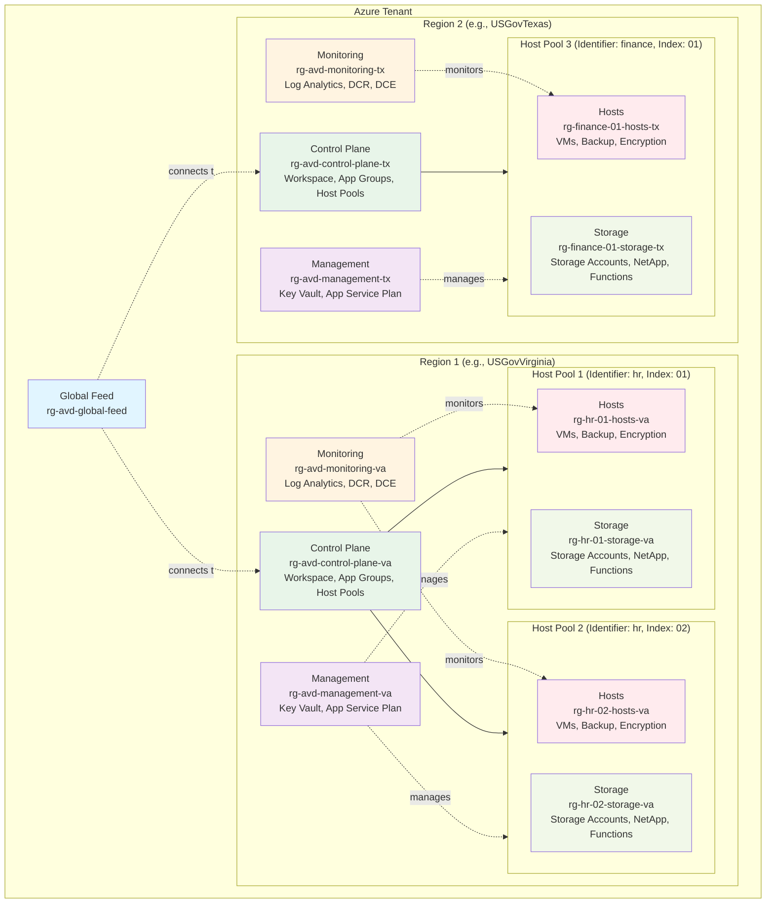

[**Home**](../README.md) | [**Features**](features.md) | [**Get Started**](quickStart.md) | [**Artifacts Guide**](artifacts-guide.md) | [**Limitations**](limitations.md) | [**Troubleshooting**](troubleshooting.md) | [**Parameters**](parameters.md) | [**Zero Trust Framework**](zeroTrustFramework.md)

# Design

This Azure Virtual Desktop (AVD) solution will deploy fully operational AVD hostpool(s) to an Azure subscription.

The deployment utilizes the Cloud Adoption Framework naming conventions and organizes resources and resource groups in accordance with several available parameters:

- Persona Identifier (***identifier***): This parameter is used to uniquely identify the persona of the host pool(s). Each persona, or each group of users with distinct business functions and technical requirements, would require a specific host-pool configuration and thus we use the persona term to identify the host pool. For more information about personas see [User Personas | AVD Cloud Adoption Framework](https://learn.microsoft.com/en-us/azure/cloud-adoption-framework/scenarios/azure-virtual-desktop/migrate-assess#user-personas).

- Host Pool Index (***index***): This *optional* parameter is used when we must shard the unique persona across multiple host pools. For more information, see [Sharding Pattern](https://docs.microsoft.com/en-us/azure/architecture/patterns/sharding).

- Name Convention Reversed (***nameConvResTypeAtEnd***): This bolean parameter, which is by default 'false', will move the resource type abbreviation to the end of the resource names effectively reversing the CAF naming standard.

The diagram below highlights how the resource groups are created based on the parameters.

The diagram illustrates the following resource group distribution. In the table below, the example names are utilizing the following parameter values:

- **identifier**: 'hr'
- **index**: '01', '02'
- locationVirtualMachines (determined by **virtualMachineSubnetResourceId** location): 'USGovVirginia'
- **locationControlPlane**: 'USGovVirginia'
- **nameConvResTypeAtEnd**: false

| Purpose | Resources | Example Name | Notes |
| ------- | :-------: | ------------ | ----- |
| Global Feed | global feed workspace | rg-avd-global-feed | One per Tenant |
| Monitoring | Log Analytics Workspace Data Collection Rules Data Collection Endpoint | rg-avd-monitoring-va | One per region |
| Management | key vault(s) app service plan  | rg-avd-management-va | One per region |
| Control Plane | feed workspace application groups hostpools scaling plans | rg-avd-control-plane-va | One per region |
| Hosts | virtual machines recovery service vault disk encryption set key vault | rg-hr-01-hosts-va rg-hr-02-hosts-va | One per identifier or per index (if specified) |
| Storage | NetApp Storage Accounts Storage Account(s) function app key vault(s) | rg-hr-01-storage-va rg-hr-02-storage-va | One per identifier or per index (if specified) |

The code is idempotent, allowing you to scale storage and sessions hosts, but the core management resources will persist and update for any subsequent deployments. Some of those resources are the host pool, application group, and log analytics workspace.

Both a personal or pooled host pool can be deployed with this solution. Either option will deploy a desktop application group with a role assignment. You can also deploy the required resources and configurations to fully enable FSLogix. This solution also automates many of the [features](features.md) that are usually enabled manually after deploying an AVD host pool.