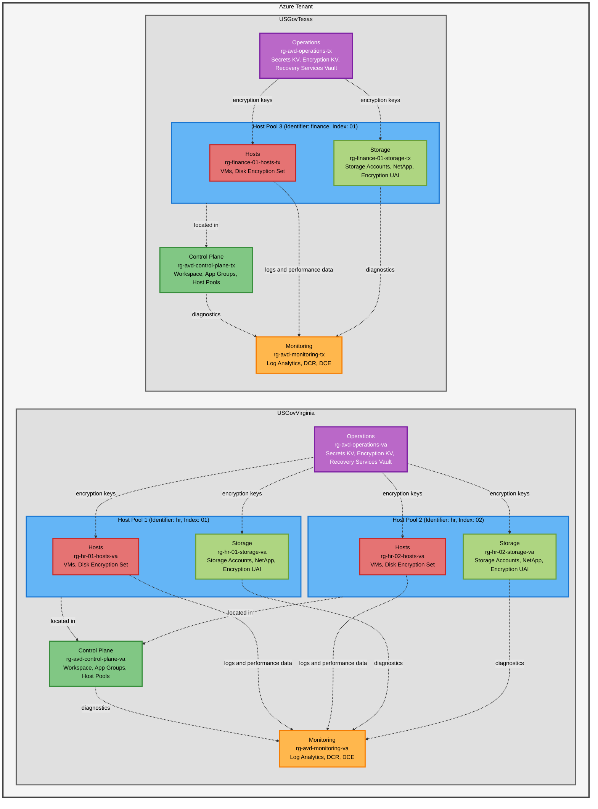

[**Home**](../README.md) | [**Quick Start**](quickStart.md) | [**Host Pool Deployment**](hostpoolDeployment.md) | [**Image Build**](imageBuild.md) | [**Artifacts**](artifactsGuide.md) | [**Features**](features.md) | [**Parameters**](parameters.md) | [**BCDR**](bcdr.md)

# Design

This Azure Virtual Desktop (AVD) solution will deploy fully operational AVD hostpool(s) to an Azure subscription.

The deployment utilizes the Cloud Adoption Framework naming conventions and organizes resources and resource groups in accordance with several available parameters:

- Persona Identifier (***identifier***): This parameter is used to uniquely identify the persona of the host pool(s). Each persona, or each group of users with distinct business functions and technical requirements, would require a specific host-pool configuration and thus we use the persona term to identify the host pool. For more information about personas see [User Personas | AVD Cloud Adoption Framework](https://learn.microsoft.com/en-us/azure/cloud-adoption-framework/scenarios/azure-virtual-desktop/migrate-assess#user-personas).

- Host Pool Index (***index***): This *optional* parameter is used when we must shard the unique persona across multiple host pools. For more information, see [Sharding Pattern](https://docs.microsoft.com/en-us/azure/architecture/patterns/sharding).

- Name Convention Reversed (***nameConvResTypeAtEnd***): This boolean parameter, which is by default 'false', will move the resource type abbreviation to the end of the resource names effectively reversing the CAF naming standard.

The diagram below highlights how the resource groups are created based on the parameters.


```mermaid
graph TB
    subgraph Tenant["Azure Tenant"]
        
        subgraph Region1["USGovVirginia<br/>"]
            direction TB
            MON1[Monitoring<br/>rg-avd-monitoring-va<br/>Log Analytics, DCR, DCE]
            OPS1[Operations<br/>rg-avd-operations-va<br/>Secrets KV, Encryption KV, Recovery Services Vault]
            CP1[Control Plane<br/>rg-avd-control-plane-va<br/>Workspace, App Groups, Host Pools]
            
            subgraph HP1["Host Pool 1 (Identifier: hr, Index: 01)"]
                direction LR
                HOSTS1[Hosts<br/>rg-hr-01-hosts-va<br/>VMs, Disk Encryption Set]
                STORAGE1[Storage<br/>rg-hr-01-storage-va<br/>Storage Accounts, NetApp, Encryption UAI]
            end
            
            subgraph HP2["Host Pool 2 (Identifier: hr, Index: 02)"]
                direction LR
                HOSTS2[Hosts<br/>rg-hr-02-hosts-va<br/>VMs, Disk Encryption Set]
                STORAGE2[Storage<br/>rg-hr-02-storage-va<br/>Storage Accounts, NetApp, Encryption UAI]
            end
            
            HP1 -.located in.-> CP1
            HP2 -.located in.-> CP1
            CP1 -.diagnostics.-> MON1
            HOSTS1 -.logs and performance data.-> MON1
            HOSTS2 -.logs and performance data.-> MON1
            OPS1 -.encryption keys.-> HOSTS1
            OPS1 -.encryption keys.-> HOSTS2
            OPS1 -.encryption keys.-> STORAGE1
            OPS1 -.encryption keys.-> STORAGE2
            STORAGE1 -.diagnostics.-> MON1
            STORAGE2 -.diagnostics.-> MON1
        end
        
        subgraph Region2["USGovTexas<br/>"]
            direction TB
            MON2[Monitoring<br/>rg-avd-monitoring-tx<br/>Log Analytics, DCR, DCE]
            OPS2[Operations<br/>rg-avd-operations-tx<br/>Secrets KV, Encryption KV, Recovery Services Vault]
            CP2[Control Plane<br/>rg-avd-control-plane-tx<br/>Workspace, App Groups, Host Pools]
            
            subgraph HP3["Host Pool 3 (Identifier: finance, Index: 01)"]
                direction LR
                HOSTS3[Hosts<br/>rg-finance-01-hosts-tx<br/>VMs, Disk Encryption Set]
                STORAGE3[Storage<br/>rg-finance-01-storage-tx<br/>Storage Accounts, NetApp, Encryption UAI]
            end
            
            HP3 -.located in.-> CP2
            CP2 -.diagnostics.-> MON2
            HOSTS3 -.logs and performance data.-> MON2
            OPS2 -.encryption keys.-> HOSTS3
            OPS2 -.encryption keys.-> STORAGE3
            STORAGE3 -.diagnostics.-> MON2
        end
    end
    
    %% Define styles for different resource group types
    classDef globalFeed fill:#4fc3f7,stroke:#0288d1,stroke-width:3px,color:#000
    classDef monitoring fill:#ffb74d,stroke:#f57c00,stroke-width:3px,color:#000
    classDef operations fill:#ba68c8,stroke:#7b1fa2,stroke-width:3px,color:#fff
    classDef controlPlane fill:#81c784,stroke:#388e3c,stroke-width:3px,color:#000
    classDef hosts fill:#e57373,stroke:#c62828,stroke-width:3px,color:#000
    classDef storage fill:#aed581,stroke:#689f38,stroke-width:3px,color:#000
    classDef hostPool fill:#64b5f6,stroke:#1976d2,stroke-width:3px,color:#000
    classDef region fill:#e0e0e0,stroke:#616161,stroke-width:3px,color:#000
    classDef tenant fill:#f5f5f5,stroke:#424242,stroke-width:4px,color:#000
    
    %% Apply styles to nodes
    class GF globalFeed
    class MON1,MON2 monitoring
    class OPS1,OPS2 operations
    class CP1,CP2 controlPlane
    class HOSTS1,HOSTS2,HOSTS3 hosts
    class STORAGE1,STORAGE2,STORAGE3 storage
    class HP1,HP2,HP3 hostPool
    class Region1,Region2 region
    class Tenant tenant
    
    %% Style connectors - make them darker and more visible
    linkStyle default stroke:#333,stroke-width:2px,color:#000
```

The diagram illustrates the following resource group distribution. In the table below, the example names are utilizing the following parameter values:

- **identifier**: 'hr'
- **index**: '01', '02'
- locationVirtualMachines (determined by **virtualMachineSubnetResourceId** location): 'USGovVirginia'
- **locationControlPlane**: 'USGovVirginia'
- **nameConvResTypeAtEnd**: false

| Purpose | Resources | Example Name | Notes |
| ------- | :-------: | ------------ | ----- |
| Global Feed | global feed workspace | rg-avd-global-feed | One per Tenant |
| Monitoring | Log Analytics Workspace<br>Data Collection Rules<br>Data Collection Endpoint | rg-avd-monitoring-va | One per region |
| Operations | Secrets Key Vault<br>Encryption Key Vault<br>Recovery Services Vault (optional) | rg-avd-operations-va | One per region. Created by the standalone KeyVault deployment or inline by the host pool `Complete` deployment type. Shared across all host pools in the same region. The Recovery Services Vault is deployed here when backup is enabled; backup policies are created conditionally — file share backup policy for pooled host pools, VM backup policy for personal host pools. |
| Control Plane | feed workspace<br>application groups<br>hostpools<br>scaling plans | rg-avd-control-plane-va | One per region |
| Hosts | virtual machines<br>disk encryption set | rg-hr-01-hosts-va<br>rg-hr-02-hosts-va | One per identifier or per index (if specified). Disk Encryption Set is created here when CMK is used. |
| Storage | NetApp Storage Accounts<br>Storage Account(s)<br>function app<br>storage encryption UAI | rg-hr-01-storage-va<br>rg-hr-02-storage-va | One per identifier or per index (if specified). Storage encryption User-Assigned Identity is created here when CMK is used for FSLogix storage. |

Because the Monitoring and Operations resource groups are shared across all host pools in a region, costs for Log Analytics, Recovery Services Vaults, and Key Vaults cannot be attributed per host pool through Azure Cost Management alone. See [Chargeback for Shared Resources](chargebackSharedResources.md) for query-based approaches that use the `cm-resource-parent` tags stamped on keys, protected items, and VMs.

The code is idempotent, allowing you to scale storage and sessions hosts, but the core management resources will persist and update for any subsequent deployments. Some of those resources are the host pool, application group, and log analytics workspace.

Both a personal or pooled host pool can be deployed with this solution. Either option will deploy a desktop application group with a role assignment. You can also deploy the required resources and configurations to fully enable FSLogix. This solution also automates many of the [features](features.md) that are usually enabled manually after deploying an AVD host pool.

## Naming Convention Internals

> **Audience:** contributors extending or debugging the naming logic. Operators deploying the template only need the parameter descriptions and the table above.

All resource names are assembled at Bicep compile time from four base template strings. Each string contains one or more uppercase placeholders that are resolved through `replace()` calls before a name is ever emitted:

| Placeholder | Resolved to |
| ----------- | ----------- |
| `RESOURCETYPE` | Resource type abbreviation from `resourceAbbreviations.json` (e.g. `rg`, `vm`, `kv`) |
| `LOCATION` | Region abbreviation from `locations.json` (e.g. `va`, `tx`, `eus`) |
| `TOKEN` | Per-resource differentiator — `hosts`, `storage`, `operations`, `sec-<uid>`, etc. |

### Four base naming templates

```
nameConv_Shared_ResGroup   – shared resource groups  (monitoring, operations, control-plane)
nameConv_Shared_Resources  – shared resources        (log analytics, key vaults, DCE/DCR)
nameConv_HP_ResGroups      – host-pool resource groups (hosts, storage, deployment)
nameConv_HP_Resources      – host-pool resources      (VMs, disk encryption sets, UAIs, …)
```

Their shape depends on `nameConvResTypeAtEnd`:

| `nameConvResTypeAtEnd` | `nameConv_Shared_*` pattern | `nameConv_HP_Resources` pattern |
| ---------------------- | --------------------------- | ------------------------------- |
| `false` (default — CAF) | `RESOURCETYPE-avd-TOKEN-LOCATION` | `RESOURCETYPE-avd-<hpBaseName>-TOKEN-LOCATION` |
| `true` (reversed) | `avd-TOKEN-LOCATION-RESOURCETYPE` | `avd-<hpBaseName>-TOKEN-LOCATION-RESOURCETYPE` |

### Concrete examples (`identifier: hr`, `index: 01`, `location: va`)

| Resource | Default (`false`) | Reversed (`true`) |
| -------- | ----------------- | ----------------- |
| Operations RG | `rg-avd-operations-va` | `avd-operations-va-rg` |
| Secrets Key Vault | `kv-avd-sec-<uid>-va` *(truncated to 24 chars)* | `avd-sec-<uid>-va-kv` |
| Hosts RG | `rg-avd-hr-01-hosts-va` | `avd-hr-01-hosts-va-rg` |
| Host Pool | `hp-avd-hr-01-va` | `avd-hr-01-va-hp` |
| VM name convention | `vm-hr###-va` | `hr###-va-vm` |

### When `existingHostPoolResourceId` is provided

The convention is **auto-detected** from the existing host pool name: if it starts with the `hp` abbreviation the convention is forward; if it ends with `hp` it is reversed. This drives `nameConvReversed` so that every other resource in the deployment matches the existing host pool's style, regardless of the `nameConvResTypeAtEnd` parameter.

### Implementation location

The full implementation lives in the **Naming Convention** section of [`deployments/hostpools/hostpool.bicep`](../deployments/hostpools/hostpool.bicep), directly above the resource group module declarations.