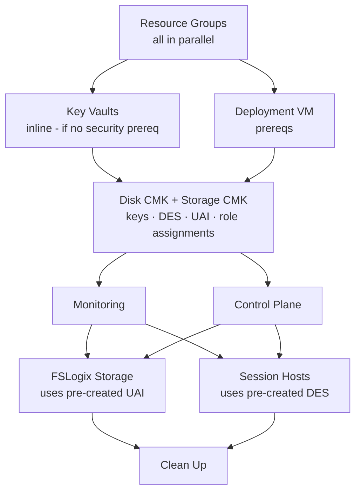

[**Home**](../README.md) | [**Quick Start**](quick-start.md) | [**Host Pool Deployment**](hostpool-deployment.md) | [**Image Build**](image-build.md) | [**Artifacts**](artifacts-guide.md) | [**Features**](features.md) | [**Parameters**](parameters.md) | [**Compliance**](compliance.md) | [**BCDR**](bcdr.md)

> **🔧 Technical Reference:** [Host Pool Template Documentation](../deployments/hostpools/README.md) - Complete parameter catalog and advanced scenarios

**Management approach:** This guide covers the **standard management** deployment, where you own
the session-host VM lifecycle. Before creating a host pool, compare it with the Commercial-only
[automated host pool](../deployments/automatedHostPools/README.md), where Azure Virtual Desktop
owns VM creation, updates, scaling, and deletion. The management approach can't be changed after
creation. See [Choose a Host Pool Management Approach](host-pool-management.md).

# 🏢 Host Pool Deployment Guide

## Overview

This guide covers deploying complete standard-management Azure Virtual Desktop (AVD) host pool
environments including session hosts, storage, networking, monitoring, and security resources. The
solution supports both pooled and personal host pools with enterprise-grade features and Zero Trust
security controls. FederalAVD or your own tooling creates and registers the VMs; for pooled custom
image fleets, the optional Session Host Replacer can automate recurring drain-and-replace updates.

### What Gets Deployed

A complete host pool deployment includes:

| Component | Resources Created |
| --- | --- |
| **🖥️ AVD Control Plane** | Host pool, workspace, application groups, session hosts |
| **💾 Storage** | FSLogix profile storage (Azure Files or NetApp Files) |
| **🔐 Security** | Secrets Key Vault (optional inline), Encryption Key Vault (optional inline), disk encryption sets, storage encryption UAI, RBAC assignments |
| **📊 Monitoring** | Log Analytics workspace, diagnostic settings, Application Insights |
| **🌐 Networking** | Private endpoints, network security (Zero Trust option) |
| **💿 Backup** | Recovery Services Vault (optional) — VM backup for **personal** host pools; FSLogix Azure Files file share backup for **pooled** host pools |

---

---

## Prerequisites

### Required Prerequisites

Before deploying a host pool, ensure you have completed these prerequisites from the [Quick Start Guide](quick-start.md#prerequisites):

✅ **Azure Subscription** - Owner or Contributor + User Access Administrator role  
✅ **Virtual Network** - Subnet for session hosts with appropriate connectivity  
✅ **Network Connectivity** - Firewall/NSG rules allowing access to [required AVD endpoints](https://learn.microsoft.com/azure/virtual-desktop/required-fqdn-endpoint?tabs=azure) ([air-gapped clouds](air-gapped-clouds.md))  
✅ **Identity Solution** - Microsoft Entra ID or Active Directory Domain Services  
✅ **Security Group** - Group containing AVD users  
✅ **Desktop Virtualization Provider** - Enabled in subscription

### Key Vault Prerequisites (Optional) {#security-prerequisites-optional}

For production deployments or any deployment using Customer Managed Keys (CMK), deploy the Key Vaults first:

**🔒 [Key Vaults Deployment Guide](quick-start.md#step-1-deploy-key-vaults-cmk-with-custom-images)**

The key vault deployment creates `rg-avd-operations-{loc}` with:

- **Secrets Key Vault** (`kv-avd-sec-{unique}-{loc}`) — stores VM admin password, domain join credentials
- **Encryption Key Vault** (`kv-avd-enc-{unique}-{loc}`) — Premium SKU, purge-protected, holds CMK keys

**When to deploy Key Vaults first:**

| Scenario | Recommendation |
| --- | --- |
| Using CMK for disks or FSLogix storage | 🔒 **Deploy Security first** — pass `existingEncryptionKeyVaultResourceId` to host pool |
| Pre-provisioning credentials in a KV | 🔒 **Deploy Security first** — pass `existingCredentialsKeyVaultResourceId` to host pool |
| Multiple host pools sharing one encryption KV | 🔒 **Deploy Security first** — all host pools reference the same KV |
| Simple PoC / dev with platform-managed keys | ✅ **Skip** — deploy host pool directly; Key Vaults will be created inline when CMK is requested |

**Inline fallback:** If `existingEncryptionKeyVaultResourceId` is empty and CMK is requested, the host pool deployment creates both KVs inline in `rg-avd-operations-{loc}`. The inline KV names are derived using the same seed as the standalone security deployment, so the names will match if you later run the security deployment separately.

> **⚠️ Common mistake — Storage 403 when uploading artifacts:** `Owner` and `Contributor` grant control-plane access only and do not cover blob read/write when shared key access is disabled (the default in this solution). Add **Storage Blob Data Contributor** on the artifacts storage account to the identity running `Update-ImageArtifacts.ps1` or `Deploy-ImageManagement.ps1`. See [troubleshooting](troubleshooting.md#storage-blob-data-access-fails-with-403).

> **⚠️ Common mistake — Key Vault Crypto Officer missing for CMK deployments:** `Owner` and `Contributor` do not grant Key Vault key operation rights — Azure enforces a strict control-plane / data-plane separation. Add **Key Vault Crypto Officer** on the encryption Key Vault to the deploying identity. See [troubleshooting](troubleshooting.md#key-vault-crypto-officer-missing).

> **Why data plane roles are required separately from ARM roles**
>
> Azure enforces a strict separation between the ARM control plane (resource management) and service data planes (key operations, blob operations). `Owner` or `Contributor` on a subscription or resource group grants full control over ARM resources but **zero access** to data plane operations. This applies consistently across services:
>
> - **Key Vault keys** — creating or reading keys requires a data plane role (`Key Vault Crypto Officer`, `Key Vault Crypto User`, etc.), regardless of who owns or created the vault.
> - **Storage blobs** — uploading or reading blobs requires a data plane role (`Storage Blob Data Contributor`, `Storage Blob Data Reader`, etc.) when shared key access is disabled. This is why the `Deploy-ImageManagement.ps1` script requires `Storage Blob Data Contributor` on the deploying identity — the storage account disables shared key access by default so SAS tokens and account keys are unavailable.
>
> **Required RBAC depends on CMK type:**
>
> - **Standard CMK** (disk or storage encryption, non-confidential VM): The **deploying identity** needs `Key Vault Crypto Officer` on the encryption Key Vault. ARM creates the encryption keys directly during deployment. This applies whether the KV was pre-deployed or created inline — creating the vault does not grant the deploying identity any key operation rights. This role may be removed after initial deployment if key rotation is managed separately.
>
> - **Confidential VM + HSM** (`confidentialVMOSDiskEncryption = true` and `keyManagementDisks = CustomerManagedHSM`): Encryption keys cannot be created via ARM for this scenario. Instead, a Run Command on the deployment VM creates the key, and the **deployment VM's user-assigned identity** is automatically assigned `Key Vault Crypto Officer` by the deployment. The deploying identity does **not** need Crypto Officer — it only needs `Role Based Access Control Administrator` on the operations resource group so the deployment can grant that role to the deployment VM's identity.

### Optional Prerequisites

#### Image Management (For Custom Software)

If you plan to use custom images or run post-deployment customizations, deploy Image Management resources first:

**📦 [Image Management Prerequisites](artifacts-guide.md)**

**Required for:**

- Custom image builds with pre-installed software
- Session host post-deployment customizations
- Air-gapped cloud deployments

**Not required for:**

- Using marketplace images without customizations
- Basic host pool deployments

#### Custom Images

If building custom images with pre-installed software:

**🎨 [Image Build Guide](image-build.md)**

---

## Deployment Methods

Use the Template Spec portal form for every first deployment. The form guides resource selection
and validation, then provides the working parameter file used for subsequent PowerShell, Azure CLI,
or CI/CD deployments.

### Method 1: Template Spec Portal Form (First Deployment)

**Best for:** GUI-based deployments with built-in validation

#### Steps

1. **Create Template Spec** (one-time setup):

   ```powershell
   .\tools\New-TemplateSpecs.ps1 `
     -Location 'eastus2' `
     -createSharedServices $false `
     -createNetwork $false `
     -createImageManagement $false `
     -createCustomImage $false `
     -createHostPool $true `
     -createAutomatedHostPool $false `
     -CreateAddOns $false
   ```

2. In the Azure portal, open **Template Specs**.
3. Select **AVD Host Pool** and choose **Deploy**.
4. Complete the guided deployment form.
5. On **Review + create**, select **Create**.
6. After the deployment is submitted, select **Download template and parameters** and save the
  working file under `customer\parameters\hostpools\`.

**Benefits:**

- Interactive UI form with parameter descriptions
- Built-in parameter validation
- Visual deployment progress
- Produces a validated parameter file for repeatable deployments

### Method 2: PowerShell/Azure CLI (Subsequent Deployments)

**Best for:** Automation and CI/CD using a parameter file exported from the Template Spec UI

#### PowerShell Example

```powershell
# Connect to Azure
Connect-AzAccount -Environment AzureUSGovernment
Set-AzContext -Subscription "your-subscription-id"

# Deploy host pool using parameter file name as deployment name
$paramFile = "demo.hostpool.parameters.json"
$deploymentName = [System.IO.Path]::GetFileNameWithoutExtension($paramFile)

New-AzSubscriptionDeployment `
    -Location "usgovvirginia" `
    -TemplateFile ".\hostpools\hostpool.json" `
  -TemplateParameterFile ".\customer\parameters\hostpools\$paramFile" `
    -Name $deploymentName
```

#### Azure CLI Example

```bash
# Login to Azure
az cloud set --name AzureUSGovernment
az login
az account set --subscription "your-subscription-id"

# Deploy host pool using parameter file name as deployment name
PARAM_FILE="demo.hostpool.parameters.json"
DEPLOYMENT_NAME="${PARAM_FILE%.json}"

az deployment sub create \
    --location usgovvirginia \
    --template-file ./hostpools/hostpool.json \
  --parameters @./customer/parameters/hostpools/$PARAM_FILE \
    --name $DEPLOYMENT_NAME
```

### Method 3: GitHub Deploy Button (Alternative)

**Best for:** Portal testing when publishing a Template Spec is not practical

[](https://portal.azure.com/#blade/Microsoft_Azure_CreateUIDef/CustomDeploymentBlade/uri/https%3A%2F%2Fraw.githubusercontent.com%2FAzure%2FFederalAVD%2Fmain%2Fdeployments%2Fhostpools%2Fhostpool.json/uiFormDefinitionUri/https%3A%2F%2Fraw.githubusercontent.com%2FAzure%2FFederalAVD%2Fmain%2Fdeployments%2Fhostpools%2FuiFormDefinition.json)
[](https://portal.azure.us/#blade/Microsoft_Azure_CreateUIDef/CustomDeploymentBlade/uri/https%3A%2F%2Fraw.githubusercontent.com%2FAzure%2FFederalAVD%2Fmain%2Fdeployments%2Fhostpools%2Fhostpool.json/uiFormDefinitionUri/https%3A%2F%2Fraw.githubusercontent.com%2FAzure%2FFederalAVD%2Fmain%2Fdeployments%2Fhostpools%2FuiFormDefinition.json)

**⚠️ Note:** Not available for Air-Gapped clouds

---

## Parameter Configuration

### Parameter Files

Export the working parameter file from the Template Spec UI and store it under
`customer/parameters/hostpools/`:

```text
customer/parameters/hostpools/
├── demo.hostpool.parameters.json
├── prod.hostpool.parameters.json
└── test.hostpool.parameters.json
```

> **Fallback:** If the Template Spec UI is unavailable, copy a sample from
> `deployments/hostpools/parameters/` to `customer/parameters/hostpools/` before editing it. Never
> edit shared samples directly because repository updates overwrite them. See
> [troubleshooting](troubleshooting.md#editing-customerexamples-or-missing-customer-changes).

### Key Parameters

#### Deployment Scope

The host pool deployment always creates all resources — resource groups, AVD control plane, session hosts, monitoring, Key Vaults — based on the options you select. Use individual **Use Existing** toggles (portal) or pre-populated resource ID parameters (automation) to reuse shared infrastructure instead of creating new resources:

In a standard-host-pool-only environment, the first deployment can create Key Vaults, monitoring,
and the FSLogix Azure Files backup vault and policy. Later host-pool portal forms can discover and
select those resources. Automation can pass the first deployment's shared-resource outputs to the
parameters below.
Use AVD Shared Services instead when the resources must exist before the first host pool, such as
for automated host-pool credentials, Image Management CMK, or a standalone FSLogix Storage add-on
that enables CMK, diagnostics, or Azure Files backup.

| Shared resource | "Use Existing" control | Parameter to supply |
| --- | --- | --- |
| AVD Workspace | **Workspace Creation Option → Update an existing Workspace** | `existingFeedWorkspaceResourceId` |
| Monitoring (Log Analytics, DCR, DCE) | **Use Existing Monitoring Resources** checkbox | `existingLogAnalyticsWorkspaceResourceId` + DCR + DCE IDs |
| Credentials Key Vault | **Credentials source → Key Vault** (Identity step) | `existingCredentialsKeyVaultResourceId` |
| Encryption Key Vault | **Use Existing Encryption Key Vault** checkbox (Zero Trust → Encryption Key Management) | `existingEncryptionKeyVaultResourceId` |
| Recovery Services Vault | **Use Existing Recovery Services Vault** checkbox | `existingVmBackupVaultResourceId` |

The deployment returns the effective resource IDs whether it created the resource or reused an
existing one. Use `credentialsKeyVaultResourceId`, `encryptionKeyVaultResourceId`,
`logAnalyticsWorkspaceResourceId`, `avdInsightsDataCollectionRuleResourceId`,
`dataCollectionEndpointResourceId`, `fslogixBackupVaultResourceId`, and
`fslogixBackupPolicyName` to configure later standard host pools. It also returns
`fslogixBackupPolicyResourceId` for consumers that accept the complete policy resource ID.

To deploy all host pool infrastructure without creating session host VMs, set `sessionHostCount: 0`. This lets you validate storage, networking, and control plane configuration before committing to VM costs. Add hosts later using the **Session Hosts** add-on.

#### Basic Configuration

| Parameter | Description | Example |
| --- | --- | --- |
| **identifier** | Host pool persona identifier (max 9 chars) | `general`, `finance`, `dev` |
| **index** | Host pool index for sharding (0-99) | `0`, `1`, `-1` (no index) |
| **hostPoolType** | Pooled or Personal | `Pooled` |
| **sessionHostCount** | Number of session hosts to deploy | `3` |
| **sessionHostIndex** | Starting index for VM names | `1` |

#### Identity Configuration

| Parameter | Description | Options |
| --- | --- | --- |
| **identitySolution** | Identity and authentication method | `ActiveDirectoryDomainServices`<br>`EntraDomainServices`<br>`EntraKerberos-Hybrid`<br>`EntraKerberos-CloudOnly`<br>`EntraId` |
| **domainName** | AD domain name (if applicable) | `contoso.com` |
| **domainJoinUserName** | Domain join account UPN | `djoin@contoso.com` |
| **deploySecretsKeyVault** | Deploy an inline Secrets Key Vault to store VM admin and domain-join credentials (configured in the **Identity → Credentials** portal step) | `true` / `false` |
| **secretsKeyVaultEnableSoftDelete** | Enable soft delete on the inline Secrets Key Vault | `true` (default) |
| **secretsKeyVaultEnablePurgeProtection** | Enable purge protection on the inline Secrets Key Vault | `true` (default) |
| **secretsKeyVaultRetentionInDays** | Soft-delete retention period for the Secrets Key Vault (7–90 days). Use `7` in test environments to minimise the wait before a deleted vault name can be reused. | `90` (default) |

**[Identity Solutions Details](features.md#identity-solutions)**

#### Image Configuration

**Using Marketplace Image:**

```json
{
  "imageReference": {
    "publisher": "MicrosoftWindowsDesktop",
    "offer": "office-365",
    "sku": "win11-23h2-avd-m365",
    "version": "latest"
  }
}
```

**Using Custom Image:**

```json
{
  "imageReference": {
    "id": "/subscriptions/xxx/resourceGroups/rg-image-management-usgovvirginia/providers/Microsoft.Compute/galleries/gal_imagemgt_usgovvirginia/images/avd-win11-23h2/versions/latest"
  }
}
```

#### Session Host Customizations

Run post-deployment scripts on session hosts using the `sessionHostCustomizations` array:

```json
{
  "sessionHostCustomizations": [
    {
      "name": "ConfigureTimeZone",
      "blobName": "TimeZoneConfiguration.zip",
      "arguments": "-TimeZone 'Eastern Standard Time'"
    },
    {
      "name": "InstallCustomApp",
      "blobName": "CustomAppInstall.zip",
      "arguments": ""
    }
  ]
}
```

**⚠️ Requires Image Management resources** - See [Artifacts Guide](artifacts-guide.md)

#### Storage Configuration

**Azure Files (Recommended for most scenarios):**

```json
{
  "fslogixStorage": "AzureFiles",
  "storageService": "AzureFiles Premium",
  "storageRedundancy": "ZoneRedundant"
}
```

**Azure NetApp Files (For high-performance requirements):**

```json
{
  "fslogixStorage": "AzureNetAppFiles",
  "storageService": "Premium",
  "activeDirectorySolution": "ActiveDirectoryDomainServices"
}
```

#### Monitoring Configuration

```json
{
  "deploymentInsights": true,
  "enableMonitoringAgent": true,
  "logAnalyticsWorkspaceResourceId": "/subscriptions/xxx/resourceGroups/rg-monitoring/providers/Microsoft.OperationalInsights/workspaces/law-monitoring"
}
```

#### Zero Trust / Security Configuration

> **Portal form:** Zero Trust settings are split across two steps — **Zero Trust → Encryption Key Management** (CMK selectors, existing KV toggle, key rotation, enc KV retention) and **Zero Trust → PaaS Private Endpoints** (private endpoint deploy checkbox, subnet selectors, DNS zones). Secrets Key Vault deploy controls are in the **Identity → Credentials** step.

```json
{
  "deployPrivateEndpoints": true,
  "operationsPrivateEndpointSubnetResourceId": "/subscriptions/xxx/resourceGroups/rg-network/providers/Microsoft.Network/virtualNetworks/vnet-avd/subnets/snet-privateendpoints",
  "keyManagementDisks": "CustomerManaged",
  "encryptionAtHost": true,
  "secureBootEnabled": true,
  "vTpmEnabled": true,
  "secretsKeyVaultRetentionInDays": 90,
  "encryptionKeyVaultRetentionInDays": 90
}
```

---

## Deployment Process

### Deployment Sequence

When deploying a `Complete` host pool, resources are created in this order to maximize parallelism and ensure RBAC assignments propagate before dependent resources need them:



> **CMK timing:** Disk Encryption Sets and the storage encryption User-Assigned Identity are created in the same phase as Monitoring and Control Plane (~5–15 minutes before VMs and storage accounts deploy). This gives Azure RBAC propagation time to complete before the resources that depend on those role assignments are created, without requiring any polling or deployment VM dependency.

### PowerShell Deployment After Parameter Export

#### 1. Select the Exported Parameter File

Use the working file downloaded from the Template Spec form. If the form is unavailable, copy and
customize a reference file instead:

```powershell
# Copy example parameter file
Copy-Item `
  -Path ".\deployments\hostpools\parameters\demo.hostpool.parameters.json" `
  -Destination ".\customer\parameters\hostpools\mycompany.hostpool.parameters.json"

# Edit with your values
code ".\customer\parameters\hostpools\mycompany.hostpool.parameters.json"
```

#### 2. Update Secrets in Key Vault

Store required secrets in Azure Key Vault (referenced by parameter file):

**Required secrets:**

- `VirtualMachineAdminPassword` - Local admin password for VMs
- `VirtualMachineAdminUserName` - Local admin username for VMs

**Additional secrets (depending on identity solution):**

- `DomainJoinUserPassword` - Domain join account password (AD/Entra DS)
- `DomainJoinUserPrincipalName` - Domain join account UPN (AD/Entra DS)

```powershell
# Example: Set secrets in Key Vault
$keyVaultName = "kv-avd-secrets-usgovvirginia"

Set-AzKeyVaultSecret -VaultName $keyVaultName `
    -Name "VirtualMachineAdminPassword" `
    -SecretValue (ConvertTo-SecureString "P@ssw0rd123!" -AsPlainText -Force)

Set-AzKeyVaultSecret -VaultName $keyVaultName `
    -Name "VirtualMachineAdminUserName" `
    -SecretValue (ConvertTo-SecureString "avdadmin" -AsPlainText -Force)
```

#### 3. Deploy Host Pool

Using PowerShell:

```powershell
$paramFile = "mycompany.hostpool.parameters.json"
$deploymentName = [System.IO.Path]::GetFileNameWithoutExtension($paramFile)

New-AzSubscriptionDeployment `
    -Location "East US 2" `
    -TemplateFile ".\hostpools\hostpool.json" `
  -TemplateParameterFile ".\customer\parameters\hostpools\$paramFile" `
    -Name $deploymentName
```

#### 4. Monitor Deployment

**PowerShell:**

```powershell
# Get deployment status
Get-AzSubscriptionDeployment -Name "avd-mycompany-deploy-202602091530"

# Watch deployment progress
Get-AzSubscriptionDeployment -Name "avd-mycompany-deploy-202602091530" | Select-Object -ExpandProperty Properties
```

**Azure Portal:**

1. Navigate to **Subscriptions** > **Deployments**
2. Find your deployment
3. Monitor resource creation progress
4. Check for any errors or warnings

#### 5. Assign Users

After deployment completes, assign users to the desktop application group:

**PowerShell:**

```powershell
$resourceGroup = "rg-avd-general-prod-usgovvirginia"
$appGroupName = "dag-avd-general-prod-usgovvirginia"
$userGroupObjectId = "xxxxxxxx-xxxx-xxxx-xxxx-xxxxxxxxxxxx"

New-AzRoleAssignment `
    -ObjectId $userGroupObjectId `
    -RoleDefinitionName "Desktop Virtualization User" `
    -ResourceName $appGroupName `
    -ResourceGroupName $resourceGroup `
    -ResourceType "Microsoft.DesktopVirtualization/applicationGroups"
```

---

## Post-Deployment Tasks

### Configure User Profile Management

FSLogix is automatically configured during deployment. Verify configuration:

1. Check FSLogix registry settings on session hosts
2. Test user profile creation and roaming
3. Verify storage account permissions

### Configure Session Timeouts

Adjust session timeout settings based on your requirements:

**PowerShell:**

```powershell
Update-AzWvdHostPool -ResourceGroupName $resourceGroup -Name $hostPoolName `
    -MaxSessionLimit 10 `
    -LoadBalancerType 'BreadthFirst'
```

### Enable Monitoring

Verify monitoring is working:

1. Check Log Analytics workspace for session host data
2. Review diagnostic logs in storage account
3. Configure alerts for critical metrics

### Configure Backup (Optional)

Backup behavior depends on host pool type and the `recoveryServices` parameter:

| Host Pool Type | `recoveryServices` | `useExistingRSV` | Additional requirements | Vault | Backed Up |
| --- | --- | --- | --- | --- | --- |
| **Personal** | `true` | `false` | — | Created inline | VM OS disks |
| **Personal** | `true` | `true` | `existingVmBackupVaultResourceId` required | Existing | VM OS disks |
| **Personal** | `false` | — | — | Not created | Nothing |
| **Pooled** | `true` | `false` | `deployFSLogixStorage=true` + Azure Files | Created inline | FSLogix file shares |
| **Pooled** | `true` | `true` | `deployFSLogixStorage=true` + Azure Files + `existingFilesBackupVaultResourceId` | Existing | FSLogix file shares |
| **Pooled** | `false` | — | — | Not created | Nothing |

> **Pooled VMs are never backed up.** Users are stateless in pooled pools; profile data lives in FSLogix storage which is what gets backed up instead.
>
> **FSLogix backup only applies to Azure Files.** NetApp Files has its own snapshot/replication capabilities and is not enrolled in Recovery Services.
>
> **Personal pools have no FSLogix storage.** The `deployFSLogixStorage` parameter is ignored for personal host pools.
>
> **Soft delete fallback for Azure Files.** When no Recovery Services Vault is configured, soft delete is automatically enabled on the FSLogix storage account file service, providing a baseline safety net against accidental deletion. When a vault is configured, soft delete is disabled because Azure Backup manages its own snapshot-based retention — the two mechanisms conflict.

If backup was enabled, verify backup policies and protected items:

```powershell
# Verify backup policies
Get-AzRecoveryServicesBackupProtectionPolicy -VaultId $vaultId

# Verify protected VMs (personal pools)
Get-AzRecoveryServicesBackupItem -WorkloadType AzureVM -VaultId $vaultId

# Verify protected file shares (pooled pools)
Get-AzRecoveryServicesBackupItem -WorkloadType AzureStorage -VaultId $vaultId
```

---

## Scaling and Management

### Scaling Plans

Set `deployScalingPlan` to `true` to create an Azure Virtual Desktop scaling plan for either a
Pooled or Personal host pool. Portal deployments show controls appropriate to the selected host
pool type. Pooled and Personal host pools support up to seven named schedules, and each schedule can
select multiple days of the week. Each grid row is one complete schedule: phase times, balancing
algorithms, capacity settings, and ramp-down behavior belong to that schedule rather than to the
scaling plan as a whole. Schedule names are case-insensitively unique, and a weekday can belong to
only one schedule. Days not explicitly assigned continue using the preceding schedule's off-peak
behavior until another schedule enters ramp-up.

For Pooled schedules, `rampDownForceLogoffUsers`, `rampDownWaitTimeMinutes`, the notification
message, and `rampDownStopHostsWhen` apply only during that schedule's ramp-down phase. Personal
schedules instead define disconnect and logoff actions independently for each phase. The Pooled
wait and notification fields are required only when force logoff is enabled. Editable Grid does not
populate column defaults, so the portal shows placeholders instead. If a direct deployment omits
these fields while enabling force logoff, the template uses a 30-minute wait and "Save your work and
sign out. This session host is being removed by autoscale." When force logoff is disabled, the
template submits a zero-minute wait and no notification message.

For PowerShell or Azure CLI deployments, provide `scalingPlanPooledSchedules` or
`scalingPlanPersonalSchedules` when scaling is enabled. Each schedule object must contain every
field for its host-pool type except the conditionally applicable Pooled wait and notification
fields. The template does not create a default schedule.

```json
{
  "deployScalingPlan": {
    "value": true
  },
  "scalingPlanExclusionTag": {
    "value": "ScalingPlanExclusion"
  },
  "scalingPlanPersonalSchedules": {
    "value": [
      {
        "name": "Weekdays",
        "daysOfWeek": ["Monday", "Tuesday", "Wednesday", "Thursday", "Friday"],
        "rampUpStartTime": "08:00",
        "rampUpAutoStartHosts": "WithAssignedUser",
        "rampUpStartVMOnConnect": "Enable",
        "rampUpMinutesToWaitOnDisconnect": "0",
        "rampUpActionOnDisconnect": "None",
        "rampUpMinutesToWaitOnLogoff": "0",
        "rampUpActionOnLogoff": "None",
        "peakStartTime": "09:00",
        "peakStartVMOnConnect": "Enable",
        "peakMinutesToWaitOnDisconnect": "0",
        "peakActionOnDisconnect": "None",
        "peakMinutesToWaitOnLogoff": "0",
        "peakActionOnLogoff": "None",
        "rampDownStartTime": "17:00",
        "rampDownStartVMOnConnect": "Disable",
        "rampDownMinutesToWaitOnDisconnect": "30",
        "rampDownActionOnDisconnect": "Deallocate",
        "rampDownMinutesToWaitOnLogoff": "30",
        "rampDownActionOnLogoff": "Deallocate",
        "offPeakStartTime": "20:00",
        "offPeakStartVMOnConnect": "Disable",
        "offPeakMinutesToWaitOnDisconnect": "30",
        "offPeakActionOnDisconnect": "Deallocate",
        "offPeakMinutesToWaitOnLogoff": "30",
        "offPeakActionOnLogoff": "Deallocate"
      }
    ]
  }
}
```

Use strict 24-hour `HH:mm` values for all phase times. Valid start-on-connect values are `Enable`
and `Disable`. Valid disconnect and logoff actions are `None`, `Deallocate`, and `Hibernate`.
`rampUpAutoStartHosts` accepts `None`, `WithAssignedUser`, or `All`. Disconnect and logoff waits
must be between 0 and 360 minutes.

A Personal schedule can use `Hibernate` only when `hibernationEnabled` is `true` and both the image
and VM size support hibernation. Microsoft does not support Personal autoscale hibernation with
FSLogix or App Attach. The template rejects Hibernate schedules when it is configuring FSLogix;
verify that no external App Attach configuration is associated with the host pool.

### Adding Session Hosts

To add more session hosts to an existing pool:

1. **Update parameter file** - Increase `sessionHostCount`
2. **Redeploy using the Session Hosts add-on:**

   ```powershell
   # Update sessionHostCount in parameter file, then redeploy
   $paramFile = "mycompany.hostpool.parameters.json"
   $deploymentName = [System.IO.Path]::GetFileNameWithoutExtension($paramFile)
   
   New-AzSubscriptionDeployment `
       -Location "East US 2" `
       -TemplateFile ".\hostpools\hostpool.json" `
       -TemplateParameterFile ".\customer\parameters\hostpools\$paramFile" `
       -Name $deploymentName
   ```

### Removing Session Hosts

To remove session hosts:

1. Drain sessions from target hosts
2. Delete VMs from Azure Portal or PowerShell
3. Remove from host pool using Azure Portal or PowerShell

### Updating Host Pool Configuration

To modify host pool settings without redeploying session hosts:

1. **Update parameter file** with new settings
2. **Redeploy** - Run the host pool deployment; session hosts are not recreated if VM parameters are unchanged

---

## Troubleshooting

### Common Issues

#### Issue: Session Hosts Not Joining Domain

**Symptoms**: VMs deploy but don't appear in AVD host pool

**Solutions**:

- Verify domain join credentials in Key Vault
- Check DNS settings on virtual network
- Ensure network connectivity to domain controllers
- Review domain join extension logs on VMs

#### Issue: FSLogix Profiles Not Working

**Symptoms**: User profiles not roaming or creating correctly

**Solutions**:

- Verify storage account permissions
- Check FSLogix registry settings on session hosts
- Ensure identity solution supports FSLogix (Kerberos required)
- Review FSLogix event logs

#### Issue: Users Can't Connect

**Symptoms**: Users receive connection errors

**Solutions**:

- Verify user assignment to application group
- Check session host registration status
- Ensure users have "Desktop Virtualization User" role
- Verify network connectivity and firewall rules

#### Issue: Private Endpoint Resolution

**Symptoms**: Session hosts can't resolve private endpoint addresses

**Solutions**:

- Verify private DNS zone configuration
- Check virtual network DNS settings
- Ensure private DNS zone linked to VNet
- Test name resolution from session host

### Getting Logs

**Session Host Logs:**

```powershell
# Get extension logs
Get-AzVMExtension -ResourceGroupName $resourceGroup -VMName $vmName

# Download custom script extension logs
Invoke-AzVMRunCommand -ResourceGroupName $resourceGroup -VMName $vmName `
    -CommandId 'RunPowerShellScript' `
    -ScriptString 'Get-Content C:\Packages\Plugins\Microsoft.Compute.CustomScriptExtension\*\Status\*.status'
```

**AVD Diagnostics:**

```powershell
# Get session host diagnostics
Get-AzWvdSessionHost -ResourceGroupName $resourceGroup -HostPoolName $hostPoolName

# Get user session information
Get-AzWvdUserSession -ResourceGroupName $resourceGroup -HostPoolName $hostPoolName
```

---

## Add-Ons and Automation

### Session Host Replacer

Automate the replacement of session hosts when new images become available:

**🔄 [Session Host Replacer](../deployments/add-ons/sessionHostReplacer/README.md)**

**Features:**

- Zero-downtime rolling updates
- Automatic image version detection
- Delete-First or Side-by-Side replacement modes
- Progressive scale-up for large deployments

### Storage Quota Manager

Automatically monitor and increase Azure Files Premium quotas:

**📊 [Storage Quota Manager](../deployments/add-ons/storageQuotaManager/README.md)**

### Other Add-Ons

- **[Update Storage Keys](../deployments/add-ons/updateStorageAccountKeyOnSessionHosts/README.md)** - Rotate storage keys for Entra ID deployments
- **[Run Commands on VMs](../deployments/add-ons/runCommandsOnVms/README.md)** - Execute scripts across session hosts

---

## Best Practices

### Security

- ✅ Enable private endpoints for all PaaS resources
- ✅ Use managed identities instead of service principals
- ✅ Implement customer-managed encryption keys
- ✅ Disable session host public IPs
- ✅ Apply Azure Policy for compliance

### Performance

- ✅ Use proximity placement groups for latency-sensitive workloads
- ✅ Enable accelerated networking on session hosts
- ✅ Right-size VM SKUs based on workload requirements
- ✅ Use Premium SSD disks for OS disks
- ✅ Configure appropriate session timeouts

### Cost Optimization

- ✅ Implement auto-scaling based on usage patterns
- ✅ Use B-series or Dsv5 VMs for cost savings
- ✅ Enable start VM on connect for personal host pools
- ✅ Configure appropriate session limits
- ✅ Review and optimize storage costs regularly

### Operational Excellence

- ✅ Use custom images with pre-installed software
- ✅ Implement backup and disaster recovery
- ✅ Configure comprehensive monitoring and alerting
- ✅ Document deployment configurations
- ✅ Automate deployments with CI/CD pipelines

---

## Next Steps

- **[Image Build Guide](image-build.md)** - Build custom images for faster deployments
- **[Artifacts Guide](artifacts-guide.md)** - Create custom software packages
- **[Session Host Replacer](../deployments/add-ons/sessionHostReplacer/README.md)** - Automate host updates
- **[Features](features.md)** - Explore advanced features
- **[Troubleshooting](troubleshooting.md)** - Resolve common issues

---

## Related Documentation

- 📖 [Quick Start Guide](quick-start.md)
- 🏗️ [Design](design.md)
- ⚙️ [Parameters Reference](parameters.md)
- ✨ [Features](features.md)
- 🚫 [Limitations](limitations.md)

---

## Appendix: Detailed Setup & Prerequisites

This section contains comprehensive setup instructions for all prerequisite components.

### A. Installing Tools

#### PowerShell Az Module

Install the Azure PowerShell module for deployment automation:

**For all users (requires administrator):**

```powershell
Install-Module -Name Az -AllowClobber -Force
```

**For current user only:**

```powershell
Install-Module -Name Az -AllowClobber -Force -Scope CurrentUser
```

**Verify installation:**

```powershell
Get-Module -Name Az -ListAvailable
```

📖 [Official Installation Guide](https://learn.microsoft.com/powershell/azure/install-azure-powershell)

#### Bicep CLI

Install Bicep for working with infrastructure-as-code templates:

```powershell
## Create the install folder
$installPath = "$env:USERPROFILE\.bicep"
$installDir = New-Item -ItemType Directory -Path $installPath -Force
$installDir.Attributes += 'Hidden'

## Fetch the latest Bicep CLI binary
(New-Object Net.WebClient).DownloadFile("https://github.com/Azure/bicep/releases/latest/download/bicep-win-x64.exe", "$installPath\bicep.exe")

## Add bicep to your PATH
$currentPath = (Get-Item -path "HKCU:\Environment").GetValue('Path', '', 'DoNotExpandEnvironmentNames')
if (-not $currentPath.Contains("%USERPROFILE%\.bicep")) { 
    setx PATH ($currentPath + ";%USERPROFILE%\.bicep") 
}
if (-not $env:path.Contains($installPath)) { 
    $env:path += ";$installPath" 
}

## Verify installation
bicep --help
```

📖 [Official Bicep Installation Guide](https://learn.microsoft.com/azure/azure-resource-manager/bicep/install)

### B. Template Spec Creation

Template Specs store ARM templates in Azure for controlled deployment with custom portal UI forms.

**When to use Template Specs:**
- **Air-gapped clouds (Secret/Top Secret)** - Recommended for UI-guided deployments (Blue Buttons not available)
- **All clouds** - When you want guided form experience with built-in validation
- **Parameter file generation** - Use UI once to create parameter files for future PowerShell deployments

**Benefits:**
- Store templates in Azure for reuse
- Control access with Azure RBAC
- Custom portal UI forms with validation
- Generate parameter files easily
- Deploy without write access to templates

**Create Template Specs:**

```powershell
# Connect to Azure
Connect-AzAccount -Environment AzureCloud  # or AzureUSGovernment

# Set subscription
Set-AzContext -Subscription "<subscription-id>"

# Create template specs
cd C:\repos\FederalAVD\tools
.\New-TemplateSpecs.ps1 -Location "eastus2"
```

This creates template specs for:

- Azure Virtual Desktop Host Pool
- Azure Virtual Desktop Custom Image Build
- Azure Virtual Desktop Networking
- Add-ons (Session Host Replacer, Storage Quota Manager, etc.)

#### 💡 Best Practice: Generate Parameter Files from Template Spec UI

The easiest way to create parameter files for PowerShell/CLI deployments:

1. **Deploy once using Template Spec UI:** Navigate to **Template Specs** in Azure Portal, select
  the desired template spec, click **Deploy**, and fill out all parameters in the form.

2. **Submit and download the parameter file:** Go to **Review + Create**, click **Create**, and wait
  for the deployment to be submitted. Click **Download template and parameters**, then save the
  `parameters.json` file.

3. **Prepare for PowerShell use:** Save the file under `customer/parameters/hostpools/` and keep
  passwords and other secrets out of the saved file.

4. **Use for future deployments:**

   ```powershell
   # Option 1: Use descriptive name based on environment/identifier
   $identifier = "prod"  # or extract from parameter file name
   New-AzDeployment `
       -Location "eastus2" `
       -TemplateFile ".\deployments\hostpools\hostpool.json" `
       -TemplateParameterFile ".\my-saved-parameters.json" `
       -Name "avd-$identifier-hostpool"
   
   # Option 2: Use parameter file name (most consistent)
   $paramFile = "prod.hostpool.parameters.json"
   $deploymentName = [System.IO.Path]::GetFileNameWithoutExtension($paramFile)
   New-AzDeployment `
       -Location "eastus2" `
       -TemplateFile ".\deployments\hostpools\hostpool.json" `
       -TemplateParameterFile ".\customer\parameters\hostpools\$paramFile" `
       -Name $deploymentName
   
   # Option 3: Combine identifier with date (if uniqueness needed)
   New-AzDeployment `
       -Location "eastus2" `
       -TemplateFile ".\deployments\hostpools\hostpool.json" `
       -TemplateParameterFile ".\my-saved-parameters.json" `
       -Name "avd-prod-hostpool-$(Get-Date -Format 'yyyyMMdd')"
   ```

**💡 Deployment Naming Best Practices:**

- **Use descriptive names:** Include environment (prod/dev/test) and component type
- **Be consistent:** Use the same naming pattern across all deployments
- **Avoid timestamps in the name parameter:** Azure tracks deployment history automatically
- **Use parameter file names:** Makes it easy to correlate deployments with configurations
- **Keep it simple:** Deployment names are just labels for tracking in Azure Portal

**Example naming patterns:**

```powershell
# Based on parameter file
"prod-hostpool-001"           # From prod-hostpool-001.parameters.json
"finance-pool-general"        # From finance-pool-general.parameters.json

# Based on environment + component
"avd-prod-usgovvirginia"
"avd-dev-centralus"

# For updates/revisions (manual increment)
"avd-prod-hostpool-v2"
"avd-prod-hostpool-v3"
```

**Note:** You can use PowerShell/CLI deployments in air-gapped clouds without creating Template Specs if you manually create or already have parameter files.

📖 [Template Specs Documentation](https://learn.microsoft.com/azure/azure-resource-manager/templates/template-specs)

### C. DNS Requirements

#### Private DNS Zones for Zero Trust

When using private endpoints, these private DNS zones must be created and linked to your virtual networks:

| Purpose | Azure Commercial | Azure Government |
| --- | --- | --- |
| **AVD Global Feed** | `privatelink-global.wvd.microsoft.com` | `privatelink-global.wvd.usgovcloudapi.net` |
| **AVD Workspace Feed** | `privatelink.wvd.microsoft.com` | `privatelink.wvd.usgovcloudapi.net` |
| **Azure Backup** | `privatelink.<geo>.backup.windowsazure.com` | `privatelink.<geo>.backup.windowsazure.us` |
| **Azure Blob Storage** | `privatelink.blob.core.windows.net` | `privatelink.blob.core.usgovcloudapi.net` |
| **Azure Files** | `privatelink.file.core.windows.net` | `privatelink.file.core.usgovcloudapi.net` |
| **Azure Key Vault** | `privatelink.vaultcore.azure.net` | `privatelink.vaultcore.usgovcloudapi.net` |
| **Azure Queue Storage** | `privatelink.queue.core.windows.net` | `privatelink.queue.core.usgovcloudapi.net` |
| **Azure Table Storage** | `privatelink.table.core.windows.net` | `privatelink.table.core.usgovcloudapi.net` |
| **Azure Web Sites** | `privatelink.azurewebsites.net` | `privatelink.azurewebsites.us` |

**For Azure Secret:** [Private DNS Zone Values](https://review.learn.microsoft.com/microsoft-government-secret/azure/azure-government-secret/services/networking/private-link/private-endpoint-dns)

**For Azure Top Secret:** [Private DNS Zone Values](https://review.learn.microsoft.com/microsoft-government-topsecret/azure/azure-government-top-secret/services/networking/private-link/private-endpoint-dns)

#### Domain DNS Configuration

For hybrid identity scenarios (AD DS or Entra Kerberos), configure custom DNS on your virtual network to point to domain controllers or DNS resolvers that can resolve domain SRV records.

### D. Required URLs & Network Connectivity

#### AVD Service Endpoints

Session hosts require network access to specific Azure Virtual Desktop service endpoints to function properly. These include endpoints for:

- AVD control plane services (host pool registration, session brokering)
- Windows Update and activation services
- Telemetry and diagnostics
- Azure Storage and Key Vault (when using private endpoints)
- Additional Microsoft services (depending on your configuration)

**🔒 Firewall & Network Requirements:**

Ensure your firewall, NSGs, and proxy configurations allow access to the required FQDNs for your cloud environment:

📖 **[Required URL List for Azure Virtual Desktop](https://learn.microsoft.com/azure/virtual-desktop/required-fqdn-endpoint?tabs=azure)** - Complete list of required endpoints by cloud (Azure Commercial, Azure Government, Azure China)

> **Important:** Blocking access to required endpoints will prevent session hosts from registering with the host pool and users from connecting to their sessions.

#### Azure Resource Manager (ARM) API

The host pool deployment uses Run Commands on a temporary deployment VM for storage identity
registration, NTFS configuration, validation, and other orchestration tasks. For Azure Files, this
VM remains in a workgroup and uses explicit directory credentials when AD operations are required.
Only the Azure NetApp Files workflow domain-joins the temporary VM. These scripts call the
**Azure Resource Manager API** using the VM's managed identity.

**Required outbound access from the session host subnet:**

| Service Tag | Port | Protocol | Purpose |
| --- | --- | --- | --- |
| `AzureResourceManager` | 443 | HTTPS | Run Command orchestration via ARM API |

> **Air-gapped / restricted networks:** Ensure the `AzureResourceManager` service tag is allowed outbound on port 443 from the subnet where session hosts (and the temporary deployment VM) are deployed. Without this, Run Command-based orchestration steps will fail silently and the deployment will time out.

📖 **[Azure service tags overview](https://learn.microsoft.com/azure/virtual-network/service-tags-overview)**

#### AVD Agent Installation

Session hosts require network access to download and install the AVD Agent and Boot Loader during deployment.

**Download Behavior:**

- **AVD Agent:** The deployment always attempts to download the latest agent version from the host pool API endpoint first. If the endpoint is unavailable or fails, it falls back to the `agentDownloadUrl` parameter (if provided) or cloud-specific default URLs
- **Boot Loader:** The deployment uses the `agentBootLoaderDownloadUrl` parameter (if provided) or cloud-specific default URLs

**Custom Agent URLs (Optional):**

For air-gapped environments or when you need to override default URLs, configure these parameters:

- `agentBootLoaderDownloadUrl` - Custom URL or blob name for AVD Agent Boot Loader MSI
- `agentDownloadUrl` - Custom URL or blob name for AVD Agent MSI (used as fallback after endpoint attempt)

📖 **For Air-Gapped Clouds:** See [Air-Gapped Cloud Considerations](air-gapped-clouds.md) for complete setup instructions, including agent download URLs and storage account configuration.

📖 **Parameter Details:** See [Parameters](parameters.md) for complete parameter documentation.

### E. Domain Permissions Setup

#### Active Directory Domain Services

Create a service account with permissions to domain join VMs:

1. Open **Active Directory Users and Computers**
2. Navigate to your service accounts OU
3. Right-click and select **New > User**
4. Create the service account with a strong password and **Password never expires**
5. Enable **View > Advanced Features** from the menu bar
6. Create an OU for AVD computers (if not present)
7. Right-click the AVD computer OU and select **Properties**
8. Select the **Security** tab
9. Click the **Advanced** button
10. Click **Add** to add the first permission entry:
    - Click **Select a principal**
    - Search for the service account and click **Check Names**
    - Click **OK**
    - Set **Applies to:** "This object and all descendant objects"
    - Check **Create Computer Objects** and **Delete Computer Objects**
    - Click **OK**
11. Click **Add** again for the second permission entry:
    - Select the same service principal
    - Set **Applies to:** "Descendant Computer objects"
    - Check the following permissions:
      - Read all properties
      - Write all properties
      - Read permissions
      - Modify permissions
      - Change password
      - Reset password
      - Validated write to DNS host name
      - Validated write to service principal name
    - Click **OK**
12. Click **OK** to close all dialogs

#### Entra ID Domain Services

Ensure the principal is a member of the **AAD DC Administrators** group in Entra ID.

### F. Azure Permissions

#### Required Permissions

**For deploying the solution:**
- **Owner** role on the subscription, OR
- **Contributor** + **User Access Administrator** roles

**Important:** Ensure your role assignment doesn't have conditions preventing you from assigning the **Role Based Access Control Administrator** role, as the deployment uses this for automated role assignments.

#### Storage Management Permissions

**For Image Management (custom images/artifacts):**
- **Storage Blob Data Contributor** role on subscription or image management resource group

**For FSLogix Storage:**
- **Storage File Data Privileged Contributor** role on subscription or storage resource groups

#### Key Vault Permissions

**For secret management:**
- **Key Vault Administrator** role on subscription or key vault resource groups

### G. Marketplace Image Selection

To find available marketplace images for session hosts:

```powershell
# Set your region
$Location = 'usgovvirginia'

# List publishers
(Get-AzVMImagePublisher -Location $Location).PublisherName

# List offers (common publisher: MicrosoftWindowsDesktop)
$Publisher = 'MicrosoftWindowsDesktop'
(Get-AzVMImageOffer -Location $Location -PublisherName $Publisher).Offer

# List SKUs (common offers: Windows-10, office-365)
$Offer = 'office-365'
(Get-AzVMImageSku -Location $Location -PublisherName $Publisher -Offer $Offer).Skus

# List image versions
$Sku = 'win11-23h2-avd-m365'
Get-AzVMImage -Location $Location -PublisherName $Publisher -Offer $Offer -Skus $Sku | 
    Select-Object * | Format-List
```

**Common marketplace images:**
- `win11-23h2-avd-m365` - Windows 11 multi-session with Microsoft 365 Apps
- `win11-23h2-avd` - Windows 11 multi-session
- `win10-22h2-avd-m365` - Windows 10 multi-session with Microsoft 365 Apps

### H. Feature Enablement

#### Enable Desktop Virtualization Resource Provider

```powershell
Register-AzResourceProvider -ProviderNamespace Microsoft.DesktopVirtualization

# Verify registration
Get-AzResourceProvider -ProviderNamespace Microsoft.DesktopVirtualization
```

📖 [Enable Resource Provider](https://learn.microsoft.com/azure/virtual-desktop/prerequisites?tabs=portal)

#### Enable Encryption at Host

Required for Zero Trust compliance:

```powershell
Register-AzProviderFeature -FeatureName "EncryptionAtHost" -ProviderNamespace "Microsoft.Compute"

# Check registration status
Get-AzProviderFeature -FeatureName "EncryptionAtHost" -ProviderNamespace "Microsoft.Compute"
```

📖 [Enable Encryption at Host](https://learn.microsoft.com/azure/virtual-machines/disks-enable-host-based-encryption-portal)

#### Enable AVD Private Link

Optional feature for enhanced security:

```powershell
Register-AzProviderFeature -FeatureName "EnablePrivateLink" -ProviderNamespace "Microsoft.DesktopVirtualization"

# Check registration status
Get-AzProviderFeature -FeatureName "EnablePrivateLink" -ProviderNamespace "Microsoft.DesktopVirtualization"
```

📖 [AVD Private Link Setup](https://learn.microsoft.com/azure/virtual-desktop/private-link-setup)

#### Enable Confidential VM with Customer-Managed Keys

Create the Confidential VM Orchestrator service principal:

```powershell
# Install Microsoft Graph module
Install-Module -Name Microsoft.Graph -Scope CurrentUser

# Connect to Graph
Connect-Graph -Tenant "<tenant-id>" -Scopes Application.ReadWrite.All

# Create service principal
New-MgServicePrincipal -AppId bf7b6499-ff71-4aa2-97a4-f372087be7f0 -DisplayName "Confidential VM Orchestrator"

# Get the object ID (needed for deployment parameter)
Get-MgServicePrincipal -Filter "displayName eq 'Confidential VM Orchestrator'" | 
    Select-Object Id, DisplayName
```

Use the returned `Id` value for the `confidentialVMOrchestratorObjectId` parameter.

### I. Azure NetApp Files Setup

If using Azure NetApp Files for FSLogix storage:

#### Register Resource Provider

```powershell
Register-AzResourceProvider -ProviderNamespace Microsoft.NetApp

# Verify registration
Get-AzResourceProvider -ProviderNamespace Microsoft.NetApp
```

📖 [Register NetApp Resource Provider](https://learn.microsoft.com/azure/azure-netapp-files/azure-netapp-files-register)

#### Enable Shared AD Feature

Required if deploying multiple domain-joined NetApp accounts in the same subscription and region:

```powershell
Register-AzProviderFeature -ProviderNamespace Microsoft.NetApp -FeatureName ANFSharedAD

# Check registration status
Get-AzProviderFeature -ProviderNamespace Microsoft.NetApp -FeatureName ANFSharedAD
```

📖 [Enable Shared AD Feature](https://learn.microsoft.com/azure/azure-netapp-files/create-active-directory-connections#shared_ad)

### J. Entra Kerberos Setup

For Entra Kerberos authentication to Azure Files, see the dedicated guides:

- **[Entra Kerberos for Azure Files (Hybrid Identity)](entra-kerberos-hybrid.md)** - With on-premises AD sync
- **[Entra Kerberos for Azure Files (Cloud-Only)](entra-kerberos-cloud-only.md)** - Pure cloud identities

Both require creating a User Assigned Managed Identity with Microsoft Graph permissions to automate storage account configuration.

### K. Networking Setup

The solution includes an automated networking deployment for creating spoke VNets, subnets, and private DNS zones.

**Deploy networking infrastructure:**

#### Option 1: Template Spec Portal Form

1. In the Azure portal, open **Template Specs**.
2. Select **AVD Network Spoke** and choose **Deploy**.
3. Configure the virtual network address space, subnets, optional hub peering, routing, and private
  DNS zones.
4. On **Review + create**, select **Create**. After the deployment is submitted, select **Download
  template and parameters** and save the working parameter file under
  `customer\parameters\networking\`.

#### Option 2: Blue Button (Azure Commercial / Government Alternative)

[](https://portal.azure.com/#blade/Microsoft_Azure_CreateUIDef/CustomDeploymentBlade/uri/https%3A%2F%2Fraw.githubusercontent.com%2FAzure%2FFederalAVD%2Fmain%2Fdeployments%2Fnetworking%2Fnetworking.json/uiFormDefinitionUri/https%3A%2F%2Fraw.githubusercontent.com%2FAzure%2FFederalAVD%2Fmain%2Fdeployments%2Fnetworking%2FuiFormDefinition.json)
[](https://portal.azure.us/#blade/Microsoft_Azure_CreateUIDef/CustomDeploymentBlade/uri/https%3A%2F%2Fraw.githubusercontent.com%2FAzure%2FFederalAVD%2Fmain%2Fdeployments%2Fnetworking%2Fnetworking.json/uiFormDefinitionUri/https%3A%2F%2Fraw.githubusercontent.com%2FAzure%2FFederalAVD%2Fmain%2Fdeployments%2Fnetworking%2FuiFormDefinition.json)

#### What Gets Deployed

- Virtual network with configurable address space
- Subnets (session hosts, private endpoints, etc.)
- VNet peering to hub (optional)
- Route tables (optional)
- NAT Gateway (optional)
- Private DNS zones (optional)

Save the subnet resource IDs for use in host pool deployment parameters.
