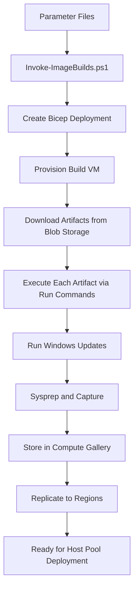

[**Home**](../README.md) | [**Quick Start**](quickStart.md) | [**Host Pool Deployment**](hostpoolDeployment.md) | [**Image Build**](imageBuild.md) | [**Artifacts**](artifactsGuide.md) | [**Features**](features.md) | [**Parameters**](parameters.md)

# 🎨 Custom Image Build Guide

## Overview

The Federal AVD solution includes an automated custom image building capability. This Zero Trust-compliant solution creates custom Windows images with pre-installed software, configurations, and optimizations for Azure Virtual Desktop deployments without requiring Azure Image Builder service.

### Why Build Custom Images?

**Benefits:**

- ⚡ **Faster Deployments** - Pre-installed software reduces session host deployment time
- 🎯 **Consistency** - Ensures all session hosts start with identical configurations
- 🔒 **Security** - Bake security hardening and policies into the base image
- 💰 **Cost Savings** - Reduces compute time for customizations during VM deployment
- 🚀 **Scale** - Deploy hundreds of session hosts from a known-good image

**When to Use Custom Images:**

- Deploying standardized desktop environments
- Installing large or complex software packages
- Applying Windows Updates and OS optimizations
- Implementing security baselines and compliance requirements
- Supporting air-gapped or restricted network environments

---

## Table of Contents

- [Prerequisites](#prerequisites)
- [Understanding the Build Process](#understanding-the-build-process)
- [Deployment Methods](#deployment-methods)
  - [Method 1: Deploy Button (Recommended)](#method-1-deploy-button-recommended)
  - [Method 2: PowerShell Helper Script](#method-2-using-the-powershell-helper-script)
  - [Method 3: Azure CLI](#method-3-azure-cli)
- [Parameter Configuration](#parameter-configuration)
- [Build Process Monitoring](#build-process-monitoring)
- [Using the Custom Image](#using-the-custom-image)
- [Troubleshooting](#troubleshooting)
- [Best Practices](#best-practices)
- [Next Steps](#next-steps)

---

## Prerequisites

### Required - Image Management Resources

Custom image building **requires** the Image Management resources to be deployed first. These resources provide the storage and infrastructure needed for artifacts and image distribution.

**📦 [Deploy Image Management Resources](artifactsGuide.md#deploying-image-management-resources)**

The Image Management deployment creates:

- Storage Account with artifacts blob container
- Managed Identity with RBAC permissions
- Azure Compute Gallery for image storage
- Private endpoints (optional, for Zero Trust)

### Required - Artifacts

Custom images are built by executing **artifacts** during the image build process. Artifacts are packages containing PowerShell scripts and installers stored in Azure Blob Storage.

**📚 [Understanding Artifacts](artifactsGuide.md)**

**Example artifacts included:**

- Windows Updates and optimizations
- FSLogix installation
- Microsoft 365 Apps installation
- Microsoft Teams installation
- OneDrive installation
- Custom software packages

**📝 [Creating Custom Artifacts](artifactsGuide.md#creating-custom-artifact-packages)**

### Required - Parameter Files

Image build configurations are defined in parameter files located in `deployments/imageBuild/parameters/`:

**One parameter file is required per image build:**

- **`<prefix>.imageBuild.parameters.json`** - Contains the complete image build configuration including compute gallery reference, artifacts location, source image details, and customizations

**Example structure:**

```
deployments/imageBuild/parameters/
├── demo.imageBuild.parameters.json
├── dev.imageBuild.parameters.json
└── prod.imageBuild.parameters.json
```

**Prefix naming:** The `<prefix>` allows you to maintain multiple image build configurations (e.g., `demo`, `dev`, `prod`) and deploy them using the `Invoke-ImageBuilds.ps1` script by specifying the prefix(es).

---

## Image Build Architecture

### How Image Building Works



### Build Process Steps

1. **Provision Build VM** - Bicep creates a temporary VM in your subscription
2. **Download Artifacts** - Each artifact is downloaded from blob storage
3. **Execute Customizations** - PowerShell scripts run sequentially via VM Run Commands using `Invoke-Customization.ps1`
4. **Apply Updates** - Windows Updates are installed (optional)
5. **Sysprep** - Image is generalized for deployment
6. **Capture** - VM is captured as an image version
7. **Distribute** - Image is stored in Compute Gallery and replicated to target regions

### Customizations Array

The `customizations` parameter array defines which artifacts to run during image build:

```json
{
  "customizations": [
    {
      "name": "InstallFsLogix",
      "blobName": "FSLogixInstallation.zip",
      "arguments": ""
    },
    {
      "name": "InstallMicrosoft365",
      "blobName": "Office365Install.zip",
      "arguments": ""
    }
  ]
}
```

**Each customization runs as a separate VM Run Command**, executing `Invoke-Customization.ps1` with the specified artifact.

---

## Parameter Configuration

### Image Build Parameters

Key parameters in `<prefix>.imageBuild.parameters.json`:

| Parameter | Description | Example |
|-----------|-------------|---------|
| **customizations** | Array of artifacts to run during build | See customizations array above |
| **imageDefinitionName** | Name for the image in Compute Gallery | `avd-win11-23h2` |
| **sourceImagePublisher** | Base image publisher (marketplace) | `MicrosoftWindowsDesktop` |
| **sourceImageOffer** | Base image offer | `office-365` |
| **sourceImageSku** | Base image SKU | `win11-23h2-avd-m365` |
| **imageVersionName** | Version number for the image | Leave blank for automatic timestamp-based versioning (e.g., `2026.0210.1435`), or specify custom version (e.g., `1.0.0`) |
| **excludeFromLatest** | Exclude this version from 'latest' | `false` |
| **replicaCount** | Number of replicas per region | `1` |
| **replicationRegions** | Regions to replicate image to | `["usgovvirginia", "usgovarizona"]` |
| **runWindowsUpdate** | Install Windows Updates during build | `true` |
| **windowsUpdateCategories** | Categories of updates to install | `Critical, Security, UpdateRollup` |
| **collectCustomizationLogs** | Save customization logs to blob storage | `true` (optional, default: `false`) |
| **logStorageAccountNetworkAccess** | Network access for log storage account | `PrivateEndpoint`, `ServiceEndpoint`, or `PublicEndpoint` |

### Image Management Resource References

These parameters reference the Image Management resources and are included in the same `<prefix>.imageBuild.parameters.json` file:

| Parameter | Description | Example |
|-----------|-------------|------|
| **computeGalleryResourceId** | Resource ID of the Azure Compute Gallery | `/subscriptions/{sub-id}/resourceGroups/{rg-name}/providers/Microsoft.Compute/galleries/{gallery-name}` |
| **artifactsContainerUri** | URI of the blob container with artifacts | `https://{storage-account}.blob.core.usgovcloudapi.net/artifacts` |
| **userAssignedIdentityResourceId** | Managed identity for blob access | `/subscriptions/{sub-id}/resourceGroups/{rg-name}/providers/Microsoft.ManagedIdentity/userAssignedIdentities/{identity-name}` |

### Automatic Image Versioning

The image build process includes automatic timestamp-based versioning:

**How it works:**
- If `imageVersionName` is left blank (recommended), the build automatically generates a version number
- Version format: `YYYY.MMDD.HHMM` (e.g., `2026.0210.1435` for February 10, 2026 at 2:35 PM)
- Each build gets a unique, sortable version number based on build time
- Versions are chronologically sortable in the Compute Gallery

**Benefits:**
- ✅ No manual version management required
- ✅ Multiple builds per day automatically get unique versions
- ✅ Build time is captured in the version number
- ✅ Easy to identify when an image was built

**Custom versioning:**
- Specify a custom `imageVersionName` value (e.g., `1.0.0`, `2.5.3`) to override automatic versioning
- Useful for release milestones or semantic versioning requirements

**⚠️ Note about `timeStamp` parameter:**
- The Bicep template uses a `timeStamp` parameter to generate automatic versions
- This parameter has a default value of `utcNow()` and should **never be included in parameter files**
- When downloading parameters from Template Spec UI, remove the `timeStamp` parameter
- Each deployment automatically generates a fresh timestamp for unique versioning

---

## Building Custom Images

### Method 1: Azure Portal (Deploy Button)

**Best for:** Quick deployments without local tooling

Click the button for your target cloud to open the deployment UI in Azure Portal:

[](https://portal.azure.com/#blade/Microsoft_Azure_CreateUIDef/CustomDeploymentBlade/uri/https%3A%2F%2Fraw.githubusercontent.com%2FAzure%2FFederalAVD%2Fmain%2Fdeployments%2FimageManagement%2FimageBuild%2FimageBuild.json/uiFormDefinitionUri/https%3A%2F%2Fraw.githubusercontent.com%2FAzure%2FFederalAVD%2Fmain%2Fdeployments%2FimageManagement%2FimageBuild%2FuiFormDefinition.json) [](https://portal.azure.us/#blade/Microsoft_Azure_CreateUIDef/CustomDeploymentBlade/uri/https%3A%2F%2Fraw.githubusercontent.com%2FAzure%2FFederalAVD%2Fmain%2Fdeployments%2FimageManagement%2FimageBuild%2FimageBuild.json/uiFormDefinitionUri/https%3A%2F%2Fraw.githubusercontent.com%2FAzure%2FFederalAVD%2Fmain%2Fdeployments%2FimageManagement%2FimageBuild%2FuiFormDefinition.json)

**⚠️ Note:** For Air-Gapped clouds (Secret/Top Secret), create Template Specs using [`New-TemplateSpecs.ps1`](../deployments/New-TemplateSpecs.ps1) or use PowerShell deployment methods below.

### Method 2: Using the PowerShell Helper Script

**Best for:** Automation and building multiple images

The `Invoke-ImageBuilds.ps1` script automates the image build deployment process.

#### Basic Usage

```powershell
# Navigate to deployments directory
cd C:\repos\FederalAVD\deployments

# Connect to Azure
Connect-AzAccount -Environment AzureUSGovernment
Set-AzContext -Subscription "your-subscription-id"

# Build image using demo parameter files
.\Invoke-ImageBuilds.ps1 -Location "usgovvirginia" -ParameterFilePrefixes @('demo')
```

#### Multiple Builds

Build multiple images simultaneously:

```powershell
.\Invoke-ImageBuilds.ps1 -Location "usgovvirginia" -ParameterFilePrefixes @('dev', 'test', 'prod')
```

#### Script Parameters

| Parameter | Type | Required | Description |
|-----------|------|----------|-------------|
| **Location** | String | Yes | Azure region where build will execute |
| **ParameterFilePrefixes** | Array | Yes | List of parameter file prefixes to process |
| **SubscriptionId** | String | No | Target subscription (uses current context if not specified) |

### Method 3: Manual Deployment with Azure CLI or PowerShell

**Best for:** CI/CD pipelines and advanced automation

Deploy using Azure CLI or PowerShell directly:

#### Azure PowerShell

```powershell
New-AzSubscriptionDeployment `
    -Location "usgovvirginia" `
    -TemplateFile ".\imageBuild\imageBuild.bicep" `
    -TemplateParameterFile ".\imageBuild\parameters\demo.imageBuild.parameters.json" `
    -Name "avd-image-build-$(Get-Date -Format 'yyyyMMddHHmm')"
```

#### Azure CLI

```bash
az deployment sub create \
    --location usgovvirginia \
    --template-file ./imageBuild/imageBuild.bicep \
    --parameters @./imageBuild/parameters/demo.imageBuild.parameters.json \
    --name avd-image-build-$(date +%Y%m%d%H%M)
```

---

## Monitoring Image Builds

### Deployment Status

Monitor the deployment in Azure Portal:

1. Navigate to **Subscriptions** > **Deployments**
2. Find your deployment (e.g., `avd-image-build-202602091530`)
3. Check deployment status and any errors

### Build VM Status

Check the build VM and its Run Command executions:

1. Navigate to the Resource Group (e.g., `rg-avd-imagebuild-use2`)
2. Find the build VM (e.g., `vm-avd-build`)
3. View **Run Commands** to see execution progress
4. Check Run Command output logs for detailed artifact execution results

### Customization Logs in Blob Storage

The image build solution includes an optional feature to automatically save all customization logs to Azure Blob Storage. This is controlled by the `collectCustomizationLogs` parameter (or the "Collect customization logs in a storage container" checkbox in the Azure Portal UI).

**When enabled:**

- A dedicated storage account is created in the build resource group
- All Run Command output and error logs are uploaded to a blob container named `image-customization-logs`
- Logs are automatically retained for **7 days** via lifecycle management policy
- You can configure network access: **Private Endpoint**, **Service Endpoint**, or **Public Endpoint**

**Log File Naming Convention:**

- Custom artifacts: `{vm-name}-{artifact-name}-output-{timestamp}.log` and `{vm-name}-{artifact-name}-error-{timestamp}.log`
- Built-in customizations:
  - `{vm-name}-Remove-AppxPackages-output-{timestamp}.log`
  - `{vm-name}-FSLogix-output-{timestamp}.log`
  - `{vm-name}-Office-output-{timestamp}.log`
  - `{vm-name}-OneDrive-output-{timestamp}.log`
  - `{vm-name}-Teams-output-{timestamp}.log`

**To access logs:**

1. Navigate to the build resource group
2. Find the storage account (name starts with `stlogs`)
3. Open **Storage Browser** > **Blob containers** > **image-customization-logs**
4. Download or view log files directly in the portal

### Build Timeline

Typical build duration: **45-90 minutes** depending on:

- Number of customizations
- Software installation complexity
- Windows Update installation (if enabled)
- Network speed for downloads

---

## Troubleshooting

### Common Issues

#### Issue: Build Fails During Artifact Execution

**Symptoms**: Build fails with error during customization step

**Solutions**:

- Check artifact PowerShell script for errors
- Verify blob storage access (managed identity permissions)
- Review Run Command output logs on the build VM
- Test artifact locally on a test VM first

#### Issue: Windows Updates Timeout

**Symptoms**: Build fails during Windows Update phase

**Solutions**:

- Increase build timeout in Bicep template
- Reduce Windows Update categories
- Use a more recent base image (fewer updates needed)
- Set `runWindowsUpdate = false` and manage updates separately

#### Issue: Image Not Available in Target Region

**Symptoms**: Image build succeeds but not visible in host pool region

**Solutions**:

- Check `replicationRegions` parameter includes target region
- Wait for replication to complete (check Compute Gallery)
- Verify replica count is sufficient

#### Issue: Access Denied to Artifacts

**Symptoms**: Build fails with 403/401 errors downloading artifacts

**Solutions**:

- Verify managed identity has **Storage Blob Data Reader** role
- Check storage account firewall rules allow Azure services
- Ensure artifact container name matches parameter

### Getting Detailed Logs

**Option 1: Blob Storage Logs (Recommended)**

If you enabled the `collectCustomizationLogs` parameter during deployment:

```powershell
# List all customization logs
$buildRg = "rg-avd-imagebuild-use2"
$storageAccount = Get-AzStorageAccount -ResourceGroupName $buildRg | Where-Object {$_.StorageAccountName -like "stlogs*"}
$ctx = $storageAccount.Context

# List all logs in the container
Get-AzStorageBlob -Container "image-customization-logs" -Context $ctx | Select-Object Name, LastModified, Length

# Download a specific log
Get-AzStorageBlob -Container "image-customization-logs" -Blob "vm-avd-build-Install-MyApp-output-*.log" -Context $ctx | Get-AzStorageBlobContent -Destination "."

# View log content directly
$blob = Get-AzStorageBlob -Container "image-customization-logs" -Blob "vm-avd-build-FSLogix-output-*.log" -Context $ctx
$blob.ICloudBlob.DownloadText()
```

**Option 2: Build VM Run Command Logs**

```powershell
# View Run Commands on the build VM
$buildRg = "rg-avd-imagebuild-use2"
$buildVm = Get-AzVM -ResourceGroupName $buildRg | Where-Object {$_.Name -like "*-build"}

# Get Run Command execution results
Get-AzVMRunCommand -ResourceGroupName $buildRg -VMName $buildVm.Name
```

**Artifacts Storage Account Logs:**

- Enable diagnostic logs on the artifacts storage account
- Check for blob download activity
- Verify managed identity access attempts

---

## Best Practices

### Image Management

1. **Version Control** - Use semantic versioning (e.g., 1.0.0, 1.1.0, 2.0.0)
2. **Testing** - Test new images in dev/test before production
3. **Documentation** - Document changes in each image version
4. **Retention** - Keep previous image versions for rollback capability
5. **Automation** - Use CI/CD pipelines to automate builds on artifact changes

### Artifact Organization

1. **Modular Artifacts** - Keep artifacts focused on single tasks
2. **Idempotency** - Ensure artifacts can run multiple times safely
3. **Error Handling** - Include proper error handling in PowerShell scripts
4. **Logging** - Write detailed logs for troubleshooting
5. **Dependencies** - Document artifact dependencies and execution order

### Security

1. **Managed Identities** - Use managed identities instead of storage account keys
2. **Private Endpoints** - Enable private endpoints for storage accounts
3. **Least Privilege** - Grant minimal RBAC permissions required
4. **Secure Artifacts** - Store software installers securely in blob storage
5. **Compliance** - Bake compliance requirements into base image

### Performance

1. **Base Image Selection** - Choose the most recent base image to minimize updates
2. **Parallel Builds** - Build multiple images simultaneously if needed
3. **Regional Proximity** - Build in the same region as artifact storage
4. **Artifact Size** - Minimize artifact package sizes for faster downloads
5. **Update Strategy** - Balance update frequency with build time

---

## Using Custom Images

### In Host Pool Deployments

Once the image build completes and replicates to your target region, reference it in host pool deployments:

**In `<prefix>.hostpool.parameters.json`:**

```json
{
  "imageReference": {
    "id": "/subscriptions/xxx/resourceGroups/rg-image-management-usgovvirginia/providers/Microsoft.Compute/galleries/gal_imagemgt_usgovvirginia/images/avd-win11-23h2/versions/latest"
  }
}
```

**Or use a specific version:**

```json
{
  "imageReference": {
    "id": "/subscriptions/xxx/resourceGroups/rg-image-management-usgovvirginia/providers/Microsoft.Compute/galleries/gal_imagemgt_usgovvirginia/images/avd-win11-23h2/versions/1.0.0"
  }
}
```

### With Session Host Replacer

The Session Host Replacer add-on automatically detects new image versions and replaces session hosts with zero downtime.

**[Session Host Replacer Documentation](../deployments/add-ons/SessionHostReplacer/readme.md)**

---

## Next Steps

- **[Deploy Host Pool](hostpoolDeployment.md)** - Deploy AVD host pool using your custom image
- **[Create Custom Artifacts](artifactsGuide.md#creating-custom-artifact-packages)** - Build your own software packages
- **[Session Host Replacer](../deployments/add-ons/SessionHostReplacer/readme.md)** - Automate host replacements on image updates

---

## Related Documentation

- 📦 [Artifacts & Image Management Guide](artifactsGuide.md)
- 🔧 [Deploy-ImageManagement Script](imageManagementScript.md)
- 🏢 [Host Pool Deployment Guide](hostpoolDeployment.md)
- 📖 [Quick Start Guide](quickStart.md)
- ⚙️ [Parameters Reference](parameters.md)
