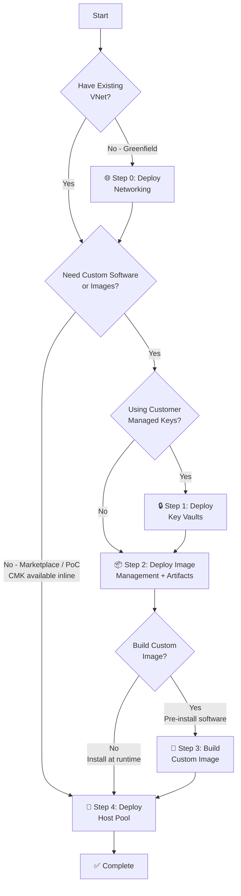
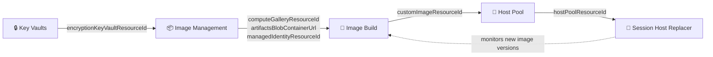

[**Home**](../README.md) | [**Quick Start**](quick-start.md) | [**Host Pool Deployment**](hostpool-deployment.md) | [**Image Build**](image-build.md) | [**Artifacts**](artifacts-guide.md) | [**Features**](features.md) | [**Parameters**](parameters.md) | [**Compliance**](compliance.md) | [**BCDR**](bcdr.md)

# Quick Start Guide

Get your Azure Virtual Desktop environment deployed quickly with this step-by-step guide. This guide helps you choose the right deployment path and complete the essential prerequisites. Use the tier table below to find your starting point, then follow the steps that apply.

---

## Your First Deployment (Golden Path)

> **New to FederalAVD?** Follow these 12 steps to get a working host pool in ~20 minutes. This path uses an existing VNet, marketplace images, and PowerShell — no CMK, no custom images, no extra infrastructure required. In the deployment sequence described later in this guide, this is **Tier 1 (PoC / Marketplace)** — you only need the host pool template (Step 4). Ignore the tier table, Steps 0–3, Template Spec setup, and CMK options for now; you can add them later.
>
> **Before you start:** Run through the [60-second preflight](#preflight-checklist) in the Essential Prerequisites section below — nine yes/no checks that catch the most common blockers.

---

**Steps 1–3: One-time environment setup**

**Step 1 — Install or update the Az PowerShell module** (skip if already on Az 12+)

```powershell
Install-Module -Name Az -Scope CurrentUser -Repository PSGallery -Force
```

**Step 2 — Connect to Azure and set your subscription**

```powershell
Connect-AzAccount                                      # Add -Environment AzureUSGovernment for Gov clouds
Set-AzContext -Subscription '<your-subscription-id>'
```

**Step 3 — Register required providers and features** (one-time per subscription; safe to re-run)

```powershell
Register-AzResourceProvider -ProviderNamespace 'Microsoft.DesktopVirtualization'
Register-AzProviderFeature   -FeatureName 'EncryptionAtHost' -ProviderNamespace 'Microsoft.Compute'

# Wait until EncryptionAtHost shows 'Registered' (~1-5 minutes)
do {
    $state = (Get-AzProviderFeature -FeatureName EncryptionAtHost -ProviderNamespace Microsoft.Compute).RegistrationState
    Write-Host "EncryptionAtHost: $state"
    if ($state -ne 'Registered') { Start-Sleep -Seconds 15 }
} while ($state -ne 'Registered')
```

> `EncryptionAtHost` is enabled on all session host VMs by default in this solution. If your subscription cannot register it, add `"encryptionAtHost": { "value": false }` to your parameter file and skip the wait loop.

---

**Steps 4–6: Repo and parameter setup**

**Step 4 — Clone the repo** (or download the ZIP from GitHub if you don't have git)

```powershell
git clone https://github.com/Azure/FederalAVD.git
Set-Location FederalAVD
```

**Step 5 — Copy the golden-path example parameter file to your working folder**

```powershell
New-Item -ItemType Directory -Force customer\parameters\hostpools | Out-Null
Copy-Item customer\examples\parameters\hostpools\golden-path.hostpool.parameters.json `
          customer\parameters\hostpools\myfirstpool.parameters.json
```

> `customer\parameters\` is git-ignored by design — your environment-specific files stay local and will not be overwritten on `git pull`. Never edit `customer\examples\` files directly; copy them first.

**Step 6 — Edit the required values in your parameter file**

Open `customer\parameters\hostpools\myfirstpool.parameters.json` and replace every value marked `TODO`:

| Parameter | What to set |
|---|---|
| `identifier` | A short prefix for this deployment (e.g., `"test"` or `"dev"`) |
| `virtualMachineNamePrefix` | VM name prefix for session hosts (e.g., `"avddev"`, max 14 chars) |
| `virtualMachineSubnetResourceId` | Full resource ID of the session host subnet |
| `appGroupSecurityGroups` | Your Entra security group object ID and display name (replace the `xxxxxxxx` placeholders) |

The file already sets `sessionHostCount: 3`, `deployFSLogixStorage: true`, and `identitySolution: "EntraId"` — leave those as-is unless your scenario differs. Everything else uses Bicep defaults (`virtualMachineSize: Standard_D4ads_v5`, `imageSku: win11-25h2-avd-m365`, `enableMonitoring: true`, etc.) which are correct for a first deployment.

> **Credentials are not in this file.** `virtualMachineAdminUserName` and `virtualMachineAdminPassword` are `@secure()` parameters — putting them in a plain-text JSON file is a security risk. The deploy command (Step 8) collects them interactively via `Read-Host` so they are never written to disk. The deployment automatically creates a Key Vault in the operations resource group and stores both values there as secrets.
>
> **No `timeStamp` to remove** — the golden-path example file does not include one. If you later export a parameter file from the Template Spec UI or ARM deployment history, delete the `timeStamp` entry before reusing the file. See [troubleshooting](troubleshooting.md#timestamp-in-parameter-file-causes-stale-image-versions).

**Step 7 — Verify the VM size is available and quota is sufficient**

Before spending 20 minutes waiting on a deployment that will fail at the VM allocation step, run the pre-flight check:

```powershell
.\tools\Test-AvdVmSize.ps1 -Location '<azure-region>'
```

Replace `<azure-region>` with your target Azure region. Add `-SessionHostCount <n>` if you changed `sessionHostCount` from the `3` set in the parameter file.

All three checks (`[PASS]`) means you are clear to deploy. If any check fails the script prints exactly what to fix. See [vCPU Quota Exhaustion](troubleshooting.md#vcpu-quota-exhaustion) for the full remediation guide.

---

**Steps 8–10: Deploy**

**Step 8 — Deploy**

```powershell
$paramFile      = 'myfirstpool.parameters.json'
$deploymentName = [System.IO.Path]::GetFileNameWithoutExtension($paramFile)

# Credentials are @secure() parameters - collect them interactively, never store in the param file
$adminUser = Read-Host 'Session host local admin username' -AsSecureString
$adminPass = Read-Host 'Session host local admin password' -AsSecureString

New-AzDeployment `
    -Location '<azure-region>' `
    -Name $deploymentName `
    -TemplateFile '.\deployments\hostpools\hostpool.json' `
    -TemplateParameterFile ".\customer\parameters\hostpools\$paramFile" `
    -virtualMachineAdminUserName $adminUser `
    -virtualMachineAdminPassword $adminPass `
    -Verbose
```

Replace `<azure-region>` with your target Azure region. The deployment sets the control plane location to match, creates a Key Vault in the operations resource group, and stores both credentials there as secrets.

**Step 9 — Wait for the deployment (~15–20 minutes)**

Track progress in **Azure Portal → Subscriptions → [your subscription] → Deployments**, or watch the `-Verbose` output. The deployment provisions: host pool, workspace, application group, session hosts, FSLogix profile storage (Azure Files), monitoring, and all required role assignments.

**Step 10 — Confirm session hosts are registered**

```powershell
# Replace resource group / host pool names from deployment outputs
Get-AzWvdSessionHost `
    -ResourceGroupName 'rg-avd-hosts-<identifier>-<region>' `
    -HostPoolName      'vdpool-avd-<identifier>-<region>'  |
    Select-Object Name, Status
```

All session hosts should show `Status: Available`.

---

**Steps 11–13: Connect and verify**

**Step 11 — Open the AVD web client**

| Cloud | URL |
|-------|-----|
| Azure Commercial | [https://client.wvd.microsoft.com/arm/webclient](https://client.wvd.microsoft.com/arm/webclient) |
| Azure Government | [https://client.wvd.azure.us/arm/webclient](https://client.wvd.azure.us/arm/webclient) |

**Step 12 — Sign in with a user from your AVD security group**

The `appGroupSecurityGroups` parameter assigned this group to the Desktop Application Group automatically. If the desktop does not appear, confirm the assignment in **Azure Portal → Host Pool → Application Groups → [pool name] → Assignments**.

**Step 13 — Connect and confirm the session is live**

Select the desktop. It connects to a session host within 1–2 minutes. You now have a live AVD host pool.

---

> **⚠️ Top 5 first-deployment mistakes** — check these before asking for help:
>
> 1. **Storage 403 when uploading artifacts** — `Owner`/`Contributor` alone is not enough when shared key access is disabled; add [Storage Blob Data Contributor](troubleshooting.md#storage-blob-data-access-fails-with-403).
> 2. **CMK Forbidden on key operations** — add [Key Vault Crypto Officer](troubleshooting.md#key-vault-crypto-officer-missing) on the encryption KV; this is separate from `Owner`/`Contributor`.
> 3. **`timeStamp` left in a saved parameter file** — [remove it](troubleshooting.md#timestamp-in-parameter-file-causes-stale-image-versions) before reusing; it must auto-generate on every run.
> 4. **Edited `customer/examples/` and changes disappeared** — always [copy to `customer/parameters/` first](troubleshooting.md#editing-customerexamples-or-missing-customer-changes), then edit.
> 5. **imageManagement CMK fails — deployed before Key Vaults** — [Step 1 must run first](troubleshooting.md#cmk-deployment-fails-image-management-deployed-before-key-vaults) when using CMK.

---

## Deployment Tiers at a Glance

| Tier | Who | Requirements | First Deployment | Jump To |
|------|-----|-------------|-----------------|---------|
| **1 — PoC / Marketplace** | Single admin | Azure subscription + existing VNet | ~20 min | [Golden Path](#your-first-deployment-golden-path) or [Step 4 directly](#step-4-deploy-host-pool) |
| **2 — Custom Images** | Single team | Tier 1 + storage account + compute gallery | ~2–3 hrs total | [Step 2 → 3 → 4](#step-2-deploy-image-management-resources) |
| **3 — Multi-Team Production** | Network, Security, Image, AVD teams | All above + Key Vaults, RBAC delegation, param hand-off | ~4–8 hrs first time | [Tier 3 section](#tier-3-multi-tiered-administration) |
| **4 — Fully Automated** | DevOps / platform team | Tier 3 + CI/CD tooling | ~1 week setup | [Automation Guide](automation-guide.md) |

> **Just need a working AVD environment to test?** Jump directly to [Step 4: Deploy Host Pool](#step-4-deploy-host-pool). A VNet with one subnet is the only hard prerequisite. CMK, FSLogix, monitoring, and private endpoints are all optional and can be added later.

> **🔒 Deploying for NIST SP 800-53 / FedRAMP High or DoD IL5 compliance?** The deployment tiers above describe *operational* complexity — compliance hardening is a separate set of parameter choices that can be applied at any tier. See the [Compliance Configuration Reference](parameters.md#compliance-configuration-reference) for the exact parameters to change from their defaults. The Zero Trust tab in the host pool deployment UI also warns when defaults are not compliance-configured.

---

## Choose Your Deployment Path



**Decision Guide:**

- **Greenfield environment without networking?** → Start with [Step 0: Deploy Networking](#step-0-deploy-networking-infrastructure-greenfield), then continue below
- **Have existing VNet + subnet?** → Skip Step 0, continue below

**Then choose your deployment approach:**

> **💡 Fastest path:** If you have an existing VNet and want a working AVD environment with marketplace images, you need nothing else. Jump straight to [Step 4: Deploy Host Pool](#step-4-deploy-host-pool) — FSLogix storage, monitoring, and optional CMK are all handled inline by the host pool deployment. Add custom images or tighter security controls later.

- **PoC or marketplace images only?** → Jump directly to [Step 4: Deploy Host Pool](#step-4-deploy-host-pool) *(CMK optional — deployed inline, no Key Vault pre-deploy needed)*
- **Need custom software on session hosts, no CMK?** → [Step 2: Image Management](#step-2-deploy-image-management-resources) first, then:
  - **Install at runtime only?** → [Step 4: Host Pool](#step-4-deploy-host-pool)
  - **Want pre-built images?** → [Step 3: Build Custom Image](#step-3-build-custom-image-optional) → [Step 4: Host Pool](#step-4-deploy-host-pool)
- **Need custom software with CMK?** → [Step 1: Key Vaults](#step-1-deploy-key-vaults-cmk-with-custom-images) first (required before image management can encrypt), then [Step 2: Image Management](#step-2-deploy-image-management-resources) → [Step 3: Build Image](#step-3-build-custom-image-optional) → [Step 4: Host Pool](#step-4-deploy-host-pool)

---

## Deployment Methods

Most components support multiple deployment methods:

| Component | Blue Button | Template Spec | PowerShell/CLI |
|-----------|-------------|---------------|----------------|
| **Networking** (VNet, subnets, routing) | ✅ Com/Gov | ✅ All clouds | ✅ All clouds |
| **Key Vaults** (Secrets & Encryption) | ✅ Com/Gov | ✅ All clouds | ✅ All clouds |
| **Image Management** (infrastructure) | ✅ Com/Gov | ✅ All clouds | ✅ All clouds |
| **Custom Image Build** | ✅ Com/Gov | ✅ All clouds | ✅ All clouds |
| **Host Pool** | ✅ Com/Gov | ✅ All clouds | ✅ All clouds |
| **Add-Ons** | ✅ Com/Gov | ✅ All clouds | ✅ All clouds |

> **🔒 Air-Gapped Clouds (Azure Secret/Top Secret):** Blue Button deployments are NOT available. You can use either:
>
> - **Template Specs with Portal UI** (for custom images, host pools, networking, add-ons)
> - **PowerShell/CLI with parameter files** (for all components)
>
> **💡 Pro Tip:** Use Template Spec UI to generate your parameter files! Deploy once with the UI form, save the generated parameters, remove the `timeStamp` parameter, then use PowerShell for future deployments.
>
> **For details on air-gapped considerations:** [Air-Gapped Guide](air-gapped-clouds.md)

---

## Essential Prerequisites

Before deploying, ensure you have these essentials ready:

### Required for All Deployments

- ✅ **Azure Subscription** with Owner role (or Contributor + User Access Administrator)
- ✅ **Virtual Network** with at least one subnet for session hosts
- ✅ **Network Connectivity** - Firewall/NSG rules allowing access to [required AVD endpoints](https://learn.microsoft.com/azure/virtual-desktop/required-fqdn-endpoint?tabs=azure) ([air-gapped clouds](air-gapped-clouds.md))
- ✅ **Security Group** for AVD users (Entra ID or AD-synced)
- ✅ **AVD Licenses** - [Verify licensing requirements](https://learn.microsoft.com/azure/virtual-desktop/overview#requirements)
- ✅ **Resource Provider** - Enable `Microsoft.DesktopVirtualization` in your subscription

### 60-Second Preflight Checklist {#preflight-checklist}

Run through these before starting any deployment. All "yes" → proceed. Any "no" → follow the quick fix.

| # | Check | Quick fix if no |
|---|-------|----------------|
| 1 | My identity has **Owner** (or Contributor + User Access Administrator) on the target subscription | [Assign role in Azure Portal](https://learn.microsoft.com/azure/role-based-access-control/role-assignments-portal) |
| 2 | `Microsoft.DesktopVirtualization` is registered on the subscription | `Register-AzResourceProvider -ProviderNamespace 'Microsoft.DesktopVirtualization'` |
| 3 | `EncryptionAtHost` feature is registered (or I've set `encryptionAtHost: false` in my params) | `Register-AzProviderFeature -FeatureName EncryptionAtHost -ProviderNamespace Microsoft.Compute` |
| 4 | I have an existing VNet with at least one subnet | [Deploy networking (Step 0)](#step-0-deploy-networking-infrastructure-greenfield) |
| 5 | I have an Entra security group containing AVD users and know its object ID | Create a group in Entra ID and note its object ID |
| 6 | The Az PowerShell module is installed | `Install-Module -Name Az -Scope CurrentUser -Repository PSGallery -Force` |
| 7 | I'm using the correct `-Environment` flag for my cloud | `Connect-AzAccount -Environment AzureUSGovernment` for Gov; omit for Commercial |
| 8 | *(Custom images only)* My identity has **Storage Blob Data Contributor** on the artifacts storage account | `Owner`/`Contributor` does not cover blob data-plane access. See [troubleshooting](troubleshooting.md#storage-blob-data-access-fails-with-403). |
| 9 | *(CMK only)* My identity has **Key Vault Crypto Officer** on the encryption Key Vault | `Owner`/`Contributor` does not cover key operations. See [troubleshooting](troubleshooting.md#key-vault-crypto-officer-missing). |
| 10 | VM size is available in my region with sufficient vCPU quota | Run `tools/Test-AvdVmSize.ps1 -Location <region>`. See [vCPU Quota Exhaustion](troubleshooting.md#vcpu-quota-exhaustion). |

> Run `tools/Test-AvdVmSize.ps1 -Location <region>` to automate checks 3 and 10 (EncryptionAtHost is **not** checked by this script — register that separately).

### Required Deployer Roles by Deployment

| Deployment | Required role | Why |
|---|---|---|
| **imageManagement** | Owner **or** Contributor + User Access Administrator at subscription scope | Creates resource groups; assigns Contributor to managed identity on image build RG, Storage Blob Data Reader on artifacts storage, Storage Blob Data Contributor on logs storage |
| **imageBuild — new RG path** (no `imageBuildResourceGroupId`) | Owner **or** Contributor + User Access Administrator at subscription scope | Creates a temporary resource group; assigns Contributor to the orchestration VM's system-assigned identity on that RG |
| **imageBuild — existing RG path** (`imageBuildResourceGroupId` set) | `Microsoft.Resources/deployments/write` at **subscription scope** (the template is subscription-scoped) + Contributor on the **image build RG** + specific gallery image version write on the **compute gallery RG** (see [Section 3 custom role](custom-roles.md#3-imagebuild-operator--existing-rg-path) for exact actions; full `Contributor` on the gallery RG also works) (+ same on the remote gallery RG if replicating to a second region) | No resource group creation or role assignments; deploys VMs into the pre-existing build RG; creates the image version and (if not pre-existing) image definition in the compute gallery RG. Subscription-level deployment write is unavoidable because `imageBuild.bicep` uses `targetScope = 'subscription'`. |
| **hostpool** | Owner **or** Contributor + User Access Administrator at subscription scope (+ Key Vault Crypto Officer on the key vault if CMK) | `targetScope = 'subscription'` — subscription scope is required regardless. Creates resource groups; assigns roles at subscription scope (AVD service principal for Start VM On Connect / Scaling Plan), at control plane RG scope (Desktop Virtualization User to Entra groups on the app group), and at multiple RG scopes (deployment VM UAI roles, Entra-based VM login, FSLogix storage roles) |

> **Tip — least privilege for imageBuild:** Using an existing resource group (pre-staged by imageManagement) eliminates the need for subscription-level resource group creation and role assignment rights. You still need `Microsoft.Resources/deployments/write` at subscription scope because `imageBuild.bicep` uses `targetScope = 'subscription'` — but this is far narrower than full `Contributor` at subscription scope. See the [Custom RBAC Roles Guide](custom-roles.md#3-imagebuild-operator--existing-rg-path) for a role definition that grants exactly this.
>
> **Custom roles:** For organizations that need to constrain operators beyond built-in roles — for example, preventing arbitrary resource creation or limiting which role definition IDs can be assigned — see the [Custom RBAC Roles Guide](custom-roles.md) for ready-to-use JSON definitions for each deployment path.

### Required for Custom Software (Steps 2 & 3)

- ✅ **Storage Blob Data Contributor** role on the image management storage account — required because the storage account disables shared key access by default (Zero Trust). `Contributor` or `Owner` alone is not sufficient; see [why data plane roles are required separately](hostpool-deployment.md#security-prerequisites-optional).
- ✅ **PowerShell Az Module** for running deployment scripts

### Required for Customer Managed Keys (Step 1 + Step 4 with CMK)

- 🔑 **Key Vault Crypto Officer** on the encryption Key Vault — required for the deploying identity to create encryption keys during the host pool deployment. `Owner` or `Contributor` on the resource group does **not** grant key operation rights; Key Vault enforces a separate data plane RBAC. See [full explanation](hostpool-deployment.md#security-prerequisites-optional).

### Optional for Zero Trust / Production

- 🔒 **Private DNS Zones** for private endpoints — can be deployed by the [networking template (Step 0)](#step-0-deploy-networking-infrastructure-greenfield) or brought from an existing hub. The resource IDs output by Step 0 are passed directly to imageManagement, imageBuild, and host pool deployments as `azure*PrivateDnsZoneResourceId` parameters. ([full list](hostpool-deployment.md#dns-requirements))
- 🔒 **Domain Services** for hybrid identity (AD DS or Entra Domain Services)
- 🔒 **Domain Join Account** with permissions ([setup guide](hostpool-deployment.md#domain-permissions))
- 🔒 **Entra Kerberos** for Azure Files - [Hybrid Guide](entra-kerberos-hybrid.md) | [Cloud-Only Guide](entra-kerberos-cloud-only.md)
- 🔒 **Key Vaults** (Secrets & Encryption) — only needed upfront when using CMK with custom images; marketplace-only deployments can use inline KV deployment — see [Step 1](#step-1-deploy-key-vaults-cmk-with-custom-images)

<details>
<summary><b>📖 Detailed Prerequisites & Setup Guides</b></summary>

**Complete Prerequisites & Setup Instructions:**

- **[Host Pool Deployment Guide - Appendix](hostpool-deployment.md#appendix-detailed-setup--prerequisites)** - Comprehensive setup guide including:
  - Installing PowerShell Az Module & Bicep CLI
  - Creating Template Specs
  - DNS requirements and private DNS zones
  - Domain permissions setup (step-by-step)
  - Azure permissions and RBAC roles
  - Marketplace image selection
  - Feature enablement (Encryption at Host, Private Link, etc.)
  - Azure NetApp Files setup
  - Entra Kerberos configuration
  - Networking infrastructure deployment

**Identity & Authentication:**

- **[Entra Kerberos (Hybrid)](entra-kerberos-hybrid.md)** - Setup for hybrid identity with on-premises AD
- **[Entra Kerberos (Cloud-Only)](entra-kerberos-cloud-only.md)** - Setup for pure cloud identities

</details>

---

## 🔒 Air-Gapped Clouds: Template Specs (Optional but Recommended)

> **ℹ️ FOR AIR-GAPPED ENVIRONMENTS (Azure Secret / Azure Top Secret)**
> 
> Blue Button deployments are not available in air-gapped clouds. You have two options:
> 
> **Option A: Template Spec + Portal UI (Recommended for first deployment)**
> - Provides guided form with built-in validation
> - Easy parameter selection and configuration
> - Generate parameter files for future use
> 
> **Option B: PowerShell/CLI with parameter files**
> - Direct deployment without Template Specs
> - Requires manual parameter file creation
> - Best for automation and CI/CD

### Option A: Template Spec Setup (For UI-Guided Deployment)

**One-time setup:**

```powershell
# Connect to your Azure environment
Connect-AzAccount -Environment <YourEnvironment>  # AzureUSGovernment, etc.

# Set your subscription
Set-AzContext -Subscription "<subscription-id>"

# Create all template specs
cd C:\repos\FederalAVD\tools
.\New-TemplateSpecs.ps1 -Location "<region>"
```

**This creates Template Specs for:**

- ✅ Custom Image Build
- ✅ Host Pool Deployment
- ✅ Networking Infrastructure
- ✅ All Add-Ons (Session Host Replacer, Storage Quota Manager, etc.)

**Deploy using Template Spec UI:**

1. Navigate to **Template Specs** in Azure Portal
2. Select the desired template spec
3. Click **Deploy** and fill out the form
4. **Before deploying**, click **Download template and parameters** to save the parameter file for future use
5. Complete the deployment

### 💡 Best Practice: Generate Parameter Files from Template Spec UI

**The easiest way to create parameter files for PowerShell deployments:**

1. Deploy using Template Spec UI (one time)
2. Fill out all parameters in the form
3. Click **Review + Create**, then **Download template and parameters**
4. Save the `parameters.json` file
5. Edit the file to **remove the `timeStamp` parameter** (if present)
6. Use this parameter file for all future PowerShell/CLI deployments

**Example:**

```powershell
# Use parameter file name as deployment name (recommended)
$paramFile = "prod.hostpool.parameters.json"
$deploymentName = [System.IO.Path]::GetFileNameWithoutExtension($paramFile)

New-AzDeployment `
    -Location "usgovvirginia" `
    -TemplateFile ".\deployments\hostpools\hostpool.json" `
    -TemplateParameterFile ".\customer\parameters\hostpools\$paramFile" `
    -Name $deploymentName
```

**💡 Deployment Naming Tips:**

- Use descriptive, consistent names (e.g., `"prod-hostpool"`, `"dev-finance-pool"`)
- Base names on parameter file names for easy correlation
- Avoid timestamps - Azure tracks deployment history automatically
- Example: `prod.hostpool.parameters.json` → deployment name: `"prod.hostpool.parameters"`

**📝 Note about `timeStamp` parameter:**

- The Bicep templates include a `timeStamp` parameter with default value `utcNow()`
- This auto-generates unique suffixes for deployment names and resource names
- **Always remove it from saved parameter files** - it should be auto-generated on each deployment
- For image builds, generates automatic version numbers (e.g., `2026.0210.1435`) based on build time
- Including it in parameter files would reuse old timestamps, defeating the purpose of automatic versioning
- Used for automatic image version numbers (e.g., `2026.0210.1435`) based on build time

📖 **[Complete Template Spec Instructions](hostpool-deployment.md#b-template-spec-creation)**

---

## Step 0: Deploy Networking Infrastructure (Greenfield)

**⏭️ Skip this step if:** You already have a virtual network with subnets for AVD session hosts.

**Required for:** Greenfield deployments without existing networking infrastructure.

> **🔧 Technical Reference:** [Networking Template Documentation](../deployments/networking/README.md) - Complete parameter reference and advanced configuration

### What Gets Deployed

The networking deployment provides a complete foundation for AVD, including:

- **🌐 Virtual Network** - Spoke or standalone VNet with customizable address space
- **🔀 Subnets** - Session hosts, private endpoints, function apps
- **🛡️ Network Security Groups** - Basic NSGs for subnet security
- **🛣️ Routing** - NAT gateway (default) or NVA (Network Virtual Appliance) force-tunnel routing
- **🚦 NAT Gateway** - NAT gateway for secure outbound connectivity
- **🔗 Hub Peering** - Optional peering to hub VNet for hybrid connectivity
- **🔒 Private DNS Zones** - For all Azure services used by AVD (Blob, Files, Queue, Table, Key Vault, Backup, AVD feed/hostpool). **Deploying these here satisfies the `azure*PrivateDnsZoneResourceId` parameters required by imageManagement, imageBuild, and host pool deployments** — pass the resource IDs from the networking deployment outputs directly into those templates.
- **🛡️ DDoS Protection** - Optional DDoS Network Protection
- **📊 Diagnostics** - NSG flow logs to Log Analytics

### Quick Deploy Options

**Option 1: Azure Portal (Blue Button)** - Commercial & Government clouds only

[](https://portal.azure.com/#blade/Microsoft_Azure_CreateUIDef/CustomDeploymentBlade/uri/https%3A%2F%2Fraw.githubusercontent.com%2FAzure%2FFederalAVD%2Fmain%2Fdeployments%2Fnetworking%2Fnetworking.json/uiFormDefinitionUri/https%3A%2F%2Fraw.githubusercontent.com%2FAzure%2FFederalAVD%2Fmain%2Fdeployments%2Fnetworking%2FuiFormDefinition.json) 
[](https://portal.azure.us/#blade/Microsoft_Azure_CreateUIDef/CustomDeploymentBlade/uri/https%3A%2F%2Fraw.githubusercontent.com%2FAzure%2FFederalAVD%2Fmain%2Fdeployments%2Fnetworking%2Fnetworking.json/uiFormDefinitionUri/https%3A%2F%2Fraw.githubusercontent.com%2FAzure%2FFederalAVD%2Fmain%2Fdeployments%2Fnetworking%2FuiFormDefinition.json)

**Option 2: PowerShell** - All clouds

```powershell
# Connect to Azure
Connect-AzAccount -Environment AzureUSGovernment
Set-AzContext -Subscription "<subscription-id>"

# Deploy networking
New-AzDeployment `
    -Location "usgovvirginia" `
    -Name "avd-networking-deployment" `
    -TemplateFile ".\deployments\networking\networking.json" `
    -TemplateParameterFile ".\customer\parameters\networking\<your-params>.json" `
    -Verbose
```

**Option 3: Template Spec + Portal UI** - Recommended for air-gapped clouds

1. Create networking template spec:

   ```powershell
   cd C:\repos\FederalAVD\tools
   .\New-TemplateSpecs.ps1 -Location "usgovvirginia" -createNetwork $true -createCustomImage $false -createHostPool $false -CreateAddOns $false
   ```

2. Navigate to **Template Specs** in Azure Portal
3. Select **AVD Network Spoke**
4. Click **Deploy** and fill out the form

### Key Configuration Options

| Feature | Description | When to Use |
|---------|-------------|-------------|
| **Hub Peering** | Peer spoke VNet to hub VNet | Hybrid connectivity, centralized routing |
| **NVA Routing** | Route traffic through Network Virtual Appliance (with optional AVD bypass routes) | Centralized firewall/inspection |
| **Private DNS Zones** | Create DNS zones for all AVD-related services (Blob, Files, Key Vault, Backup, AVD). Outputs feed directly into imageManagement, imageBuild, and host pool `azure*PrivateDnsZoneResourceId` parameters. | Private endpoints, Zero Trust architecture |
| **DDoS Protection** | Enable DDoS Network Protection | Production environments, security requirements |
| **Multiple Subnets** | Session hosts, private endpoints, functions | Segmentation, private link deployments |

### Typical Deployment Scenarios

**Scenario 1: Simple Greenfield (Development/Test)**

- VNet with session host subnet only
- Public routing
- No hub peering
- Minimal configuration

**Scenario 2: Production with Hub (Zero Trust)**

- VNet with multiple subnets (hosts, private endpoints)
- Hub peering for hybrid connectivity
- NVA routing through hub firewall
- Private DNS zones for all Azure services
- DDoS protection enabled

**Scenario 3: Air-Gapped Cloud**

- VNet with segmented subnets
- Private DNS zones for cloud-specific service endpoints
- Route tables configured for on-premises routing
- No internet egress

**📖 For detailed networking architecture and requirements:** [Host Pool Deployment Guide - Networking Prerequisites](hostpool-deployment.md#c-networking-setup)

---

## Step 1: Deploy Key Vaults (CMK with Custom Images)

**⏭️ Skip this step if:** You don't need custom images with CMK. Key Vaults deployed inline during host pool deployment are idempotent — subsequent deployments to the same resource group reuse them, so you don't need to pre-deploy for sharing across host pools.

**Required when:** Using Customer Managed Keys with custom image management — the key vault must exist before deploying image management so the storage account and compute gallery can be encrypted.

> **⚠️ Common mistake — sequence matters with CMK:** Deploy Key Vaults (this step) **before** Image Management (Step 2). Image Management needs the Key Vault resource ID at creation time to configure encryption on the compute gallery and storage account. Deploying out of order either fails outright or creates unencrypted resources. See [troubleshooting](troubleshooting.md#cmk-deployment-fails-image-management-deployed-before-key-vaults).

The Key Vaults deployment creates a **dedicated operations resource group** (`rg-avd-operations-{loc}`) containing:

| Resource | Name Pattern | Purpose |
|----------|-------------|-------|
| **Secrets Key Vault** | `kv-avd-sec-{unique}-{loc}` | Stores VM admin credentials and domain join credentials referenced by the host pool deployment |
| **Encryption Key Vault** | `kv-avd-enc-{unique}-{loc}` | Stores CMK encryption keys for disk encryption sets and FSLogix storage accounts (Premium SKU, purge-protected) |

> **Custom naming:** These patterns reflect the CAF default. To use a consistent naming convention across all solutions, see the **[Naming Convention guide](naming-convention.md)**.

> **Why deploy this separately?** Deploying Key Vaults before image management lets you:
> - Encrypt the compute gallery and artifacts storage account with CMK from the start
> - Pre-populate credential secrets so the portal form can reference them
> - Give your security team time to review KV access policies before deployment begins

### Deploy Key Vaults

**Option 1: Azure Portal (Blue Button)** — Commercial & Government clouds only

[](https://portal.azure.com/#blade/Microsoft_Azure_CreateUIDef/CustomDeploymentBlade/uri/https%3A%2F%2Fraw.githubusercontent.com%2FAzure%2FFederalAVD%2Fmain%2Fdeployments%2FkeyVaults%2FkeyVaults.json/uiFormDefinitionUri/https%3A%2F%2Fraw.githubusercontent.com%2FAzure%2FFederalAVD%2Fmain%2Fdeployments%2FkeyVaults%2FuiFormDefinition.json)
[](https://portal.azure.us/#blade/Microsoft_Azure_CreateUIDef/CustomDeploymentBlade/uri/https%3A%2F%2Fraw.githubusercontent.com%2FAzure%2FFederalAVD%2Fmain%2Fdeployments%2FkeyVaults%2FkeyVaults.json/uiFormDefinitionUri/https%3A%2F%2Fraw.githubusercontent.com%2FAzure%2FFederalAVD%2Fmain%2Fdeployments%2FkeyVaults%2FuiFormDefinition.json)

**Option 2: PowerShell** — All clouds

```powershell
Connect-AzAccount -Environment '<environment>'
Set-AzContext -Subscription "<subscription-id>"
$location = '<location>'

$virtualMachineAdminPassword = Read-Host -Prompt "Enter the VM admin password" -AsSecureString
$virtualMachineAdminUserName = Read-Host -Prompt "Enter the VM admin username" -AsSecureString
$domainJoinUserPassword = Read-Host -Prompt "Enter the domain join user password" -AsSecureString
$domainJoinUserPrincipalName = Read-Host -Prompt "Enter the domain join user principal name" -AsSecureString
$templateFile = Get-ChildItem -Path . -Recurse -Filter 'keyVaults.json' | Where-Object { $_.FullName -like '*keyVaults*' } | Select-Object -First 1 -ExpandProperty FullName
Write-Output "Template file found: $templateFile"
New-AzDeployment `
    -TemplateFile $templateFile `
    -Location $location `
    -virtualMachineAdminPassword $virtualMachineAdminPassword `
    -virtualMachineAdminUserName $virtualMachineUserPrincipalName `
    -domainJoinUserPassword $domainJoinUserPassword `
    -domainJoinUserPrincipalName $domainJoinUserPrincipalName
```

**Option 3: Template Spec + Portal UI** — All clouds including air-gapped

```powershell
# Create the Template Spec (one-time)
cd C:\repos\FederalAVD\tools
.\New-TemplateSpecs.ps1 -Location "usgovvirginia"
```

Then navigate to **Template Specs** → **AVD Security** → **Deploy**.

### Pass Outputs to Image Management & Host Pool

After deployment, note the Key Vault resource IDs from the deployment outputs:

| Security Output | Used In |
|----------------|--------|
| `encryptionKeyVaultResourceId` | Image Management deployment (CMK for storage/gallery) |
| `secretsKeyVaultResourceId` | Host pool deployment (`existingCredentialsKeyVaultResourceId`) |
| `encryptionKeyVaultResourceId` | Host pool deployment (`existingEncryptionKeyVaultResourceId`) |

> **Required RBAC on the Encryption KV** for the deploying identity: `Key Vault Crypto Officer` — needed to create encryption keys during host pool deployment. This applies whether the KV was pre-deployed here or created inline by the host pool deployment, because creating a vault does not grant the deploying identity any key operation rights (ARM control plane ≠ Key Vault data plane). This role can be removed after initial deployment once key rotation is handled separately. See the [full explanation and Confidential VM exception](hostpool-deployment.md#security-prerequisites-optional).

---

## Step 2: Deploy Image Management Resources

**⏭️ Skip this step if:** You're using marketplace images without customization.

**Required for:** Custom image builds or session host runtime customizations with software packages.

This step has two parts: deploying the Azure infrastructure once, then uploading artifacts whenever your software changes.

### Part A: Deploy Infrastructure (One-Time)

Deploys everything imageBuild needs when using the **existing resource group path** (recommended for production): compute gallery, artifacts storage account, build logs storage account, managed identity (pre-granted all required roles), and the image build resource group.

> **Why imageManagement handles all of this:** The imageBuild deployment grants no RBAC roles on the existing RG path. The identity you supply must already have **Contributor** on the build resource group, **Storage Blob Data Reader** on the artifacts account, and **Storage Blob Data Contributor** on the logs account. imageManagement creates all of these resources and grants all of these roles in a single deployment — so image builders only need permission to run the imageBuild template, not to create resource groups or assign roles.
>
> **Alternative — Temporary RG path:** Leave `imageBuildResourceGroupId` empty and skip pre-staging the resource group in imageManagement. imageBuild will create a uniquely-named, temporary resource group on each run and **automatically delete the entire resource group** when the build completes. No UAI is required unless you are using storage features (artifacts container or log collection).

**Option 1: Azure Portal (Blue Button)** — Commercial & Government clouds only

[](https://portal.azure.com/#blade/Microsoft_Azure_CreateUIDef/CustomDeploymentBlade/uri/https%3A%2F%2Fraw.githubusercontent.com%2FAzure%2FFederalAVD%2Fmain%2Fdeployments%2FimageManagement%2FimageManagement.json/uiFormDefinitionUri/https%3A%2F%2Fraw.githubusercontent.com%2FAzure%2FFederalAVD%2Fmain%2Fdeployments%2FimageManagement%2FuiFormDefinition.json)
[](https://portal.azure.us/#blade/Microsoft_Azure_CreateUIDef/CustomDeploymentBlade/uri/https%3A%2F%2Fraw.githubusercontent.com%2FAzure%2FFederalAVD%2Fmain%2Fdeployments%2FimageManagement%2FimageManagement.json/uiFormDefinitionUri/https%3A%2F%2Fraw.githubusercontent.com%2FAzure%2FFederalAVD%2Fmain%2Fdeployments%2FimageManagement%2FuiFormDefinition.json)

**Option 2: Deploy-ImageManagement.ps1 Script** — All clouds (recommended for PowerShell)
Set-AzContext -Subscription "<subscription-id>"

cd deployments
# Deploy infrastructure only
.\Deploy-ImageManagement.ps1 -Location "usgovvirginia" -ParameterFilePrefix basic

# OR deploy infrastructure AND upload artifacts in one step
.\Deploy-ImageManagement.ps1 -Location "usgovvirginia" -ParameterFilePrefix basic -UpdateArtifacts
```

Example parameter files are in `deployments\imageManagement\parameters\` (`basic`, `privateEndpoint`, `serviceEndpoint`, `production`). Copy and rename one into `customer\parameters\imageManagement\` for your environment.

If you did **not** use `-UpdateArtifacts`, note the `artifactsStorageAccountResourceId` output — you'll need it in Part B.

**Key imageManagement outputs to pass to imageBuild:**

| imageManagement output | imageBuild parameter |
|---|---|
| `computeGalleryResourceId` | `computeGalleryResourceId` |
| `artifactsBlobContainerUrl` | `artifactsContainerUri` |
| `managedIdentityResourceId` | `userAssignedIdentityResourceId` |
| `buildLogsStorageAccountResourceId` | `logStorageAccountResourceId` |
| `imageBuildResourceGroupResourceId` | `imageBuildResourceGroupId` |

### Part B: Upload Artifacts (Run Whenever Software Changes)

> **⏭️ Skip if** you already used `-UpdateArtifacts` in Part A.

```powershell
cd deployments
.\Update-ImageArtifacts.ps1 `
    -StorageAccountResourceId "<artifactsStorageAccountResourceId from Part A output>"
```

> **⚠️ Common mistake — Storage 403 when uploading artifacts:** If `Update-ImageArtifacts.ps1` fails with `403 AuthorizationFailure`, the storage account has shared key access disabled (the default in this solution). `Owner` and `Contributor` grant control-plane access only — they do not cover blob read/write. Add **Storage Blob Data Contributor** on the artifacts storage account to the identity running the script. See [troubleshooting](troubleshooting.md#storage-blob-data-access-fails-with-403).

> **⚠️ Common mistake — edits to `customer/examples/` disappear on git pull:** The `customer/examples/` folder is tracked by git and gets overwritten when you pull updates. Always copy example files to `customer/parameters/` (or `customer/artifacts/`) before editing — `customer/` is git-ignored by design and your changes there are preserved. See [troubleshooting](troubleshooting.md#editing-customerexamples-or-missing-customer-changes).

**✈️ Air-gapped environments:** Use `-SkipDownloadingNewSources` and manually place installers in `customer/artifacts/` before running.

**📚 Detailed Guides:**

- **[imageManagement README](../deployments/imageManagement/README.md)** — Infrastructure parameters and deployment options
- **[Update-ImageArtifacts Script Reference](update-image-artifacts.md)** — All script parameters and examples
- **[Artifacts Guide](artifacts-guide.md)** — Creating custom artifact packages
- **[Air-Gapped Cloud Instructions](air-gapped-clouds.md)** — Secret/Top Secret cloud considerations

### Part C: Pass imageManagement Outputs to imageBuild

> **This is the standard recommended workflow for production.** imageManagement pre-stages all infrastructure and grants all required roles. imageBuild deployments never assign roles — they simply consume pre-staged resources.

Deploy imageManagement with all defaults enabled (`deployArtifactsStorageAccount = true`, `deployBuildLogsStorageAccount = true`, `deployImageBuildResourceGroup = true`). The managed identity is granted:
- **Contributor** on the image build resource group
- **Storage Blob Data Reader** on the artifacts storage account
- **Storage Blob Data Contributor** on the build logs storage account

Image builders then supply these three outputs to imageBuild:
- `imageBuildResourceGroupId` — pre-created persistent RG; imageBuild deploys VMs into it each run and deletes only the VMs on completion (the RG is left intact)
- `userAssignedIdentityResourceId` — the managed identity with all roles pre-granted
- `logStorageAccountResourceId` + `logContainerName` — for build log collection

This enables least-privilege: the person running imageBuild needs no rights to create resource groups or assign roles.

> **Temporary RG alternative:** Leave `imageBuildResourceGroupId` empty and do not pre-stage the RG in imageManagement. Each run creates a new uniquely-named temporary resource group (timestamp-suffixed) and **deletes the entire resource group** on completion. The `userAssignedIdentityResourceId` is only needed when using storage features on this path.

---

## Step 3: Build Custom Image (Optional)

**⏭️ Skip this step if:** You're okay with marketplace images or installing software at session host runtime.

**Benefits:** Faster session host deployment, consistent configuration, pre-installed software.

### Quick Deploy Options

**Option 1: Azure Portal (Blue Button)** - Commercial & Government clouds only

[](https://portal.azure.com/#blade/Microsoft_Azure_CreateUIDef/CustomDeploymentBlade/uri/https%3A%2F%2Fraw.githubusercontent.com%2FAzure%2FFederalAVD%2Fmain%2Fdeployments%2FimageBuild%2FimageBuild.json/uiFormDefinitionUri/https%3A%2F%2Fraw.githubusercontent.com%2FAzure%2FFederalAVD%2Fmain%2Fdeployments%2FimageBuild%2FuiFormDefinition.json) 
[](https://portal.azure.us/#blade/Microsoft_Azure_CreateUIDef/CustomDeploymentBlade/uri/https%3A%2F%2Fraw.githubusercontent.com%2FAzure%2FFederalAVD%2Fmain%2Fdeployments%2FimageBuild%2FimageBuild.json/uiFormDefinitionUri/https%3A%2F%2Fraw.githubusercontent.com%2FAzure%2FFederalAVD%2Fmain%2Fdeployments%2FimageBuild%2FuiFormDefinition.json)

**Option 2: PowerShell Helper Script** - All clouds

```powershell
cd deployments
.\Invoke-ImageBuilds.ps1 -Location "usgovvirginia" -ParameterFilePrefixes @('demo')
```

**Option 3: Template Spec + Portal UI** - Recommended for air-gapped clouds

1. Navigate to **Template Specs** in Azure Portal
2. Select **Azure Virtual Desktop Custom Image**
3. Click **Deploy** and fill out the form
4. *Optional:* Download parameters for future PowerShell deployments

**📖 Complete Image Build Guide:**

- **[image-build.md](image-build.md)** - Full image build documentation with parameters, monitoring, and troubleshooting

**⏱️ Typical build time:** 45-90 minutes depending on customizations

---

## Step 4: Deploy Host Pool

Deploy your complete AVD environment including host pool, session hosts, storage, monitoring, and security resources.

### Quick Deploy Options

**Option 1: Azure Portal (Blue Button)** - Commercial & Government clouds only

[](https://portal.azure.com/#blade/Microsoft_Azure_CreateUIDef/CustomDeploymentBlade/uri/https%3A%2F%2Fraw.githubusercontent.com%2FAzure%2FFederalAVD%2Fmain%2Fdeployments%2Fhostpools%2Fhostpool.json/uiFormDefinitionUri/https%3A%2F%2Fraw.githubusercontent.com%2FAzure%2FFederalAVD%2Fmain%2Fdeployments%2Fhostpools%2FuiFormDefinition.json) 
[](https://portal.azure.us/#blade/Microsoft_Azure_CreateUIDef/CustomDeploymentBlade/uri/https%3A%2F%2Fraw.githubusercontent.com%2FAzure%2FFederalAVD%2Fmain%2Fdeployments%2Fhostpools%2Fhostpool.json/uiFormDefinitionUri/https%3A%2F%2Fraw.githubusercontent.com%2FAzure%2FFederalAVD%2Fmain%2Fdeployments%2Fhostpools%2FuiFormDefinition.json)

**Option 2: PowerShell** - All clouds

> **💡 Recommended first-time approach:** Use **Option 3 (Template Spec + Portal UI)** below to fill out the form, then click **Download template and parameters** before submitting. Remove `timeStamp` from the downloaded file and use it for all future PowerShell deployments. The UI provides validation and guided field discovery that is much easier than hand-editing JSON. See the [Template Spec setup section above](#-air-gapped-clouds-template-specs-optional-but-recommended) for one-time setup instructions.

```powershell
# Use parameter file name as deployment name
$paramFile = "demo.parameters.json"
$deploymentName = [System.IO.Path]::GetFileNameWithoutExtension($paramFile)

New-AzDeployment `
    -Location 'eastus2' `
    -Name $deploymentName `
    -TemplateFile '.\deployments\hostpools\hostpool.json' `
    -TemplateParameterFile ".\customer\parameters\hostpools\$paramFile" `
    -Verbose
```

> **⚠️ Common mistake — `timeStamp` in a saved parameter file:** If you exported the parameter file from the Template Spec UI or ARM deployment history, delete the `timeStamp` entry before saving the file for reuse. Leaving it causes every subsequent deployment to reuse the same timestamp, resulting in stale image version numbers and potential resource naming conflicts. See [troubleshooting](troubleshooting.md#timestamp-in-parameter-file-causes-stale-image-versions).

**Option 3: Template Spec + Portal UI** - Recommended for air-gapped clouds

1. Navigate to **Template Specs** in Azure Portal
2. Select **Azure Virtual Desktop HostPool**
3. Click **Deploy** and fill out the form
4. *Optional:* Download parameters for future PowerShell deployments

**📖 Complete Host Pool Guide:**

- **[hostpool-deployment.md](hostpool-deployment.md)** - Full deployment documentation with all parameters, features, and configurations

---

## Tier 3: Multi-Tiered Administration

In enterprise environments, different teams own different pieces of the infrastructure. The Federal AVD solution is designed so that each deployment step produces **outputs** that the next team consumes as **parameters** — enabling clean organizational boundaries without credential sharing or giving every team subscription Owner rights.

### Recommended Team Ownership Model

| Team | Owns | Deploys |
|------|------|---------| 
| **Platform / Network** | VNet, subnets, NSGs, DNS zones, hub peering | [Step 0: Networking](#step-0-deploy-networking-infrastructure-greenfield) |
| **Security** | Key Vaults, encryption keys, secrets, RBAC | [Step 1: Key Vaults](#step-1-deploy-key-vaults-cmk-with-custom-images) |
| **Image / Platform Engineering** | Compute gallery, artifacts storage, image builds | [Step 2: Image Management](#step-2-deploy-image-management-resources) + [Step 3: Image Build](#step-3-build-custom-image-optional) |
| **AVD Team** | Host pools, session hosts, FSLogix, monitoring | [Step 4: Host Pool](#step-4-deploy-host-pool) |

### Cross-Team Output Passing

Each team saves their deployment outputs into parameter files that the next team consumes. No team needs to touch another team's infrastructure directly.

| Source Team | Output | Destination Team | Parameter |
|-------------|--------|-----------------|-----------|
| Platform / Network | Subnet resource ID | All teams | `subnetResourceId` |
| Platform / Network | Private DNS zone resource IDs (from networking deployment outputs) | Image, AVD | `azure*PrivateDnsZoneResourceId` |
| Security | Secrets KV resource ID | AVD | `existingCredentialsKeyVaultResourceId` |
| Security | Encryption KV resource ID | Image, AVD | `encryptionKeyVaultResourceId` |
| Image Team | `computeGalleryResourceId` | Image (builds) | `computeGalleryResourceId` |
| Image Team | `artifactsBlobContainerUrl` | Image (builds) | `artifactsContainerUri` |
| Image Team | `managedIdentityResourceId` | Image (builds) | `userAssignedIdentityResourceId` |
| Image Team | Image definition resource ID | AVD | `customImageResourceId` |

### RBAC: Least-Privilege Deployment Rights

Assign these roles so each team can deploy their components without subscription-level Owner rights:

| Component | Deploying team needs | Why |
|-----------|---------------------|-----|
| **imageBuild — existing RG** | `Microsoft.Resources/deployments/write` at subscription scope + `Contributor` on build RG + `Contributor` on gallery RG | Subscription-scope write unavoidable (`targetScope = 'subscription'`); no role assignments required |
| **Session Hosts add-on** | `Contributor` on hosts RG + `Desktop Virtualization Host Pool Contributor` on control plane RG | Resource group scoped — no subscription-level rights needed |
| **hostpool — Complete** | `Owner` or `Contributor + User Access Administrator` at subscription scope | Creates RGs and assigns roles at subscription scope |

> **Generating parameter files for each team:** The easiest way to create a parameter file is to deploy once using the Template Spec portal form, then **download the generated parameter file** before submitting. Remove the `timeStamp` parameter before saving for reuse. See the [air-gapped section](#-air-gapped-clouds-template-specs-optional-but-recommended) for details.

---

## Tier 4: Full Automation

Once you have working manual deployments for each step (Tiers 1–3), you can chain them together into a pipeline. The Federal AVD solution is built for this pattern: each step is a standalone deployment that produces machine-readable outputs feeding the next step.

The **[End-to-End Automation Guide](automation-guide.md)** covers:

- **Output → Input mapping** — which output from each step feeds which parameter in the next
- **Pipeline integration** — how to wire steps together in Azure DevOps, GitHub Actions, or any CI/CD tool
- **Image refresh automation** — `Invoke-ImageBuilds.ps1` to trigger new image versions on a schedule
- **Zero-downtime host replacement** — [Session Host Replacer add-on](../deployments/add-ons/sessionHostReplacer/README.md) monitors for new image versions and drains/replaces session hosts automatically



> **Tip:** Export parameter files from the Template Spec UI after each team's first manual deployment. With those files in source control, your pipeline needs only to call `New-AzDeployment` with the right parameter file at each stage.

---

## Validation & Next Steps

### Verify Deployment

1. **Connect to AVD:**
   - Azure Commercial: [AVD Web Client](https://client.wvd.microsoft.com/arm/webclient)
   - Azure Government: [AVD Gov Web Client](https://client.wvd.azure.us/arm/webclient)
   - [Windows Desktop Client](https://learn.microsoft.com/azure/virtual-desktop/users/connect-windows)

2. **Test User Access:**
   - Log in with a user from your AVD security group
   - Verify desktop/app launches successfully

### Lifecycle Management & Add-Ons

**Explore operational automation:**

- 🔄 **[Session Host Replacer](../deployments/add-ons/sessionHostReplacer/README.md)** - Zero-downtime host replacements on image updates
- 💾 **[Storage Quota Manager](../deployments/add-ons/storageQuotaManager/README.md)** - Automated FSLogix profile quota management
- 🔑 **[Update Storage Keys](../deployments/add-ons/updateStorageAccountKeyOnSessionHosts/README.md)** - Automated key rotation
- ⚡ **[Run Commands on VMs](../deployments/add-ons/runCommandsOnVms/README.md)** - Execute scripts across session hosts

### Learn More

- 🤖 **[End-to-End Automation Guide](automation-guide.md)** - Chaining all steps into a pipeline
- 📐 **[Design Overview](design.md)** - Architecture patterns and design decisions
- ✨ **[Features](features.md)** - Complete feature list and capabilities
- 🚧 **[Limitations](limitations.md)** - Known limitations and workarounds
- 🔧 **[Troubleshooting](troubleshooting.md)** - Common issues and solutions
- ⚙️ **[Parameters Reference](parameters.md)** - Per-solution parameter documentation index
- 🏷️ **[Naming Convention](naming-convention.md)** - Customize how all resources are named across solutions

---

## Quick Reference

### Common Commands

```powershell
# Connect to Azure
Connect-AzAccount -Environment AzureUSGovernment

# List available regions
Get-AzLocation | Select-Object Location,DisplayName | Sort-Object DisplayName

# Check resource provider
Get-AzResourceProvider -ProviderNamespace Microsoft.DesktopVirtualization

# Register resource provider
Register-AzResourceProvider -ProviderNamespace Microsoft.DesktopVirtualization

# View deployment status
Get-AzDeployment -Name "<deployment-name>" | Select-Object DeploymentName, ProvisioningState, Timestamp
```

### Deployment Naming Best Practices

**Use parameter file names for deployment names (recommended):**

```powershell
# Extract deployment name from parameter file
$paramFile = "prod.hostpool.parameters.json"
$deploymentName = [System.IO.Path]::GetFileNameWithoutExtension($paramFile)
# Result: "prod.hostpool.parameters"

New-AzDeployment -Location "usgovvirginia" -Name $deploymentName -TemplateFile "..." -TemplateParameterFile "..."
```

**Alternative patterns:**

- **Environment-based**: `"avd-prod-hostpool"`, `"avd-dev-finance"`
- **Incremental versions**: `"avd-prod-v2"`, `"avd-prod-v3"`
- **Keep it simple**: Azure tracks deployment history automatically

**❌ Avoid:** Timestamps in deployment names - they make tracking difficult

### Support & Resources

- 📖 [Microsoft AVD Documentation](https://learn.microsoft.com/azure/virtual-desktop/)
- 🐛 [Report Issues](https://github.com/Azure/FederalAVD/issues)
- 💬 [Discussions](https://github.com/Azure/FederalAVD/discussions)

---

**Tier 1 — no custom images?** [Jump to Step 4](#step-4-deploy-host-pool) and you're done. **Need images?** Follow [Steps 2 → 3 → 4](#step-2-deploy-image-management-resources). **Enterprise / multi-team?** See [Tier 3](#tier-3-multi-tiered-administration). **Automating everything?** Start with the [Automation Guide](automation-guide.md).
