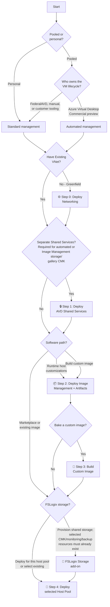
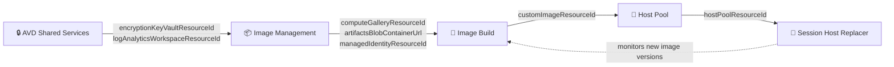

[**Home**](../README.md) | [**Quick Start**](quick-start.md) | [**Host Pool Deployment**](hostpool-deployment.md) | [**Image Build**](image-build.md) | [**Artifacts**](artifacts-guide.md) | [**Features**](features.md) | [**Parameters**](parameters.md) | [**Compliance**](compliance.md) | [**BCDR**](bcdr.md)

# Quick Start Guide

Get your Azure Virtual Desktop environment deployed. Pick your path below.

---

## Choose Your Path

**Fastest evaluation:** If you have an existing VNet and subnet, deploy the
[Standard PoC](#poc-fast-path) with a pooled host pool and marketplace image. This Step 4-only path
takes about 20 minutes. Step 4 is an all-in-one standard host-pool deployment: it can create or use
Key Vaults, monitoring, CMK resources, FSLogix backup resources, and host-pool-specific FSLogix
storage without Steps 1-3. Later standard host pools can reuse the shared resources created by the
first Step 4 deployment.

Choose a different path only when the workload requires it. Answer these four routing questions:

1. **Standard or automated host management?** Standard is the default, works in every cloud, and
   supports pooled and personal desktops. Automated is a pooled Azure Commercial preview where
   Azure Virtual Desktop owns VM creation, update, scaling, and deletion. The management approach
   can't be changed on an existing host pool.
2. **Where will software customization occur?** A marketplace or existing image can go directly to
    Step 4. Use Image Management (Step 2) without Image Build when session-host customizations need
    centrally hosted scripts or installers. Add Image Build (Step 3) only when FederalAVD must bake
    and publish a custom image.
3. **Where will FSLogix profiles be stored?** Step 4 can deploy storage dedicated to the host pool or
    use existing storage. Deploy the [FSLogix Storage add-on](../deployments/add-ons/fslogixStorage/README.md)
    first when the profile storage itself must be provisioned independently or shared by multiple
    host pools, then select that existing storage in each Step 4 deployment. The add-on can only use
    existing Key Vault, monitoring, and FSLogix backup resources, so deploy Step 1 first or supply
    approved existing resources when those options are required.
4. **Are separate prerequisites required?** Add Networking (Step 0) when no approved VNet and subnet
    exist. AVD Shared Services (Step 1) is required for automated host pools and before Image
    Management when CMK must protect artifact storage or gallery image versions. It is otherwise
     optional for standard host pools: the first Step 4 deployment can create shared Key Vaults,
     monitoring, and FSLogix backup resources that later standard host pools reuse. Use Step 1 when
     those resources must exist before any host pool, Image Management deployment, or FSLogix
     Storage add-on.

Select the smallest matching path below. Before promoting a PoC design or deploying production, use
[Choose a Host Pool Management Approach](host-pool-management.md) to record the recurring image,
host-maintenance, capacity, and replacement owners.

| | Path | Steps | Time |
| --- | --- | --- | --- |
| 🧪 | **[Standard PoC / Evaluation](#poc-fast-path)** — existing VNet, marketplace images, no compliance requirements | Step 4 only | ~20 min |
| 🧪 | **[Automated PoC / Evaluation](../deployments/automatedHostPools/README.md#deploy)** — Azure Commercial, existing VNet, marketplace image | Steps 1 → 4 | ~30 min |
| 📦 | **Runtime host customizations** — marketplace/existing image plus centrally hosted scripts or installers | Steps 2 → 4 | Varies |
| 🖼️ | **[Custom software, no CMK](#step-2-deploy-image-management-resources)** — pre-install software baked into images | Steps 2 → 3 → 4 | 2–4 hrs |
| 🏛️ | **[Compliance / Image Management CMK](#step-1-deploy-avd-shared-services)** — protect artifact storage and, when building images, gallery image versions | Steps 1 → 2 → Step 3 if building → 4 | Varies |
| ✈️ | **[Air-Gapped (Secret / Top Secret)](#-air-gapped-start-here)** — no Blue Button, bring-your-own artifacts, M365/Teams/OneDrive via custom image | Steps 1 → 2 → 3 → 4 | Setup day + deployment |
| 🌐 | **No existing VNet?** — add [Step 0: Networking](#step-0-deploy-networking-infrastructure-greenfield) first to any path above | + Step 0 | +30 min |
| 💾 | **Shared FSLogix storage with no CMK, diagnostics, or backup, or with all prerequisite resource IDs already available** | FSLogix Storage add-on → Step 4 pool(s) | Varies |
| 🔐 | **Shared FSLogix storage that needs FederalAVD to create its CMK, monitoring, or Azure Files backup prerequisites** | Step 1 → FSLogix Storage add-on → Step 4 pool(s) | Varies |

> **🏛️ Compliance / Image Management CMK path:** Step 1 must precede Step 2 when CMK must protect
> Image Management artifact or build-log storage. When custom images also require CMK, Step 2
> creates the Disk Encryption Set that Step 3 uses for build VM disks and published gallery image
> versions. Step 3 remains optional when Image Management is used only to host runtime artifacts.
> This sequencing requirement does not apply to an all-in-one standard Step 4 deployment, which can
> create its own Key Vault and CMK resources. A policy-required or centralized Log Analytics
> Workspace is another reason to deploy Step 1 first. For IL6 and IL7, Step 1 is the recommended
> baseline even when an individual template could deploy without it; omit it only when approved
> shared services provide equivalent control coverage.
>
> **Automated host pools:** Step 1 is always required, including the PoC path. Deploy the Shared
> Services secrets Key Vault first and pass its `secretsKeyVaultResourceId` output to the automated
> host pool's `credentialsKeyVaultResourceId` parameter. Standard host pools retain the Step 4-only
> path because their all-in-one deployment can collect credentials and create or reuse supporting
> resources through its own workflow. When deploying multiple standard host pools, the first can
> create shared Key Vaults, monitoring, and FSLogix backup resources; select those existing
> resources in later Step 4 forms. For automation, pass the first deployment's effective Key Vault,
> Log Analytics, DCR, DCE, and FSLogix backup outputs to the corresponding `existing*` parameters.
>
> **🔒 Compliance is implemented through parameter choices:** FedRAMP High, DoD IL4/IL5, CMMC,
> and similar frameworks are enabled by selecting the required controls at each step. Those choices
> create a sequencing dependency only when a resource must already exist, such as the Step 1
> encryption Key Vault required before Step 2 can apply CMK. See
> [Compliance Configuration](parameters.md#compliance-configuration-reference). The portal form
> flags non-compliant defaults in a Zero Trust tab.

## Recommended First Deployment Workflow

Use the **Template Spec portal forms for the first deployment in every Azure cloud**. The forms
show only the fields relevant to earlier choices, populate supported values from Azure, and validate
dependencies that are difficult to understand by hand-editing JSON. The parameter files generated
from these forms then become the repeatable PowerShell or CI/CD inputs for the environment.

For a PoC, publish only the forms required by the selected path. Before a production deployment or
recurring image rollout, complete the
[host-pool and lifecycle decision record](host-pool-management.md#record-the-decisions-before-deployment).
The standard and automated deployments have different, immutable session-host lifecycle ownership,
so production planning should confirm that choice before the host pool becomes a long-lived
environment.

### 1. Publish the Core Template Specs

From the repository root, connect to the target subscription and publish the core forms. The
example below publishes the standard host-pool form:

```powershell
Connect-AzAccount -Environment '<environment>'
Set-AzContext -Subscription '<subscription-id>'

.\tools\New-TemplateSpecs.ps1 `
    -Location '<region>' `
    -createNetwork $true `
    -createSharedServices $true `
    -createImageManagement $true `
    -createCustomImage $true `
    -createHostPool $true `
    -createAutomatedHostPool $false `
    -CreateAddOns $false
```

All switches are explicit because the script defaults do not publish Networking, Security and
Monitoring, or Image Management. Publishing a Template Spec does not deploy the workload; it makes
the guided form available in the Azure portal. Add-ons can be published later when needed.

For an automated host pool, reverse the two host-pool switches:

```powershell
-createHostPool $false `
-createAutomatedHostPool $true
```

Publish only the Step 4 form that matches your selected management approach. The automated form is
available only in Azure Commercial.

### 2. Deploy Only the Components Your Path Requires

In the Azure portal, open **Template Specs**, select the first required component, and choose
**Deploy**. Follow the order shown in [Choose Your Path](#choose-your-path). Skip optional components
rather than filling out forms for resources the environment does not need. For an automated host
pool, deploy AVD Shared Services with the Secrets Key Vault enabled before opening the automated
host-pool form.

### 3. Save Each Generated Parameter File

After completing a form, go to **Review + create** and select **Download template and parameters**
before submitting the deployment. Rename the downloaded parameter file and save it in the matching
customer folder:

| Template Spec | Save the generated parameters under |
| --- | --- |
| AVD Network Spoke | `customer\parameters\networking\<environment>.networking.parameters.json` |
| AVD Shared Services | `customer\parameters\sharedServices\<environment>.sharedServices.parameters.json` |
| AVD Image Management | `customer\parameters\imageManagement\<environment>.imageManagement.parameters.json` |
| AVD Custom Image | `customer\parameters\imageBuild\<image>.imageBuild.parameters.json` |
| AVD Host Pool (standard) | `customer\parameters\hostpools\<hostpool>.hostpool.parameters.json` |
| AVD Automated Host Pool | `customer\parameters\automatedHostPools\<hostpool>.automatedHostPool.parameters.json` |

Remove `timeStamp` from downloaded Image Build parameter files so each build generates fresh
resource and image-version identities. Other deployment templates no longer expose this parameter.
Secure values are supplied at deployment time and must not be stored in parameter files.
The `customer\` folder is git-ignored so customer configuration survives repository updates without
being committed upstream.

### 4. Carry Outputs Forward

After each deployment, copy only the documented outputs required by the next form. For example,
AVD Shared Services supplies `secretsKeyVaultResourceId` to every automated host pool and supplies
the encryption Key Vault and shared monitoring resource IDs to Image Management and Host Pool;
Image Management supplies gallery, storage, identity, and build resource IDs to Image Build; Image
Build supplies `customImageResourceId` to Host Pool. Use the
[cross-team output mapping](#cross-team-output-passing) as the field-by-field reference.

### 5. Automate the Known-Good Deployment

After the first successful UI deployment, use the saved parameter files for PowerShell, Azure CLI,
or CI/CD. The component sections below link to those repeat-deployment commands and technical
references; they are not required to understand the initial form-driven deployment.

<details>
<summary><b>Full deployment decision diagram</b></summary>


```mermaid
graph TD
    A[Start] --> TYPE{Pooled or<br/>personal?}
    TYPE -->|Personal| STD[Standard management]
    TYPE -->|Pooled| OWNER{Who owns the<br/>VM lifecycle?}
    OWNER -->|FederalAVD, manual,<br/>or customer tooling| STD
    OWNER -->|Azure Virtual Desktop<br/>Commercial preview| AUTO[Automated management]
    STD --> B{Have Existing<br/>VNet?}
    AUTO --> B
    B -->|No - Greenfield| C[🌐 Step 0: Deploy<br/>Networking]
    B -->|Yes| SS
    C --> SS
    SS{Separate Shared Services?<br/>Required for automated or<br/>Image Management storage/<br/>gallery CMK} -->|Yes| KV2[🔒 Step 1: Deploy<br/>AVD Shared Services]
    SS -->|No| SOFTWARE
    KV2 --> SOFTWARE
    SOFTWARE{Software path?} -->|Marketplace or<br/>existing image| PROFILE
    SOFTWARE -->|Runtime host<br/>customizations| IMG[📦 Step 2: Deploy Image<br/>Management + Artifacts]
    SOFTWARE -->|Build custom image| IMG
    IMG --> BUILD{Bake a custom image?}
    BUILD -->|Yes| IB[🎨 Step 3: Build<br/>Custom Image]
    BUILD -->|No| PROFILE
    IB --> PROFILE
    PROFILE{FSLogix storage?} -->|Deploy for this host pool<br/>or select existing| HP
    PROFILE -->|Provision shared storage;<br/>selected CMK/monitoring/backup<br/>resources must already exist| FS[💾 FSLogix Storage<br/>add-on]
    FS --> HP
    HP[🏢 Step 4: Deploy<br/>selected Host Pool]
```

</details>

For production operations after Step 4, use the
[host-pool management guide](host-pool-management.md) to choose in-place maintenance or image-based
replacement and assign the recurring lifecycle owner.

---

## Prerequisites

**Required for all paths:**

- Azure subscription with **Owner** role (or Contributor + User Access Administrator)
- Virtual Network with at least one subnet — or deploy [Step 0: Networking](#step-0-deploy-networking-infrastructure-greenfield) first
- Entra security group with AVD users (note the object ID)
- Az PowerShell module: `Install-Module -Name Az -Scope CurrentUser -Repository PSGallery -Force`

**Additional for custom images (Steps 2–3):** **Storage Blob Data Contributor** on the artifacts storage account — `Owner`/`Contributor` does not cover blob data-plane access when shared key access is disabled (the default). See [troubleshooting](troubleshooting.md#storage-blob-data-access-fails-with-403).

**Additional for CMK (Steps 1 + 4):** **Key Vault Crypto Officer** on the encryption Key Vault — ARM control plane ≠ Key Vault data plane. See [troubleshooting](troubleshooting.md#key-vault-crypto-officer-missing).

<details>
<summary><b>60-second preflight checklist, deployer roles, and detailed setup guides</b></summary>

### 60-Second Preflight Checklist {#preflight-checklist}

Run through these before starting any deployment. All "yes" → proceed. Any "no" → follow the quick fix.

| # | Check | Quick fix if no |
| --- | ------- | ---------------- |
| 1 | My identity has **Owner** (or Contributor + User Access Administrator) on the target subscription | [Assign role in Azure Portal](https://learn.microsoft.com/azure/role-based-access-control/role-assignments-portal) |
| 2 | `Microsoft.DesktopVirtualization` is registered on the subscription | `Register-AzResourceProvider -ProviderNamespace 'Microsoft.DesktopVirtualization'` |
| 3 | `EncryptionAtHost` feature is registered (or I've set `encryptionAtHost: false` in my params) | `Register-AzProviderFeature -FeatureName EncryptionAtHost -ProviderNamespace Microsoft.Compute` |
| 4 | I have an existing VNet with at least one subnet | [Deploy networking (Step 0)](#step-0-deploy-networking-infrastructure-greenfield) |
| 5 | I have an Entra security group containing AVD users and know its object ID | Create a group in Entra ID and note its object ID |
| 6 | The Az PowerShell module is installed | `Install-Module -Name Az -Scope CurrentUser -Repository PSGallery -Force` |
| 7 | I'm using the correct `-Environment` flag for my cloud | `Connect-AzAccount -Environment AzureUSGovernment` for Gov; omit for Commercial |
| 8 | *(Custom images only)* My identity has **Storage Blob Data Contributor** on the artifacts storage account | `Owner`/`Contributor` does not cover blob data-plane access. See [troubleshooting](troubleshooting.md#storage-blob-data-access-fails-with-403). |
| 9 | *(CMK only)* My identity has **Key Vault Crypto Officer** on the encryption Key Vault | `Owner`/`Contributor` does not cover key operations. See [troubleshooting](troubleshooting.md#key-vault-crypto-officer-missing). |
| 10 | VM size is available in my region with sufficient vCPU quota | Run `tools/Test-AvdVmSize.ps1 -Location <region>`. See [vCPU Quota Exhaustion](troubleshooting.md#vcpu-quota-exhaustion). |

> Run `tools/Test-AvdVmSize.ps1 -Location <region>` to automate checks 3 and 10 (EncryptionAtHost is **not** checked by this script — register that separately).

<details>
<summary><b>Required Deployer Roles by Deployment</b></summary>

| Deployment | Required role | Why |
| ---------- | ------------- | --- |
| **imageManagement** | Owner **or** Contributor + User Access Administrator at subscription scope | Creates resource groups; assigns Contributor to managed identity on image build RG, Storage Blob Data Reader on artifacts storage, Storage Blob Data Contributor on logs storage |
| **imageBuild — new RG path** (no `imageBuildResourceGroupId`) | Owner **or** Contributor + User Access Administrator at subscription scope | Creates a temporary resource group; assigns Contributor to the orchestration VM's system-assigned identity on that RG |
| **imageBuild — existing RG path** (`imageBuildResourceGroupId` set) | `Microsoft.Resources/deployments/write` at **subscription scope** (the template is subscription-scoped) + Contributor on the **image build RG** + specific gallery image version write on the **compute gallery RG** (see [Section 3 custom role](custom-roles.md#3-imagebuild-operator--existing-rg-path) for exact actions; full `Contributor` on the gallery RG also works) (+ same on the remote gallery RG if replicating to a second region) | No resource group creation or role assignments; deploys VMs into the pre-existing build RG; creates the image version and (if not pre-existing) image definition in the compute gallery RG. Subscription-level deployment write is unavoidable because `imageBuild.bicep` uses `targetScope = 'subscription'`. |
| **hostpool** | Owner **or** Contributor + User Access Administrator at subscription scope (+ Key Vault Crypto Officer on the key vault if CMK) | `targetScope = 'subscription'` — subscription scope is required regardless. Creates resource groups; assigns roles at subscription scope (AVD service principal for Start VM On Connect / Scaling Plan), at control plane RG scope (Desktop Virtualization User to Entra groups on the app group), and at multiple RG scopes (deployment VM UAI roles, Entra-based VM login, FSLogix storage roles) |

> **Tip — least privilege for imageBuild:** Using an existing resource group (pre-staged by imageManagement) eliminates the need for subscription-level resource group creation and role assignment rights. You still need `Microsoft.Resources/deployments/write` at subscription scope because `imageBuild.bicep` uses `targetScope = 'subscription'` — but this is far narrower than full `Contributor` at subscription scope. See the [Custom RBAC Roles Guide](custom-roles.md#3-imagebuild-operator--existing-rg-path) for a role definition that grants exactly this.
>
> **Custom roles:** For organizations that need to constrain operators beyond built-in roles — for example, preventing arbitrary resource creation or limiting which role definition IDs can be assigned — see the [Custom RBAC Roles Guide](custom-roles.md) for ready-to-use JSON definitions for each deployment path.

</details>

### Optional for Zero Trust / Production

- 🔒 **Private DNS Zones** for private endpoints — can be deployed by the [networking template (Step 0)](#step-0-deploy-networking-infrastructure-greenfield) or brought from an existing hub. The resource IDs output by Step 0 are passed directly to imageManagement, imageBuild, and host pool deployments as `azure*PrivateDnsZoneResourceId` parameters. ([full list](hostpool-deployment.md#dns-requirements))
- 🔒 **Domain Services** for hybrid identity (AD DS or Entra Domain Services)
- 🔒 **Domain Join Account** with permissions ([setup guide](hostpool-deployment.md#domain-permissions))
- 🔒 **Entra Kerberos** for Azure Files - [Hybrid Guide](entra-kerberos-hybrid.md) | [Cloud-Only Guide](entra-kerberos-cloud-only.md)
- 🔒 **Key Vaults** (Secrets & Encryption) — needed upfront when Image Management artifact storage
    or gallery image versions use CMK; the standard host-pool deployment can create its own Key
    Vaults inline — see [Step 1](#step-1-deploy-avd-shared-services)

### Detailed Setup Guides

- **[Host Pool Deployment Guide - Appendix](hostpool-deployment.md#appendix-detailed-setup--prerequisites)** — DNS requirements, domain permissions, feature enablement, NetApp Files setup, Entra Kerberos, and more
- **[Entra Kerberos (Hybrid)](entra-kerberos-hybrid.md)** — Setup for hybrid identity with on-premises AD
- **[Entra Kerberos (Cloud-Only)](entra-kerberos-cloud-only.md)** — Setup for pure cloud identities

</details>

<details>
<summary><b>Deployment methods by component (Blue Button, Template Spec, PowerShell/CLI)</b></summary>

| Component | Blue Button | Template Spec | PowerShell/CLI |
| --- | --- | --- | --- |
| **Networking** (VNet, subnets, routing) | ✅ Com/Gov | ✅ All clouds | ✅ All clouds |
| **AVD Shared Services** (Key Vaults, monitoring, and FSLogix backup) | ✅ Com/Gov | ✅ All clouds | ✅ All clouds |
| **Image Management** (infrastructure) | ✅ Com/Gov | ✅ All clouds | ✅ All clouds |
| **Custom Image Build** | ✅ Com/Gov | ✅ All clouds | ✅ All clouds |
| **Host Pool** | ✅ Com/Gov | ✅ All clouds | ✅ All clouds |
| **Add-Ons** | ✅ Com/Gov | ✅ All clouds | ✅ All clouds |

> **Air-gapped clouds (Azure Secret/Top Secret):** Blue Button is not available. Use the
> [Template Spec first-deployment workflow](#recommended-first-deployment-workflow) or PowerShell/CLI.

</details>

---

<a id="-air-gapped-start-here"></a>

## ✈️ Air-Gapped Clouds (Azure Secret / Top Secret) — Start Here

> **This section is for Azure Government Secret (IL6) and Azure Government Top Secret (IL7) deployments.**
> If you are deploying to Azure Commercial or Azure Government (IL2/IL4/IL5), continue to the
> component deployment steps below.

Air-gapped cloud deployments differ from connected deployments in three ways:

1. **Blue Button is unavailable.** Use the same Template Spec portal forms recommended for every
    first deployment.
2. **Software cannot be downloaded from public endpoints during the build.** Stage required
    artifacts from a connected system or approved cloud software distribution endpoints and keep
    `downloadLatestMicrosoftContent` set to `false`.
3. **Image choice depends on the workload.** A plain marketplace image can be used when a suitable
    SKU exists in the target cloud and no additional software or image-time configuration is
    required. Microsoft 365 Apps, Teams, OneDrive, unavailable software, and substantial
    preconfiguration require a custom image with a complete offline artifact set.

The transfer inventory changes as vendor packages and air-gapped cloud endpoints change. Use the
[Air-Gapped Cloud Guide](air-gapped-clouds.md) as the authoritative checklist for agents, Office,
Teams, OneDrive, browser policy templates, UWP apps, and Windows updates.

### Your Deployment Path

Use the standard host-pool deployment in Secret and Top Secret. Step 1 is the recommended IL6/IL7
baseline; omit it only when approved shared services provide equivalent security and monitoring
controls. Step 0 remains conditional on whether networking already exists. Steps 2 and 3 are
required only when the workload needs a custom image:

```text
Step 0 (optional): Networking
Step 1 (strongly recommended; required before Image Management CMK or for policy prerequisites): AVD Shared Services
Step 2 (conditional): Image Management - deploy infrastructure + upload artifacts
Step 3 (conditional): Image Build - bake required software and configuration into the image
Step 4: Standard Host Pool - use a verified marketplace SKU or the custom gallery image
```

Even when using a marketplace image, verify that the selected SKU exists and that the AVD Agent,
Boot Loader, and required service endpoints are available from the target enclave. Before starting
Step 2, complete the staging checklist in the [full air-gapped reference](air-gapped-clouds.md).

---

## Template Spec Setup Notes

The [recommended first-deployment workflow](#recommended-first-deployment-workflow) applies to
Commercial, Government, Secret, and Top Secret clouds. In Secret and Top Secret, Template Specs are
the only guided portal form because Blue Button links are unavailable.

`New-TemplateSpecs.ps1` publishes a new major Template Spec version when one already exists. Publish
only after reviewing repository changes, then use the new version for subsequent form deployments.
For advanced publishing options and RBAC, see
[Template Spec creation](hostpool-deployment.md#b-template-spec-creation).

---

## Step 0: Deploy Networking Infrastructure (Greenfield)

**⏭️ Skip this step if:** You already have a virtual network with subnets for AVD session hosts.

**Required for:** Greenfield deployments without existing networking infrastructure.

> **🔧 Technical Reference:** [Networking Template Documentation](../deployments/networking/README.md) - Complete parameter reference and advanced configuration

### First Deployment: Template Spec UI

1. In the Azure portal, open **Template Specs** and deploy **AVD Network Spoke**.
2. Use the form's routing and private DNS choices to expose only the networking fields needed for
    the environment. For Secret and Top Secret, let this deployment create missing zones instead
    of manually reproducing protected zone names. The template derives the correct names from the
    connected Azure environment and its maintained cloud mappings.
3. At **Review + create**, download the generated parameters and save them as
    `customer\parameters\networking\<environment>.networking.parameters.json`.
4. Deploy, then retain the VNet, subnet, and `privateDnsZoneResourceIds` output needed by later
    forms. Every private endpoint must use a matching zone linked to the VNet or its DNS resolver.

<details>
<summary><b>Resources and alternative deployment methods</b></summary>

The networking deployment provides a complete foundation for AVD, including:

- **🌐 Virtual Network** - Spoke or standalone VNet with customizable address space
- **🔀 Subnets** - Session hosts, private endpoints, function apps
- **🛡️ Network Security Groups** - Basic NSGs for subnet security
- **🛣️ Routing** - NAT gateway (default) or NVA (Network Virtual Appliance) force-tunnel routing
- **🚦 NAT Gateway** - NAT gateway for secure outbound connectivity
- **🔗 Hub Peering** - Optional peering to hub VNet for hybrid connectivity
- **🔒 Private DNS Zones** - For all Azure services used by AVD (Blob, Files, Queue, Table, Key Vault, Backup, AVD feed/hostpool). **Deploying these here satisfies the `azure*PrivateDnsZoneResourceId` parameters required by imageManagement, imageBuild, and host pool deployments** — pass the resource IDs from the networking deployment outputs directly into those templates.
- **🛡️ DDoS Protection** - Optional DDoS Network Protection
- **📊 Diagnostics** - NSG flow logs to Log Analytics

### Quick Deploy Options

**Option 1: Azure Portal (Blue Button)** - Commercial & Government clouds only

[](https://portal.azure.com/#blade/Microsoft_Azure_CreateUIDef/CustomDeploymentBlade/uri/https%3A%2F%2Fraw.githubusercontent.com%2FAzure%2FFederalAVD%2Fmain%2Fdeployments%2Fnetworking%2Fnetworking.json/uiFormDefinitionUri/https%3A%2F%2Fraw.githubusercontent.com%2FAzure%2FFederalAVD%2Fmain%2Fdeployments%2Fnetworking%2FuiFormDefinition.json)
[](https://portal.azure.us/#blade/Microsoft_Azure_CreateUIDef/CustomDeploymentBlade/uri/https%3A%2F%2Fraw.githubusercontent.com%2FAzure%2FFederalAVD%2Fmain%2Fdeployments%2Fnetworking%2Fnetworking.json/uiFormDefinitionUri/https%3A%2F%2Fraw.githubusercontent.com%2FAzure%2FFederalAVD%2Fmain%2Fdeployments%2Fnetworking%2FuiFormDefinition.json)

**Option 2: PowerShell** - All clouds

```powershell
# Connect to Azure
Connect-AzAccount -Environment AzureUSGovernment
Set-AzContext -Subscription "<subscription-id>"

# Deploy networking
New-AzDeployment `
    -Location "usgovvirginia" `
    -Name "avd-networking-deployment" `
    -TemplateFile ".\deployments\networking\networking.json" `
    -TemplateParameterFile ".\customer\parameters\networking\<your-params>.json" `
    -Verbose
```

### Key Configuration Options

| Feature | Description | When to Use |
| --- | --- | --- |
| **Hub Peering** | Peer spoke VNet to hub VNet | Hybrid connectivity, centralized routing |
| **NVA Routing** | Route traffic through Network Virtual Appliance (with optional AVD bypass routes) | Centralized firewall/inspection |
| **Private DNS Zones** | Create DNS zones for all AVD-related services (Blob, Files, Key Vault, Backup, AVD). Outputs feed directly into imageManagement, imageBuild, and host pool `azure*PrivateDnsZoneResourceId` parameters. | Private endpoints, Zero Trust architecture |
| **DDoS Protection** | Enable DDoS Network Protection | Production environments, security requirements |
| **Multiple Subnets** | Session hosts, private endpoints, functions | Segmentation, private link deployments |

### Typical Deployment Scenarios

#### Scenario 1: Simple Greenfield (Development/Test)

- VNet with session host subnet only
- Public routing
- No hub peering
- Minimal configuration

#### Scenario 2: Production With Hub (Zero Trust)

- VNet with multiple subnets (hosts, private endpoints)
- Hub peering for hybrid connectivity
- NVA routing through hub firewall
- Private DNS zones for all Azure services
- DDoS protection enabled

#### Scenario 3: Air-Gapped Cloud

- VNet with segmented subnets
- Private DNS zones for cloud-specific service endpoints
- Route tables configured for on-premises routing
- No internet egress

**📖 For detailed networking architecture and requirements:** [Host Pool Deployment Guide - Networking Prerequisites](hostpool-deployment.md#c-networking-setup)

</details>

---

## Step 1: Deploy AVD Shared Services {#step-1-deploy-avd-shared-services}

**⏭️ Skip this step if:** You are deploying a standard host pool and don't need shared resources
before another component. The first Step 4 deployment can create Key Vaults, monitoring, CMK
resources, and FSLogix backup resources that later standard host pools reuse. It can also deploy
host-pool-specific FSLogix storage or consume existing storage.

> **IL6/IL7 recommendation:** Do not skip Step 1 by default in Secret or Top Secret. Its centralized
> logging, monitoring, secrets, and key-management resources support the expected high-impact
> compliance posture. Skip it only when approved shared services provide equivalent capabilities
> and the control owners have documented that coverage.

**Required when:** Deploying an automated host pool, or using Customer Managed Keys for Image
Management artifact/build-log storage or gallery image versions, because those consumers require
an existing credentials or encryption Key Vault.
Also deploy Step 1 first whenever assigned policy requires a Log Analytics Workspace before
diagnostic-enabled resources are created. See
[Compliance — Log Analytics Workspace prerequisite](compliance.md#always-on-controls-no-configuration-required).
Use Step 1 by choice when multiple host pools or supporting components should share Key Vaults,
monitoring, or the FSLogix Azure Files backup vault and policy **before the first host pool is
deployed**. For standard-host-pool-only designs, the first Step 4 deployment can create those
resources instead and later Step 4 deployments can select them as existing resources.

> **⚠️ Common mistake — sequence matters with Image Management CMK:** Deploy AVD Shared Services
> (this step) **before** Image Management (Step 2). Image Management needs the encryption Key Vault
> resource ID to apply CMK to artifact/build-log storage and to create the Disk Encryption Set used
> for CMK-protected build disks and gallery image versions. See
> [troubleshooting](troubleshooting.md#cmk-deployment-fails-image-management-deployed-before-key-vaults).

### First Deployment: Template Spec UI

1. In the Azure portal, open **Template Specs** and deploy **AVD Shared Services**.
2. Use the form to choose credential and encryption Key Vaults, centralized monitoring, FSLogix
    backup, and private connectivity. Fields that do not apply remain hidden.
3. At **Review + create**, download the generated parameters and save them as
    `customer\parameters\sharedServices\<environment>.sharedServices.parameters.json`.
4. Deploy, then retain the Key Vault, monitoring, FSLogix backup vault, and policy outputs required
    by downstream forms.

<details>
<summary><b>Resources and alternative deployment methods</b></summary>

The AVD Shared Services deployment creates a **dedicated operations resource group**
(`rg-avd-operations-{loc}`) containing the Key Vaults and optional shared FSLogix Recovery Services
vault. When `deployMonitoring` is `true`, it also creates a separate monitoring resource group
containing the Log Analytics Workspace, AVD Insights Data Collection Rule, and Data Collection
Endpoint. The template entry point is `deployments/sharedServices/sharedServices.bicep`.

| Resource | Name Pattern | Purpose |
| --- | --- | --- |
| **Secrets Key Vault** | `kv-avd-sec-{unique}-{loc}` | Stores VM admin credentials and domain join credentials referenced by the host pool deployment |
| **Encryption Key Vault** | `kv-avd-enc-{unique}-{loc}` | Stores CMK encryption keys for disk encryption sets and FSLogix storage accounts (Premium SKU, purge-protected) |
| **Log Analytics Workspace** *(optional)* | `law-avd-{loc}` | Central workspace for Key Vault and Image Management storage account diagnostic settings, and host pool monitoring |
| **AVD Insights Data Collection Rule** *(optional)* | `microsoft-avdi-{loc}` | Shared DCR that every host pool referencing this workspace can reuse via `existingAVDInsightsDataCollectionRuleResourceId`, instead of the first host pool creating its own |
| **Data Collection Endpoint** *(optional)* | `dce-avd-{loc}` | Shared DCE that every host pool referencing this workspace can reuse via `existingDataCollectionEndpointResourceId` |
| **Azure Monitor Agent Identity** *(optional)* | `uai-avd-ama-{loc}` | Regional identity reused by automated host pools via `monitoringUserAssignedIdentityResourceId`. It remains in the workload subscription when monitoring is centralized in another subscription. |
| **FSLogix Recovery Services Vault** *(optional)* | `rsv-avd-files-{loc}` | Shared regional vault and Azure Files snapshot backup policy for pooled host pools and standalone FSLogix storage deployments |

**Custom naming:** These patterns reflect the CAF default. To use a consistent naming convention across all solutions, see the **[Naming Convention guide](naming-convention.md)**.

Shared monitoring resources can be associated with an existing Azure Monitor Private Link Scope
(AMPLS). The AMPLS, private endpoints, access modes, and private DNS configuration remain owned by
the networking platform; Shared Services does not create them.

> **Why deploy this separately?** Deploying AVD Shared Services before Image Management lets you:
>
> - Encrypt artifact/build-log storage with CMK and, when selected, create the Disk Encryption Set
>   used for CMK-protected gallery image versions
> - Pre-populate credential secrets so the portal form can reference them
> - Give your security team time to review KV access policies before deployment begins
> - Stand up one Log Analytics Workspace, DCR, and DCE that Key Vault diagnostics, Image Management storage diagnostics, and every host pool can all share, instead of the first host pool deployment creating its own

### Deploy AVD Shared Services

**Option 1: Azure Portal (Blue Button)** — Commercial & Government clouds only

[](https://portal.azure.com/#blade/Microsoft_Azure_CreateUIDef/CustomDeploymentBlade/uri/https%3A%2F%2Fraw.githubusercontent.com%2FAzure%2FFederalAVD%2Fmain%2Fdeployments%2FsharedServices%2FsharedServices.json/uiFormDefinitionUri/https%3A%2F%2Fraw.githubusercontent.com%2FAzure%2FFederalAVD%2Fmain%2Fdeployments%2FsharedServices%2FuiFormDefinition.json)
[](https://portal.azure.us/#blade/Microsoft_Azure_CreateUIDef/CustomDeploymentBlade/uri/https%3A%2F%2Fraw.githubusercontent.com%2FAzure%2FFederalAVD%2Fmain%2Fdeployments%2FsharedServices%2FsharedServices.json/uiFormDefinitionUri/https%3A%2F%2Fraw.githubusercontent.com%2FAzure%2FFederalAVD%2Fmain%2Fdeployments%2FsharedServices%2FuiFormDefinition.json)

**Option 2: PowerShell** — All clouds

```powershell
Connect-AzAccount -Environment '<environment>'
Set-AzContext -Subscription "<subscription-id>"
$location = '<location>'

$virtualMachineAdminPassword = Read-Host -Prompt "Enter the VM admin password" -AsSecureString
$virtualMachineAdminUserName = Read-Host -Prompt "Enter the VM admin username" -AsSecureString
$domainJoinUserPassword = Read-Host -Prompt "Enter the domain join user password" -AsSecureString
$domainJoinUserPrincipalName = Read-Host -Prompt "Enter the domain join user principal name" -AsSecureString
$templateFile = Get-ChildItem -Path . -Recurse -Filter 'sharedServices.json' | Where-Object { $_.FullName -like '*sharedServices*' } | Select-Object -First 1 -ExpandProperty FullName
Write-Output "Template file found: $templateFile"
New-AzDeployment `
    -TemplateFile $templateFile `
    -Location $location `
    -virtualMachineAdminPassword $virtualMachineAdminPassword `
    -virtualMachineAdminUserName $virtualMachineAdminUserName `
    -domainJoinUserPassword $domainJoinUserPassword `
    -domainJoinUserPrincipalName $domainJoinUserPrincipalName `
    -deployMonitoring $true
```

</details>

### Pass Outputs to Image Management & Host Pool

After deployment, note the resource IDs from the deployment outputs:

| AVD Shared Services Output | Used In |
| :-------------- | :------ |
| `encryptionKeyVaultResourceId` | Image Management deployment (CMK for artifact/build-log storage and gallery image versions) |
| `secretsKeyVaultResourceId` | Standard host pool (`existingCredentialsKeyVaultResourceId`) or automated host pool (`credentialsKeyVaultResourceId`, required) |
| `encryptionKeyVaultResourceId` | Host pool deployment (`existingEncryptionKeyVaultResourceId`) |
| `logAnalyticsWorkspaceResourceId` | Image Management deployment (`logAnalyticsWorkspaceResourceId`) and Host pool deployment (`existingLogAnalyticsWorkspaceResourceId`) — only present when `deployMonitoring` was `true` |
| `avdInsightsDataCollectionRuleResourceId` | Host pool deployment (`existingAVDInsightsDataCollectionRuleResourceId`) — only present when `deployMonitoring` was `true` |
| `dataCollectionEndpointResourceId` | Host pool deployment (`existingDataCollectionEndpointResourceId`) — only present when `deployMonitoring` was `true` |
| `azureMonitorAgentIdentityResourceId` | Automated host pool deployment (`monitoringUserAssignedIdentityResourceId`) — only present when monitoring and shared AMA identity deployment were enabled |
| `azureMonitorPrivateLinkScopeResourceId` | Host pool deployment (`azureMonitorPrivateLinkScopeResourceId`) and centralized monitoring/DNS automation — empty when AMPLS integration is disabled |
| `fslogixBackupVaultResourceId` | Pooled host pool (`existingFilesBackupVaultResourceId`) or FSLogix Storage add-on (`recoveryServicesVaultResourceId`) |
| `fslogixBackupPolicyName` | Pooled host pool (`existingFilesBackupPolicyName`) or FSLogix Storage add-on (`fileSharePolicyName`) |

> **Required RBAC on the Encryption KV** for the deploying identity: `Key Vault Crypto Officer` — needed to create encryption keys during host pool deployment. This applies whether the KV was pre-deployed here or created inline by the host pool deployment, because creating a vault does not grant the deploying identity any key operation rights (ARM control plane ≠ Key Vault data plane). This role can be removed after initial deployment once key rotation is handled separately. See the [full explanation and Confidential VM exception](hostpool-deployment.md#security-prerequisites-optional).

---

## Step 2: Deploy Image Management Resources

**⏭️ Skip this step if:** You're using marketplace images without customization.

**Required for:** Custom image builds, or session-host runtime customizations that need FederalAVD
to host scripts and installers. Image Management can be deployed as artifact infrastructure without
running Image Build. Step 3 is required only when software and configuration must be baked into a
new image.

### First Deployment: Template Spec UI

1. In the Azure portal, open **Template Specs** and deploy **AVD Image Management**.
2. Use the form to select storage, gallery, build infrastructure, networking, monitoring, and CMK
    options. Supply Step 1 outputs only when those features are enabled.
3. At **Review + create**, download the generated parameters and save them as
    `customer\parameters\imageManagement\<environment>.imageManagement.parameters.json`.
4. Deploy, then retain the gallery, artifact storage, managed identity, build resource group, log
    storage, and encryption outputs needed by artifact upload and Image Build.

<details>
<summary><b>Infrastructure details and alternative deployment methods</b></summary>

This step has two parts: deploying the Azure infrastructure once, then uploading artifacts whenever your software changes.

### Part A: Deploy Infrastructure (One-Time)

Deploys everything imageBuild needs when using the **existing resource group path** (recommended for production): compute gallery, artifacts storage account, build logs storage account, managed identity (pre-granted all required roles), and the image build resource group.

> **Why imageManagement handles all of this:** The imageBuild deployment grants no RBAC roles on the existing RG path. The identity you supply must already have **Contributor** on the build resource group, **Storage Blob Data Reader** on the artifacts account, and **Storage Blob Data Contributor** on the logs account. imageManagement creates all of these resources and grants all of these roles in a single deployment — so image builders only need permission to run the imageBuild template, not to create resource groups or assign roles.
>
> **Alternative — Temporary RG path:** Leave `imageBuildResourceGroupId` empty and skip pre-staging the resource group in imageManagement. imageBuild will create a uniquely-named, temporary resource group on each run and **automatically delete the entire resource group** when the build completes. No UAI is required unless you are using storage features (artifacts container or log collection).

**Option 1: Azure Portal (Blue Button)** — Commercial & Government clouds only

[](https://portal.azure.com/#blade/Microsoft_Azure_CreateUIDef/CustomDeploymentBlade/uri/https%3A%2F%2Fraw.githubusercontent.com%2FAzure%2FFederalAVD%2Fmain%2Fdeployments%2FimageManagement%2FimageManagement.json/uiFormDefinitionUri/https%3A%2F%2Fraw.githubusercontent.com%2FAzure%2FFederalAVD%2Fmain%2Fdeployments%2FimageManagement%2FuiFormDefinition.json)
[](https://portal.azure.us/#blade/Microsoft_Azure_CreateUIDef/CustomDeploymentBlade/uri/https%3A%2F%2Fraw.githubusercontent.com%2FAzure%2FFederalAVD%2Fmain%2Fdeployments%2FimageManagement%2FimageManagement.json/uiFormDefinitionUri/https%3A%2F%2Fraw.githubusercontent.com%2FAzure%2FFederalAVD%2Fmain%2Fdeployments%2FimageManagement%2FuiFormDefinition.json)

**Option 2: Deploy-ImageManagement.ps1 Script** — All clouds (recommended for PowerShell)

```powershell
Set-AzContext -Subscription "<subscription-id>"

cd deployments
# Deploy infrastructure only
.\Deploy-ImageManagement.ps1 -Location "usgovvirginia" -ParameterFilePrefix basic

# OR deploy infrastructure AND upload artifacts in one step
.\Deploy-ImageManagement.ps1 -Location "usgovvirginia" -ParameterFilePrefix basic -UpdateArtifacts
```

Example parameter files are in `deployments\imageManagement\parameters\` (`basic`, `privateEndpoint`, `serviceEndpoint`, `production`). Use these as references when reviewing a generated file; copying and hand-editing an example is the alternative when the Template Spec UI is unavailable.

</details>

After deployment, note the `artifactsStorageAccountResourceId` output - you need it in Part B.

**Key imageManagement outputs to pass to imageBuild:**

| imageManagement output | imageBuild parameter |
| :--- | :--- |
| `computeGalleryResourceId` | `computeGalleryResourceId` |
| `artifactsBlobContainerUrl` | `artifactsContainerUri` |
| `managedIdentityResourceId` | `userAssignedIdentityResourceId` |
| `buildLogsStorageAccountResourceId` | `logStorageAccountResourceId` |
| `imageBuildResourceGroupResourceId` | `imageBuildResourceGroupId` |

### Part B: Upload Artifacts (Run Whenever Software Changes)

> **⏭️ Skip if** you already used `-UpdateArtifacts` in Part A.

```powershell
cd deployments
.\Update-ImageArtifacts.ps1 `
    -StorageAccountResourceId "<artifactsStorageAccountResourceId from Part A output>"
```

> **⚠️ Common mistake — Storage 403 when uploading artifacts:** If `Update-ImageArtifacts.ps1` fails with `403 AuthorizationFailure`, the storage account has shared key access disabled (the default in this solution). `Owner` and `Contributor` grant control-plane access only — they do not cover blob read/write. Add **Storage Blob Data Contributor** on the artifacts storage account to the identity running the script. See [troubleshooting](troubleshooting.md#storage-blob-data-access-fails-with-403).

**⚠️ Common mistake — edits to `customer-examples/` disappear on git pull:** The `customer-examples/` folder is tracked by git and gets overwritten when you pull updates. Always copy example files to `customer/parameters/` (or `customer/artifacts/`) before editing — `customer/` is git-ignored by design and your changes there are preserved. See [troubleshooting](troubleshooting.md#editing-customerexamples-or-missing-customer-changes).

**✈️ Air-gapped environments:** The script auto-detects the connected environment and uses the correct base downloads file (`secret` or `topsecret`) — most installers are available via air-gapped cloud URLs and download automatically. Manually stage any items with empty `DownloadUrl` in `customer/artifacts/` before running. Only add `-SkipDownloadingNewSources` if network downloads are not reachable. See the [Air-Gapped Cloud Guide](air-gapped-clouds.md).

**📚 Detailed Guides:**

- **[imageManagement README](../deployments/imageManagement/README.md)** — Infrastructure parameters and deployment options
- **[Update-ImageArtifacts Script Reference](update-image-artifacts.md)** — All script parameters and examples
- **[Artifacts Guide](artifacts-guide.md)** — Creating custom artifact packages
- **[Air-Gapped Cloud Instructions](air-gapped-clouds.md)** — Secret/Top Secret cloud considerations

### Part C: Pass imageManagement Outputs to imageBuild

<details>
<summary><b>Production image-build identity and resource group model</b></summary>

> **This is the standard recommended workflow for production.** imageManagement pre-stages all infrastructure and grants all required roles. imageBuild deployments never assign roles — they simply consume pre-staged resources.

Deploy imageManagement with all defaults enabled (`deployArtifactsStorageAccount = true`, `deployBuildLogsStorageAccount = true`, `deployImageBuildResourceGroup = true`). The managed identity is granted:

- **Contributor** on the image build resource group
- **Storage Blob Data Reader** on the artifacts storage account
- **Storage Blob Data Contributor** on the build logs storage account

Image builders then supply these three outputs to imageBuild:

- `imageBuildResourceGroupId` — pre-created persistent RG; imageBuild deploys VMs into it each run and deletes only the VMs on completion (the RG is left intact)
- `userAssignedIdentityResourceId` — the managed identity with all roles pre-granted
- `logStorageAccountResourceId` + `logContainerName` — for build log collection

This enables least-privilege: the person running imageBuild needs no rights to create resource groups or assign roles.

> **Temporary RG alternative:** Leave `imageBuildResourceGroupId` empty and do not pre-stage the RG in imageManagement. Each run creates a new uniquely-named temporary resource group (timestamp-suffixed) and **deletes the entire resource group** on completion. The `userAssignedIdentityResourceId` is only needed when using storage features on this path.

</details>

---

## Step 3: Build Custom Image (Optional)

**⏭️ Skip this step if:** You're okay with marketplace images or installing software at session host runtime.

**Benefits:** Faster session host deployment, consistent configuration, pre-installed software.

### First Deployment: Template Spec UI

1. In the Azure portal, open **Template Specs** and deploy **AVD Custom Image**.
2. Use the form to select the source image, gallery definition, customizations, update source, and
    build infrastructure. Supply the outputs retained from Image Management.
3. At **Review + create**, download the generated parameters and save them as
    `customer\parameters\imageBuild\<image>.imageBuild.parameters.json`.
4. Remove `timeStamp`, deploy the image, and retain `customImageResourceId` for the Host Pool form.

<details>
<summary><b>Blue Button and PowerShell alternatives</b></summary>

### Alternative Deployment Methods

**Option 1: Azure Portal (Blue Button)** - Commercial & Government clouds only

[](https://portal.azure.com/#blade/Microsoft_Azure_CreateUIDef/CustomDeploymentBlade/uri/https%3A%2F%2Fraw.githubusercontent.com%2FAzure%2FFederalAVD%2Fmain%2Fdeployments%2FimageBuild%2FimageBuild.json/uiFormDefinitionUri/https%3A%2F%2Fraw.githubusercontent.com%2FAzure%2FFederalAVD%2Fmain%2Fdeployments%2FimageBuild%2FuiFormDefinition.json)
[](https://portal.azure.us/#blade/Microsoft_Azure_CreateUIDef/CustomDeploymentBlade/uri/https%3A%2F%2Fraw.githubusercontent.com%2FAzure%2FFederalAVD%2Fmain%2Fdeployments%2FimageBuild%2FimageBuild.json/uiFormDefinitionUri/https%3A%2F%2Fraw.githubusercontent.com%2FAzure%2FFederalAVD%2Fmain%2Fdeployments%2FimageBuild%2FuiFormDefinition.json)

**Option 2: PowerShell Helper Script** - All clouds

```powershell
cd deployments
.\Invoke-ImageBuilds.ps1 -Location "usgovvirginia" -ParameterFilePrefixes @('demo')
```

</details>

**📖 Complete Image Build Guide:**

- **[image-build.md](image-build.md)** - Full image build documentation with parameters, monitoring, and troubleshooting

**⏱️ Typical build time:** 45-90 minutes depending on customizations

---

## Step 4: Deploy Host Pool

Deploy your complete AVD environment including host pool, session hosts, storage, monitoring, and security resources.

### Choose Standard or Automated Management

This choice can't be changed after the host pool is created. Read the full
[host pool management decision guide](host-pool-management.md) before deploying.

| Choose | Use when | Image lifecycle |
| --- | --- | --- |
| **AVD Host Pool** | Any cloud; pooled or personal; direct VM control; existing pipelines or scripts | Your process, or Session Host Replacer for standard pooled hosts |
| **AVD Automated Host Pool** | Azure Commercial; pooled only; preview accepted; AVD should own VM creation, updates, and deletion | Native Session Host Configuration and Session Host Update |

Don't use Session Host Replacer, the Session Hosts add-on, or another VM lifecycle tool with an
automated host pool. For a standard pool, AVD autoscale can start and stop VMs while Session Host
Replacer independently handles image-driven replacement.

### First Deployment: Template Spec UI

1. In the Azure portal, open **Template Specs** and deploy **AVD Host Pool** or
    **AVD Automated Host Pool**, according to the decision above.
2. Use the form to select identity, image, session hosts, FSLogix, monitoring, backup, security, and
    private connectivity. Supply outputs from earlier steps only when those components were deployed.
3. At **Review + create**, download the generated parameters and save them as
    `customer\parameters\hostpools\<hostpool>.hostpool.parameters.json` for standard management or
    `customer\parameters\automatedHostPools\<hostpool>.automatedHostPool.parameters.json` for
    automated management.
4. Deploy and verify that the session hosts report **Available**.

<a id="poc-fast-path"></a>
<details>
<summary><b>Fallback when the Template Spec UI is unavailable</b></summary>

Use this PowerShell-only path only when the Template Spec UI cannot be used. It hand-configures the
starter parameter file instead of benefiting from the portal form's resource pickers, conditional
fields, and validation. For a **standard-management** evaluation with an existing VNet,
marketplace image, no CMK, and no custom software, Steps 0-3 can still be skipped. For an
automated-pool evaluation, use the fallback commands in the
[automated host-pool guide](../deployments/automatedHostPools/README.md#deploy), which deploys the
required Shared Services credentials Key Vault before the host pool.

> **Before you start:** Run the [60-second preflight](#preflight-checklist) above, and make sure the Az module is installed (`Install-Module -Name Az -Scope CurrentUser -Repository PSGallery -Force`) and you're connected (`Connect-AzAccount`).

#### 1 - Get the Repo

```powershell
git clone https://github.com/Azure/FederalAVD.git
Set-Location FederalAVD
```

#### 2 - Copy the PoC Parameter File

```powershell
New-Item -ItemType Directory -Force customer\parameters\hostpools | Out-Null
Copy-Item customer-examples\parameters\hostpools\poc.hostpool.parameters.json `
          customer\parameters\hostpools\myfirstpool.parameters.json
```

> `customer\parameters\` is git-ignored — your files stay local and won't be overwritten on `git pull`. Never edit `customer-examples\` directly.

#### 3 - Set the Four Required Values

Edit `customer\parameters\hostpools\myfirstpool.parameters.json`:

| Parameter | What to set |
| --- | --- |
| `identifier` | Short prefix for this deployment (e.g., `"test"`) |
| `virtualMachineNamePrefix` | VM name prefix (e.g., `"avddev"`, max 14 chars) |
| `virtualMachineSubnetResourceId` | Full resource ID of the session host subnet |
| `appGroupSecurityGroups` | Entra security group object ID and display name |

The file already sets `sessionHostCount: 3`, `deployFSLogixStorage: true`, and `identitySolution: "EntraId"`. Credentials are collected interactively at deploy time — never put them in the JSON file.

#### 4 - Check VM Size Availability and Quota

```powershell
.\tools\Test-AvdVmSize.ps1 -Location '<azure-region>'
```

All three checks `[PASS]` means you're clear. If any fail the script prints exactly what to fix.

#### 5 - Deploy

```powershell
$adminUser = Read-Host 'Session host local admin username' -AsSecureString
$adminPass = Read-Host 'Session host local admin password' -AsSecureString

New-AzDeployment `
    -Location '<azure-region>' `
    -Name 'myfirstpool' `
    -TemplateFile '.\deployments\hostpools\hostpool.json' `
    -TemplateParameterFile '.\customer\parameters\hostpools\myfirstpool.parameters.json' `
    -virtualMachineAdminUserName $adminUser `
    -virtualMachineAdminPassword $adminPass `
    -Verbose
```

Track progress in **Azure Portal → Subscriptions → [your subscription] → Deployments**. Expect ~15–20 minutes.

#### 6 - Verify Session Hosts

```powershell
Get-AzWvdSessionHost `
    -ResourceGroupName 'rg-avd-hosts-<identifier>-<region>' `
    -HostPoolName      'vdpool-avd-<identifier>-<region>' |
    Select-Object Name, Status
```

All session hosts should show `Status: Available`. Then sign in at [https://client.wvd.microsoft.com/arm/webclient](https://client.wvd.microsoft.com/arm/webclient) (Commercial) or [https://client.wvd.azure.us/arm/webclient](https://client.wvd.azure.us/arm/webclient) (Government).

---

> **Top 5 first-deployment mistakes:**
>
> 1. **Storage 403 when uploading artifacts** — `Owner`/`Contributor` alone is not enough when shared key access is disabled; add [Storage Blob Data Contributor](troubleshooting.md#storage-blob-data-access-fails-with-403).
> 2. **CMK Forbidden on key operations** — add [Key Vault Crypto Officer](troubleshooting.md#key-vault-crypto-officer-missing) on the encryption KV.
> 3. **`timeStamp` left in a saved Image Build parameter file** — [remove it](troubleshooting.md#timestamp-in-parameter-file-causes-stale-image-versions) before reusing.
> 4. **Edited `customer-examples/` and changes disappeared** — always [copy to `customer/parameters/` first](troubleshooting.md#editing-customerexamples-or-missing-customer-changes).
> 5. **imageManagement CMK fails — deployed before Key Vaults** — [Step 1 must run first](troubleshooting.md#cmk-deployment-fails-image-management-deployed-before-key-vaults) when Image Management storage or gallery image versions use CMK.

</details>

<details>
<summary><b>Blue Button and PowerShell alternatives</b></summary>

### Alternative Deployment Methods

**Option 1: Azure Portal (Blue Button)** - Commercial & Government clouds only

[](https://portal.azure.com/#blade/Microsoft_Azure_CreateUIDef/CustomDeploymentBlade/uri/https%3A%2F%2Fraw.githubusercontent.com%2FAzure%2FFederalAVD%2Fmain%2Fdeployments%2Fhostpools%2Fhostpool.json/uiFormDefinitionUri/https%3A%2F%2Fraw.githubusercontent.com%2FAzure%2FFederalAVD%2Fmain%2Fdeployments%2Fhostpools%2FuiFormDefinition.json)
[](https://portal.azure.us/#blade/Microsoft_Azure_CreateUIDef/CustomDeploymentBlade/uri/https%3A%2F%2Fraw.githubusercontent.com%2FAzure%2FFederalAVD%2Fmain%2Fdeployments%2Fhostpools%2Fhostpool.json/uiFormDefinitionUri/https%3A%2F%2Fraw.githubusercontent.com%2FAzure%2FFederalAVD%2Fmain%2Fdeployments%2Fhostpools%2FuiFormDefinition.json)

**Option 2: PowerShell** - All clouds

```powershell
# Use parameter file name as deployment name
$paramFile = "demo.parameters.json"
$deploymentName = [System.IO.Path]::GetFileNameWithoutExtension($paramFile)

New-AzDeployment `
    -Location 'eastus2' `
    -Name $deploymentName `
    -TemplateFile '.\deployments\hostpools\hostpool.json' `
    -TemplateParameterFile ".\customer\parameters\hostpools\$paramFile" `
    -Verbose
```

</details>

**📖 Complete Host Pool Guide:**

- **[hostpool-deployment.md](hostpool-deployment.md)** - Full deployment documentation with all parameters, features, and configurations

---

## Tier 3: Multi-Tiered Administration

In enterprise environments, different teams own different pieces of the infrastructure. The Federal AVD solution is designed so that each deployment step produces **outputs** that the next team consumes as **parameters** — enabling clean organizational boundaries without credential sharing or giving every team subscription Owner rights.

<details>
<summary><b>Team ownership model, cross-team output passing, and RBAC</b></summary>

### Recommended Team Ownership Model

| Team | Owns | Deploys |
| --- | --- | --- |
| **Platform / Network** | VNet, subnets, NSGs, DNS zones, hub peering | [Step 0: Networking](#step-0-deploy-networking-infrastructure-greenfield) |
| **Security** | Key Vaults, Log Analytics Workspace, encryption keys, secrets, RBAC | [Step 1: AVD Shared Services](#step-1-deploy-avd-shared-services) |
| **Image / Platform Engineering** | Compute gallery, artifacts storage, image builds | [Step 2: Image Management](#step-2-deploy-image-management-resources) + [Step 3: Image Build](#step-3-build-custom-image-optional) |
| **AVD Team** | Host pools, session hosts, FSLogix, monitoring | [Step 4: Host Pool](#step-4-deploy-host-pool) |

### Cross-Team Output Passing

Each team saves their deployment outputs into parameter files that the next team consumes. No team needs to touch another team's infrastructure directly.

| Source Team | Output | Destination Team | Parameter |
| --- | --- | --- | --- |
| Platform / Network | Subnet resource ID | All teams | `subnetResourceId` |
| Platform / Network | Private DNS zone resource IDs (from networking deployment outputs) | Image, AVD | `azure*PrivateDnsZoneResourceId` |
| Security | Secrets KV resource ID | AVD | `existingCredentialsKeyVaultResourceId` |
| Security | Encryption KV resource ID | Image, AVD | `encryptionKeyVaultResourceId` |
| Image Team | `computeGalleryResourceId` | Image (builds) | `computeGalleryResourceId` |
| Image Team | `artifactsBlobContainerUrl` | Image (builds) | `artifactsContainerUri` |
| Image Team | `managedIdentityResourceId` | Image (builds) | `userAssignedIdentityResourceId` |
| Image Team | Image definition resource ID | AVD | `customImageResourceId` |

### RBAC: Least-Privilege Deployment Rights

Assign these roles so each team can deploy their components without subscription-level Owner rights:

| Component | Deploying team needs | Why |
| --- | --- | --- |
| **imageBuild — existing RG** | `Microsoft.Resources/deployments/write` at subscription scope + `Contributor` on build RG + `Contributor` on gallery RG | Subscription-scope write unavoidable (`targetScope = 'subscription'`); no role assignments required |
| **Session Hosts add-on** | `Contributor` on hosts RG + `Desktop Virtualization Host Pool Contributor` on control plane RG | Resource group scoped — no subscription-level rights needed |
| **hostpool — Complete** | `Owner` or `Contributor + User Access Administrator` at subscription scope | Creates RGs and assigns roles at subscription scope |

> **Generating parameter files for each team:** The easiest way to create a parameter file is to deploy once using the Template Spec portal form, then **download the generated parameter file** before submitting. For Image Build files, remove the `timeStamp` parameter before saving for reuse. See the [recommended first-deployment workflow](#recommended-first-deployment-workflow) for details.

</details>

---

## Tier 4: Full Automation

Once you have working manual deployments for each step (Tiers 1–3), you can chain them together into a pipeline. The Federal AVD solution is built for this pattern: each step is a standalone deployment that produces machine-readable outputs feeding the next step.

The **[End-to-End Automation Guide](automation-guide.md)** covers:

- **Output → Input mapping** — which output from each step feeds which parameter in the next
- **Pipeline integration** — how to wire steps together in Azure DevOps, GitHub Actions, or any CI/CD tool
- **Image refresh automation** — `Invoke-ImageBuilds.ps1` to trigger new image versions on a schedule
- **Zero-downtime host replacement** — [Session Host Replacer add-on](../deployments/add-ons/sessionHostReplacer/README.md) monitors for new image versions and drains/replaces session hosts automatically


```mermaid
graph LR
    KV[🔒 AVD Shared Services] -->|encryptionKeyVaultResourceId\nlogAnalyticsWorkspaceResourceId| IM
    IM[📦 Image Management] -->|computeGalleryResourceId\nartifactsBlobContainerUrl\nmanagedIdentityResourceId| IB
    IB[🎨 Image Build] -->|customImageResourceId| HP
    HP[🏢 Host Pool] -->|hostPoolResourceId| SHR
    SHR[🔄 Session Host Replacer] -.->|monitors new image versions| IB
```

> **Tip:** Export parameter files from the Template Spec UI after each team's first manual deployment. With those files in source control, your pipeline needs only to call `New-AzDeployment` with the right parameter file at each stage.

---

## Validation & Next Steps

### Verify Deployment

1. **Connect to AVD:**
   - Azure Commercial: [AVD Web Client](https://client.wvd.microsoft.com/arm/webclient)
   - Azure Government: [AVD Gov Web Client](https://client.wvd.azure.us/arm/webclient)
   - [Windows Desktop Client](https://learn.microsoft.com/azure/virtual-desktop/users/connect-windows)

2. **Test User Access:**
   - Log in with a user from your AVD security group
   - Verify desktop/app launches successfully

### Lifecycle Management & Add-Ons

**Explore operational automation:**

- 🔄 **[Session Host Replacer](../deployments/add-ons/sessionHostReplacer/README.md)** - Zero-downtime host replacements on image updates
- 💾 **[Storage Quota Manager](../deployments/add-ons/storageQuotaManager/README.md)** - Automated FSLogix profile quota management
- 🔑 **[Update Storage Keys](../deployments/add-ons/updateStorageAccountKeyOnSessionHosts/README.md)** - Automated key rotation
- ⚡ **[Run Commands on VMs](../deployments/add-ons/runCommandsOnVms/README.md)** - Execute scripts across session hosts

### Learn More

- 🤖 **[End-to-End Automation Guide](automation-guide.md)** - Chaining all steps into a pipeline
- 📐 **[Design Overview](design.md)** - Architecture patterns and design decisions
- ✨ **[Features](features.md)** - Complete feature list and capabilities
- 🚧 **[Limitations](limitations.md)** - Known limitations and workarounds
- 🔧 **[Troubleshooting](troubleshooting.md)** - Common issues and solutions
- ⚙️ **[Parameters Reference](parameters.md)** - Per-solution parameter documentation index
- 🏷️ **[Naming Convention](naming-convention.md)** - Customize how all resources are named across solutions

---

## Quick Reference

### Common Commands

```powershell
# Connect to Azure
Connect-AzAccount -Environment AzureUSGovernment

# List available regions
Get-AzLocation | Select-Object Location,DisplayName | Sort-Object DisplayName

# Check resource provider
Get-AzResourceProvider -ProviderNamespace Microsoft.DesktopVirtualization

# Register resource provider
Register-AzResourceProvider -ProviderNamespace Microsoft.DesktopVirtualization

# View deployment status
Get-AzDeployment -Name "<deployment-name>" | Select-Object DeploymentName, ProvisioningState, Timestamp
```

### Deployment Naming Best Practices

**Use parameter file names for deployment names (recommended):**

```powershell
# Extract deployment name from parameter file
$paramFile = "prod.hostpool.parameters.json"
$deploymentName = [System.IO.Path]::GetFileNameWithoutExtension($paramFile)
# Result: "prod.hostpool.parameters"

New-AzDeployment -Location "usgovvirginia" -Name $deploymentName -TemplateFile "..." -TemplateParameterFile "..."
```

**Alternative patterns:**

- **Environment-based**: `"avd-prod-hostpool"`, `"avd-dev-finance"`
- **Incremental versions**: `"avd-prod-v2"`, `"avd-prod-v3"`
- **Keep it simple**: Azure tracks deployment history automatically

**❌ Avoid:** Timestamps in deployment names - they make tracking difficult

### Support & Resources

- 📖 [Microsoft AVD Documentation](https://learn.microsoft.com/azure/virtual-desktop/)
- 🐛 [Report Issues](https://github.com/Azure/FederalAVD/issues)
- 💬 [Discussions](https://github.com/Azure/FederalAVD/discussions)

---

**Tier 1 — no custom images?** [Jump to Step 4](#step-4-deploy-host-pool) and you're done. **Need images?** Follow [Steps 2 → 3 → 4](#step-2-deploy-image-management-resources). **Enterprise / multi-team?** See [Tier 3](#tier-3-multi-tiered-administration). **Automating everything?** Start with the [Automation Guide](automation-guide.md).
