[**Home**](../README.md) | [**Quick Start**](quickStart.md) | [**Host Pool Deployment**](hostpoolDeployment.md) | [**Image Build**](imageBuild.md) | [**Artifacts**](artifactsGuide.md) | [**Features**](features.md) | [**Parameters**](parameters.md)

# Quick Start Guide

Get your Azure Virtual Desktop environment deployed quickly with this step-by-step guide. This guide helps you choose the right deployment path and complete the essential prerequisites.

---

## Choose Your Deployment Path

```mermaid
graph TD
    A[Start] --> B{Have Existing<br/>VNet?}
    B -->|No<br/>Greenfield| C[🌐 Step 0: Deploy<br/>Networking]
    B -->|Yes| D{Need Custom<br/>Software?}
    C --> D
    D -->|Yes| E[📦 Step 1: Deploy<br/>Image Management]
    D -->|No| F[Use Marketplace<br/>Image]
    E --> G{Build<br/>Custom Image?}
    G -->|Yes<br/>Pre-install software| H[🎨 Step 2: Build<br/>Custom Image]
    G -->|No<br/>Install at runtime| I[🏢 Step 3: Deploy<br/>Host Pool]
    H --> I
    F --> I
    I --> J[✅ Complete]
```



**Decision Guide:**

- **Greenfield environment without networking?** → Start with [Step 0: Deploy Networking](#step-0-deploy-networking-infrastructure-greenfield), then continue below
- **Have existing VNet + subnet?** → Skip Step 0, continue below

**Then choose your deployment approach:**

- **Simple PoC with marketplace images?** → Jump directly to [Step 3: Deploy Host Pool](#step-3-deploy-host-pool)
- **Need custom software, install at session host runtime?** → [Step 1](#step-1-deploy-image-management-resources) → [Step 3](#step-3-deploy-host-pool)
- **Want pre-configured images with software pre-installed?** → [Step 1](#step-1-deploy-image-management-resources) → [Step 2](#step-2-build-custom-image-optional) → [Step 3](#step-3-deploy-host-pool)

---

## Deployment Methods

Most components support multiple deployment methods:

| Component | Blue Button | Template Spec | PowerShell/CLI |
|-----------|-------------|---------------|----------------|
| **Networking** (VNet, subnets, routing) | ✅ Com/Gov | ✅ All clouds | ✅ All clouds |
| **Image Management** (infrastructure) | ❌ | ❌ | ✅ All clouds |
| **Custom Image Build** | ✅ Com/Gov | ✅ All clouds | ✅ All clouds |
| **Host Pool** | ✅ Com/Gov | ✅ All clouds | ✅ All clouds |
| **Add-Ons** | ✅ Com/Gov | ✅ All clouds | ✅ All clouds |

> **🔒 Air-Gapped Clouds (Azure Secret/Top Secret):** Blue Button deployments are NOT available. You can use either:
> - **Template Specs with Portal UI** (for custom images, host pools, networking, add-ons)
> - **PowerShell/CLI with parameter files** (for all components)
> 
> **💡 Pro Tip:** Use Template Spec UI to generate your parameter files! Deploy once with the UI form, save the generated parameters, remove the `timeStamp` parameter, then use PowerShell for future deployments.
> 
> **For details on air-gapped considerations:** [Air-Gapped Image Management Guide](airGappedClouds.md)

---

## Essential Prerequisites

Before deploying, ensure you have these essentials ready:

### Required for All Deployments

- ✅ **Azure Subscription** with Owner role (or Contributor + User Access Administrator)
- ✅ **Virtual Network** with at least one subnet for session hosts
- ✅ **Security Group** for AVD users (Entra ID or AD-synced)
- ✅ **AVD Licenses** - [Verify licensing requirements](https://learn.microsoft.com/azure/virtual-desktop/overview#requirements)
- ✅ **Resource Provider** - Enable `Microsoft.DesktopVirtualization` in your subscription

### Required for Custom Software (Steps 1 & 2)

- ✅ **Storage Blob Data Contributor** role for managing artifacts
- ✅ **PowerShell Az Module** for running deployment scripts

### Optional for Zero Trust / Production

- 🔒 **Private DNS Zones** for private endpoints ([full list](hostpoolDeployment.md#dns-requirements))
- 🔒 **Domain Services** for hybrid identity (AD DS or Entra Domain Services)
- 🔒 **Domain Join Account** with permissions ([setup guide](hostpoolDeployment.md#domain-permissions))
- 🔒 **Entra Kerberos** for Azure Files - [Hybrid Guide](entraKerberosHybrid.md) | [Cloud-Only Guide](entraKerberosCloudOnly.md)

<details>
<summary><b>📖 Detailed Prerequisites & Setup Guides</b></summary>

**Complete Prerequisites & Setup Instructions:**
- **[Host Pool Deployment Guide - Appendix](hostpoolDeployment.md#appendix-detailed-setup--prerequisites)** - Comprehensive setup guide including:
  - Installing PowerShell Az Module & Bicep CLI
  - Creating Template Specs
  - DNS requirements and private DNS zones
  - Domain permissions setup (step-by-step)
  - Azure permissions and RBAC roles
  - Marketplace image selection
  - Feature enablement (Encryption at Host, Private Link, etc.)
  - Azure NetApp Files setup
  - Entra Kerberos configuration
  - Networking infrastructure deployment

**Identity & Authentication:**
- **[Entra Kerberos (Hybrid)](entraKerberosHybrid.md)** - Setup for hybrid identity with on-premises AD
- **[Entra Kerberos (Cloud-Only)](entraKerberosCloudOnly.md)** - Setup for pure cloud identities

</details>

---

## 🔒 Air-Gapped Clouds: Template Specs (Optional but Recommended)

> **ℹ️ FOR AIR-GAPPED ENVIRONMENTS (Azure Secret / Azure Top Secret)**
> 
> Blue Button deployments are not available in air-gapped clouds. You have two options:
> 
> **Option A: Template Spec + Portal UI (Recommended for first deployment)**
> - Provides guided form with built-in validation
> - Easy parameter selection and configuration
> - Generate parameter files for future use
> 
> **Option B: PowerShell/CLI with parameter files**
> - Direct deployment without Template Specs
> - Requires manual parameter file creation
> - Best for automation and CI/CD

### Option A: Template Spec Setup (For UI-Guided Deployment)

**One-time setup:**

```powershell
# Connect to your Azure environment
Connect-AzAccount -Environment <YourEnvironment>  # AzureUSGovernment, etc.

# Set your subscription
Set-AzContext -Subscription "<subscription-id>"

# Create all template specs
cd C:\repos\FederalAVD\deployments
.\New-TemplateSpecs.ps1 -Location "<region>"
```

**This creates Template Specs for:**

- ✅ Custom Image Build
- ✅ Host Pool Deployment
- ✅ Networking Infrastructure
- ✅ All Add-Ons (Session Host Replacer, Storage Quota Manager, etc.)

**Deploy using Template Spec UI:**

1. Navigate to **Template Specs** in Azure Portal
2. Select the desired template spec
3. Click **Deploy** and fill out the form
4. **Before deploying**, click **Download template and parameters** to save the parameter file for future use
5. Complete the deployment

### 💡 Best Practice: Generate Parameter Files from Template Spec UI

**The easiest way to create parameter files for PowerShell deployments:**

1. Deploy using Template Spec UI (one time)
2. Fill out all parameters in the form
3. Click **Review + Create**, then **Download template and parameters**
4. Save the `parameters.json` file
5. Edit the file to **remove the `timeStamp` parameter** (if present)
6. Use this parameter file for all future PowerShell/CLI deployments

**Example:**
```powershell
# Use parameter file name as deployment name (recommended)
$paramFile = "prod.hostpool.parameters.json"
$deploymentName = [System.IO.Path]::GetFileNameWithoutExtension($paramFile)

New-AzDeployment `
    -Location "usgovvirginia" `
    -TemplateFile ".\deployments\hostpools\hostpool.bicep" `
    -TemplateParameterFile ".\deployments\hostpools\parameters\$paramFile" `
    -Name $deploymentName
```

**💡 Deployment Naming Tips:**
- Use descriptive, consistent names (e.g., `"prod-hostpool"`, `"dev-finance-pool"`)
- Base names on parameter file names for easy correlation
- Avoid timestamps - Azure tracks deployment history automatically
- Example: `prod.hostpool.parameters.json` → deployment name: `"prod.hostpool.parameters"`

**📝 Note about `timeStamp` parameter:**
- The Bicep templates include a `timeStamp` parameter with default value `utcNow()`
- This auto-generates unique suffixes for deployment names and resource names
- **Always remove it from saved parameter files** - it should be auto-generated on each deployment
- For image builds, generates automatic version numbers (e.g., `2026.0210.1435`) based on build time
- Including it in parameter files would reuse old timestamps, defeating the purpose of automatic versioning
- Used for automatic image version numbers (e.g., `2026.0210.1435`) based on build time

📖 **[Complete Template Spec Instructions](hostpoolDeployment.md#b-template-spec-creation)**

---

## Step 0: Deploy Networking Infrastructure (Greenfield)

**⏭️ Skip this step if:** You already have a virtual network with subnets for AVD session hosts.

**Required for:** Greenfield deployments without existing networking infrastructure.

### What Gets Deployed

The networking deployment provides a complete foundation for AVD, including:

- **🌐 Virtual Network** - Spoke or standalone VNet with customizable address space
- **🔀 Subnets** - Session hosts, private endpoints, function apps
- **🛡️ Network Security Groups** - Basic NSGs for subnet security
- **🛣️ Routing** - Default, NVA (Network Virtual Appliance), or NAT gateway routing
- **🚦 NAT Gateway** - Optional NAT gateway for secure outbound connectivity
- **🔗 Hub Peering** - Optional peering to hub VNet for hybrid connectivity
- **🔒 Private DNS Zones** - For Azure services (Blob, Files, Queue, Table, Key Vault, Backup, AVD)
- **🛡️ DDoS Protection** - Optional DDoS Network Protection
- **📊 Diagnostics** - NSG flow logs to Log Analytics

### Quick Deploy Options

**Option 1: Azure Portal (Blue Button)** - Commercial & Government clouds only

[](https://portal.azure.com/#blade/Microsoft_Azure_CreateUIDef/CustomDeploymentBlade/uri/https%3A%2F%2Fraw.githubusercontent.com%2FAzure%2FFederalAVD%2Fmain%2Fdeployments%2Fnetworking%2Fnetworking.json/uiFormDefinitionUri/https%3A%2F%2Fraw.githubusercontent.com%2FAzure%2FFederalAVD%2Fmain%2Fdeployments%2Fnetworking%2FuiFormDefinition.json) 
[](https://portal.azure.us/#blade/Microsoft_Azure_CreateUIDef/CustomDeploymentBlade/uri/https%3A%2F%2Fraw.githubusercontent.com%2FAzure%2FFederalAVD%2Fmain%2Fdeployments%2Fnetworking%2Fnetworking.json/uiFormDefinitionUri/https%3A%2F%2Fraw.githubusercontent.com%2FAzure%2FFederalAVD%2Fmain%2Fdeployments%2Fnetworking%2FuiFormDefinition.json)

**Option 2: PowerShell** - All clouds

```powershell
# Connect to Azure
Connect-AzAccount -Environment AzureUSGovernment
Set-AzContext -Subscription "<subscription-id>"

# Deploy networking
New-AzDeployment `
    -Location "usgovvirginia" `
    -Name "avd-networking-deployment" `
    -TemplateFile ".\deployments\networking\networking.bicep" `
    -TemplateParameterFile ".\deployments\networking\parameters\<your-params>.json" `
    -Verbose
```

**Option 3: Template Spec + Portal UI** - Recommended for air-gapped clouds
1. Create networking template spec:
   ```powershell
   .\New-TemplateSpecs.ps1 -Location "usgovvirginia" -createNetwork $true -createCustomImage $false -createHostPool $false -CreateAddOns $false
   ```
2. Navigate to **Template Specs** in Azure Portal
3. Select **AVD Network Spoke**
4. Click **Deploy** and fill out the form

### Key Configuration Options

| Feature | Description | When to Use |
|---------|-------------|-------------|
| **Hub Peering** | Peer spoke VNet to hub VNet | Hybrid connectivity, centralized routing |
| **NVA Routing** | Route traffic through Network Virtual Appliance | Centralized firewall/inspection |
| **Private DNS Zones** | Create DNS zones for Azure services | Private endpoints, Zero Trust architecture |
| **DDoS Protection** | Enable DDoS Network Protection | Production environments, security requirements |
| **Multiple Subnets** | Session hosts, private endpoints, functions | Segmentation, private link deployments |

### Typical Deployment Scenarios

**Scenario 1: Simple Greenfield (Development/Test)**
- VNet with session host subnet only
- Public routing
- No hub peering
- Minimal configuration

**Scenario 2: Production with Hub (Zero Trust)**
- VNet with multiple subnets (hosts, private endpoints)
- Hub peering for hybrid connectivity
- NVA routing through hub firewall
- Private DNS zones for all Azure services
- DDoS protection enabled

**Scenario 3: Air-Gapped Cloud**
- VNet with segmented subnets
- Private DNS zones for cloud-specific service endpoints
- Route tables configured for on-premises routing
- No internet egress

**📖 For detailed networking architecture and requirements:** [Host Pool Deployment Guide - Networking Prerequisites](hostpoolDeployment.md#c-networking-setup)

---

## Step 1: Deploy Image Management Resources

**⏭️ Skip this step if:** You're using marketplace images without customization.


**Required for:** Custom image builds or session host runtime customizations with software packages.

Image Management deploys:
- Storage Account for artifacts (scripts & installers)
- Compute Gallery for custom images
- Managed Identity for secure access

### Quick Deploy

```powershell
# Connect to Azure
Connect-AzAccount -Environment AzureUSGovernment

# Set subscription
Set-AzContext -Subscription "<subscription-id>"

# Deploy image management
cd deployments
.\Deploy-ImageManagement.ps1 -DeployImageManagementResources -Location "usgovvirginia"
```

**📖 Detailed Guides:**
- **[Artifacts & Image Management Guide](artifactsGuide.md)** - Understanding the artifact system
- **[Deploy-ImageManagement Script Reference](imageManagementScript.md)** - All parameters and options
- **[Creating Custom Artifacts](artifactsGuide.md#creating-custom-artifact-packages)** - Build your own software packages
- **[Air-Gapped Cloud Instructions](airGappedClouds.md)** - Secret/Top Secret cloud considerations

---

## Step 2: Build Custom Image (Optional)

**⏭️ Skip this step if:** You're okay with marketplace images or installing software at session host runtime.

**Benefits:** Faster session host deployment, consistent configuration, pre-installed software.

### Quick Deploy Options

**Option 1: Azure Portal (Blue Button)** - Commercial & Government clouds only

[](https://portal.azure.com/#blade/Microsoft_Azure_CreateUIDef/CustomDeploymentBlade/uri/https%3A%2F%2Fraw.githubusercontent.com%2FAzure%2FFederalAVD%2Fmain%2Fdeployments%2FimageManagement%2FimageBuild%2FimageBuild.json/uiFormDefinitionUri/https%3A%2F%2Fraw.githubusercontent.com%2FAzure%2FFederalAVD%2Fmain%2Fdeployments%2FimageManagement%2FimageBuild%2FuiFormDefinition.json) 
[](https://portal.azure.us/#blade/Microsoft_Azure_CreateUIDef/CustomDeploymentBlade/uri/https%3A%2F%2Fraw.githubusercontent.com%2FAzure%2FFederalAVD%2Fmain%2Fdeployments%2FimageManagement%2FimageBuild%2FimageBuild.json/uiFormDefinitionUri/https%3A%2F%2Fraw.githubusercontent.com%2FAzure%2FFederalAVD%2Fmain%2Fdeployments%2FimageManagement%2FimageBuild%2FuiFormDefinition.json)

**Option 2: PowerShell Helper Script** - All clouds

```powershell
cd deployments
.\Invoke-ImageBuilds.ps1 -Location "usgovvirginia" -ParameterFilePrefixes @('demo')
```

**Option 3: Template Spec + Portal UI** - Recommended for air-gapped clouds
1. Navigate to **Template Specs** in Azure Portal
2. Select **Azure Virtual Desktop Custom Image**
3. Click **Deploy** and fill out the form
4. *Optional:* Download parameters for future PowerShell deployments

**📖 Complete Image Build Guide:**
- **[imageBuild.md](imageBuild.md)** - Full image build documentation with parameters, monitoring, and troubleshooting

**⏱️ Typical build time:** 45-90 minutes depending on customizations

---

## Step 3: Deploy Host Pool

Deploy your complete AVD environment including host pool, session hosts, storage, monitoring, and security resources.

### Quick Deploy Options

**Option 1: Azure Portal (Blue Button)** - Commercial & Government clouds only

[](https://portal.azure.com/#blade/Microsoft_Azure_CreateUIDef/CustomDeploymentBlade/uri/https%3A%2F%2Fraw.githubusercontent.com%2FAzure%2FFederalAVD%2Fmain%2Fdeployments%2Fhostpools%2Fhostpool.json/uiFormDefinitionUri/https%3A%2F%2Fraw.githubusercontent.com%2FAzure%2FFederalAVD%2Fmain%2Fdeployments%2Fhostpools%2FuiFormDefinition.json) 
[](https://portal.azure.us/#blade/Microsoft_Azure_CreateUIDef/CustomDeploymentBlade/uri/https%3A%2F%2Fraw.githubusercontent.com%2FAzure%2FFederalAVD%2Fmain%2Fdeployments%2Fhostpools%2Fhostpool.json/uiFormDefinitionUri/https%3A%2F%2Fraw.githubusercontent.com%2FAzure%2FFederalAVD%2Fmain%2Fdeployments%2Fhostpools%2FuiFormDefinition.json)

**Option 2: PowerShell** - All clouds

```powershell
# Use parameter file name as deployment name
$paramFile = "demo.parameters.json"
$deploymentName = [System.IO.Path]::GetFileNameWithoutExtension($paramFile)

New-AzDeployment `
    -Location 'eastus2' `
    -Name $deploymentName `
    -TemplateFile '.\deployments\hostpools\hostpool.bicep' `
    -TemplateParameterFile ".\deployments\hostpools\parameters\$paramFile" `
    -Verbose
```

**Option 3: Template Spec + Portal UI** - Recommended for air-gapped clouds
1. Navigate to **Template Specs** in Azure Portal
2. Select **Azure Virtual Desktop HostPool**
3. Click **Deploy** and fill out the form
4. *Optional:* Download parameters for future PowerShell deployments

**📖 Complete Host Pool Guide:**
- **[hostpoolDeployment.md](hostpoolDeployment.md)** - Full deployment documentation with all parameters, features, and configurations

---

## Validation & Next Steps

### Verify Deployment

1. **Connect to AVD:**
   - Azure Commercial: [AVD Web Client](https://client.wvd.microsoft.com/arm/webclient)
   - Azure Government: [AVD Gov Web Client](https://client.wvd.azure.us/arm/webclient)
   - [Windows Desktop Client](https://learn.microsoft.com/azure/virtual-desktop/users/connect-windows)

2. **Test User Access:**
   - Log in with a user from your AVD security group
   - Verify desktop/app launches successfully

### Lifecycle Management & Add-Ons

**Explore operational automation:**
- 🔄 **[Session Host Replacer](../deployments/add-ons/SessionHostReplacer/readme.md)** - Zero-downtime host replacements on image updates
- 💾 **[Storage Quota Manager](../deployments/add-ons/StorageQuotaManager/readme.md)** - Automated FSLogix profile quota management
- 🔑 **[Update Storage Keys](../deployments/add-ons/UpdateStorageAccountKeyOnSessionHosts/readme.md)** - Automated key rotation
- ⚡ **[Run Commands on VMs](../deployments/add-ons/RunCommandsOnVms/readme.md)** - Execute scripts across session hosts

### Learn More

- 📐 **[Design Overview](design.md)** - Architecture patterns and design decisions
- ✨ **[Features](features.md)** - Complete feature list and capabilities
- 🚧 **[Limitations](limitations.md)** - Known limitations and workarounds  
- 🔧 **[Troubleshooting](troubleshooting.md)** - Common issues and solutions
- ⚙️ **[Parameters Reference](parameters.md)** - Complete parameter documentation

---

## Quick Reference

### Common Commands

```powershell
# Connect to Azure
Connect-AzAccount -Environment AzureUSGovernment

# List available regions
Get-AzLocation | Select-Object Location,DisplayName | Sort-Object DisplayName

# Check resource provider
Get-AzResourceProvider -ProviderNamespace Microsoft.DesktopVirtualization

# Register resource provider
Register-AzResourceProvider -ProviderNamespace Microsoft.DesktopVirtualization

# View deployment status
Get-AzDeployment -Name "<deployment-name>" | Select-Object DeploymentName, ProvisioningState, Timestamp
```

### Deployment Naming Best Practices

**Use parameter file names for deployment names (recommended):**

```powershell
# Extract deployment name from parameter file
$paramFile = "prod.hostpool.parameters.json"
$deploymentName = [System.IO.Path]::GetFileNameWithoutExtension($paramFile)
# Result: "prod.hostpool.parameters"

New-AzDeployment -Location "usgovvirginia" -Name $deploymentName -TemplateFile "..." -TemplateParameterFile "..."
```

**Alternative patterns:**
- **Environment-based**: `"avd-prod-hostpool"`, `"avd-dev-finance"`
- **Incremental versions**: `"avd-prod-v2"`, `"avd-prod-v3"`
- **Keep it simple**: Azure tracks deployment history automatically

**❌ Avoid:** Timestamps in deployment names - they make tracking difficult

### Support & Resources

- 📖 [Microsoft AVD Documentation](https://learn.microsoft.com/azure/virtual-desktop/)
- 🐛 [Report Issues](https://github.com/Azure/FederalAVD/issues)
- 💬 [Discussions](https://github.com/Azure/FederalAVD/discussions)

---

**Ready to deploy? Start with [Step 1](#step-1-deploy-image-management-resources) or [jump to Step 3](#step-3-deploy-host-pool) for marketplace images!**
