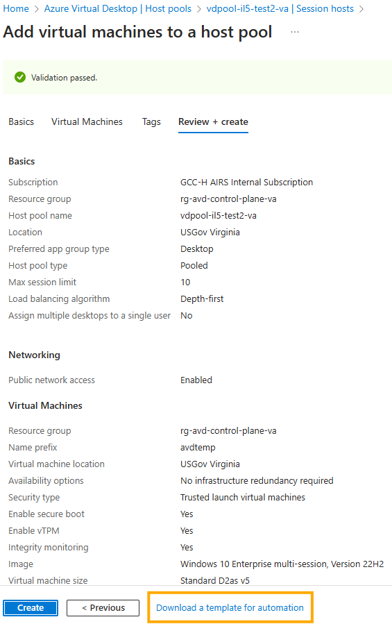
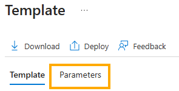
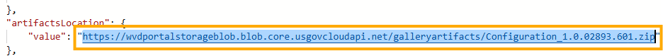
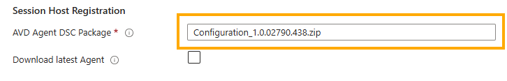

[**Home**](../README.md) | [**Quick Start**](quick-start.md) | [**Host Pool Deployment**](hostpool-deployment.md) | [**Image Build**](image-build.md) | [**Artifacts**](artifacts-guide.md) | [**Features**](features.md) | [**Parameters**](parameters.md) | [**Compliance**](compliance.md) | [**BCDR**](bcdr.md)

# Troubleshooting

## Role Assignment Failure

### Symptom

You receive an error similar to the following:

```json
{
    "status": "Failed",
    "error": {
        "code": "RoleAssignmentUpdateNotPermitted",
        "message": "Tenant ID, application ID, principal ID, and scope are not allowed to be updated."
    }
}
```

### Problem

You may have orphaned role assignments.

### Solution

Fix this issue by running the following PowerShell commands from the Cloud Shell.


```powershell
$orphanedRoleAssignments = Get-AzRoleAssignment | Where-object -Property Displayname -eq $null
if ($orphanedRoleAssignments.Count -eq 0) {
    Write-Output "No orphaned role assignments found. Exiting."
    exit 0
}
Write-Output "Total number of orphaned role assignments: $($orphanedRoleAssignments.Count)"
 
$orphanCounter = 0
foreach ($assignment in $orphanedRoleAssignments) {
    $orphanCounter++
    Write-Output "Attempting to remove item number $orphanCounter for RoleAssignmentName: $($assignment.RoleAssignmentName) | RoleAssignmentId: $($assignment.RoleAssignmentId) | ObjectId: $($assignment.ObjectId) | RoleDefinitionName: $($assignment.RoleDefinitionName) | Scope: $($assignment.Scope)"    
    Remove-AzRoleAssignment -ObjectId $assignment.ObjectId -RoleDefinitionName $assignment.RoleDefinitionName -Scope $assignment.Scope    
    Write-Output "Successfully removed item number $orphanCounter"
}
```

## Redeployment

If you need to redeploy this solution due to an error or to add resources, be sure the virtual machines (aka session hosts) are turned on.  For "pooled" host pools, you must disable scaling as well.  If the virtual machines are shutdown, the deployment will fail since virtual machine extensions cannot be updated when virtual machines are in a shutdown state.

If you existing deployment resource groups, you should delete the virtual machine in this resource group in order to ensure a fresh virtual machine is used to run the deployment scripts leveraged by this solution.

## WinError 193

### Symptom

[WinError 193] %1 is not a valid Win32 application
... missing tolower

### Problem

Corrupt Bizep Install

### Solution

Reinstall Bicep by following the steps at [Bicep Installation](quick-start.md#bicep-installation)

## AVD Agent Install and Configuration Failed

### Symptom

The Session Host deployment failed and after digging into the deployment you find that the 'AVDAgentInstallandConfig' DSC extension failed.

### Problem

This may be due to an issue with the file name (or Url) specified in the 'avdAgentsDSCPackage' parameter of the deployment.

### Solution

Complete these steps to determine if this is the issue.

1. Review the inputs of your failed deployment at the root level. Look for and save the value of the 'avdAgentsDSCPackage' parameter to Notepad. Keep Notepad Open.

2. Follow the standard portal instructions from [Add session hosts to a host pool](https://learn.microsoft.com/en-us/azure/virtual-desktop/add-session-hosts-host-pool?tabs=portal%2Cgui&pivots=host-pool-standard) to the **Review + create** tab, but do not click **Create**.
   
3. Select **Download a template for automation**.

   

4. Select the **Parameters** link on the **Template** screen.

   

5. Search for the **artifactsLocation** parameter and then copy the contents to Notepad below the entry from Step 1

   

6. Compare the values and note if the value is incorrect. Update the 'avdAgentsDSCPackage' parameter value in your parameters file or use this new value in the **AVD Agent DSC Package** text box on the **Session Hosts** pane of the template spec (or blue-button deployment).

   

## Run Commands Stuck or Blocking Redeployment

### Symptom

A deployment fails with a conflict or overwrite error on a Run Command resource, or redeployment of the `runCommandsOnVms` add-on or session hosts add-on fails because a Run Command with the same name already exists on one or more VMs.

### Problem

Azure VM Run Commands are persistent ARM resources (`Microsoft.Compute/virtualMachines/runCommands`). If a deployment failed or was interrupted, the Run Command resource remains on the VM in a `Running`, `Failed`, or `Succeeded` state. ARM uses the Run Command name as a unique key per VM, so re-deploying the same command while the resource still exists causes a conflict. Each VM also has a per-VM limit on the total number of Run Commands (~25); repeated deployments without cleanup can exhaust this limit.

### Solution

Remove the Run Command resources before redeploying. The VM does not need to be running to delete a Run Command ARM resource.

**PowerShell (Az module):**

```powershell
# List all run commands on a VM
Get-AzVMRunCommand -ResourceGroupName 'rg-avd-sessionhosts' -VMName 'avd-vm-01'

# Remove a specific run command by name
Remove-AzVMRunCommand -ResourceGroupName 'rg-avd-sessionhosts' -VMName 'avd-vm-01' -RunCommandName 'DoD-STIGs-202604'

# Remove ALL run commands from a single VM
Get-AzVMRunCommand -ResourceGroupName 'rg-avd-sessionhosts' -VMName 'avd-vm-01' |
    ForEach-Object {
        Remove-AzVMRunCommand -ResourceGroupName 'rg-avd-sessionhosts' -VMName 'avd-vm-01' -RunCommandName $_.Name
    }

# Remove all run commands from multiple VMs
$resourceGroupName = 'rg-avd-sessionhosts'
$vmNames = @('avd-vm-01', 'avd-vm-02', 'avd-vm-03')
foreach ($vmName in $vmNames) {
    Get-AzVMRunCommand -ResourceGroupName $resourceGroupName -VMName $vmName |
        ForEach-Object {
            Remove-AzVMRunCommand -ResourceGroupName $resourceGroupName -VMName $vmName -RunCommandName $_.Name
        }
}
```

**Azure CLI:**

```bash
# List all run commands on a VM
az vm run-command list --resource-group rg-avd-sessionhosts --vm-name avd-vm-01

# Remove a specific run command
az vm run-command delete --resource-group rg-avd-sessionhosts --vm-name avd-vm-01 --name DoD-STIGs-202604 --yes

# Remove all run commands from a VM
az vm run-command list --resource-group rg-avd-sessionhosts --vm-name avd-vm-01 \
  --query '[].name' -o tsv | \
  xargs -I{} az vm run-command delete \
    --resource-group rg-avd-sessionhosts --vm-name avd-vm-01 --name {} --yes
```

**Azure portal:**

1. Navigate to the VM in the Azure portal.
2. Under **Operations**, select **Run command**.
3. Select the **Managed** tab to view persistent Run Command resources.
4. Click the run command to open it, then select **Delete**.
